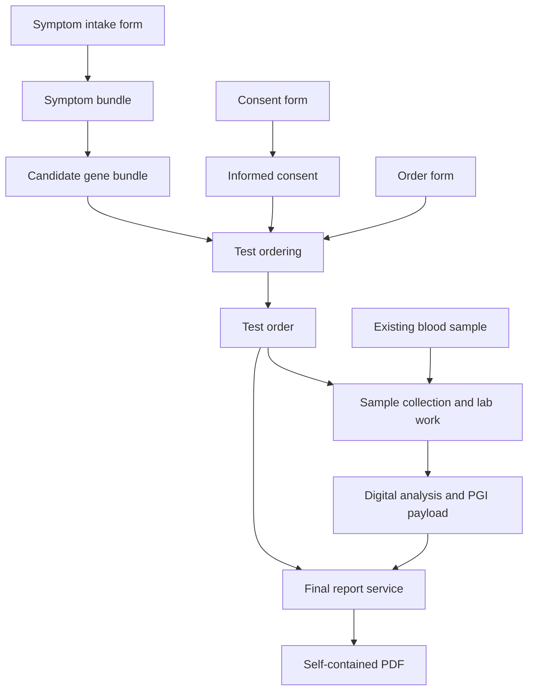

# Pocket Genes Objects and Services Wiki

Version: **1.2.0 — proposed catalog specification**
Prepared: **20 September 2026**
Scope: **20 exchanged object types, 15 mock services, and fictional independent providers.**

This reference turns the agreed Pocket Genes service model into a concrete wiki and implementation starter. The object names, property schemas, suffixes, and API routes below are proposed conventions for this catalog. They define proposed catalog contracts, including native PGI exchange formats mapped to the current app Codable models, but they are not a claim about live production data. All patient information, provider profiles, prices, turnaround times, genes, and analytical examples are synthetic.

Each provider offers services that declare typed input slots. A filled form is supplied only when the offer declares a `pgo_form` input slot. Services return typed objects or update the state of a physical item. The result of one service can become an input to another provider's service. People can request one service or an assembled journey through the app.

## Contents

1. [Model, stages, and shared rules](#model-stages-and-shared-rules)
2. [Ownership, provenance, and service fulfillment](#ownership-provenance-and-service-fulfillment)
3. [Object registry](#object-registry)
4. [Object reference pages](#object-reference-pages)
5. [Service catalog](#service-catalog)
6. [Provider catalog](#provider-catalog)
7. [Wiki presentation and icon system](#wiki-presentation-and-icon-system)
8. [Implementation and validation](#implementation-and-validation)
9. [Native services and PGO experience](#native-services-and-pgo-experience)
10. [Native app PGO file selection](#native-app-pgo-file-selection)
11. [Native format references](#native-format-references)

## Model, stages, and shared rules

The three stages are **Test planning → Wet lab → Bioinformatics**. An object can be useful in more than one stage. Stages classify capabilities; they do not force every request to traverse every stage.

| Stage | Main responsibility | Boundary |
| --- | --- | --- |
| Test planning | Forms, symptom structuring, candidate genes, informed consent, professional and organizational input | Produces the `test_order` |
| Wet lab | Biological sample collection requests, sample custody, optional separate transport, and laboratory processing | Produces the agreed initial digital file |
| Bioinformatics | Any supported transformation from source file through annotation, structured findings, or report generation | Produces the requested digital deliverable |

### Current service offer and transaction contract

These rules are the source of truth for the native app, backoffice, backend validators, bundled simulator catalog, and provider API examples. A service transaction always instantiates an existing published `service_offers` document. Users can create `service_transactions`; app users cannot create `service_offers`.

**Persistent key naming**

- Field naming is a collection-level contract. Keys must be internally consistent within their collection even when the same semantic value has a different spelling in another collection.

| Firestore collection | Field convention | Examples |
| --- | --- | --- |
| `service_offers` | lower camel case | `isHiddenFromSearch`, `inputSlots`, `outputSlots` |
| `service_transactions` | lower camel case | `outputObjects`, `outputReports`, `objectType`, `objectCode`, `reportCode` |
| `uploaded_objects` | snake case | `object_type`, `object_code`, `download_url`, `object_owner_id` |
| `uploaded_reports` | snake case | `report_code`, `download_url`, `report_owner_id` |
| `file_storage` | snake case | `file_name`, `linked_object_code`, `linked_report_code` |
| `object_owners` | snake case | `owner_name`, `owner_contact_email` |
| `report_owners` | snake case | `owner_name`, `owner_contact_email` |
| `object_codes` | snake case | `uploaded_object_id`, `owner_id` |
| `report_codes` | snake case | `uploaded_report_id`, `owner_id` |

- Therefore a service transaction output uses `{ objectType, objectCode }`, while the corresponding `uploaded_objects` record uses `{ object_type, object_code }`. This is deliberate, not an alias.
- Compatibility aliases and dual reads are forbidden. Each collection must reject the other convention for its persisted keys.
- Collection names and identifier values such as `pgo_pdf_report` retain their declared spelling.
- A serialized PGO wrapper is a separate versioned file boundary and uses its schema-defined snake-case keys. Implementations must decode that file and explicitly construct the correctly cased Firestore document for the target collection.

**Service offer identity and provider ownership**

- `service_offers` use one canonical root shape: `serviceId`, `serviceVersion`, `schemaVersion`, `name`, `providerId`, `providerKind`, `providerName`, `status`, `isHiddenFromSearch`, optional `formShape`, `inputSlots`, `outputSlots`, `acceptedConditions`, `scopeRules`, optional `commercialTerms`, calculated `shortContract`, requester-facing `description` and provider-side `providerWork`.
- Legacy aliases such as `title`, `service_id`, `provider_id`, `publisherOrganizationId`, `publisherIndividualId`, `form_shape`, `input_slots` and `output_slots` are invalid for root Firebase offers.
- `providerId` must resolve to a real Discover organization or professional individual. `providerKind` is exactly `organization` or `individual`; arbitrary provider strings are invalid.
- Provider selection happens before the rest of the offer details. Backend/backoffice owns provider resolution and must persist the provider ID, kind and display snapshot.
- New real service IDs are generated, not user-entered: `pgs_<provider_name_slug>_<n>`, lowercase with underscores. Matching form shape IDs use the same generated base: `pgfs_<provider_name_slug>_<n>`.
- The mock package may keep semantic fixture service IDs for documentation and simulation, but root Firebase/backoffice offers must use generated IDs.
- `serviceVersion` and `formShape.version` are display-only integers. Creation starts at `1`; backend logic increments published versions after meaningful published contract changes. Draft edits do not increment published contract versions.
- `description` and `providerWork` are distinct required fields. `description` is the requester-facing app summary. `providerWork` describes the provider-side operational work.
- `isHiddenFromSearch` is a required boolean on every offer. `false` allows an otherwise eligible active offer to appear in native discovery; `true` excludes it from the available-services search/list only. It is not a publication status, deletion marker, transaction status, or authorization rule. Missing, non-boolean, or snake-case variants are invalid; clients must not infer a default or perform a compatibility read.

**Form shape**

- A request form is optional. The only way to include a form input is enabling Support form input in the offer workflow.
- If support form input is enabled, the offer must include exactly one input slot with `objectType: "pgo_form"`, `acceptedTypes: ["pgo_form"]`, `role: "form"`, `required: true` and `cardinality: { "min": 1, "max": 1 }`.
- If support form input is disabled, there must be no `pgo_form` input slot and no `formShape`.
- `allowUnknownFields` is always `false` and must not be exposed as a UI control. Backend validation rejects `allowUnknownFields: true` and rejects undeclared submitted form fields.
- Every form field requires `key`, `label`, `type` and `required`. `enum` and `multi_enum` fields require non-empty `options`.
- Base form fields `requested_at` and `requested_by` are required in every form shape. They live inside the `pgo_form` payload fields, not as separate transaction fields.

**Input slots**

- Manual input slots cannot use `pgo_form`; only the Support form input toggle can add the single form slot.
- Each input slot accepts exactly one Pocket Genes object type. `acceptedTypes` must be a one-item array equal to `objectType`.
- `cardinality` is always `{ "min": 1, "max": 1 }` and `required` is always `true`.
- Input `role` is generated from the object type: `pgo_test_order` becomes `test_order`; `pgo_unannotated_vcf` becomes `unannotated_vcf`; `pgo_form` is the special role `form`.
- Duplicate input object types are invalid. Multiple required objects are modeled as multiple explicit slots.

**Output slots**

- At least one output slot is required.
- Output can never be `pgo_form`. The default/preferred output for a new offer is `pgo_pdf_report`.
- Output `role` is required. `mutationMode` remains exactly `new_object` or `new_revision`; `new_revision` must point to the source input role through `sameIdentityAsInput`.

**Calculated contract and stages**

- `shortContract` is auto-calculated from input and output slots and is not editable text.
- The calculated shape is `input_role:Input Label -> output_role:Output Label`; multiple slots are joined with ` + `. A service with no inputs uses `none -> ...`.
- Stages are shown near the calculated contract as the visual pipeline Test planning -> Wet lab -> Bioinformatics, not as a normal identity field.
- The frontend best-effort predicts stages from slots, then lets the user adjust checkboxes. At least one stage must stay selected. `pgo_form` does not influence prediction.
- Output-based prediction is preferred: planning outputs such as symptom bundles, candidate genes, informed consent and test orders map to `test_planning`; lab outputs such as collection requests, samples, DNA, reads and sequence data map to `wet_lab`; bioinformatics outputs such as aligned reads, VCFs, PGI/interactive reports, karyotype results and flow cytometry data map to `bioinformatics`.
- `pgo_pdf_report` is contextual: bioinformatics inputs predict `bioinformatics`, lab inputs predict `wet_lab`, otherwise it predicts `test_planning`.

**Commercial terms, acceptance and scope**

- The entire `commercialTerms` block is optional.
- `pricingModel` is exactly `not_specified`, `free`, `fixed` or `calculated_after_submission`. `fixed` requires `price.amount` and `price.currency`.
- Turnaround is collected as number plus unit picker and stored compactly as `2w`, `1d`, `3h` or `15m`.
- `acceptedConditions` and `scopeRules` are optional arrays. Empty values are accepted when the provider has no formal language at creation time.

**Transactions and publishing**

- A service transaction must be created from an existing service offer, never from a mock/free-text service relationship in the real request flow.
- New transactions inherit `serviceId`, `serviceVersion`, `inputSlots` and `outputSlots` from the selected offer.
- Native clients must not create the transaction when the user first taps **Solicitar este servicio** / **Request this service**. That tap opens a multistep request flow.
- The first request step is the offer form when the selected offer declares a `pgo_form` input. Platform fields such as `requested_at` and `requested_by` are filled from the real signed-in user context, and user-entered fields are collected before any transaction write. The submitted PGO embeds an immutable copy of the exact shape so it remains fully reconstructable after the offer changes.
- After the form, each required non-form input slot opens an in-app File picker. This picker searches internal File Storage documents linked to the signed-in user's six-character report codes (`community_users.owned_reports`) and filters them by the slot's expected object type/extension. It must not open an external device file picker.
- The user may proceed with **I will attach the files later**. The transaction is still created, selected attachments are recorded when present, and unresolved required roles remain in `missingRequiredInputRoles`/pending attachment metadata for later fulfillment.
- Before creating `file_storage`, `uploaded_objects`, `object_codes`, `object_owners`, or the provider `owned_objects` entry for a submitted form, the request flow must complete every deterministic validation and reload the user's root transactions. Total capacity, current UTC-day usage, latest transaction, and cooldown are calculated in memory from their `requestedAt` timestamps. No derived state is persisted. A denied request leaves no submitted-form object to remediate.
- For an offer with a form, the provider-owned form file, uploaded object, nine-digit code, owner normalization, provider `owned_objects` index, and requester-local download must all succeed before the transaction is created. The transaction write happens only after those steps and the file-selection/later-attachment choice are complete. The native flow then shows a congrats state and dismisses into ServicesHub.
- Required input slots collect `obj_*` object IDs and positive integer revisions. A transaction may become `delivered` only when `outputObjects` exactly covers every promised output role with a valid matching PGO.
- Request IDs use the `pgr_*` namespace.
- Offers start as `draft`. `active` is reached through the publish action, not through a normal status dropdown.
- Native service discovery lists only offers whose `status` is `active` and whose `isHiddenFromSearch` is `false`. Bundled mocks appear only in the simulator.
- An active hidden offer remains a valid versioned contract. An authorized backoffice workflow may create a transaction from it manually, subject to the same provider, input, output, admission, and version validation as any other offer. Hiding is not deactivation.
- Every transaction remains visible to its requester even when its source offer is hidden later or was already hidden when an authorized backoffice created it. Transaction lists load reduced transaction snapshots from the user node and transaction details load `service_transactions/{id}`; neither may join against the current offer or apply `isHiddenFromSearch`.
- Simulator requests are fake, but any generated requester/form metadata must use the real signed-in user context when available.

**Current root transaction write**

- Native writes `requestId`, `offerId`, `serviceId`, `serviceVersion`, `providerId`, `providerKind`, `requestedByUserId`, optional `requestedByUserEmail`, server `requestedAt`, `requestedAtClient`, `status`, `requestRevision`, `idempotencyKey`, `inputs`, `outputObjects`, `outputReports`, `issues`, `missingRequiredInputRoles`, `offerSnapshot`, `providerSnapshot`, `contractSource`, optional `attachmentsPending`, `createdAt`, and `updatedAt`.
- `schemaVersion` is allowed for backend normalization but is not required until the native writer emits it. `formRef`, `formSnapshot`, generic `outputs`, and publisher-ID aliases are invalid root fields.
- Every input writes `role`, positive-revision `objectRef`, exact `objectType`, and `objectSnapshot`. A provisioned form additionally writes `objectCode`, `uploadedObjectId`, `fileStorageId`, and `objectOwnerId`.
- The final batch creates the root transaction and appends the reduced `requestedServiceTransactions` summary. It does not write counters, balances, bucket dates, cooldown dates, last-use dates, next-use dates, or pending admissions, and it never re-runs limit eligibility.

### Agreed contracts

- A request includes a `pgo_form` only when the selected service offer declares a `pgo_form` input slot backed by `formShape`. `requested_at` and `requested_by` live among its filled fields.
- `formShape` declares field keys, types, requiredness, and enum options. It is optional service configuration, not a twenty-first object type. A completed `pgo_form` must copy the exact shape into `data.form_shape`; shape ID/version pointers without that snapshot are invalid.
- Test ordering consumes **pgo_form + informed consent + candidate gene bundle** directly. No intermediate suggested-tests object is required.
- `test_order` holds the patient identity, purpose, clinical suspicion, selected gene scope, fulfillment requirements, and consent connection.
- `collection_request` is a formal biological sample collection request linked to a test order. It is the plan to obtain a specimen from a subject or source; it is not courier pickup, truck pickup, package pickup, route planning, transport, or the physical sample itself.
- A sample at origin and the same sample at destination have the same object identity with different revisions and custody state.
- An extracted DNA sample or biopsy is a derived physical object with its own identity and lineage.
- Extraction and sequencing also return updated source-specimen snapshots showing consumption or remaining quantity. Historical revisions preserve provenance; physical execution must check and lock the current available state.
- PGI native payloads are provider JSON files with strict closed tuples: `.pgi1.json` is always `MDMAPIModel`/`mdm`, `.pgi2.json` is always `AGAPIModel`/`ag`, and `.pgi3.json` is always `TwoPQAPIModel`/`2pq`. The Pocket Genes `pgo_interactive_report` object registers one of those raw payloads with linkage, support evidence and provenance. Cross-format registration is invalid even if two models share field names.
- Final reporting consumes **pgo_form + test_order + pgo_interactive_report**. The order supplies patient and scope, the registered PGI payload supplies provider report content, and the form supplies request context and presentation choices.
- Type matching is necessary but scope sufficiency is also required. Data must support the requested genes and analysis. File extensions and the presence or absence of VCF rows cannot establish that by themselves.
- Service request limits are catalog-level transaction admission rules. They are not `pgo_` object types, form fields, per-offer token costs, or provider-created service records.

### Vocabulary and identifiers

| Prefix / entity | Stands for | Purpose |
| --- | --- | --- |
| `pgo_` | Pocket Genes object type | Stable catalog keyword; e.g. `pgo_test_order` |
| `obj_` | Object instance | A particular order, sample, form, or result |
| `pgs_` | Pocket Genes service | A provider's declared transformation contract |
| `pgp_` | Pocket Genes provider | Organization or professional fulfilling services |
| `pgfs_` | Pocket Genes form shape | Versioned field definitions belonging to a service |
| `pgr_` | Pocket Genes request | One invocation and its execution state |
| Pipeline | Composition of requests | Connects compatible outputs and inputs across providers |

### Common object envelope

All exchanged objects have a JSON record. Native data files remain separate bytes in their standard format. A physical object's JSON records the real item's identity and state; it does not replace physical delivery.

| Property | Type | Meaning |
| --- | --- | --- |
| object_id | string | Stable instance identity. |
| object_type | enum | One of the 20 registered pgo_ keys. |
| schema_version | string | Payload contract version; fixtures use 1.0.0. |
| revision | integer ≥ 1 | Snapshot of the object. References pin this revision. |
| created_at | date-time | Creation time of this snapshot; distinct from the request time inside its form. |
| created_by | string | Identity that issued this snapshot. |
| input_refs | ObjectRef[] | Exact source object revisions, including the request form, when generated by a service. |
| data | object | Type-specific properties defined in the following pages. |
| files | FileDescriptor[] | Associated native payloads; role, path, media type, SHA-256 and byte count. |


`ObjectRef` has exactly `object_id` and `revision`. The same physical item may have revision 1 at origin and revision 2 at the destination; both snapshots remain addressable. New analytical results normally get new IDs, with references to their sources. Changing custody must not rewrite an earlier snapshot.

Native FASTQ, FASTA, BAM, VCF, FCS, and PDF objects use a `.pgobject.json` sidecar in this package. Their actual files keep `.fastq`, `.fasta`, `.bam`, `.vcf`, `.fcs`, or `.pdf`. Compound `.pg*.json` suffixes are conventions for Pocket Genes JSON objects. Compressed variants require an explicitly declared encoding/profile, not a new clinical meaning.

The same `.vcf` suffix is shared by the two VCF types. `object_type` and the annotation profile distinguish them. An annotated VCF is not automatically compatible with every interpretation service.

### Scope and fulfillment

The synthetic order requests `PGGENE_A`, `PGGENE_B`, and `PGGENE_C` under `PG_DEMO_REF_1`. The supporting metadata records which genes and variant classes are assessable and references the producer's evidence. A service checks the required profile, subject identity, order identity, actual input availability, and the requested analytical scope.

| Candidate handoff | Decision |
| --- | --- |
| Correct type/profile and evidence-backed support for all requested genes and variant classes | Eligible for the next service |
| Correct `.vcf` suffix but only two of the three requested genes supported | Insufficient scope; report the missing gene |
| Supported genes match, but reference/profile is incompatible | Requires an explicitly compatible service or transformation |
| No variants reported for one gene, with no evidence about its assessability | Cannot infer a negative result or complete testing |
| Broader acquisition than the requested scope | Does not authorize broader interpretation or reporting; honor the order's scope |

The tiny files in this package demonstrate structure and linkage. Their `synthetic_fixture` attestations are mock inputs to the compatibility example, not proof of assay coverage, a diagnostic result, or evidence that a real provider is qualified. The supplied validator checks catalog and fixture integrity; production assay validation remains provider-specific.

### Pocket Genes service network: proposed v1 logic

This specification describes a professional catalog of independently purchasable services. Pocket Genes defines a small shared object vocabulary and a common request contract. Providers publish what they accept, what they return, and the terms under which they do the work. A user can request one service or a complete compatible journey through the app or API.

This is a product-design proposal. The providers, prices, turnaround estimates, patients and scientific fixture tokens in the accompanying catalog are fictional. The examples demonstrate interoperability; they do not establish clinical validity or legal sufficiency.

#### 1. The concepts and what each one stands for

| Concept | Identifier convention | Responsibility |
|---|---|---|
| Object type | `pgo_*` | Defines the meaning, schema, representation and accepted profiles of an interchangeable piece. PGO means **Pocket Genes Object**. |
| Object instance | `object_id`, such as `obj_demo_order` | One actual piece: an order, gene bundle, sample record or registered native file. |
| Object revision | Positive integer | A specific recorded version of that object. References always pin it. |
| Provider | `pgp_*` | The organization or professional entity responsible for executing a published service. PGP means **Pocket Genes Provider**. |
| Service | `pgs_*` | An offer to perform a defined transformation. PGS means **Pocket Genes Service**. |
| Form shape | `pgfs_*` plus version | The service configuration specifying required fields, field types and enum options. PGFS means **Pocket Genes Form Shape**. |
| Form | `pgo_form` | The filled fields supplied with every execution request, including when the request was made and who made it. |
| Service request | `pgr_*` | One execution of one service under its pinned version and accepted commercial terms. PGR means **Pocket Genes Request**. |
| Pipeline | Application orchestration record | A set of service requests connected through explicit output-to-input bindings. It is a process configuration, not an extra accepted object type. |

`form_shape`, provider, service and pipeline are configuration or execution entities. They do not expand the fixed twenty-type exchanged-object registry. A specimen's digital record represents a physical item; sending its JSON does not deliver the specimen itself.

#### 2. The universal service contract

Every execution follows this pattern:

**Zero or more input objects, including a `pgo_form` only when declared, → one or more output objects.**

The `pgo_form` input is conditional. The phrase “VCF → PGI1” remains useful catalog shorthand; its full execution contract is defined by the offer input slots, and includes a form only when that offer declares a `pgo_form` slot.

A service definition contains:

| Field | Meaning |
|---|---|
| `serviceId`, `serviceVersion` | The particular published offer and its pinned integer contract version. |
| `schemaVersion` | Integer service-offer schema version; current value is `1`. |
| `name` | The display name shown by the native app. There is no `title` alias. |
| `providerId`, `providerKind`, `providerName` | The real organization or professional individual linked to this offer. There are no `publisherOrganizationId` or `publisherIndividualId` aliases on `service_offers`. |
| `status` | Published availability state; native available services read active offers only. |
| `isHiddenFromSearch` | Required discovery boolean. `true` removes the offer from native available-service search/listing only; it never hides transactions created from that offer. |
| `serviceCategory` | Optional/open-ended broad classification; not the service identity. |
| `stages` | Where the service belongs in the three-stage catalog. |
| `formShape` | Optional exact form schema, required only when an input slot declares `objectType: "pgo_form"`. |
| `inputSlots` | Named roles. Each slot has exactly one `objectType`, and `acceptedTypes` must contain exactly that same value. |
| `outputSlots` | Named results, their `objectType`, and whether `mutationMode` creates a new object or revision. |
| `acceptedConditions` | Optional preconditions for this provider to accept the particular objects and request. |
| `scopeRules` | Optional explanation of how the requested objective and analytical scope constrain the output. |
| `commercialTerms` | Optional price/turnaround metadata. Real offers can be free, priced later, or priced explicitly. |

The catalog contains sample requests and results for all fifteen services. A service may be performed by software, laboratory work, human assessment, transport, or a combination. Its internal method is the provider's responsibility; its external obligations are explicit.

##### Forms are service-specific

A `formShape` defines a list of fields, not one global medical intake questionnaire. Supported field types in this proposal are `text`, `number`, `integer`, `boolean`, `date`, `datetime`, `enum`, `multi_enum` and `string_list`.

Each field has a stable `key`, a display `label`, a `type` and `required`. Enum and multi-enum fields also contain explicit options, each with a stored value and a display label. Forms store the stable values, not the labels.

Every completed `pgo_form` is self-describing. `data.form_shape` is a required immutable snapshot with `id`, positive integer `version`, `allow_unknown_fields: false`, and the complete ordered field list. Every field snapshot contains `key`, `label`, canonical `type`, `required`, and `options`; `options` is non-empty only for `enum` and `multi_enum`. `data.form_shape.id/version` must exactly equal `data.form_shape_id/form_shape_version`. A consumer must never replace this snapshot with the latest offer shape.

Optional unanswered fields remain in `form_shape.fields` and are omitted from `data.fields`. This lets the explorer reconstruct the entire submitted form, show unanswered optional questions, resolve stored enum values back to their frozen labels, and preserve the original order. Shape keys and answer keys are unique, unknown answers are rejected, and null is not a substitute for an omitted optional answer.

When present, every shape includes `requested_at` and `requested_by`. Their values occur inside `pgo_form.data.fields`, alongside the service-specific values. An authenticated submission establishes the requester; a typed name alone is not proof of identity. Server processing timestamps can be recorded on the request separately.

For example, a symptom intake shape also requires `subject_id` and `observations`. A final-report shape requires `language` and `presentation`. Patient identity and clinical suspicion already live in the order for that reporting request, so the reporting form need not collect them again.

```json
{
  "form_shape_id": "pgfs_final_report",
  "form_shape_version": 1,
  "form_shape": {
    "id": "pgfs_final_report",
    "version": 1,
    "allow_unknown_fields": false,
    "fields": [
      {
        "key": "requested_at",
        "label": "Requested at",
        "type": "datetime",
        "required": true,
        "options": []
      },
      {
        "key": "requested_by",
        "label": "Requested by",
        "type": "text",
        "required": true,
        "options": []
      },
      {
        "key": "language",
        "label": "Report language",
        "type": "enum",
        "required": true,
        "options": [
          {
            "value": "en",
            "label": "English"
          },
          {
            "value": "es-AR",
            "label": "Spanish, Argentina"
          }
        ]
      },
      {
        "key": "presentation",
        "label": "Presentation",
        "type": "enum",
        "required": true,
        "options": [
          {
            "value": "clinical",
            "label": "Clinical report"
          },
          {
            "value": "patient",
            "label": "Patient-facing report"
          }
        ]
      }
    ]
  },
  "fields": [
    {
      "key": "requested_at",
      "value": "2026-09-16T12:00:00Z"
    },
    {
      "key": "requested_by",
      "value": "user_demo_001"
    },
    {
      "key": "language",
      "value": "en"
    },
    {
      "key": "presentation",
      "value": "clinical"
    }
  ]
}
```

The form is validated against the declared shape version. Reject duplicate keys, missing required fields, wrong value types and enum values outside the published options. This catalog rejects unknown fields; `allowUnknownFields` is not configurable. A new required field requires a new compatible contract version; changing a published shape must not silently invalidate already accepted requests.

##### Inputs bind by role

An input slot identifies why the object is supplied. For DNA extraction, the demonstrated contract uses `blood_sample`. A provider that accepts tissue or embryo biopsy publishes separate explicit slots or a separate offer; one manual input slot never hides several object types behind checkboxes.

A test order is a different slot. This avoids relying on array position to distinguish an order from the specimen being processed. An input reference consists of `object_id` and `revision`. Native files are retrieved through that registered object, with its file descriptors and integrity information.

```json
{
  "service_id": "pgs_final_report",
  "service_version": 1,
  "inputs": [
    {
      "role": "form",
      "object_ref": {
        "object_id": "obj_demo_form_final_report",
        "revision": 1
      }
    },
    {
      "role": "test_order",
      "object_ref": {
        "object_id": "obj_demo_order",
        "revision": 1
      }
    },
    {
      "role": "interactive_report",
      "object_ref": {
        "object_id": "obj_demo_interactive",
        "revision": 1
      }
    }
  ]
}
```

A form-only service supplies one `inputs` item for its `pgo_form` role and no separate root `form_ref`.

#### 3. The three stages

| Stage | Goal | Prevalent objects |
|---|---|---|
| **Test planning** | Turn an objective and available information into a complete test order. | Forms, symptom bundles, candidate gene bundles, informed consent and test orders. |
| **Wet lab** | Fulfill the physical work and laboratory processing required for the agreed digital deliverable. | Collection requests, physical samples, extracted DNA and the laboratory's output files. |
| **Bioinformatics** | Process an available digital input into the contracted analytical or presentation result. | FASTA, FASTQ, BAM, VCF, images, FCS, PGI payloads and PDF. |

The stage is a catalog location, not a rule that every customer must buy all three stages. In this three-stage vocabulary, bioinformatics also groups related digital analysis such as karyotype image review. A PDF can be produced in test planning as a consultation summary or in bioinformatics as a final genomic report; the document profile determines its purpose.

##### Test planning

One route creates a symptom bundle from a form and prioritizes candidate genes from that bundle. A second service produces an informed-consent piece from its own form. Test ordering then combines exactly the three agreed inputs:

**pgo_form + informed_consent + bundle_of_candidate_genes → test_order.**

The order's form supplies patient name, date of birth, patient identifier, objective, suspicion and other required ordering details. It also selects `wet_lab_output_type`, the final deliverables through `required_output_types`, and the `required_profile`. Those map to the order's patient record and fulfillment requirements, including `fulfillment.final_output_types`. The order consolidates that context and retains its consent reference. No `bundle_of_suggested_tests` intermediate is required. Professionals and organizations can specialize in any of these transformations.

##### Wet lab

A `collection_request` is a formal instruction to obtain an actual biological sample from a subject or source as part of a test order. The illustrated offer addresses `pgp_sample_logistics`, using a demo clinical collection room, a blood-draw collection method, the 2026-09-16 13:00–15:00 UTC collection window, and an EDTA-tube preparation profile. It is explicitly not courier pickup, truck pickup, package pickup, route planning, or transport.

After biological collection, the resulting physical sample is represented by a separate sample object. If that sample later moves, transport returns a later revision of the same physical sample identity with custody, location and receipt information. Extraction produces a new DNA object because the extracted material is a distinct derived specimen. Its lineage points back to the source. Consumption or remaining quantity of source material must be recorded.

The collection example is the sample-acquisition request. The transport example begins only after a physical specimen exists. These examples must not collapse biological collection and courier movement into one object.

`pgo_embryo_sample` distinguishes `whole_embryo` from `embryo_biopsy`. The demonstrated DNA-extraction offer accepts an embryo biopsy only. A whole embryo cannot be substituted merely because the registry type is shared. Taking a biopsy creates a separate material identity and lineage before that biopsy can enter extraction.

A lab can choose its contractual exit point. This catalog's sequencing offer returns FASTQ. Another published service could return BAM, unannotated VCF or a complete result by performing more work internally. The platform does not force the customer to purchase or download every intermediate file.

##### Bioinformatics

The fifteen examples split alignment, calling, annotation, interactive interpretation and reporting into separate offers. Each step can belong to a different provider, and a provider may publish a combined offer.

FASTA and FASTQ are distinct types. They are not interchangeable labels for one mandatory entry format. An eligible provider can accept whichever actual source format its contract supports. The fixed registry contains FASTA and FCS even though these fifteen mock offers do not yet consume or produce them.

Annotation requires `pgo_form + unannotated_vcf + test_order`. The order constrains subject, scope, reference, profile and fulfillment checks; the annotated VCF must preserve analytical-support evidence and limitations.

The interpretation contract demonstrated here is:

**pgo_form + annotated_vcf -> pgo_interactive_report (.pgi1.json / MDMAPIModel).**

The demo interpretation service creates a Pocket Genes registration object whose raw payload is a `.pgi1.json` file matching `MDMAPIModel`. The registered VCF carries its own source and analytical-support information. This conversion does not require a symptom bundle or a test order as an additional input. Pipeline orchestration compares the registration object's declared support with a linked order without making symptoms part of the conversion. `.pgi2.json` and `.pgi3.json` follow the same registration concept for `AGAPIModel` and `TwoPQAPIModel`, but require native payloads from compatible sources.

The final-report contract is:

**pgo_form + test_order + pgo_interactive_report (.pgi1/.pgi2/.pgi3) -> final PDF.**

The order supplies the patient and intended clinical context. The registered PGI object supplies the native payload reference, provider model, support evidence, provenance and analytical limitations. The form supplies request metadata and presentation choices. Under this contract, those pieces must contain everything needed for a self-contained report. The provider should not need to retrieve original intake forms or planning bundles. Any included professional review and report issuance must be stated in the offered service.

#### 4. Compatibility includes the requested result

Matching an extension only identifies a possible connection. Before a provider accepts work, the system evaluates:

1. **Object identity and access:** the supplied revision exists and belongs to the intended subject or material lineage.
2. **Type and version:** the declared semantic type, JSON schema or native representation is accepted.
3. **Profile and content:** the relevant form, annotation, imaging, assay or document-purpose profile matches.
4. **Order scope:** the service and input data can support the genes, reference, variant classes and deliverables requested.
5. **State and availability:** a physical item is in the appropriate location and condition, with usable material available.
6. **Execution terms:** the provider accepts the location, price, turnaround and responsibility attached to the request.

For example, the fixture order requests `PGGENE_A`, `PGGENE_B` and `PGGENE_C` on synthetic reference `PG_DEMO_REF_1`. Its scope is stored in `data.scope`. Its fulfillment requirements are stored in `data.fulfillment`, including `scope_policy: requested_only` and `analysis_support_required: true`.

A VCF whose supported analytical scope omits requested genes is insufficient, even if structurally valid. Adding annotations cannot recover missing measurements. Absence of a row for a requested gene does not establish that the gene was adequately assessed. Analytical objects therefore retain `data.analysis_support`, including status, evaluated genes, supported variant classes, evidence and limitations. Evidence can point to an embedded declaration or an attached quality/support file. Its presence as JSON is not, by itself, a scientific verification.

An output supports the order only when its analytical support and service profile meet the actual requirement. Extra processing or findings do not silently expand the requested scope. A provider that cannot meet the full accepted contract returns the limitation and a suitable non-delivered state rather than describing the request as fulfilled.

#### 5. Execution lifecycle and responsibility

| State | Meaning |
|---|---|
| `received` | The request is recorded and assigned an ID. |
| `validating` | Form, input access, compatibility, availability and scope are being checked. |
| `accepted` | The provider accepts responsibility for the specified service under the agreed terms. |
| `queued` | Accepted work waits for an execution slot. |
| `running` | The provider is performing the work. |
| `awaiting_input` | Work needs an explicit clarification or additional piece before it can continue. |
| `delivered` | The accepted contract is fulfilled and every promised output object is uploaded, registered and available to the requester. |
| `rejected` | The provider declines before acceptance, with a reason. |
| `failed` | Accepted work cannot fulfill the contract, with a reason and recovery information. |
| `cancelled` | Cancellation has completed under the agreed terms. |

The normal path is received, validating, accepted, queued, running and delivered. Queuing can be skipped. Validation or running work can pause at awaiting_input; the response must say what is needed and where execution resumes. Delivered, rejected, failed and cancelled are terminal states. A later rework execution has a new request identity linked to the original. `completed` and `finished` are not valid service-transaction states and must be rejected rather than translated for compatibility.

An HTTP `202` only confirms asynchronous receipt unless the returned state explicitly says accepted. A progress percentage is informative; it does not replace the state or prove fulfillment.

A pipeline needs a named party responsible for resolving cross-provider failures. Each provider owns its service, while Pocket Genes or an explicitly contracted journey operator coordinates the overall journey. If a downstream provider rejects an upstream output, the requester needs a concrete resolution: corrected output, an alternative compatible provider, a new physical procedure if separately authorized, or a refund under the accepted terms.

Refund status is a commercial outcome, not an object transformation. Track it alongside the execution. “The provider returned a file” is not a sufficient reason to consider an unfulfilled scope delivered.

##### Delivered transactions and registered results

`delivered` is the only successful final state for a root-level `service_transactions` record. It means more than provider-side processing being finished: every output slot frozen from the selected service offer has a corresponding, downloadable Pocket Genes Object. The backend and backoffice validate this invariant immediately before committing the transition; a provider callback cannot bypass it.

`outputObjects` is an array of exact reduced snapshots with required `role`, `objectType`, and `objectCode` properties. `role` must uniquely match a frozen output slot. `objectType` must be one concrete type from the 20-type PGO catalog and match the promised type; `same_as:<input_role>` is resolved before comparison. `objectCode` is exactly nine ASCII digits, including possible leading zeroes, and must resolve through `object_codes/{objectCode}` to a ready `uploaded_objects` record whose snake-case `object_code` and `object_type` fields repeat the same code and type, with a usable stored payload reference and a positive integer `upload_version_count`. Delivered records contain exactly one valid snapshot for every promised output slot. Missing, duplicate, unknown, mismatched, unresolved, unversioned or not-ready outputs make the transition invalid.

`outputReports` is optional. Each reduced snapshot contains only one unique, uppercase six-character alphanumeric `reportCode`. Reports are companion results, do not form part of the service offer output contract in this version, and never satisfy a missing promised object. The strict JSON shape is published in `schemas/protocol/service-transaction.schema.json`; semantic coverage and uploaded-object readiness remain backend checks.

The native app treats malformed delivered data as inconsistent rather than successful. Valid delivered requests show a completion check and a **View results** action. The modal result screen downloads each object through the same `object_codes` -> `uploaded_objects` path used by **Add object**, persists its code and current `upload_version_count` into the object inventory so it appears in **Choose your object**, replaces the action with a spinner while work is active, and then exposes **Open** through the standard blocking PGO activation and explorer flow. On every later presentation, an exact local code match shows **Open** immediately. A metadata-only version check shows **Update** only when the authoritative remote count is greater; updating replaces the local payload and version under the same code rather than creating a duplicate. `upload_version_count` starts at `1` and increments for each payload replacement. It remains on `uploaded_objects`, not in the immutable transaction snapshot.

##### Token-based service request limits

The service catalog uses the catalog-level policy `pg_usage_policy_service_requests_v1`, stored in `catalog/usage-policy.json`. The policy gates creation of root-level `service_transactions`; it does not change any object type, add a `pgo_token` record, add token fields to `form_shape`, or allow individual `service_offers` to declare variable token costs. Service offers remain provider-published contracts. Users consume limits only when they request an offered service and the backend admits the resulting transaction.

A token means permission to initiate one admitted service transaction. Every newly admitted `pgr_` transaction costs exactly one token, regardless of provider, stage, input file type, output file type, turnaround, revisions, or whether the request is part of a journey. Ordinary reads, downloads, status updates, notifications, clarifications, output registration, contact requests, and limit-extension requests do not consume tokens.

Each user may receive this stable policy configuration:

```json
{
  "token_status": {
    "policy_id": "pg_usage_policy_service_requests_v1",
    "total_transaction_limit": 20,
    "daily_transaction_limit": 5,
    "cooldown_seconds": 300
  }
}
```

`token_status` is configuration only. It is not an accounting snapshot and must never contain a counter, remaining balance, last-use timestamp, next-use timestamp, cooldown start/end, UTC bucket marker, or pending admission. In particular, the following fields are forbidden everywhere in persisted user state: `admitted_usage_count`, `admitted_usage_day_start`, `today_usage_count`, `tokens_consumed_today`, `tokens_remaining_today`, `last_request_at`, `next_request_at`, `cooldown_started_at`, `cooldown_ends_at`, `pending_admissions`, and `token_balance`. These values become stale by definition and can diverge from the transactions that actually exist.

The only usage source of truth is the current root `service_transactions` collection. Every calculation queries records whose `requestedByUserId` is the signed-in user and reads each record's required server `requestedAt` timestamp. The reduced `requestedServiceTransactions` array is a navigation index only and must not be used for limit accounting. `charged_user_id`, `token_consumed_at`, `admittedAt`, and other duplicate accounting timestamps are not part of the native transaction contract.

The client recomputes the complete status in memory every time account status opens or refreshes and immediately before a request is approved:

1. Deduplicate the fetched records by root transaction document ID and ignore timestamps later than the current clock time.
2. `total_used` is the number of transactions that have occurred. `remaining_total = max(0, total_transaction_limit - total_used)`.
3. Compute `utc_day_start` and `next_utc_day_start` with a Gregorian calendar fixed to UTC. `used_today` is the number of `requestedAt` timestamps in the half-open interval `[utc_day_start, next_utc_day_start)` that are not later than `now`.
4. `last_transaction_at` is `max(requestedAt)` across occurred transactions. It is a temporary projection, never a stored user field.
5. The temporary cooldown deadline is `last_transaction_at + cooldown_seconds`. It is recalculated from those two inputs and is never persisted.
6. If the daily maximum is active, its temporary deadline is `next_utc_day_start`. If cooldown and daily maximum are active together, the later temporary deadline controls eligibility.
7. The seven-day chart groups the same real timestamps into seven UTC buckets. No chart count is cached.

At exactly `00:00 UTC`, the old daily interval ends and the new interval begins. There is no reset write and no counter mutation: a fresh calculation naturally produces the new day's count. The UI may render the UTC boundary in the device's local time, but device time zones never change bucket membership.

Admission order remains strict. First validate the active offer, exact inputs, complete form shape and values, authenticated requester, provider account/owner destination, and idempotency without persisting submitted data. Next load the stable policy configuration and the complete current root transaction list, calculate total capacity, UTC daily capacity, latest transaction, and cooldown in memory, and either deny or approve. A denial leaves no form object, owner mutation, code, file, transaction, counter, or timestamp behind. Only after approval may the provider-owned form file/object/code and requester-local copy be created. The final batch creates the root transaction with `requestedByUserId` and server `requestedAt` and appends the reduced user summary; it does not update usage state.

Once this calculation approves a request, limits, offer shape, and form values must not be re-evaluated later in the same pipeline. A later endogenous rejection could strand a valid provider-owned form and is forbidden. Only an external I/O failure such as network, permission, or storage unavailability may interrupt the approved pipeline.

The native loading surface exposes the actual state machine: validate request; validate form and provider when applicable; load stable limits; calculate usage from real transactions; show eligibility approval; prepare, register, and download the form object when applicable; create the transaction; and finalize the Services Hub index. Completed steps stay visibly checked. There is no reservation document and no persisted admission mirror.

Idempotent retries resolve an existing transaction before launching new work. A retry that needs a fresh decision reloads `service_transactions` and recalculates every derived value; it never trusts a value retained from a prior screen presentation. Provider callbacks, result delivery, cancellation finalization, and status transitions do not create new requests and therefore do not run the creation gate.

Administrative capacity changes update the stable `total_transaction_limit`; they do not write a remaining balance. Existing transactions and their `requestedAt` values are never rewritten to manipulate today's count or cooldown. Granting one replacement request means increasing the total limit according to the administrative policy, while the historical transaction remains intact.

Pipelines follow the same admission rule. Compatibility planning and route preview consume no tokens. Each separately requested published service step consumes one token when admitted. A combined published service that hides multiple internal provider steps behind one offer consumes one token for that one admitted transaction. If an automatic pipeline step cannot be admitted because of limits, store it as `waiting_for_limits` and re-check the limits before retrying.

The native UI should present this as **Limits**, not as a wallet, coins, purchases, refills, or paid upgrades. Use these stable internal denial codes: `token_balance_exhausted`, `token_daily_limit_reached`, and `token_cooldown_active`. User-facing copy should be:

| Case | Message |
| --- | --- |
| Daily maximum reached | You've reached your service request limit for today. You can request another service after {time}. |
| Balance exhausted | You've reached your current service request limit. |
| Cooldown active | You can request another service in {remaining_time}. |

Add this suffix where helpful: "Need to use more services? Contact us to request higher usage limits." The short explanation is: "Service request limits help keep Pocket Genes reliable and give providers time to manage incoming requests."

The account-status modal shows the configured cooldown plus locally derived last request, today's `used/max`, total `remaining/total`, local-clock rendering of the current UTC window and next reset, and seven UTC day buckets. Its visible countdown refreshes every second from `now` and the temporary calculated deadline. When cooldown and daily capacity are both blocking, the later deadline wins. UTC defines the bucket boundary; device-local time is presentation only.

##### Idempotency and safe recovery

Every creation call carries an idempotency key. Repeating the same key with the same canonical request returns the original execution; reusing it for a different payload returns a conflict. The provider publishes the retention window. This draft proposes at least thirty days.

After a timeout, query the existing request or repeat with the same key. Do not submit a new request simply because a callback was delayed. Duplicate courier dispatch, sample consumption or laboratory work can be expensive and cannot always be undone.

A failed physical job is not automatically retried. Check the specimen's actual state and remaining material, determine the recovery action and obtain whatever action authorization is required by the accepted service terms. Digital work also needs idempotency so that retries do not create accidental repeated charges or conflicting outputs.

##### API and callbacks

The provider catalog includes an illustrative complete API example for Variant Analysis Cooperative:

- `POST /service-requests` submits a service, form reference and role-bound inputs.
- `GET /service-requests/{request_id}` returns authoritative state.
- `GET /service-requests/{request_id}/results` returns registered output references.
- A signed provider callback announces progress or completion to a preregistered Pocket Genes endpoint.

Provider authentication, object access and callback verification are integration configuration. Credentials are absent from the fixtures. Callback destinations are registered in advance; a request cannot redirect patient information to an arbitrary URL. Events include unique IDs and increasing request revisions so duplicates and out-of-order delivery can be handled. Large FASTQ, BAM or PDF payloads stay in object storage; the API passes authenticated object references and integrity metadata.

#### 6. Example pipelines and alternate entry points

##### A. Test planning through a final report

The user supplies the planning forms. Meridian Clinical Planning produces the symptom bundle, candidate genes and consent piece, then creates the order. Origin Sample Services produces the biological sample collection request and, through a separate transport service, moves the already collected blood sample. Atlas Precision Laboratory extracts DNA and produces FASTQ. Variant Analysis Cooperative aligns the reads, calls variants, annotates the VCF and creates a registered PGI1/MDM payload. Clarity Report Studio combines the registered PGI object with the original complete order and produces the final PDF.



Every service request in the diagram also receives its own form. The detailed fifteen-service table exposes the individual transformations hidden inside the grouped physical and digital blocks. The original order remains available at every step where it is explicitly required, including final reporting.

##### B. Start with an existing annotated VCF

A user already has a registered compatible annotated VCF and a complete test order. Request `pgs_interactive_interpretation` with its form and that VCF, then request `pgs_final_report` with its own form, the resulting registered PGI object and the order. Laboratory work, alignment, calling and annotation are skipped. The existing analytical support must still meet the order scope.

A user with an existing unannotated VCF can first request annotation without creating a test order, then request PGI1/MDM registration. A complete test order becomes required when that user requests the final self-contained reporting contract.

If the user already has a suitable `.pgi1.json`, `.pgi2.json`, or `.pgi3.json`, a registration/import step can create the `pgo_interactive_report`; then the final-report service is sufficient once its required order and form are available.

##### C. A service without sequencing or domain inputs

A user fills the `pgfs_form_to_pdf` form and requests `pgs_form_to_pdf`. Meridian Clinical Planning returns a consultation summary PDF. The request carries that form as a `pgo_form` input role and has no root `form_ref` field. This is a complete, independent service.

A separate non-sequencing branch is `pgo_form + metaphase image_bundle → karyotype_result`, fulfilled by Chromosome Image Services. It demonstrates that the network can support specialist image review within the same request mechanics.

#### 7. Provider substitution and composition

A new provider publishes its own service ID and accepted contract. The platform can propose it for a step when its output, acceptance conditions, scope and commercial terms fit the surrounding route. Existing requests keep the provider and version originally accepted; substitution is explicit.

A compatible output can be reused in several subsequent services, subject to access and scope. Input consumption matters: a digital object remains reusable, while a physical procedure may consume all or part of the specimen. Pipelines therefore bind exact object revisions and track remaining material before initiating more work.

A complete journey should be checked before starting irreversible physical steps. The available source, each required handoff, the selected providers and the final requested output must form a feasible route. A provider directory with matching extensions is not enough.

The fifteen services are a starting catalog. They illustrate how a provider can specialize in one conversion or offer several stages. The twenty object types are a fixed proposed v1 vocabulary; future registry additions should have clear semantics, schemas and examples rather than becoming catch-all files.

#### 8. Professional catalog presentation

Each object should have a stable icon asset, a clear name, its `pgo_*` keyword, a physical/virtual label, extension, accepted-profile details and a concise definition. Its wiki page should expose properties, a content example, producer services and consumer services.

The light gamification comes from visible progression and discoverable connections: “You have these pieces,” “These services can use them,” and “This requested result needs these remaining pieces.” Use neutral completion markers and stage colors. Icons and object cards should help users recognize the catalog without implying medical certainty, quality scores or game-like rewards for ordering more tests.

A provider page names who is responsible, which services are offered, coverage, turnaround and integration capabilities. A service page shows the input slots, required form, output, acceptance rules and exact scope. Missing compatibility is shown as a specific reason, such as an unsupported material kind or incomplete gene scope, with the relevant corrective action.

## Ownership, provenance, and service fulfillment

This chapter is the normative ownership and fulfillment contract for the Pocket Genes native app, Firebase backend, provider backoffice, service catalog, and support tooling. It defines who creates and controls reports and Pocket Genes Objects (PGOs), how creator information is stored and displayed, and how a reusable service offer becomes a time-bound service transaction whose results can be downloaded by the requester.

The exact capability field is `is_clinician`. The misspelling `is_clinitial` is not a valid field and must never be read, written, or accepted as an alias.

### 1. The identities must remain separate

The platform must not collapse the following identities into a single generic "owner":

| Identity | Meaning | Main authority |
| --- | --- | --- |
| Subject | The person whose health, specimen, or genomic information is represented | Gives the applicable consent and has the rights provided by law |
| Requester | The signed-in app user who creates a service transaction | Can access their own request, follow its progress, communicate, and retrieve delivered results |
| Report owner | The creator and seeder of a legacy report record | Publishes and maintains the report and its payload under a stable report code |
| Object owner | The creator and seeder of a PGO record | Publishes and maintains the object and its payload under a stable object code |
| Service provider | The Discover organization or professional individual contractually responsible for performing an offer | Performs the declared work and delivers the promised output object types |
| Pocket Genes platform | The technical intermediary that transports references, files, status, and messages | Provides access control, routing, storage integration, and the native experience |

One person or entity may occupy more than one role, but the records and permissions do not merge. For example, a professional may be the service provider and seed the resulting object, while a patient is both the requester and subject. The transaction must still preserve each role explicitly.

Downloading a report or object does **not** make the requester its technical owner. It gives the requester an authorized local copy and access to the result. The owner remains the creator/seeder recorded by the authoritative uploaded record unless an explicit, audited ownership transfer is performed by an authorized backend process.

In this contract, "owner" means the platform's creator, publisher, and seeder relationship. It does not by itself decide clinical data rights, intellectual-property rights, patient rights, copyright, or legal title. Those rights continue to be governed by consent, the service contract, and applicable law.

### 2. What report and object ownership means

A report owner or object owner is the account that created the platform record and supplied, linked, or authorized its payload. That account is the provenance source shown to recipients.

An owner may:

- create a tracker and its stable access code;
- provide or link the first payload;
- edit requester-visible metadata for records they own;
- replace or revise their own payload through the supported upload flow;
- increment `upload_version_count` when the payload changes;
- manage their public creator profile; and
- remove their own record when permitted by retention, transaction, consent, and legal rules.

An owner may not:

- edit a report or object seeded by a different owner;
- claim ownership merely because they know an access code or downloaded a copy;
- change a nine-digit object code into a report code, or the reverse;
- silently change an object's canonical `object_type` after publication;
- reuse one stored file for several report or object identities;
- use native owner tools to mark a service transaction as fulfilled; or
- use `is_clinician` as a substitute for provider authorization, backoffice authorization, or medical credential verification.

The stable code identifies the published record. A payload update remains a new version of that same record and increments `upload_version_count`; it does not create a second owner relationship. Identity fields, code mappings, and owner links are immutable except through a privileged, audited recovery or ownership-transfer operation.

### 3. Report owners and object owners are parallel, strict domains

Reports and PGOs share concepts but do not share lookup collections or code formats.

| Concern | Legacy report | Pocket Genes Object |
| --- | --- | --- |
| Access code | Six uppercase alphanumeric characters | Exactly nine ASCII digits; leading zeroes are valid |
| Code collection | `report_codes/{reportCode}` | `object_codes/{objectCode}` |
| Code target field | `uploaded_report_id` | `uploaded_object_id` |
| Full record | `uploaded_reports/{uploadedReportId}` | `uploaded_objects/{uploadedObjectId}` |
| Owner link field | `report_owner_id` | `object_owner_id` |
| Owner profile | `report_owners/{reportOwnerId}` | `object_owners/{objectOwnerId}` |
| User-owned index | `community_users/{uid}.owned_reports` | `community_users/{uid}.owned_objects` |
| Local provenance code | `ownerReportCode` | `ownerObjectCode` |

There is no report-to-object runtime compatibility fallback. Object reads never resolve through `report_owners`, and missing object codes are never searched in `report_codes`; the inverse is also forbidden. The only sanctioned bridge is a one-time normalization write before the first provider-owned submitted form: when the resolved provider account has `report_owners/{uid}` but no `object_owners/{uid}`, trusted provisioning copies the owner profile into a new `object_owners/{uid}` record. All subsequent object reads use that new object-owner record. If neither owner profile exists, form provisioning fails instead of inventing ownership data.

#### 3.1 Owner profile shape

Both owner profile domains expose the same human-readable profile fields:

- `owner_name`
- `owner_company`
- `owner_profession`
- `owner_bio`
- `owner_contact_number`
- `owner_contact_email`

The authoritative full creator profile is loaded from the corresponding owner collection. Uploaded records also carry small provenance snapshots such as `owner_name` and `owner_email` so lists and detail screens can render useful attribution without replacing the owner profile as source of truth.

Creator contact information must be displayed only in the contexts allowed by privacy and authorization rules. A public or recipient-visible screen may use a deliberately reduced profile. Internal contact details must not become public merely because they exist in the owner document.

#### 3.2 Uploaded report record

An uploaded report includes, at minimum for ownership and access purposes:

- `report_code`
- `report_owner_id`
- `owner_community_user_id`
- `owner_public_profile_id`
- `owner_name` and `owner_email` snapshots
- `file_name`
- `provider_name` and `provider_format`
- `download_url` or `linked_file_id` when ready
- positive integer `upload_version_count`
- `date_created` and `date_modified`
- `tracking_progress_status`

`report_owner_id` and `owner_community_user_id` must identify the account authorized to maintain the record. The six-character code document points to this full uploaded report; it is not the full report itself.

#### 3.3 Uploaded object record

An uploaded object includes, at minimum for ownership, type safety, and access:

- `object_code`
- exact catalog `object_type`, such as `pgo_annotated_vcf`
- `object_owner_id`
- `owner_community_user_id`
- `owner_public_profile_id`
- `owner_name` and `owner_email` snapshots
- `file_name`
- `provider_name`
- `download_url` or `linked_file_id` when ready
- positive integer `upload_version_count`
- `date_created` and `date_modified`
- `tracking_progress_status`

`object_owner_id` and `owner_community_user_id` are required and must identify the same owner. The nine-digit code document points to the full uploaded object. The payload must be a valid PGO wrapper whose `object_type` exactly matches the uploaded record and the promised service output.

#### 3.4 Stored payloads

Root `file_storage` is payload storage shared by report and object workflows, but every stored file can be claimed by only one code domain:

- `linked_report_code` links one file to one report;
- `linked_object_code` links one file to one object;
- both cannot be populated at the same time; and
- after a link is established, it is immutable and cannot be reused for another report or object.

The owner must have created the stored file they link. Client checks improve feedback, while Firestore rules and backend validation remain the security boundary.

### 4. `is_clinician` is a capability, not ownership

`community_users/{uid}.is_clinician` is the shared native capability flag for report and object publication tools.

When `is_clinician == true`, the profile section **Reports and objects** exposes both:

- **Manage uploaded reports**, backed by `owned_reports`; and
- **Manage uploaded objects**, backed by `owned_objects`.

The flag does not live in `report_owners` or `object_owners`, and neither owner document independently grants the capability. The app currently records acceptance evidence through `report_owners/{uid}.accepted_terms` and `accepted_terms_at`, then writes `community_users/{uid}.is_clinician = true`. Those terms explicitly cover both reports and PGOs. The object owner profile remains separate even though the shared onboarding acceptance record is stored in the report-owner domain.

`is_clinician` means that the user may access native creator tools after accepting the applicable terms. It does **not** mean that:

- every report or object belongs to that user;
- the user is the subject or requester;
- Pocket Genes has verified a license in every jurisdiction;
- the user may publish a service offer;
- the user may edit service transactions;
- the user may attach service outputs or set `delivered`; or
- the user may bypass ownership checks.

Backend authorization must check both the capability and the record's owner IDs. Hiding a button from non-clinicians is user experience, not authorization.

A non-clinician does not need `is_clinician` to request services, retain their own service transactions, download delivered results, store authorized local copies, or explore those copies. This is the complete requester experience and is a primary app use case.

### 5. Creator information in the native experience

Creator attribution follows the loaded report or object, not the signed-in viewer.

The app must:

1. resolve the access code in the correct code collection;
2. load the authoritative uploaded report or object;
3. read its owner ID;
4. load the matching owner profile from the correct owner collection;
5. show the creator/seeder beside the report or object where attribution is expected; and
6. preserve the report or object code in the local stored-file metadata so the relationship can be resolved again.

Report screens use report terminology and `report_owners`. PGO screens use object terminology and `object_owners`, including when the PGO's payload happens to be a PDF report or interactive report.

A service result screen may initially show the provider and compact output snapshot from the transaction. Before downloading or opening an output object, the app resolves `object_codes -> uploaded_objects -> object_owners`. This prevents a stale transaction snapshot from replacing the authoritative payload, version, type, readiness, or creator record.

Downloaded results are local recipient copies. They appear in **Choose your object** or the corresponding report selector and can be explored on that device, but they are not added to the requester's backend `owned_objects` or `owned_reports` merely because they were downloaded.

### 6. Platform terms and allocation of responsibility

These product rules state the intended platform allocation of responsibility. Production terms, privacy notices, consent language, retention rules, and jurisdiction-specific limitations must be reviewed by qualified legal and privacy counsel. No implementation may remove rights or liabilities that cannot legally be waived.

#### 6.1 Owner and provider representations

By seeding a report or object, the owner represents that they:

- have authority to upload, link, process, and share the content;
- have obtained the required patient or subject consent;
- have a lawful basis for handling health and genomic information;
- supplied accurate provenance and creator information;
- will not publish malicious, unlawful, deceptive, or rights-infringing content;
- are responsible for the content, clinical assertions, interpretation, quality, and fitness of the seeded material; and
- will maintain or correct the record when they discover a material error.

By fulfilling a service transaction, the provider additionally represents that the work and outputs conform to the accepted offer version, declared scope, output roles, object types, acceptance conditions, and applicable professional obligations.

#### 6.2 Requester responsibilities

The requester is responsible for:

- providing accurate request and subject information;
- supplying only inputs they are authorized to use;
- reviewing the offer, contract, provider, scope, timing, and limitations before requesting;
- protecting access codes and downloaded files;
- obtaining professional interpretation when the result requires it; and
- not treating transport, storage, or catalog presentation as an independent medical endorsement by Pocket Genes.

#### 6.3 Pocket Genes as technical intermediary

When acting as the platform, Pocket Genes is a means of digital transport and coordination. It routes service requests, object references, report references, files, statuses, and provider communications. It does not become the author, owner, seeder, laboratory, diagnosing professional, or guarantor of third-party content merely by transporting or displaying it.

To the maximum extent permitted by applicable law, Pocket Genes as platform does not warrant or accept responsibility for the accuracy, completeness, clinical validity, authorship, legality, availability, fitness, or interpretation of content created by owners or providers, nor for decisions made solely from that content. Owners and service providers remain responsible for what they create, publish, and deliver.

Pocket Genes remains responsible for obligations that belong to the platform itself, including its own access controls, security commitments, privacy duties, transaction routing, and statutory duties that cannot be excluded. A transport disclaimer must never be used to excuse a platform security failure or a non-waivable legal obligation.

If a Pocket Genes organization separately appears as the named provider of an offer, that provider role carries the obligations written in the offer and transaction. The provider role and the neutral platform role must remain separately attributable.

"Transport" in this chapter means digital transport of records and references. It does not mean physical specimen pickup. `pgo_collection_request` means a request to collect a biological sample from a subject; any physical shipment of an already collected specimen is a separate provider service and custody event.

#### 6.4 Takedown, correction, and disputes

The platform must offer an auditable path to report unauthorized content, incorrect attribution, compromised codes, or unlawful disclosure. A disputed record may be restricted while preserving required evidence. Corrections must preserve revision history, timestamps, and actor identity. Ownership transfer, if supported, must be explicit and audited; changing a display name is not an ownership transfer.

### 7. Service offers are untimed templates and contracts

A `service_offers` document is a reusable, versioned definition of work. It is not one patient's request and does not move through execution statuses.

An offer defines:

- provider identity and provider kind;
- requester-facing description and provider-side work;
- optional form shape;
- required input slots and their exact PGO types;
- promised output slots and their exact PGO types;
- calculated visual conversion contract;
- stages, acceptance conditions, scope, commercial terms, and turnaround; and
- `serviceVersion`, which freezes a published contract revision.

The offer is untimed in the execution sense: it has no requester-specific start, queue, completion, or delivery clock. It remains a selectable template while `active`, even though it still has administrative creation/update timestamps, version history, and may later be retired or superseded.

Only an active offer may be selected for a new real transaction. The native app cannot create or publish offers. Offers are created and published by authorized organizations or professional individuals through provider/backend tooling.

The offer is both:

1. a **template**, because many requesters may instantiate it; and
2. a **contract definition**, because its selected version fixes the expected inputs, outputs, provider work, scope, and terms for each resulting transaction.

A later offer edit must not rewrite an existing transaction. Each transaction stores the accepted `serviceId`, integer `serviceVersion`, provider identity, and an immutable `offerSnapshot` sufficient to explain the contract that was accepted.

### 8. Service transactions are timed executions

A root `service_transactions` document is one request by one user against one existing active offer. It is a time-bound operational record, not a template.

A transaction records:

- `requestId` in the `pgr_*` namespace;
- `serviceId` and frozen `serviceVersion`;
- requester and subject identity;
- provider identity;
- accepted offer/provider snapshots;
- exact input object references and revisions;
- form data only through the declared `pgo_form` input slot;
- creation, request, token-consumption, update, and delivery timing;
- current lifecycle status and issues;
- `outputObjects`; and
- optional `outputReports`.

Transactions can last seconds, days, or weeks. They remain visible in the requester's Service Hub for as long as required to complete, reject, fail, or cancel them. Logging out, closing the app, changing devices, or publishing a newer offer version must not erase or silently replace the authoritative root transaction.

The requester's `community_users` record stores only a reduced `requested_service_transactions` snapshot list for efficient cells. The full operational truth remains under root `service_transactions`.

#### 8.1 Offer versus transaction

| Property | Service offer | Service transaction |
| --- | --- | --- |
| Purpose | Reusable template and contract | One execution of one accepted offer version |
| Time model | No execution clock | Has request, processing, update, and completion times |
| Actor | Authorized provider publisher | Requester, assigned provider, and backoffice operators |
| Status | Publishing/availability state such as `active` | Operational state such as `received`, `running`, or `delivered` |
| Inputs/outputs | Declares required slot types | Binds actual input revisions and delivered output codes |
| Mutability | New published version for meaningful contract changes | Controlled lifecycle transitions; accepted contract stays frozen |
| Native app | Read/select only | Create own request, read own progress, communicate, download results |

An offer can exist with zero transactions. A transaction cannot exist without an offer. An offer is never `delivered`; only a transaction can be delivered.

### 9. Services are the primary way to request new objects

For an ordinary requester, a service is the primary mechanism for asking a provider to create, transform, analyze, or deliver PGOs. The requester chooses an active offer because its output slots state exactly which object types the provider promises.

The native app can also create reports and objects through clinician creator tools. That direct flow exists so an authorized creator can seed content they already produced or are responsible for. It is not a shortcut for a requester to manufacture an expected service output, claim that provider work was completed, or change a transaction to `delivered`.

The distinction is:

- **Direct creation:** an authorized clinician/creator seeds and owns a report or object outside a requester transaction.
- **Service request:** a non-clinician or clinician asks a provider to perform the published work; the transaction persists until the provider fulfills it.
- **Service delivery:** the provider/backoffice first creates and uploads the promised output records, then attaches their codes to the transaction and completes it.

Objects supplied as service inputs remain bound by their existing owner and revision. Objects produced as outputs are owned by the account or organization that actually creates/seeds them, commonly the provider or an authorized professional acting for that provider. Receipt by the requester grants access; it does not silently rewrite provenance.

#### 9.1 Submitted request forms are provider-owned PGOs

When an active offer declares its single `pgo_form` input, completing the native form creates a real `pgo_form` before it creates the service transaction. The provider account is the technical owner because the form is submitted to that provider for operational work. The signed-in requester remains the authenticated creator/submitting actor in `created_by` and audit snapshots; downloading a local copy does not transfer ownership back to the requester.

The provider account is resolved from the offer's real `providerId` and `providerKind` through the active Discover publisher document. Native requester clients must not query protected `user_roles` data to infer ownership. The publisher's explicit `ownerCommunityUserId`, `communityUserId`, or `firebaseUid` wins; when an existing publisher has not yet materialized one of those fields, its public `updatedByUserId` and then `createdByUserId` are the account candidates. The selected UID is still required to resolve a real `object_owners/{uid}` or `report_owners/{uid}` profile before any write. Arbitrary provider text, provider names, and contact-email strings are never owners. For an organization offer, `object_owner_id`, `owner_community_user_id`, and `owner_public_profile_id` identify that resolved organization account. A professional-individual offer follows the same rule with its linked professional account.

The required sequence is strict and sequential:

1. Validate the selected active offer, declared input roles, immutable form shape, every typed answer, and the complete `.pgform.json` wrapper in memory. `requested_at` and `requested_by` come from the authenticated context. This step writes nothing.
2. Load the exact Discover publisher, require `status == active`, resolve its public owning-community UID, and validate the matching owner profile. If `object_owners/{providerUid}` is absent, prepare the normalization data from the matching `report_owners/{providerUid}` profile, but do not write that normalization yet.
3. Load the stable policy configuration and every root service transaction whose `requestedByUserId` matches the requester. Calculate total use, the current UTC-day bucket, latest transaction, cooldown deadline, and effective next allowed moment in memory. Approve or deny without persisting any derived value. A denial ends here and leaves no form object or owner mutation.
4. After approval, generate a collision-checked random code of exactly nine ASCII digits. Leading zeroes are valid. A collision is retried as infrastructure work; it is not a new request validation.
5. In one authorized registration transaction, write any prepared owner normalization, create the provider-owned root `file_storage` record, create `uploaded_objects/{id}` as exact type `pgo_form` with revision/upload version `1`, and create `object_codes/{nineDigits}`. The file name is `<requester display name> - YYYY-MM-DD.pgform.json`, and the file is linked only through `linked_object_code`.
6. Add the uploaded-object document ID to `community_users/{providerUid}.owned_objects`. This is why the organization later sees the form under **Manage uploaded objects**.
7. Resolve the new code through the same `object_codes -> uploaded_objects -> object_owners -> file_storage` path used by **Add your object**, save the local copy, and make it visible under **Choose your object** for the requester.
8. Create `service_transactions/{id}`, bind the real form object ID/revision in the `form` input slot, and append the reduced requester summary in one final batch. This stage uses the existing in-memory approval and never rechecks total usage, daily usage, cooldown, offer shape, or form answers.

Registration of the remote file, object, code, owner index, and owner normalization should be performed by trusted backend logic or an equivalently atomic authorized transaction. Post-approval authorization checks only that the signed-in requester and immutable request/provider identity match and that the attempted writes are permitted. It must not rerun business eligibility. An external network, permission, or storage failure may interrupt execution and must preserve the request identity for retry/reconciliation. If provisional form data must be removed, compensating cleanup deletes the file, uploaded object, code, provider index, and local copy; a correctly normalized owner profile may remain because it is provider identity infrastructure, not request data.

The loading UI must expose the same ordered state machine used by the implementation: request validation, form validation, provider resolution, limit configuration loading, functional usage calculation, eligibility approval, form preparation, provider registration, local download, transaction creation, and finalization. Progress is event-driven: the UI changes to the next step only after the service layer has completed the corresponding operation. The progress driver remains alive for the full request instead of terminating whenever its queue is temporarily empty. The current step stays visibly in progress, only earlier completed steps show checkmarks, and success cannot appear while an ownership, registration, download, or transaction commit callback is pending. After the matching root transaction is authoritatively committed, all business operations are complete: the driver drains any confirmed visual steps at the required minimum cadence and delivers success exactly once. A separate committed-success fallback performs that same terminal handoff if normal UI delivery stalls; it never repeats validation, writes data, or invents backend work.

### 10. Complete native requester flow

The native app must support the following complete flow for a signed-in user with `is_clinician == false`:

1. Load the same active root `service_offers` catalog available to all users.
2. Open an offer and review provider, description, expected work, form, inputs, outputs, contract, scope, timing, and terms.
3. Tap **Request this service** and complete the offer's form when it declares one.
4. Select required existing in-app objects by code and revision, or use the supported attach-later path when the contract permits pending attachments.
5. Immediately before creation, reload the user's root transactions and functionally calculate cooldown, UTC daily usage, and total usage from their `requestedAt` timestamps.
6. When a form is declared, create and register the provider-owned `pgo_form`, normalize its owner profile if required, add it to the provider's `owned_objects`, and download the requester-local copy through its new nine-digit code.
7. Create one root transaction only after form provisioning succeeds, using an idempotency key and the signed-in user's real identity, and bind the actual form object/revision rather than an embedded fake snapshot.
8. Show confirmation, dismiss it over the Service Hub, and reveal the newly persisted request in the user's list.
9. Keep the request available while the provider processes it. The user may open detail, view a standalone process-follow-up modal, or use **Contact**; the user cannot force the next status.
10. Refresh from root `service_transactions` until the authoritative status and output snapshots change.
11. When `delivered`, show a completed treatment and enable **View results**.
12. In the result modal, resolve every `outputObjects` code. Show **Download**, a spinner while downloading, **Open** once the matching object exists locally, or **Update** when the remote `upload_version_count` is greater than the local count.
13. Download through the same strict object-code circuit used by **Add your object**, persist the owner code and remote version, and make the result available in **Choose your object**.
14. Open the corresponding PGO explorer and preserve creator/provider attribution.

This is a full requester journey. Lack of clinician capability limits publication and ownership management; it does not reduce the user's ability to request, wait for, receive, download, and explore authorized service results.


### 11. Backoffice-only fulfillment authority

Service transaction lifecycle management is a web backoffice/backend responsibility. The native app initiates a request and consumes its state; it does not operate the provider queue.

| Operation | Native requester app | Provider backoffice/backend |
| --- | --- | --- |
| Browse active offers | Allowed | Allowed |
| Create a transaction from an active offer | Allowed for signed-in requester | May support assisted creation if authorized |
| Read a transaction | Only the requester's own transaction | Authorized provider/admin scope |
| Communicate about progress | Allowed | Allowed |
| Change operational status | Forbidden | Required authorized workflow |
| Attach `outputObjects` | Forbidden | Required authorized workflow |
| Attach optional `outputReports` | Forbidden | Authorized workflow |
| Mark `delivered` | Forbidden | Backend-validated backoffice action only |
| Download and explore delivered outputs | Allowed for authorized requester | Allowed when authorized |

Neither `is_clinician` nor native ownership-management access grants backoffice transaction permissions. A clinician may seed their own files in the app, but they still cannot use native UI or direct client writes to advance a service transaction.

The backend must reject unauthorized status or output mutations even if a modified client attempts them. Firestore rules alone should not be expected to implement all semantic delivery validation; the delivery action should pass through trusted backend logic.

### 12. Delivery and output consistency

The only successful final transaction status is `delivered`. Labels such as `finished`, `completed`, `done`, or `success` are not canonical stored statuses.

The canonical arrays are plural:

- `outputObjects`
- `outputReports`

Singular fields such as `output_object` or `output_report` are invalid.

Each `outputObjects` snapshot contains exactly:

- `role`, matching one promised output role;
- `objectType`, matching that role's promised canonical PGO type; and
- `objectCode`, an exact nine-digit object code.

Each optional `outputReports` snapshot contains a six-character `reportCode`. Report snapshots are a convenience and may accompany a delivery, but they are not part of output-slot contract satisfaction and cannot replace a promised PGO.

Before `delivered`, trusted backend logic must verify all of the following:

1. Every promised output slot from the frozen offer version is covered exactly once by `outputObjects`.
2. No unknown or duplicate output role is present.
3. Every `objectType` exactly matches its promised output role.
4. Every `objectCode` is nine ASCII digits and resolves through `object_codes`.
5. The code points to an existing `uploaded_objects` record.
6. The uploaded record repeats the same `object_code` and `object_type`.
7. The object has a valid owner relationship and provenance snapshots.
8. The object is ready through a valid `download_url` or `linked_file_id`.
9. `upload_version_count` is a positive integer.
10. The actor is authorized to fulfill the transaction for its provider.
11. The status transition is valid and audit fields are server-authored.

The safe delivery order is:

1. create or identify the output object record;
2. upload/link its payload;
3. establish the object code mapping;
4. confirm type, owner, readiness, and version;
5. attach the compact output snapshot to the transaction;
6. validate exact coverage against the frozen offer; and
7. atomically change the transaction to `delivered`.

A transaction that claims a successful final state without valid promised output objects is inconsistent and must not be displayed as delivered. The backoffice must block the transition; read clients should surface a controlled data error rather than pretending results are available.

### 13. Local download, opening, and updates

The service transaction carries compact output references, not the full result payload. On result access, the app resolves the authoritative remote object and compares it with local storage.

- No local object with the same code: show **Download**.
- Download in progress: replace the action with a spinner and prevent duplicate work.
- Same object code and same `upload_version_count`: show **Open**.
- Same object code but lower local version: show **Update**.
- Local version greater than remote: do not overwrite automatically; surface an integrity error for investigation.

Updating replaces the local payload under the same object identity and preserves the nine-digit code. It must not create duplicate entries in **Choose your object**. Opening uses the catalog `object_type` to route to the correct PGO explorer.

The locally stored copy is subject to device security, sign-out, deletion, and privacy controls. Local availability is not proof that the remote transaction, code mapping, or owner relationship may be mutated by that user.

### 14. Security, privacy, and audit requirements

The ecosystem must enforce:

- requester reads limited to their own transactions;
- provider/backoffice reads and writes limited to authorized provider scope;
- owner edits limited to records whose owner IDs match the signed-in account;
- server timestamps for security-sensitive creation, update, token, and delivery events;
- auditable actor identity for offer publication, output attachment, status transitions, corrections, and ownership transfers;
- least-privilege exposure of owner contact details;
- strict separation of report and object code namespaces;
- encryption and appropriate access controls for sensitive health/genomic information;
- retention and deletion behavior consistent with consent, transaction records, legal holds, and applicable law; and
- idempotent transaction creation so retries do not create duplicate provider work.

The reduced transaction snapshot under the user node is a display index, not authorization or operational truth. The root transaction, root uploaded record, code mapping, and owner profile must agree before sensitive content is exposed.

### 15. End-to-end examples

#### 15.1 Non-clinician requests a new annotated VCF object

1. The user selects an active offer whose output includes `annotated_vcf:pgo_annotated_vcf`.
2. The user completes the native request flow and receives a root transaction in `received`.
3. The provider works over time and updates status through the web backoffice.
4. An authorized provider account creates `uploaded_objects/{id}`, with `object_type = pgo_annotated_vcf`, a provider-controlled `object_owner_id`, a ready payload reference, and `upload_version_count = 1`.
5. The backoffice creates the nine-digit code mapping and attaches `{ role, objectType, objectCode }` to `outputObjects`.
6. The backend validates the output against the frozen offer and changes the transaction to `delivered`.
7. The app displays **View results**. The requester downloads and explores the object.
8. The requester has an authorized local copy; the provider/creator remains the technical object owner.

#### 15.2 Clinician directly seeds an existing object

1. A user with `is_clinician == true` opens **Manage uploaded objects**.
2. The app generates a collision-checked nine-digit code.
3. The clinician creates an object tracker and supplies or links a payload they are authorized to publish.
4. Firebase records the object under `uploaded_objects`, the profile under `object_owners`, the code mapping under `object_codes`, and the record ID in `community_users.owned_objects`.
5. The clinician may later replace the payload, incrementing `upload_version_count`.

No service transaction is implied. Direct creation does not create a service request, consume a service-request token, or grant permission to fulfill an unrelated transaction.

#### 15.3 Optional report accompanies promised objects

A service promises `pgo_interactive_report` and `pgo_pdf_report` output objects. The provider must deliver both as nine-digit object snapshots with the exact promised types. It may additionally attach a six-character legacy report snapshot in `outputReports` for a classic report experience. The report is useful, but it does not satisfy either PGO output slot.

### 16. Acceptance checklist

An implementation is aligned with this chapter only when all of the following are true:

- `is_clinician` is the only accepted spelling of the capability field.
- Report and object owners are creator/seeder identities, not whoever currently views or downloads a file.
- Report and object lookup chains remain separate and strict.
- Owner profiles and compact uploaded-record snapshots are both preserved for their intended roles.
- Native creator tools enforce capability plus record ownership.
- Non-clinicians can complete the entire requester journey.
- New objects are primarily requested through active service offers.
- Offers remain reusable, untimed execution templates with versioned contracts.
- Transactions remain time-bound instances of one frozen offer version.
- Native users cannot change transaction status or outputs.
- Backoffice/backend is the only fulfillment authority.
- `delivered` is impossible until exact, ready, versioned output objects satisfy every promised slot.
- Optional output reports never replace required output objects.
- Result downloads preserve code, owner provenance, object type, and remote version.
- Reopening results shows **Open** or **Update** from persisted local state.
- Pocket Genes is presented as the technical intermediary for third-party content, subject to its own non-waivable platform duties.
- Creator, provider, requester, subject, and platform responsibilities remain separately attributable and auditable.

## Object registry

| # | Object | Keyword | Nature | Primary extension | Typical stage |
| --- | --- | --- | --- | --- | --- |
| 1 | Form | `pgo_form` | virtual | `.pgform.json` | Test planning, Wet lab, Bioinformatics |
| 2 | Symptom bundle | `pgo_bundle_of_symptoms` | virtual | `.pgsymptoms.json` | Test planning |
| 3 | Candidate gene bundle | `pgo_bundle_of_candidate_genes` | virtual | `.pggenes.json` | Test planning |
| 4 | Informed consent | `pgo_informed_consent` | virtual | `.pgconsent.json` | Test planning, Wet lab, Bioinformatics |
| 5 | Test order | `pgo_test_order` | virtual | `.pgorder.json` | Test planning, Wet lab, Bioinformatics |
| 6 | Sample collection request | `pgo_collection_request` | virtual | `.pgcollection.json` | Wet lab |
| 7 | Blood sample | `pgo_blood_sample` | physical | `.pgblood.json` | Wet lab |
| 8 | Tissue sample | `pgo_tissue_sample` | physical | `.pgtissue.json` | Wet lab |
| 9 | Embryo material | `pgo_embryo_sample` | physical | `.pgembryo.json` | Wet lab |
| 10 | Extracted DNA sample | `pgo_dna_sample` | physical | `.pgdna.json` | Wet lab |
| 11 | Sequence reads | `pgo_sequence_reads` | virtual | `.fastq` | Wet lab, Bioinformatics |
| 12 | Nucleotide sequences | `pgo_sequence_data` | virtual | `.fasta` | Wet lab, Bioinformatics |
| 13 | Aligned reads | `pgo_aligned_reads` | virtual | `.bam` | Wet lab, Bioinformatics |
| 14 | Unannotated variants | `pgo_unannotated_vcf` | virtual | `.vcf` | Wet lab, Bioinformatics |
| 15 | Annotated variants | `pgo_annotated_vcf` | virtual | `.vcf` | Bioinformatics |
| 16 | Interactive genomic report | `pgo_interactive_report` | virtual | `.pgi1.json / .pgi2.json / .pgi3.json` | Bioinformatics |
| 17 | PDF report | `pgo_pdf_report` | virtual | `.pdf` | Test planning, Wet lab, Bioinformatics |
| 18 | Image bundle | `pgo_image_bundle` | virtual | `.pgimages.json` | Test planning, Wet lab, Bioinformatics |
| 19 | Karyotype result | `pgo_karyotype_result` | virtual | `.pgkaryotype.json` | Bioinformatics |
| 20 | Flow cytometry data | `pgo_flow_cytometry_data` | virtual | `.fcs` | Wet lab, Bioinformatics |

The registry is fixed at 20 types for this draft. `form_shape`, provider profiles, service definitions, requests, file descriptors, and pipelines are supporting configuration/runtime entities. Other specimen types and modalities can be introduced through a later registry version; for example, saliva is not silently treated as tissue.

## Object reference pages

### 01. Form — `pgo_form`

A completed, service-specific request form. The published shape belongs to service configuration, while every submitted object carries an immutable copy of that exact shape so the app can reconstruct the complete form without loading the current offer.

| Attribute | Value |
| --- | --- |
| Nature | virtual |
| Stages | Test planning, Wet lab, Bioinformatics |
| Extension | .pgform.json |
| Icon asset | icons/pgo_form.svg |
| Icon subject | A compact form sheet with three input lines and one checked field. |
| JSON Schema | schemas/objects/pgo_form.schema.json |
| Example record | examples/objects/pgo_form.pgform.json |


**Properties inside `data`**

| Property | Type | Required within parent | Meaning / constraints |
| --- | --- | --- | --- |
| `form_shape_id` | string | Yes | Identifier of the form_shape published by the requested service. minLength: 1 |
| `form_shape_version` | integer | Yes | Exact integer version of the form_shape used to fill and validate this form. minimum: 1 |
| `form_shape` | object | Yes | Immutable snapshot of the exact published shape used for this submission. Its `id` and `version` must equal the two fields above. |
| `form_shape.id` | string | Yes | Exact published shape identifier. |
| `form_shape.version` | integer | Yes | Positive lifecycle counter pinned when the request was submitted. |
| `form_shape.allow_unknown_fields` | boolean | Yes | Must be `false`; it is never configurable. |
| `form_shape.fields` | array | Yes | Ordered field definitions used to reconstruct labels, controls, requiredness and choices. Keys must be unique. |
| `form_shape.fields[].key` | string | Yes | Stable field key. |
| `form_shape.fields[].label` | string | Yes | User-facing label frozen at submission time. |
| `form_shape.fields[].type` | enum | Yes | One of `text`, `number`, `integer`, `boolean`, `date`, `datetime`, `enum`, `multi_enum`, `string_list`. |
| `form_shape.fields[].required` | boolean | Yes | Whether the completed object must contain an answer for this key. |
| `form_shape.fields[].options` | array | Yes | Non-empty only for `enum` and `multi_enum`; every option has unique non-empty `value` and `label`. Empty for every other type. |
| `fields` | array | Yes | Filled request fields, including requested_at and requested_by. minItems: 2 |
| `fields[].key` | string | Yes | Field key declared in the service form_shape. minLength: 1 |
| `fields[].value` | string/number/boolean/array | Yes | Filled value. Actual type, requiredness, and enum options are enforced by the referenced form_shape. |


**Sample object record**

```json
{
  "object_id": "obj_demo_form_symptom_intake",
  "object_type": "pgo_form",
  "schema_version": "1.0.0",
  "revision": 1,
  "created_at": "2026-09-16T12:00:00Z",
  "created_by": "user_demo_001",
  "input_refs": [],
  "data": {
    "form_shape_id": "pgfs_symptom_intake",
    "form_shape_version": 1,
    "fields": [
      {
        "key": "requested_at",
        "value": "2026-09-16T12:00:00Z"
      },
      {
        "key": "requested_by",
        "value": "user_demo_001"
      },
      {
        "key": "subject_id",
        "value": "subject_demo_001"
      },
      {
        "key": "observations",
        "value": [
          "Synthetic observation A",
          "Synthetic observation B"
        ]
      }
    ],
    "form_shape": {
      "id": "pgfs_symptom_intake",
      "version": 1,
      "allow_unknown_fields": false,
      "fields": [
        {
          "key": "requested_at",
          "label": "Requested at",
          "type": "datetime",
          "required": true,
          "options": []
        },
        {
          "key": "requested_by",
          "label": "Requested by",
          "type": "text",
          "required": true,
          "options": []
        },
        {
          "key": "subject_id",
          "label": "Subject identifier",
          "type": "text",
          "required": true,
          "options": []
        },
        {
          "key": "observations",
          "label": "Reported observations",
          "type": "string_list",
          "required": true,
          "options": []
        }
      ]
    }
  },
  "files": []
}
```

**Validation and JSON logic**

- `form_shape` is required and immutable. Its ID and integer version must match `form_shape_id` and `form_shape_version`; a consumer must never substitute the current offer shape.
- Shape keys and answer keys must each be unique. Unknown answers and `allow_unknown_fields: true` are invalid.
- Validate every answer against the embedded type, enum options and requiredness. Optional unanswered fields remain in `form_shape.fields` and are omitted from `data.fields`, which lets the explorer show the whole original form as submitted.
- requested_at and requested_by must appear exactly once. requested_at must be a date-time and requested_by must identify the actual requester.
- `date` uses `YYYY-MM-DD`; `datetime` uses ISO 8601; `integer` is a JSON number with no fractional part; `multi_enum` and `string_list` are arrays of strings.
- The service can require only this form, or this form plus additional objects.
- Common request fields are platform-populated or verified; they are not editable evidence of someone else making a request.

**Linked mock services**

- Produced or updated by: No service in the initial 15; retained as an accepted type for additional provider contracts.
- Consumed by: `pgs_symptom_intake`, `pgs_gene_prioritization`, `pgs_informed_consent`, `pgs_test_ordering`, `pgs_collection_request`, `pgs_sample_transport`, `pgs_dna_extraction`, `pgs_sequencing`, `pgs_read_alignment`, `pgs_variant_calling`, `pgs_variant_annotation`, `pgs_interactive_interpretation`, `pgs_final_report`, `pgs_karyotype_analysis`, `pgs_form_to_pdf`

**Other service opportunities**

- Symptom intake without existing pieces.
- Informed consent request without existing pieces.
- Language and layout selection accompanying final report inputs.


### 02. Symptom bundle — `pgo_bundle_of_symptoms`

A structured collection of reported symptoms and observations that a provider can use to prioritize candidate genes.

| Attribute | Value |
| --- | --- |
| Nature | virtual |
| Stages | Test planning |
| Extension | .pgsymptoms.json |
| Icon asset | icons/pgo_bundle_of_symptoms.svg |
| Icon subject | Three observation dots connected to a short assessment list. |
| JSON Schema | schemas/objects/pgo_bundle_of_symptoms.schema.json |
| Example record | examples/objects/pgo_bundle_of_symptoms.pgsymptoms.json |


**Properties inside `data`**

| Property | Type | Required within parent | Meaning / constraints |
| --- | --- | --- | --- |
| `subject_id` | string | Yes | Synthetic or platform-assigned subject identifier; do not infer identity from a filename. minLength: 1 |
| `observations` | array | Yes | Structured observations for this subject. minItems: 1 |
| `observations[].observation_id` | string | Yes | Local identifier for this observation. minLength: 1 |
| `observations[].label` | string | Yes | Reported symptom or clinical observation text. minLength: 1 |
| `observations[].code_system` | string | Yes | Identifier namespace; demo fixtures use PG_DEMO_OBSERVATION. minLength: 1 |
| `observations[].code` | string | Yes | Code in the selected namespace. minLength: 1 |
| `observations[].presence` | string | Yes | Whether the observation was reported present, absent, or uncertain. Options: present, absent, uncertain; minLength: 1 |
| `observations[].source` | string | Yes | How the observation was obtained. Options: self_report, professional_observation, submitted_form; minLength: 1 |
| `observations[].recorded_at` | string | Yes | Time the observation was recorded. format: date-time; minLength: 1 |
| `source_form_ref` | object | Yes | Completed form from which this bundle was created. |
| `source_form_ref.object_id` | string | Yes | Stable object identifier. minLength: 1; pattern: ^obj_[A-Za-z0-9_]+$ |
| `source_form_ref.revision` | integer | Yes | Pinned object revision. minimum: 1 |


**Sample object record**

```json
{
  "object_id": "obj_demo_symptoms",
  "object_type": "pgo_bundle_of_symptoms",
  "schema_version": "1.0.0",
  "revision": 1,
  "created_at": "2026-09-16T12:05:00Z",
  "created_by": "pgp_clinical_planning",
  "input_refs": [
    {
      "object_id": "obj_demo_form_symptom_intake",
      "revision": 1
    }
  ],
  "data": {
    "subject_id": "subject_demo_001",
    "observations": [
      {
        "observation_id": "observation_demo_001",
        "label": "Fictional observation A",
        "code_system": "PG_DEMO_OBSERVATION",
        "code": "DEMO_OBSERVATION_01",
        "presence": "present",
        "source": "submitted_form",
        "recorded_at": "2026-09-16T12:00:00Z"
      },
      {
        "observation_id": "observation_demo_002",
        "label": "Fictional observation B",
        "code_system": "PG_DEMO_OBSERVATION",
        "code": "DEMO_OBSERVATION_02",
        "presence": "uncertain",
        "source": "submitted_form",
        "recorded_at": "2026-09-16T12:00:00Z"
      }
    ],
    "source_form_ref": {
      "object_id": "obj_demo_form_symptom_intake",
      "revision": 1
    }
  },
  "files": []
}
```

**Validation and JSON logic**

- Keep observation_id unique within the bundle.
- A symptom bundle represents observations; it does not itself assert a diagnosis or a confirmed affected gene.
- Preserve presence and provenance so absent or uncertain observations cannot silently become positive findings.

**Linked mock services**

- Produced or updated by: `pgs_symptom_intake`
- Consumed by: `pgs_gene_prioritization`

**Other service opportunities**

- Form to structured symptom bundle.
- Symptom bundle to ranked candidate genes.
- Professional review of submitted observations.


### 03. Candidate gene bundle — `pgo_bundle_of_candidate_genes`

A provider-selected set of candidate genes for the next planning step, optionally ranked and explained.

| Attribute | Value |
| --- | --- |
| Nature | virtual |
| Stages | Test planning |
| Extension | .pggenes.json |
| Icon asset | icons/pgo_bundle_of_candidate_genes.svg |
| Icon subject | A DNA helix next to three candidate markers. |
| JSON Schema | schemas/objects/pgo_bundle_of_candidate_genes.schema.json |
| Example record | examples/objects/pgo_bundle_of_candidate_genes.pggenes.json |


**Properties inside `data`**

| Property | Type | Required within parent | Meaning / constraints |
| --- | --- | --- | --- |
| `subject_id` | string | Yes | Synthetic or platform-assigned subject identifier; do not infer identity from a filename. minLength: 1 |
| `gene_namespace` | string | Yes | Identifier system used by all gene_id entries. minLength: 1 |
| `genes` | array | Yes | Candidate genes selected by the provider. minItems: 1 |
| `genes[].gene_id` | string | Yes | Gene identifier in gene_namespace. minLength: 1 |
| `genes[].rank` | integer | Yes | Provider-assigned candidate rank. minimum: 1 |
| `genes[].rationale` | string | Yes | Reason for including this candidate. minLength: 1 |
| `genes[].evidence_refs` | array | Yes | References supporting inclusion; may point to observation or source identifiers. minItems: 1 |
| `source_symptoms_ref` | object | Yes | Symptom bundle used by the provider. |
| `source_symptoms_ref.object_id` | string | Yes | Stable object identifier. minLength: 1; pattern: ^obj_[A-Za-z0-9_]+$ |
| `source_symptoms_ref.revision` | integer | Yes | Pinned object revision. minimum: 1 |
| `method` | string | Yes | Method name or version used for prioritization. minLength: 1 |


**Sample object record**

```json
{
  "object_id": "obj_demo_genes",
  "object_type": "pgo_bundle_of_candidate_genes",
  "schema_version": "1.0.0",
  "revision": 1,
  "created_at": "2026-09-16T12:10:00Z",
  "created_by": "pgp_clinical_planning",
  "input_refs": [
    {
      "object_id": "obj_demo_form_gene_prioritization",
      "revision": 1
    },
    {
      "object_id": "obj_demo_symptoms",
      "revision": 1
    }
  ],
  "data": {
    "subject_id": "subject_demo_001",
    "gene_namespace": "PG_DEMO_GENE",
    "genes": [
      {
        "gene_id": "PGGENE_A",
        "rank": 1,
        "rationale": "Fictional candidate 1 selected from demo observations.",
        "evidence_refs": [
          "observation_demo_001",
          "observation_demo_002"
        ]
      },
      {
        "gene_id": "PGGENE_B",
        "rank": 2,
        "rationale": "Fictional candidate 2 selected from demo observations.",
        "evidence_refs": [
          "observation_demo_001",
          "observation_demo_002"
        ]
      },
      {
        "gene_id": "PGGENE_C",
        "rank": 3,
        "rationale": "Fictional candidate 3 selected from demo observations.",
        "evidence_refs": [
          "observation_demo_001",
          "observation_demo_002"
        ]
      }
    ],
    "source_symptoms_ref": {
      "object_id": "obj_demo_symptoms",
      "revision": 1
    },
    "method": "demo-prioritization-v1"
  },
  "files": []
}
```

**Validation and JSON logic**

- gene_id and rank must be unique within this bundle.
- Candidate status must remain distinct from variant findings and confirmed causality.
- The test-order service can accept this bundle directly alongside informed_consent and its completed form.

**Linked mock services**

- Produced or updated by: `pgs_gene_prioritization`
- Consumed by: `pgs_test_ordering`

**Other service opportunities**

- Symptom-driven gene prioritization.
- Independent professional candidate review.
- Direct input to test ordering.


### 04. Informed consent — `pgo_informed_consent`

A completed, attributable consent record generated by a consent service from a submitted form.

| Attribute | Value |
| --- | --- |
| Nature | virtual |
| Stages | Test planning, Wet lab, Bioinformatics |
| Extension | .pgconsent.json |
| Icon asset | icons/pgo_informed_consent.svg |
| Icon subject | A shield containing a check, paired with a small document corner. |
| JSON Schema | schemas/objects/pgo_informed_consent.schema.json |
| Example record | examples/objects/pgo_informed_consent.pgconsent.json |


**Properties inside `data`**

| Property | Type | Required within parent | Meaning / constraints |
| --- | --- | --- | --- |
| `subject_id` | string | Yes | Synthetic or platform-assigned subject identifier; do not infer identity from a filename. minLength: 1 |
| `purpose` | string | Yes | Purpose explained to the participant. minLength: 1 |
| `scope` | object | Yes | The recorded scope of the consent. |
| `scope.activities` | array | Yes | Activities covered by this recorded consent. minItems: 1 |
| `scope.genes` | array | Yes | Gene scope disclosed when applicable. minItems: 0 |
| `scope.provider_ids` | array | Yes | Named providers covered by this record; avoid assuming global authorization. minItems: 1 |
| `text_version` | string | Yes | Version of the text presented to the person. minLength: 1 |
| `text_snapshot` | string | Yes | The exact consent text snapshot associated with this acceptance. minLength: 1 |
| `status` | string | Yes | Recorded state of this consent. Options: completed, withdrawn, superseded; minLength: 1 |
| `acceptance` | object | Yes | The captured consent action; schema validity alone does not prove legal sufficiency. |
| `acceptance.accepted_at` | string | Yes | Timestamp of the recorded consent action. format: date-time; minLength: 1 |
| `acceptance.accepted_by` | string | Yes | Identity of the person whose acceptance was captured. minLength: 1 |
| `acceptance.capacity` | string | Yes | Recorded capacity of the accepting person. Options: self, authorized_representative; minLength: 1 |
| `acceptance.method` | string | Yes | Acceptance capture method. Options: electronic_acceptance, signed_document, in_person_record; minLength: 1 |
| `acceptance.evidence_reference` | string | Yes | Immutable evidence reference for the captured acceptance. minLength: 1 |
| `source_form_ref` | object | Yes | Form submitted to the consent service. |
| `source_form_ref.object_id` | string | Yes | Stable object identifier. minLength: 1; pattern: ^obj_[A-Za-z0-9_]+$ |
| `source_form_ref.revision` | integer | Yes | Pinned object revision. minimum: 1 |


**Sample object record**

```json
{
  "object_id": "obj_demo_consent",
  "object_type": "pgo_informed_consent",
  "schema_version": "1.0.0",
  "revision": 1,
  "created_at": "2026-09-16T12:08:00Z",
  "created_by": "pgp_clinical_planning",
  "input_refs": [
    {
      "object_id": "obj_demo_form_informed_consent",
      "revision": 1
    }
  ],
  "data": {
    "subject_id": "subject_demo_001",
    "purpose": "Participate in the fictional Pocket Genes demonstration workflow.",
    "scope": {
      "activities": [
        "sample_processing",
        "variant_analysis",
        "report_generation"
      ],
      "genes": [
        "PGGENE_A",
        "PGGENE_B",
        "PGGENE_C"
      ],
      "provider_ids": [
        "pgp_clinical_planning",
        "pgp_sample_logistics",
        "pgp_precision_lab",
        "pgp_variant_analysis",
        "pgp_report_studio",
        "pgp_cytogenetics"
      ]
    },
    "text_version": "1.0.0",
    "text_snapshot": "DEMONSTRATION ONLY. I agree to use synthetic information and fictional samples in this catalog example. This text is not a clinical consent template.",
    "status": "completed",
    "acceptance": {
      "accepted_at": "2026-09-16T12:08:00Z",
      "accepted_by": "user_demo_001",
      "capacity": "self",
      "method": "electronic_acceptance",
      "evidence_reference": "signature_demo_001"
    },
    "source_form_ref": {
      "object_id": "obj_demo_form_informed_consent",
      "revision": 1
    }
  },
  "files": []
}
```

**Validation and JSON logic**

- A completed object must contain the presented text snapshot and attributable acceptance evidence.
- The subject and intended activities must match the service and order that rely on the record.
- A withdrawn or superseded consent must not be treated as an active completed consent.
- This mock record demonstrates a data contract only; a valid JSON object does not establish that a consent process meets any particular legal or professional requirements.

**Linked mock services**

- Produced or updated by: `pgs_informed_consent`
- Consumed by: `pgs_test_ordering`

**Other service opportunities**

- Form to completed consent record.
- Consent plus candidate genes plus form to test order.
- Trace the consent used for a particular service request.


### 05. Test order — `pgo_test_order`

The formal test request carrying patient identity, purpose, clinical suspicion, requested analytical scope, consent linkage, and required deliverables.

| Attribute | Value |
| --- | --- |
| Nature | virtual |
| Stages | Test planning, Wet lab, Bioinformatics |
| Extension | .pgorder.json |
| Icon asset | icons/pgo_test_order.svg |
| Icon subject | A clipboard with a checked gene list and a small order seal. |
| JSON Schema | schemas/objects/pgo_test_order.schema.json |
| Example record | examples/objects/pgo_test_order.pgorder.json |


**Properties inside `data`**

| Property | Type | Required within parent | Meaning / constraints |
| --- | --- | --- | --- |
| `order_number` | string | Yes | Human-readable order number. minLength: 1 |
| `patient` | object | Yes | Self-contained patient identity required by the ordered deliverable. |
| `patient.subject_id` | string | Yes | Synthetic or platform-assigned subject identifier; do not infer identity from a filename. minLength: 1 |
| `patient.full_name` | string | Yes | Patient name to appear in the final report. minLength: 1 |
| `patient.date_of_birth` | string | Yes | Date of birth supplied for the order. format: date; minLength: 1 |
| `patient.identifier` | string | Yes | Patient identifier for the ordering organization; the fixture is synthetic. minLength: 1 |
| `objective` | string | Yes | Question or intended objective of this test. minLength: 1 |
| `clinical_suspicion` | string | Yes | Suspicion or clinical reason being evaluated; may explicitly state that none was specified. minLength: 1 |
| `scope` | object | Yes | The analytical scope required by the order. |
| `scope.genes` | array | Yes | Requested genes, using the specified gene namespace. minItems: 1 |
| `scope.reference_id` | string | Yes | Reference assembly identifier agreed by the providers. minLength: 1 |
| `scope.variant_classes` | array | Yes | Variant classes required by this order. minItems: 1 |
| `fulfillment` | object | Yes | The outcome and intermediate laboratory handoff required by this order. |
| `fulfillment.wet_lab_output_type` | string | Yes | Object type the selected lab is expected to deliver. minLength: 1 |
| `fulfillment.final_output_types` | array | Yes | Requested final output object types. minItems: 1 |
| `fulfillment.required_profile` | string | Yes | Versioned analytical profile providers must satisfy. minLength: 1 |
| `fulfillment.scope_policy` | string | Yes | Requested analytical and reporting boundary. Options: requested_only; minLength: 1 |
| `fulfillment.analysis_support_required` | boolean | Yes | Require explicit support for requested analytical scope rather than relying on filename or variant presence. Value: True |
| `consent_ref` | object | Yes | Completed consent record relied upon for this order. |
| `consent_ref.object_id` | string | Yes | Stable object identifier. minLength: 1; pattern: ^obj_[A-Za-z0-9_]+$ |
| `consent_ref.revision` | integer | Yes | Pinned object revision. minimum: 1 |
| `candidate_genes_ref` | object | Yes | Candidate gene bundle used to create the order. |
| `candidate_genes_ref.object_id` | string | Yes | Stable object identifier. minLength: 1; pattern: ^obj_[A-Za-z0-9_]+$ |
| `candidate_genes_ref.revision` | integer | Yes | Pinned object revision. minimum: 1 |
| `requested_by` | string | Yes | Professional, organization or user recorded as placing the order. minLength: 1 |
| `issued_at` | string | Yes | Time the order was issued. format: date-time; minLength: 1 |
| `status` | string | Yes | Order state. Options: issued, in_progress, completed, cancelled; minLength: 1 |


**Sample object record**

```json
{
  "object_id": "obj_demo_order",
  "object_type": "pgo_test_order",
  "schema_version": "1.0.0",
  "revision": 1,
  "created_at": "2026-09-16T12:15:00Z",
  "created_by": "pgp_clinical_planning",
  "input_refs": [
    {
      "object_id": "obj_demo_form_test_ordering",
      "revision": 1
    },
    {
      "object_id": "obj_demo_consent",
      "revision": 1
    },
    {
      "object_id": "obj_demo_genes",
      "revision": 1
    }
  ],
  "data": {
    "order_number": "PG-DEMO-ORDER-001",
    "patient": {
      "subject_id": "subject_demo_001",
      "full_name": "Alex Example",
      "date_of_birth": "1990-01-01",
      "identifier": "PATIENT-DEMO-001"
    },
    "objective": "Evaluate the synthetic three-gene demonstration",
    "clinical_suspicion": "Demo clinical hypothesis only",
    "scope": {
      "genes": [
        "PGGENE_A",
        "PGGENE_B",
        "PGGENE_C"
      ],
      "reference_id": "PG_DEMO_REF_1",
      "variant_classes": [
        "SNV",
        "small_indel"
      ]
    },
    "fulfillment": {
      "wet_lab_output_type": "pgo_sequence_reads",
      "final_output_types": [
        "pgo_interactive_report",
        "pgo_pdf_report"
      ],
      "required_profile": "pg_demo_small_variant_v1",
      "scope_policy": "requested_only",
      "analysis_support_required": true
    },
    "consent_ref": {
      "object_id": "obj_demo_consent",
      "revision": 1
    },
    "candidate_genes_ref": {
      "object_id": "obj_demo_genes",
      "revision": 1
    },
    "requested_by": "user_demo_001",
    "issued_at": "2026-09-16T12:15:00Z",
    "status": "issued"
  },
  "files": []
}
```

**Validation and JSON logic**

- Creation requires its own completed form plus informed_consent plus bundle_of_candidate_genes.
- Patient identity, objective and clinical suspicion must be available directly in this object for the final reporting provider.
- Order scope must remain within the recorded consent scope and explicitly define which genes and variant classes are requested.
- A matching native file extension alone cannot fulfill the order; the deliverable must satisfy the scope and required profile.
- The final reporting request can use this order and a matching registered PGI object without fetching original symptom bundles or intake forms.
- requested_only limits requested analysis and reporting. It does not claim that an instrument cannot physically acquire additional raw signal.

**Linked mock services**

- Produced or updated by: `pgs_test_ordering`
- Consumed by: `pgs_collection_request`, `pgs_dna_extraction`, `pgs_sequencing`, `pgs_read_alignment`, `pgs_variant_calling`, `pgs_variant_annotation`, `pgs_final_report`

**Other service opportunities**

- Formal output of test planning.
- Define wet-lab processing and its digital handoff.
- Combine with a registered PGI payload to produce a final self-contained PDF.


### 06. Sample collection request — `pgo_collection_request`

A formal request to obtain an actual biological sample from a subject or biological source as part of a test order.

This object means sample collection in the clinical/laboratory sense: blood draw, buccal swab, saliva collection, tissue biopsy, embryo-material collection, or another explicitly supported specimen-acquisition procedure. It does not mean courier pickup, package pickup, truck pickup, route planning, or sample transport. Transport after collection must be represented by `pgs_sample_transport` or another explicit transport service.

| Attribute | Value |
| --- | --- |
| Nature | virtual |
| Stages | Wet lab |
| Extension | .pgcollection.json |
| Icon asset | icons/pgo_collection_request.svg |
| Icon subject | A test tube with a plus mark representing biological sample collection. |
| JSON Schema | schemas/objects/pgo_collection_request.schema.json |
| Example record | examples/objects/pgo_collection_request.pgcollection.json |


**Properties inside `data`**

| Property | Type | Required within parent | Meaning / constraints |
| --- | --- | --- | --- |
| `order_ref` | object | Yes | Parent test order. |
| `order_ref.object_id` | string | Yes | Stable object identifier. minLength: 1; pattern: ^obj_[A-Za-z0-9_]+$ |
| `order_ref.revision` | integer | Yes | Pinned object revision. minimum: 1 |
| `subject_ref` | object | Yes | Subject or biological source from whom/which the sample will actually be collected. |
| `subject_ref.subject_id` | string | Yes | Subject/source identifier. minLength: 1 |
| `requested_sample` | object | Yes | Biological material to obtain and the procedure used to obtain it. This is not package pickup. |
| `requested_sample.sample_type` | string | Yes | Biological material type. Options: blood, buccal_swab, saliva, tissue, embryo_material |
| `requested_sample.collection_method` | string | Yes | Procedure for obtaining the biological sample. Options: phlebotomy, buccal_swab, saliva_kit, tissue_biopsy, embryo_biopsy |
| `requested_sample.container` | string | Yes | Tube, kit or container required at collection. minLength: 1 |
| `requested_sample.minimum_quantity` | string | Yes | Minimum amount to obtain when applicable. minLength: 1 |
| `assigned_collector_provider_id` | string | Yes | Provider assigned to perform or coordinate the biological sample collection. minLength: 1 |
| `collection_site` | object | Yes | Site where the biological sample will be obtained from the subject/source. This is not a courier pickup location. |
| `collection_site.site_id` | string | Yes | Registered sample collection site identifier. minLength: 1 |
| `collection_site.name` | string | Yes | Collection site display name. minLength: 1 |
| `collection_site.address_line` | string | Yes | Address where the biological collection procedure happens. minLength: 1 |
| `collection_site.city` | string | Yes | City. minLength: 1 |
| `collection_site.country_code` | string | Yes | Country code. minLength: 1; pattern: ^[A-Z]{2}$ |
| `collection_site.contact_name` | string | Yes | Collection-site contact, such as the nurse, lab desk, or coordinator. minLength: 1 |
| `collection_site.contact_phone` | string | Yes | Phone used to coordinate the biological collection appointment; synthetic in the fixture. minLength: 1 |
| `collection_window_start` | string | Yes | Start of the requested biological sample collection appointment window. format: date-time; minLength: 1 |
| `collection_window_end` | string | Yes | End of the requested biological sample collection appointment window. format: date-time; minLength: 1 |
| `preparation_profile` | string | Yes | Patient/source preparation, tube/kit and immediate post-collection handling requirements. minLength: 1 |
| `post_collection_plan` | object | Yes | Expected next step after the sample has been obtained. Transport, if needed, must be a separate service. |
| `post_collection_plan.next_step` | string | Yes | Expected next action after collection. minLength: 1 |
| `post_collection_plan.receiving_lab_id` | string | Yes | Laboratory expected to receive the sample after collection, if known. minLength: 1 |
| `post_collection_plan.transport_required` | boolean | Yes | Whether a separate transport service is expected after collection. |
| `status` | string | Yes | Sample collection lifecycle status. Options: requested, scheduled, collected, cancelled, failed |


**Sample object record**

```json
{
  "object_id": "obj_demo_collection",
  "object_type": "pgo_collection_request",
  "schema_version": "1.0.0",
  "revision": 1,
  "created_at": "2026-09-16T12:30:00Z",
  "created_by": "pgp_sample_logistics",
  "input_refs": [
    {
      "object_id": "obj_demo_form_collection_request",
      "revision": 1
    },
    {
      "object_id": "obj_demo_order",
      "revision": 1
    }
  ],
  "data": {
    "order_ref": {
      "object_id": "obj_demo_order",
      "revision": 1
    },
    "subject_ref": {
      "subject_id": "subject_demo_001"
    },
    "requested_sample": {
      "sample_type": "blood",
      "collection_method": "phlebotomy",
      "container": "EDTA tube",
      "minimum_quantity": "2 mL"
    },
    "assigned_collector_provider_id": "pgp_sample_logistics",
    "collection_site": {
      "site_id": "site_demo_collection_room",
      "name": "Demo clinical collection room",
      "address_line": "100 Example Avenue",
      "city": "Demo City",
      "country_code": "AR",
      "contact_name": "Demo collection nurse",
      "contact_phone": "+54-DEMO-0001"
    },
    "collection_window_start": "2026-09-16T13:00:00Z",
    "collection_window_end": "2026-09-16T15:00:00Z",
    "preparation_profile": "EDTA tube, subject identity check, consent confirmed before draw",
    "post_collection_plan": {
      "next_step": "register_physical_sample",
      "receiving_lab_id": "pgp_precision_lab",
      "transport_required": true
    },
    "status": "requested"
  },
  "files": []
}
```

**Validation and JSON logic**

- This object means actual biological sample collection from a subject/source. It never means courier pickup, package pickup, truck pickup or sample transport.
- `collection_window_end` must be later than `collection_window_start`.
- `requested_sample.collection_method` must match the requested biological material and the provider capability.
- The collection request is a virtual planning/coordination object. A physical sample object is created or linked only after the sample is actually obtained.
- Any movement after collection belongs to `pgs_sample_transport` or another explicit transport service.

**Linked mock services**

- Produced or updated by: `pgs_collection_request`
- Consumed by: `pgs_sample_transport`

**Other service opportunities**

- Test order plus form to biological sample collection request.
- Collection request plus actual collected sample to transported sample, only through a separate transport service.
- Recording the handoff to the selected laboratory after the sample exists.


### 07. Blood sample — `pgo_blood_sample`

An identified blood specimen whose digital object tracks location, custody, availability and processing lineage.

| Attribute | Value |
| --- | --- |
| Nature | physical |
| Stages | Wet lab |
| Extension | .pgblood.json — tracking record for the physical item |
| Icon asset | icons/pgo_blood_sample.svg |
| Icon subject | A blood collection tube with a droplet. |
| JSON Schema | schemas/objects/pgo_blood_sample.schema.json |
| Example record | examples/objects/pgo_blood_sample.pgblood.json |


**Properties inside `data`**

| Property | Type | Required within parent | Meaning / constraints |
| --- | --- | --- | --- |
| `subject_id` | string | Yes | Synthetic or platform-assigned subject identifier; do not infer identity from a filename. minLength: 1 |
| `order_ref` | object | Yes | The test order governing this specimen. |
| `order_ref.object_id` | string | Yes | Stable object identifier. minLength: 1; pattern: ^obj_[A-Za-z0-9_]+$ |
| `order_ref.revision` | integer | Yes | Pinned object revision. minimum: 1 |
| `sample_label` | string | Yes | Human-readable identifier physically applied to the specimen container. minLength: 1 |
| `state` | string | Yes | Current lifecycle state. Options: available_at_origin, in_transit, received_at_destination, processing, partially_consumed, consumed, unavailable; minLength: 1 |
| `collected_at` | string | Yes | Time the specimen or material was obtained. format: date-time; minLength: 1 |
| `collected_by` | string | Yes | Provider or professional identifier responsible for obtaining the material. minLength: 1 |
| `current_location` | object | Yes | A named physical location. |
| `current_location.location_id` | string | Yes | Registered location identifier. minLength: 1 |
| `current_location.name` | string | Yes | Display name for the current location. minLength: 1 |
| `current_location.country_code` | string | Yes | Country code for routing; two uppercase letters. minLength: 1; pattern: ^[A-Z]{2}$ |
| `custodian_id` | string | Yes | Provider or organization currently responsible for the specimen. minLength: 1 |
| `quantity` | object | Yes | A quantity with explicit units. |
| `quantity.value` | number | Yes | Non-negative remaining or collected amount. minimum: 0 |
| `quantity.unit` | string | Yes | Unit of measurement agreed by the service. minLength: 1 |
| `handling_profile` | string | Yes | Provider-defined, versioned handling profile. The fixture is not a medical handling instruction. minLength: 1 |
| `lineage_refs` | array | Yes | Parent material objects; empty for an initial collected specimen. minItems: 0 |
| `lineage_refs[].object_id` | string | Yes | Stable object identifier. minLength: 1; pattern: ^obj_[A-Za-z0-9_]+$ |
| `lineage_refs[].revision` | integer | Yes | Pinned object revision. minimum: 1 |
| `container_type` | string | Yes | Container profile accepted for this particular order. minLength: 1 |


**Sample object record**

```json
{
  "object_id": "obj_demo_blood",
  "object_type": "pgo_blood_sample",
  "schema_version": "1.0.0",
  "revision": 1,
  "created_at": "2026-09-16T12:20:00Z",
  "created_by": "platform_demo_import",
  "input_refs": [],
  "data": {
    "subject_id": "subject_demo_001",
    "order_ref": {
      "object_id": "obj_demo_order",
      "revision": 1
    },
    "sample_label": "DEMO-SAMPLE-001",
    "state": "available_at_origin",
    "collected_at": "2026-09-16T12:20:00Z",
    "collected_by": "pgp_precision_lab",
    "current_location": {
      "location_id": "location_demo_origin",
      "name": "Demo collection site",
      "country_code": "AR"
    },
    "custodian_id": "pgp_precision_lab",
    "quantity": {
      "value": 1,
      "unit": "container"
    },
    "handling_profile": "handling_demo_v1",
    "lineage_refs": [],
    "container_type": "container_demo_blood_v1"
  },
  "files": []
}
```

**Validation and JSON logic**

- The .pgblood.json file is a tracking record for the physical specimen; transferring it does not transfer the specimen.
- subject_id and order_ref must match the laboratory request.
- State, custodian, location, available quantity and handling profile must be accepted before work begins.
- Transport preserves object_id and records a new revision for the changed state.
- Material derived from this specimen, such as extracted DNA, receives a new object_id with lineage_refs pointing back to this specimen.

**Linked mock services**

- Produced or updated by: `pgs_sample_transport`, `pgs_dna_extraction`
- Consumed by: `pgs_collection_request`, `pgs_sample_transport`, `pgs_dna_extraction`

**Other service opportunities**

- Blood collection and registration.
- Pickup and transport to laboratory.
- Blood specimen to extracted DNA or directly to an agreed laboratory output.


### 08. Tissue sample — `pgo_tissue_sample`

An identified tissue specimen with its source description, preparation state and handling contract.

| Attribute | Value |
| --- | --- |
| Nature | physical |
| Stages | Wet lab |
| Extension | .pgtissue.json — tracking record for the physical item |
| Icon asset | icons/pgo_tissue_sample.svg |
| Icon subject | A specimen cassette or microscopy slide with a tissue patch. |
| JSON Schema | schemas/objects/pgo_tissue_sample.schema.json |
| Example record | examples/objects/pgo_tissue_sample.pgtissue.json |


**Properties inside `data`**

| Property | Type | Required within parent | Meaning / constraints |
| --- | --- | --- | --- |
| `subject_id` | string | Yes | Synthetic or platform-assigned subject identifier; do not infer identity from a filename. minLength: 1 |
| `order_ref` | object | Yes | The test order governing this specimen. |
| `order_ref.object_id` | string | Yes | Stable object identifier. minLength: 1; pattern: ^obj_[A-Za-z0-9_]+$ |
| `order_ref.revision` | integer | Yes | Pinned object revision. minimum: 1 |
| `sample_label` | string | Yes | Human-readable identifier physically applied to the specimen container. minLength: 1 |
| `state` | string | Yes | Current lifecycle state. Options: available_at_origin, in_transit, received_at_destination, processing, partially_consumed, consumed, unavailable; minLength: 1 |
| `collected_at` | string | Yes | Time the specimen or material was obtained. format: date-time; minLength: 1 |
| `collected_by` | string | Yes | Provider or professional identifier responsible for obtaining the material. minLength: 1 |
| `current_location` | object | Yes | A named physical location. |
| `current_location.location_id` | string | Yes | Registered location identifier. minLength: 1 |
| `current_location.name` | string | Yes | Display name for the current location. minLength: 1 |
| `current_location.country_code` | string | Yes | Country code for routing; two uppercase letters. minLength: 1; pattern: ^[A-Z]{2}$ |
| `custodian_id` | string | Yes | Provider or organization currently responsible for the specimen. minLength: 1 |
| `quantity` | object | Yes | A quantity with explicit units. |
| `quantity.value` | number | Yes | Non-negative remaining or collected amount. minimum: 0 |
| `quantity.unit` | string | Yes | Unit of measurement agreed by the service. minLength: 1 |
| `handling_profile` | string | Yes | Provider-defined, versioned handling profile. The fixture is not a medical handling instruction. minLength: 1 |
| `lineage_refs` | array | Yes | Parent material objects; empty for an initial collected specimen. minItems: 0 |
| `lineage_refs[].object_id` | string | Yes | Stable object identifier. minLength: 1; pattern: ^obj_[A-Za-z0-9_]+$ |
| `lineage_refs[].revision` | integer | Yes | Pinned object revision. minimum: 1 |
| `anatomical_site` | string | Yes | Recorded tissue source; the fixture uses a fictional site. minLength: 1 |
| `preparation` | string | Yes | Preparation description or profile accepted by the service. minLength: 1 |


**Sample object record**

```json
{
  "object_id": "obj_demo_tissue",
  "object_type": "pgo_tissue_sample",
  "schema_version": "1.0.0",
  "revision": 1,
  "created_at": "2026-09-16T12:20:00Z",
  "created_by": "platform_demo_import",
  "input_refs": [],
  "data": {
    "subject_id": "subject_demo_001",
    "order_ref": {
      "object_id": "obj_demo_order",
      "revision": 1
    },
    "sample_label": "DEMO-TISSUE-001",
    "state": "available_at_origin",
    "collected_at": "2026-09-16T12:20:00Z",
    "collected_by": "pgp_precision_lab",
    "current_location": {
      "location_id": "location_demo_origin",
      "name": "Demo collection site",
      "country_code": "AR"
    },
    "custodian_id": "pgp_precision_lab",
    "quantity": {
      "value": 1,
      "unit": "container"
    },
    "handling_profile": "handling_demo_tissue_v1",
    "lineage_refs": [],
    "anatomical_site": "SITE_DEMO_01",
    "preparation": "preparation_demo_v1"
  },
  "files": []
}
```

**Validation and JSON logic**

- The JSON record identifies physical material and must not be mistaken for a digital slide.
- Preparation and handling must meet the receiving service requirements.
- Derived images and extracted material receive distinct object identities linked through lineage or source references.

**Linked mock services**

- Produced or updated by: `pgs_sample_transport`, `pgs_dna_extraction`
- Consumed by: `pgs_collection_request`, `pgs_sample_transport`, `pgs_dna_extraction`

**Other service opportunities**

- Tissue pickup and transport.
- Tissue to extracted DNA.
- Tissue preparation and imaging to image_bundle.


### 09. Embryo material — `pgo_embryo_sample`

An identified whole embryo or embryo-biopsy specimen, with explicit material kind so the two cannot be interchanged.

| Attribute | Value |
| --- | --- |
| Nature | physical |
| Stages | Wet lab |
| Extension | .pgembryo.json — tracking record for the physical item |
| Icon asset | icons/pgo_embryo_sample.svg |
| Icon subject | A circular cell cluster, shown without a baby or human silhouette. |
| JSON Schema | schemas/objects/pgo_embryo_sample.schema.json |
| Example record | examples/objects/pgo_embryo_sample.pgembryo.json |


**Properties inside `data`**

| Property | Type | Required within parent | Meaning / constraints |
| --- | --- | --- | --- |
| `subject_id` | string | Yes | Synthetic or platform-assigned subject identifier; do not infer identity from a filename. minLength: 1 |
| `order_ref` | object | Yes | The test order governing this specimen. |
| `order_ref.object_id` | string | Yes | Stable object identifier. minLength: 1; pattern: ^obj_[A-Za-z0-9_]+$ |
| `order_ref.revision` | integer | Yes | Pinned object revision. minimum: 1 |
| `sample_label` | string | Yes | Human-readable identifier physically applied to the specimen container. minLength: 1 |
| `state` | string | Yes | Current lifecycle state. Options: available_at_origin, in_transit, received_at_destination, processing, partially_consumed, consumed, unavailable; minLength: 1 |
| `collected_at` | string | Yes | Time the specimen or material was obtained. format: date-time; minLength: 1 |
| `collected_by` | string | Yes | Provider or professional identifier responsible for obtaining the material. minLength: 1 |
| `current_location` | object | Yes | A named physical location. |
| `current_location.location_id` | string | Yes | Registered location identifier. minLength: 1 |
| `current_location.name` | string | Yes | Display name for the current location. minLength: 1 |
| `current_location.country_code` | string | Yes | Country code for routing; two uppercase letters. minLength: 1; pattern: ^[A-Z]{2}$ |
| `custodian_id` | string | Yes | Provider or organization currently responsible for the specimen. minLength: 1 |
| `quantity` | object | Yes | A quantity with explicit units. |
| `quantity.value` | number | Yes | Non-negative remaining or collected amount. minimum: 0 |
| `quantity.unit` | string | Yes | Unit of measurement agreed by the service. minLength: 1 |
| `handling_profile` | string | Yes | Provider-defined, versioned handling profile. The fixture is not a medical handling instruction. minLength: 1 |
| `lineage_refs` | array | Yes | Parent material objects; empty for an initial collected specimen. minItems: 0 |
| `lineage_refs[].object_id` | string | Yes | Stable object identifier. minLength: 1; pattern: ^obj_[A-Za-z0-9_]+$ |
| `lineage_refs[].revision` | integer | Yes | Pinned object revision. minimum: 1 |
| `material_kind` | string | Yes | Exact type of embryo-related material. Options: whole_embryo, embryo_biopsy; minLength: 1 |
| `embryo_identifier` | string | Yes | Identifier linking the material to the tracked embryo. minLength: 1 |
| `source_embryo_ref` | object | No | Source whole-embryo object when this object represents a biopsy. |
| `source_embryo_ref.object_id` | string | Yes | Stable object identifier. minLength: 1; pattern: ^obj_[A-Za-z0-9_]+$ |
| `source_embryo_ref.revision` | integer | Yes | Pinned object revision. minimum: 1 |


**Sample object record**

```json
{
  "object_id": "obj_demo_embryo",
  "object_type": "pgo_embryo_sample",
  "schema_version": "1.0.0",
  "revision": 1,
  "created_at": "2026-09-16T12:20:00Z",
  "created_by": "platform_demo_import",
  "input_refs": [],
  "data": {
    "subject_id": "subject_demo_001",
    "order_ref": {
      "object_id": "obj_demo_order",
      "revision": 1
    },
    "sample_label": "DEMO-EMBRYO-BIOPSY-001",
    "state": "available_at_origin",
    "collected_at": "2026-09-16T12:20:00Z",
    "collected_by": "pgp_precision_lab",
    "current_location": {
      "location_id": "location_demo_origin",
      "name": "Demo collection site",
      "country_code": "AR"
    },
    "custodian_id": "pgp_precision_lab",
    "quantity": {
      "value": 1,
      "unit": "container"
    },
    "handling_profile": "handling_demo_embryo_biopsy_v1",
    "lineage_refs": [
      {
        "object_id": "obj_demo_whole_embryo",
        "revision": 1
      }
    ],
    "material_kind": "embryo_biopsy",
    "embryo_identifier": "EMBRYO-DEMO-001",
    "source_embryo_ref": {
      "object_id": "obj_demo_whole_embryo",
      "revision": 1
    }
  },
  "files": []
}
```

**Validation and JSON logic**

- A service must declare accepted material_kind values; whole_embryo and embryo_biopsy are not substitutes.
- A biopsy is a new physical object with its own object_id and a source_embryo_ref.
- Services consuming biopsy material do not imply consuming or sequencing the whole embryo.
- Physical custody, availability and handling must be tracked for the specific material kind.

**Linked mock services**

- Produced or updated by: `pgs_sample_transport`, `pgs_dna_extraction`
- Consumed by: `pgs_collection_request`, `pgs_sample_transport`, `pgs_dna_extraction`

**Other service opportunities**

- Transport of explicitly identified embryo material.
- Embryo image acquisition.
- Embryo biopsy to extracted DNA.


### 10. Extracted DNA sample — `pgo_dna_sample`

Extracted DNA represented as a physical material object available for a compatible laboratory service.

| Attribute | Value |
| --- | --- |
| Nature | physical |
| Stages | Wet lab |
| Extension | .pgdna.json — tracking record for the physical item |
| Icon asset | icons/pgo_dna_sample.svg |
| Icon subject | A small sample tube containing a DNA helix. |
| JSON Schema | schemas/objects/pgo_dna_sample.schema.json |
| Example record | examples/objects/pgo_dna_sample.pgdna.json |


**Properties inside `data`**

| Property | Type | Required within parent | Meaning / constraints |
| --- | --- | --- | --- |
| `subject_id` | string | Yes | Synthetic or platform-assigned subject identifier; do not infer identity from a filename. minLength: 1 |
| `order_ref` | object | Yes | The test order governing this specimen. |
| `order_ref.object_id` | string | Yes | Stable object identifier. minLength: 1; pattern: ^obj_[A-Za-z0-9_]+$ |
| `order_ref.revision` | integer | Yes | Pinned object revision. minimum: 1 |
| `sample_label` | string | Yes | Human-readable identifier physically applied to the specimen container. minLength: 1 |
| `state` | string | Yes | Current lifecycle state. Options: available_at_origin, in_transit, received_at_destination, processing, partially_consumed, consumed, unavailable; minLength: 1 |
| `collected_at` | string | Yes | Time the specimen or material was obtained. format: date-time; minLength: 1 |
| `collected_by` | string | Yes | Provider or professional identifier responsible for obtaining the material. minLength: 1 |
| `current_location` | object | Yes | A named physical location. |
| `current_location.location_id` | string | Yes | Registered location identifier. minLength: 1 |
| `current_location.name` | string | Yes | Display name for the current location. minLength: 1 |
| `current_location.country_code` | string | Yes | Country code for routing; two uppercase letters. minLength: 1; pattern: ^[A-Z]{2}$ |
| `custodian_id` | string | Yes | Provider or organization currently responsible for the specimen. minLength: 1 |
| `quantity` | object | Yes | A quantity with explicit units. |
| `quantity.value` | number | Yes | Non-negative remaining or collected amount. minimum: 0 |
| `quantity.unit` | string | Yes | Unit of measurement agreed by the service. minLength: 1 |
| `handling_profile` | string | Yes | Provider-defined, versioned handling profile. The fixture is not a medical handling instruction. minLength: 1 |
| `lineage_refs` | array | Yes | Parent material objects; empty for an initial collected specimen. minItems: 0 |
| `lineage_refs[].object_id` | string | Yes | Stable object identifier. minLength: 1; pattern: ^obj_[A-Za-z0-9_]+$ |
| `lineage_refs[].revision` | integer | Yes | Pinned object revision. minimum: 1 |
| `concentration` | object | Yes | A quantity with explicit units. |
| `concentration.value` | number | Yes | Non-negative remaining or collected amount. minimum: 0 |
| `concentration.unit` | string | Yes | Unit of measurement agreed by the service. minLength: 1 |
| `extraction_method` | string | Yes | Extraction method or process identifier. minLength: 1 |
| `source_sample_ref` | object | Yes | Physical specimen from which DNA was extracted. |
| `source_sample_ref.object_id` | string | Yes | Stable object identifier. minLength: 1; pattern: ^obj_[A-Za-z0-9_]+$ |
| `source_sample_ref.revision` | integer | Yes | Pinned object revision. minimum: 1 |


**Sample object record**

```json
{
  "object_id": "obj_demo_dna",
  "object_type": "pgo_dna_sample",
  "schema_version": "1.0.0",
  "revision": 1,
  "created_at": "2026-09-16T16:00:00Z",
  "created_by": "pgp_precision_lab",
  "input_refs": [
    {
      "object_id": "obj_demo_form_dna_extraction",
      "revision": 1
    },
    {
      "object_id": "obj_demo_blood",
      "revision": 2
    },
    {
      "object_id": "obj_demo_order",
      "revision": 1
    }
  ],
  "data": {
    "subject_id": "subject_demo_001",
    "order_ref": {
      "object_id": "obj_demo_order",
      "revision": 1
    },
    "sample_label": "DEMO-DNA-001",
    "state": "received_at_destination",
    "collected_at": "2026-09-16T16:00:00Z",
    "collected_by": "pgp_precision_lab",
    "current_location": {
      "location_id": "location_demo_lab",
      "name": "Demo laboratory",
      "country_code": "AR"
    },
    "custodian_id": "pgp_precision_lab",
    "quantity": {
      "value": 20,
      "unit": "uL"
    },
    "handling_profile": "handling_demo_dna_v1",
    "lineage_refs": [
      {
        "object_id": "obj_demo_blood",
        "revision": 2
      }
    ],
    "concentration": {
      "value": 5,
      "unit": "ng/uL"
    },
    "extraction_method": "extraction_demo_v1",
    "source_sample_ref": {
      "object_id": "obj_demo_blood",
      "revision": 2
    }
  },
  "files": []
}
```

**Validation and JSON logic**

- source_sample_ref and lineage_refs must identify the source material consistently.
- Concentration and volume use explicit units and must meet the receiving service requirements.
- Available material must be updated when a service consumes all or part of the DNA sample.

**Linked mock services**

- Produced or updated by: `pgs_dna_extraction`, `pgs_sequencing`
- Consumed by: `pgs_sequencing`

**Other service opportunities**

- Blood or tissue to extracted DNA.
- DNA sample plus test order to sequence reads.
- DNA sample to an agreed variant file through a combined laboratory service.


### 11. Sequence reads — `pgo_sequence_reads`

Native sequencing reads with base-quality values in FASTQ files; the object groups related files and carries scope and provenance metadata.

| Attribute | Value |
| --- | --- |
| Nature | virtual |
| Stages | Wet lab, Bioinformatics |
| Extension | .fastq |
| Icon asset | icons/pgo_sequence_reads.svg |
| Icon subject | Three offset read strips with small quality dots. |
| JSON Schema | schemas/objects/pgo_sequence_reads.schema.json |
| Example record | examples/objects/pgo_sequence_reads.pgobject.json |


**Properties inside `data`**

| Property | Type | Required within parent | Meaning / constraints |
| --- | --- | --- | --- |
| `subject_id` | string | Yes | Synthetic or platform-assigned subject identifier; do not infer identity from a filename. minLength: 1 |
| `order_ref` | object | No | Linked order when this object belongs to an ordered pipeline; optional for a standalone or imported object. |
| `order_ref.object_id` | string | Yes | Stable object identifier. minLength: 1; pattern: ^obj_[A-Za-z0-9_]+$ |
| `order_ref.revision` | integer | Yes | Pinned object revision. minimum: 1 |
| `reference_id` | string | Yes | Reference identifier shared across sequence analysis and variant coordinates. minLength: 1 |
| `profile_id` | string | Yes | Versioned analytical contract or compatibility profile. minLength: 1 |
| `analysis_support` | object | Yes | Declared analysis support, separate from the presence or absence of variant records. |
| `analysis_support.status` | string | Yes | Whether this object is sufficient for its linked analytical scope. Options: sufficient, partial, unassessed; minLength: 1 |
| `analysis_support.evaluated_genes` | array | Yes | Genes evaluated by the declared process. Empty when unassessed. minItems: 0 |
| `analysis_support.supported_variant_classes` | array | Yes | Variant classes supported by the declared process. minItems: 0 |
| `analysis_support.evidence` | array | Yes | Evidence supporting the status. A sufficient status requires evidence. minItems: 0 |
| `analysis_support.evidence[].kind` | string | Yes | Evidence category, such as provider_attestation or analytical_qc; this fixture uses synthetic_fixture_attestation. minLength: 1 |
| `analysis_support.evidence[].reference` | string | Yes | An auditable evidence identifier or source reference. minLength: 1 |
| `analysis_support.evidence[].summary` | string | Yes | What this evidence establishes, including its limitations. minLength: 1 |
| `analysis_support.limitations` | array | Yes | Known scope or analytical limitations. minItems: 0 |
| `source_sample_ref` | object | No | Pinned upstream object when recorded in Pocket Genes. Imported standalone objects may omit this reference with explicit source disclosure. |
| `source_sample_ref.object_id` | string | Yes | Stable object identifier. minLength: 1; pattern: ^obj_[A-Za-z0-9_]+$ |
| `source_sample_ref.revision` | integer | Yes | Pinned object revision. minimum: 1 |
| `read_layout` | string | Yes | Relationship between the read files. Options: single_end, paired_end; minLength: 1 |
| `read_count` | integer | Yes | Number of read records across all attached FASTQ files. minimum: 1 |
| `quality_encoding` | string | Yes | Base-quality encoding declared by the producer. Options: phred33, phred64; minLength: 1 |
| `compression` | string | Yes | Compression of attached native payloads. Options: none, gzip; minLength: 1 |
| `provenance` | object | No | Explicit source disclosure for an imported object or a provider-generated result. This supplements registered lineage; it does not prove analytical sufficiency. |
| `provenance.source_kind` | string | Yes | Whether this object entered from outside the recorded network or was generated by a provider service. Options: imported, provider_generated |
| `provenance.source_label` | string | Yes | Human-readable description of where this object came from. minLength: 1 |
| `provenance.imported_at` | string | No | When the object was registered from an external source; required when source_kind is imported. format: date-time |
| `provenance.producer_label` | string | No | Known producing provider or source label; omit when genuinely unknown rather than inventing an identity. minLength: 1 |


**Sample object record**

```json
{
  "object_id": "obj_demo_fastq",
  "object_type": "pgo_sequence_reads",
  "schema_version": "1.0.0",
  "revision": 1,
  "created_at": "2026-09-17T12:00:00Z",
  "created_by": "pgp_precision_lab",
  "input_refs": [
    {
      "object_id": "obj_demo_form_sequencing",
      "revision": 1
    },
    {
      "object_id": "obj_demo_dna",
      "revision": 1
    },
    {
      "object_id": "obj_demo_order",
      "revision": 1
    }
  ],
  "data": {
    "subject_id": "subject_demo_001",
    "order_ref": {
      "object_id": "obj_demo_order",
      "revision": 1
    },
    "reference_id": "PG_DEMO_REF_1",
    "profile_id": "pg_demo_small_variant_v1",
    "analysis_support": {
      "status": "sufficient",
      "evaluated_genes": [
        "PGGENE_A",
        "PGGENE_B",
        "PGGENE_C"
      ],
      "supported_variant_classes": [
        "SNV",
        "small_indel"
      ],
      "evidence": [
        {
          "kind": "synthetic_fixture_attestation",
          "reference": "demo-evidence-001",
          "summary": "Illustrative provider declaration for the fictional three-gene fixture; not a real measurement or clinical result."
        }
      ],
      "limitations": [
        "Synthetic fixture only; the native sample bytes do not establish real gene coverage or clinical validity."
      ]
    },
    "source_sample_ref": {
      "object_id": "obj_demo_dna",
      "revision": 1
    },
    "read_layout": "single_end",
    "read_count": 3,
    "quality_encoding": "phred33",
    "compression": "none",
    "provenance": {
      "source_kind": "provider_generated",
      "source_label": "Synthetic provider-generated result for the Pocket Genes demonstration pipeline.",
      "producer_label": "Pocket Genes demo fixture author"
    }
  },
  "files": [
    {
      "role": "primary",
      "path": "payloads/demo.fastq",
      "media_type": "text/plain",
      "sha256": "a7d93a768978a1d855daf6dee1401496ac46e1c8d0428905ea6ea9ede860c9a9",
      "size_bytes": 180
    }
  ]
}
```

**Native content / decoded preview**


```text
@pg_demo_read_1
GCGTACGTACGTACGTACGT
+
IIIIIIIIIIIIIIIIIIII
@pg_demo_read_2
TCGTACGTACGTACGTACGT
+
IIIIIIIIIIIIIIIIIIII
@pg_demo_read_3
CCGTACGTACGTACGTACGT
+
IIIIIIIIIIIIIIIIIIII
```

**Validation and JSON logic**

- The primary payload must be native FASTQ; .fastq.gz is allowed when compression is gzip.
- Each read record must have corresponding sequence and quality lengths.
- Paired-end objects must identify compatible read_1 and read_2 payload roles in the common files list.
- Read presence or read count alone does not establish analytical sufficiency for requested genes.
- Keep data metadata in the .pgobject.json sidecar; never replace FASTQ content with JSON.
- order_ref is optional for a standalone or imported object. A service request that explicitly requires a test order must compare the supplied order with subject, scope, reference, profile and any existing linkage.
- Imported standalone objects can omit upstream object references that do not exist in Pocket Genes, but must provide provenance.source_kind=imported, source_label, imported_at, and disclose known limitations in analysis_support.limitations. Do not invent upstream identities or scope evidence.
- Provider-generated outputs require the actual upstream source_sample_ref and common input_refs as a semantic provenance rule. A missing source reference cannot be excused by changing or omitting provenance metadata.

**Linked mock services**

- Produced or updated by: `pgs_sequencing`
- Consumed by: `pgs_read_alignment`

**Other service opportunities**

- DNA sample to sequence reads.
- Read processing and alignment to BAM.
- Combined FASTQ to unannotated VCF service.


### 12. Nucleotide sequences — `pgo_sequence_data`

Native nucleotide sequences in FASTA format, with an explicit sequence role and no assumed per-base quality information.

| Attribute | Value |
| --- | --- |
| Nature | virtual |
| Stages | Wet lab, Bioinformatics |
| Extension | .fasta |
| Icon asset | icons/pgo_sequence_data.svg |
| Icon subject | One nucleotide strip with a FASTA-style header mark. |
| JSON Schema | schemas/objects/pgo_sequence_data.schema.json |
| Example record | examples/objects/pgo_sequence_data.pgobject.json |


**Properties inside `data`**

| Property | Type | Required within parent | Meaning / constraints |
| --- | --- | --- | --- |
| `subject_id` | string | Yes | Synthetic or platform-assigned subject identifier; do not infer identity from a filename. minLength: 1 |
| `order_ref` | object | No | Linked order when this object belongs to an ordered pipeline; optional for a standalone or imported object. |
| `order_ref.object_id` | string | Yes | Stable object identifier. minLength: 1; pattern: ^obj_[A-Za-z0-9_]+$ |
| `order_ref.revision` | integer | Yes | Pinned object revision. minimum: 1 |
| `reference_id` | string | Yes | Reference identifier shared across sequence analysis and variant coordinates. minLength: 1 |
| `profile_id` | string | Yes | Versioned analytical contract or compatibility profile. minLength: 1 |
| `analysis_support` | object | Yes | Declared analysis support, separate from the presence or absence of variant records. |
| `analysis_support.status` | string | Yes | Whether this object is sufficient for its linked analytical scope. Options: sufficient, partial, unassessed; minLength: 1 |
| `analysis_support.evaluated_genes` | array | Yes | Genes evaluated by the declared process. Empty when unassessed. minItems: 0 |
| `analysis_support.supported_variant_classes` | array | Yes | Variant classes supported by the declared process. minItems: 0 |
| `analysis_support.evidence` | array | Yes | Evidence supporting the status. A sufficient status requires evidence. minItems: 0 |
| `analysis_support.evidence[].kind` | string | Yes | Evidence category, such as provider_attestation or analytical_qc; this fixture uses synthetic_fixture_attestation. minLength: 1 |
| `analysis_support.evidence[].reference` | string | Yes | An auditable evidence identifier or source reference. minLength: 1 |
| `analysis_support.evidence[].summary` | string | Yes | What this evidence establishes, including its limitations. minLength: 1 |
| `analysis_support.limitations` | array | Yes | Known scope or analytical limitations. minItems: 0 |
| `sequence_role` | string | Yes | What the attached sequences represent. Options: consensus, assembly, reference, unqualified_reads; minLength: 1 |
| `sequence_count` | integer | Yes | Number of sequence records in the native payload. minimum: 1 |
| `alphabet` | string | Yes | Declared sequence alphabet. Options: DNA, RNA; minLength: 1 |
| `source_object_ref` | object | No | Pinned upstream object when recorded in Pocket Genes. Imported standalone objects may omit this reference with explicit source disclosure. |
| `source_object_ref.object_id` | string | Yes | Stable object identifier. minLength: 1; pattern: ^obj_[A-Za-z0-9_]+$ |
| `source_object_ref.revision` | integer | Yes | Pinned object revision. minimum: 1 |
| `provenance` | object | No | Explicit source disclosure for an imported object or a provider-generated result. This supplements registered lineage; it does not prove analytical sufficiency. |
| `provenance.source_kind` | string | Yes | Whether this object entered from outside the recorded network or was generated by a provider service. Options: imported, provider_generated |
| `provenance.source_label` | string | Yes | Human-readable description of where this object came from. minLength: 1 |
| `provenance.imported_at` | string | No | When the object was registered from an external source; required when source_kind is imported. format: date-time |
| `provenance.producer_label` | string | No | Known producing provider or source label; omit when genuinely unknown rather than inventing an identity. minLength: 1 |


**Sample object record**

```json
{
  "object_id": "obj_demo_fasta",
  "object_type": "pgo_sequence_data",
  "schema_version": "1.0.0",
  "revision": 1,
  "created_at": "2026-09-16T12:20:00Z",
  "created_by": "platform_demo_import",
  "input_refs": [],
  "data": {
    "subject_id": "subject_demo_001",
    "order_ref": {
      "object_id": "obj_demo_order",
      "revision": 1
    },
    "reference_id": "PG_DEMO_REF_1",
    "profile_id": "pg_demo_small_variant_v1",
    "analysis_support": {
      "status": "unassessed",
      "evaluated_genes": [],
      "supported_variant_classes": [],
      "evidence": [
        {
          "kind": "synthetic_fixture_attestation",
          "reference": "demo-evidence-001",
          "summary": "Illustrative provider declaration for the fictional three-gene fixture; not a real measurement or clinical result."
        }
      ],
      "limitations": [
        "This FASTA is a synthetic reference sequence, not evidence that a patient was tested."
      ]
    },
    "sequence_role": "reference",
    "sequence_count": 1,
    "alphabet": "DNA",
    "provenance": {
      "source_kind": "imported",
      "source_label": "Synthetic PG_DEMO_REF_1 reference fixture registered for this catalog.",
      "imported_at": "2026-09-16T12:00:00Z",
      "producer_label": "Pocket Genes demo fixture author"
    }
  },
  "files": [
    {
      "role": "primary",
      "path": "payloads/demo.fasta",
      "media_type": "text/plain",
      "sha256": "bee4388007176d0df49964c2d345e5075b2891f908d224968f6777e9ac3326ea",
      "size_bytes": 1058
    }
  ]
}
```

**Native content / decoded preview**


```text
>PG_DEMO_1 synthetic_reference=PG_DEMO_REF_1
ACGTACGTACGTACGTACGTACGTACGTACGTACGTACGTACGTACGTACGTACGTACGTACGTACGTACGTACGTACGT
ACGTACGTACGTACGTACGTACGTACGTACGTACGTACGTACGTACGTACGTACGTACGTACGTACGTACGTACGTACGT
ACGTACGTACGTACGTACGTACGTACGTACGTACGTACGTACGTACGTACGTACGTACGTACGTACGTACGTACGTACGT
[preview truncated; bundled FASTA contains the full 1,000-base sequence]
```

**Validation and JSON logic**

- The native payload must be FASTA; the sidecar supplies metadata and provenance.
- sequence_role must match the receiving service requirements.
- FASTA and FASTQ are separate contracts. A service requiring read-quality values cannot infer them from FASTA.
- No universal pipeline requires conversion from FASTQ to FASTA or FASTA to FASTQ.
- order_ref is optional for a standalone or imported object. A service request that explicitly requires a test order must compare the supplied order with subject, scope, reference, profile and any existing linkage.
- Imported standalone objects can omit upstream object references that do not exist in Pocket Genes, but must provide provenance.source_kind=imported, source_label, imported_at, and disclose known limitations in analysis_support.limitations. Do not invent upstream identities or scope evidence.
- Provider-generated outputs require the actual upstream source_object_ref and common input_refs as a semantic provenance rule. A missing source reference cannot be excused by changing or omitting provenance metadata.

**Linked mock services**

- Produced or updated by: No service in the initial 15; retained as an accepted type for additional provider contracts.
- Consumed by: No service in the initial 15; retained as an accepted type for additional provider contracts.

**Other service opportunities**

- Consensus generation from available reads.
- Alignment or analysis services explicitly accepting the specified FASTA role.
- Reference-aware sequence comparison.


### 13. Aligned reads — `pgo_aligned_reads`

Native BAM alignment data with the exact reference identifier, source lineage and analytical support declaration.

| Attribute | Value |
| --- | --- |
| Nature | virtual |
| Stages | Wet lab, Bioinformatics |
| Extension | .bam |
| Icon asset | icons/pgo_aligned_reads.svg |
| Icon subject | Several short read strips aligned beneath one reference line. |
| JSON Schema | schemas/objects/pgo_aligned_reads.schema.json |
| Example record | examples/objects/pgo_aligned_reads.pgobject.json |


**Properties inside `data`**

| Property | Type | Required within parent | Meaning / constraints |
| --- | --- | --- | --- |
| `subject_id` | string | Yes | Synthetic or platform-assigned subject identifier; do not infer identity from a filename. minLength: 1 |
| `order_ref` | object | No | Linked order when this object belongs to an ordered pipeline; optional for a standalone or imported object. |
| `order_ref.object_id` | string | Yes | Stable object identifier. minLength: 1; pattern: ^obj_[A-Za-z0-9_]+$ |
| `order_ref.revision` | integer | Yes | Pinned object revision. minimum: 1 |
| `reference_id` | string | Yes | Reference identifier shared across sequence analysis and variant coordinates. minLength: 1 |
| `profile_id` | string | Yes | Versioned analytical contract or compatibility profile. minLength: 1 |
| `analysis_support` | object | Yes | Declared analysis support, separate from the presence or absence of variant records. |
| `analysis_support.status` | string | Yes | Whether this object is sufficient for its linked analytical scope. Options: sufficient, partial, unassessed; minLength: 1 |
| `analysis_support.evaluated_genes` | array | Yes | Genes evaluated by the declared process. Empty when unassessed. minItems: 0 |
| `analysis_support.supported_variant_classes` | array | Yes | Variant classes supported by the declared process. minItems: 0 |
| `analysis_support.evidence` | array | Yes | Evidence supporting the status. A sufficient status requires evidence. minItems: 0 |
| `analysis_support.evidence[].kind` | string | Yes | Evidence category, such as provider_attestation or analytical_qc; this fixture uses synthetic_fixture_attestation. minLength: 1 |
| `analysis_support.evidence[].reference` | string | Yes | An auditable evidence identifier or source reference. minLength: 1 |
| `analysis_support.evidence[].summary` | string | Yes | What this evidence establishes, including its limitations. minLength: 1 |
| `analysis_support.limitations` | array | Yes | Known scope or analytical limitations. minItems: 0 |
| `source_reads_ref` | object | No | Pinned upstream object when recorded in Pocket Genes. Imported standalone objects may omit this reference with explicit source disclosure. |
| `source_reads_ref.object_id` | string | Yes | Stable object identifier. minLength: 1; pattern: ^obj_[A-Za-z0-9_]+$ |
| `source_reads_ref.revision` | integer | Yes | Pinned object revision. minimum: 1 |
| `sort_order` | string | Yes | Declared BAM record sort order. Options: coordinate, queryname, unsorted; minLength: 1 |
| `alignment_count` | integer | Yes | Number of alignment records in the payload. minimum: 1 |
| `index_present` | boolean | Yes | Whether the common files list includes an index payload. |
| `provenance` | object | No | Explicit source disclosure for an imported object or a provider-generated result. This supplements registered lineage; it does not prove analytical sufficiency. |
| `provenance.source_kind` | string | Yes | Whether this object entered from outside the recorded network or was generated by a provider service. Options: imported, provider_generated |
| `provenance.source_label` | string | Yes | Human-readable description of where this object came from. minLength: 1 |
| `provenance.imported_at` | string | No | When the object was registered from an external source; required when source_kind is imported. format: date-time |
| `provenance.producer_label` | string | No | Known producing provider or source label; omit when genuinely unknown rather than inventing an identity. minLength: 1 |


**Sample object record**

```json
{
  "object_id": "obj_demo_bam",
  "object_type": "pgo_aligned_reads",
  "schema_version": "1.0.0",
  "revision": 1,
  "created_at": "2026-09-17T13:00:00Z",
  "created_by": "pgp_variant_analysis",
  "input_refs": [
    {
      "object_id": "obj_demo_form_read_alignment",
      "revision": 1
    },
    {
      "object_id": "obj_demo_fastq",
      "revision": 1
    },
    {
      "object_id": "obj_demo_order",
      "revision": 1
    }
  ],
  "data": {
    "subject_id": "subject_demo_001",
    "order_ref": {
      "object_id": "obj_demo_order",
      "revision": 1
    },
    "reference_id": "PG_DEMO_REF_1",
    "profile_id": "pg_demo_small_variant_v1",
    "analysis_support": {
      "status": "sufficient",
      "evaluated_genes": [
        "PGGENE_A",
        "PGGENE_B",
        "PGGENE_C"
      ],
      "supported_variant_classes": [
        "SNV",
        "small_indel"
      ],
      "evidence": [
        {
          "kind": "synthetic_fixture_attestation",
          "reference": "demo-evidence-001",
          "summary": "Illustrative provider declaration for the fictional three-gene fixture; not a real measurement or clinical result."
        }
      ],
      "limitations": [
        "Synthetic fixture only; the native sample bytes do not establish real gene coverage or clinical validity."
      ]
    },
    "source_reads_ref": {
      "object_id": "obj_demo_fastq",
      "revision": 1
    },
    "sort_order": "coordinate",
    "alignment_count": 3,
    "index_present": true,
    "provenance": {
      "source_kind": "provider_generated",
      "source_label": "Synthetic provider-generated result for the Pocket Genes demonstration pipeline.",
      "producer_label": "Pocket Genes demo fixture author"
    }
  },
  "files": [
    {
      "role": "primary",
      "path": "payloads/demo.bam",
      "media_type": "application/octet-stream",
      "sha256": "7754c84562be6eda557639415b0fc5d4bcbf31c9475cc242b705fe0d5efa1b9d",
      "size_bytes": 321
    },
    {
      "role": "index",
      "path": "payloads/demo.bam.bai",
      "media_type": "application/octet-stream",
      "sha256": "f161f04d6028f5c142f8ddeb3cd3dfe72457c72dd238b17baf6597e29061b3ec",
      "size_bytes": 96
    }
  ]
}
```

**Native content / decoded preview**

The following is a readable preview. The package also contains the actual binary file; this text is not its byte representation.

```text
@HD	VN:1.6	SO:coordinate
@SQ	SN:PG_DEMO_1	LN:1000	AS:PG_DEMO_REF_1
@RG	ID:PGDEMO	SM:subject_demo_001
@CO	Synthetic catalog fixtures. Not clinical data.
@PG	ID:samtools	PN:samtools	VN:1.24 (pysam)	CL:samtools view -h -o /tmp/tmpdehbc4sh /workspace/scratch/a631aa0d3bb1/pocket-genes-wiki/package/payloads/demo.bam
pg_demo_read_1	0	PG_DEMO_1	101	60	20M	*	0	0	GCGTACGTACGTACGTACGT	IIIIIIIIIIIIIIIIIIII	RG:Z:PGDEMO
pg_demo_read_2	0	PG_DEMO_1	401	60	20M	*	0	0	TCGTACGTACGTACGTACGT	IIIIIIIIIIIIIIIIIIII	RG:Z:PGDEMO
pg_demo_read_3	0	PG_DEMO_1	701	60	20M	*	0	0	CCGTACGTACGTACGTACGT	IIIIIIIIIIIIIIIIIIII	RG:Z:PGDEMO
```

**Validation and JSON logic**

- The primary payload is binary BAM. SAM-like text is a decoded preview, not a .bam file.
- The native header and object reference_id must agree.
- An index is required only for services that explicitly require one; index_present must agree with file roles.
- The receiving service must accept the sort order, reference and analytical profile.
- order_ref is optional for a standalone or imported object. A service request that explicitly requires a test order must compare the supplied order with subject, scope, reference, profile and any existing linkage.
- Imported standalone objects can omit upstream object references that do not exist in Pocket Genes, but must provide provenance.source_kind=imported, source_label, imported_at, and disclose known limitations in analysis_support.limitations. Do not invent upstream identities or scope evidence.
- Provider-generated outputs require the actual upstream source_reads_ref and common input_refs as a semantic provenance rule. A missing source reference cannot be excused by changing or omitting provenance metadata.

**Linked mock services**

- Produced or updated by: `pgs_read_alignment`
- Consumed by: `pgs_variant_calling`

**Other service opportunities**

- Sequence reads to aligned reads.
- BAM to unannotated VCF.
- Independent alignment-quality review.


### 14. Unannotated variants — `pgo_unannotated_vcf`

A native variant file without the clinical annotation profile expected by the next service. Technical calling fields may still be present.

| Attribute | Value |
| --- | --- |
| Nature | virtual |
| Stages | Wet lab, Bioinformatics |
| Extension | .vcf |
| Icon asset | icons/pgo_unannotated_vcf.svg |
| Icon subject | A nucleotide strip with one highlighted variant marker. |
| JSON Schema | schemas/objects/pgo_unannotated_vcf.schema.json |
| Example record | examples/objects/pgo_unannotated_vcf.pgobject.json |


**Properties inside `data`**

| Property | Type | Required within parent | Meaning / constraints |
| --- | --- | --- | --- |
| `subject_id` | string | Yes | Synthetic or platform-assigned subject identifier; do not infer identity from a filename. minLength: 1 |
| `order_ref` | object | No | Linked order when this object belongs to an ordered pipeline; optional for a standalone or imported object. |
| `order_ref.object_id` | string | Yes | Stable object identifier. minLength: 1; pattern: ^obj_[A-Za-z0-9_]+$ |
| `order_ref.revision` | integer | Yes | Pinned object revision. minimum: 1 |
| `reference_id` | string | Yes | Reference identifier shared across sequence analysis and variant coordinates. minLength: 1 |
| `profile_id` | string | Yes | Versioned analytical contract or compatibility profile. minLength: 1 |
| `analysis_support` | object | Yes | Declared analysis support, separate from the presence or absence of variant records. |
| `analysis_support.status` | string | Yes | Whether this object is sufficient for its linked analytical scope. Options: sufficient, partial, unassessed; minLength: 1 |
| `analysis_support.evaluated_genes` | array | Yes | Genes evaluated by the declared process. Empty when unassessed. minItems: 0 |
| `analysis_support.supported_variant_classes` | array | Yes | Variant classes supported by the declared process. minItems: 0 |
| `analysis_support.evidence` | array | Yes | Evidence supporting the status. A sufficient status requires evidence. minItems: 0 |
| `analysis_support.evidence[].kind` | string | Yes | Evidence category, such as provider_attestation or analytical_qc; this fixture uses synthetic_fixture_attestation. minLength: 1 |
| `analysis_support.evidence[].reference` | string | Yes | An auditable evidence identifier or source reference. minLength: 1 |
| `analysis_support.evidence[].summary` | string | Yes | What this evidence establishes, including its limitations. minLength: 1 |
| `analysis_support.limitations` | array | Yes | Known scope or analytical limitations. minItems: 0 |
| `vcf_version` | string | Yes | Native VCF format version. minLength: 1 |
| `sample_names` | array | Yes | Native VCF sample-column names. minItems: 1 |
| `source_object_ref` | object | No | Pinned upstream object when recorded in Pocket Genes. Imported standalone objects may omit this reference with explicit source disclosure. |
| `source_object_ref.object_id` | string | Yes | Stable object identifier. minLength: 1; pattern: ^obj_[A-Za-z0-9_]+$ |
| `source_object_ref.revision` | integer | Yes | Pinned object revision. minimum: 1 |
| `annotation_state` | string | Yes | Semantic annotation state. Options: unannotated; minLength: 1 |
| `record_count` | integer | Yes | Count of native VCF variant records. minimum: 0 |
| `provenance` | object | No | Explicit source disclosure for an imported object or a provider-generated result. This supplements registered lineage; it does not prove analytical sufficiency. |
| `provenance.source_kind` | string | Yes | Whether this object entered from outside the recorded network or was generated by a provider service. Options: imported, provider_generated |
| `provenance.source_label` | string | Yes | Human-readable description of where this object came from. minLength: 1 |
| `provenance.imported_at` | string | No | When the object was registered from an external source; required when source_kind is imported. format: date-time |
| `provenance.producer_label` | string | No | Known producing provider or source label; omit when genuinely unknown rather than inventing an identity. minLength: 1 |


**Sample object record**

```json
{
  "object_id": "obj_demo_unannotated_vcf",
  "object_type": "pgo_unannotated_vcf",
  "schema_version": "1.0.0",
  "revision": 1,
  "created_at": "2026-09-17T14:00:00Z",
  "created_by": "pgp_variant_analysis",
  "input_refs": [
    {
      "object_id": "obj_demo_form_variant_calling",
      "revision": 1
    },
    {
      "object_id": "obj_demo_bam",
      "revision": 1
    },
    {
      "object_id": "obj_demo_order",
      "revision": 1
    }
  ],
  "data": {
    "subject_id": "subject_demo_001",
    "order_ref": {
      "object_id": "obj_demo_order",
      "revision": 1
    },
    "reference_id": "PG_DEMO_REF_1",
    "profile_id": "pg_demo_small_variant_v1",
    "analysis_support": {
      "status": "sufficient",
      "evaluated_genes": [
        "PGGENE_A",
        "PGGENE_B",
        "PGGENE_C"
      ],
      "supported_variant_classes": [
        "SNV",
        "small_indel"
      ],
      "evidence": [
        {
          "kind": "synthetic_fixture_attestation",
          "reference": "demo-evidence-001",
          "summary": "Illustrative provider declaration for the fictional three-gene fixture; not a real measurement or clinical result."
        }
      ],
      "limitations": [
        "Synthetic fixture only; the native sample bytes do not establish real gene coverage or clinical validity."
      ]
    },
    "vcf_version": "4.3",
    "sample_names": [
      "subject_demo_001"
    ],
    "source_object_ref": {
      "object_id": "obj_demo_bam",
      "revision": 1
    },
    "annotation_state": "unannotated",
    "record_count": 3,
    "provenance": {
      "source_kind": "provider_generated",
      "source_label": "Synthetic provider-generated result for the Pocket Genes demonstration pipeline.",
      "producer_label": "Pocket Genes demo fixture author"
    }
  },
  "files": [
    {
      "role": "primary",
      "path": "payloads/demo-unannotated.vcf",
      "media_type": "text/plain",
      "sha256": "8cb57b1c2ac24e13a038e5161c7747e6f6643209fd67dd89eb5ad54ce70a9b51",
      "size_bytes": 522
    }
  ]
}
```

**Native content / decoded preview**


```text
##fileformat=VCFv4.3
##source=PocketGenesSyntheticCatalog
##reference=PG_DEMO_REF_1
##contig=<ID=PG_DEMO_1,length=1000>
##FORMAT=<ID=GT,Number=1,Type=String,Description="Genotype">
##FORMAT=<ID=DP,Number=1,Type=Integer,Description="Read depth">
##FORMAT=<ID=GQ,Number=1,Type=Integer,Description="Genotype quality">
#CHROM	POS	ID	REF	ALT	QUAL	FILTER	INFO	FORMAT	subject_demo_001
PG_DEMO_1	101	.	A	G	60	PASS	.	GT:DP:GQ	1/1:1:40
PG_DEMO_1	401	.	A	T	60	PASS	.	GT:DP:GQ	1/1:1:40
PG_DEMO_1	701	.	A	C	60	PASS	.	GT:DP:GQ	1/1:1:40
```

**Validation and JSON logic**

- The native payload must conform to the declared VCF version and native sample names.
- Unannotated means no accepted clinical annotation profile is attached; normal technical calling fields are allowed.
- A record-free position or gene cannot be interpreted as adequately tested simply because no variant is listed.
- Analytical sufficiency must come from the declared evidence and agreed profile.
- Matching pgo_unannotated_vcf is distinct from matching pgo_annotated_vcf even though both use .vcf.
- order_ref is optional for a standalone or imported object. A service request that explicitly requires a test order must compare the supplied order with subject, scope, reference, profile and any existing linkage.
- The demo fixture uses the technical PGGENE tag for fictional gene mapping. That tag alone does not satisfy clinical annotation profile PG_DEMO_ANN_V1.
- Imported standalone objects can omit upstream object references that do not exist in Pocket Genes, but must provide provenance.source_kind=imported, source_label, imported_at, and disclose known limitations in analysis_support.limitations. Do not invent upstream identities or scope evidence.
- Provider-generated outputs require the actual upstream source_object_ref and common input_refs as a semantic provenance rule. A missing source reference cannot be excused by changing or omitting provenance metadata.

**Linked mock services**

- Produced or updated by: `pgs_variant_calling`
- Consumed by: `pgs_variant_annotation`

**Other service opportunities**

- Laboratory sample processing to unannotated VCF.
- BAM to unannotated VCF.
- Unannotated VCF to annotated VCF or directly to a registered PGI payload when a provider supports that conversion.


### 15. Annotated variants — `pgo_annotated_vcf`

A native VCF with declared annotation fields and versioned annotation sources, ready for services accepting that annotation profile.

| Attribute | Value |
| --- | --- |
| Nature | virtual |
| Stages | Bioinformatics |
| Extension | .vcf |
| Icon asset | icons/pgo_annotated_vcf.svg |
| Icon subject | A variant marker with an attached small information tag. |
| JSON Schema | schemas/objects/pgo_annotated_vcf.schema.json |
| Example record | examples/objects/pgo_annotated_vcf.pgobject.json |


**Properties inside `data`**

| Property | Type | Required within parent | Meaning / constraints |
| --- | --- | --- | --- |
| `subject_id` | string | Yes | Synthetic or platform-assigned subject identifier; do not infer identity from a filename. minLength: 1 |
| `order_ref` | object | No | Linked order when this object belongs to an ordered pipeline; optional for a standalone or imported object. |
| `order_ref.object_id` | string | Yes | Stable object identifier. minLength: 1; pattern: ^obj_[A-Za-z0-9_]+$ |
| `order_ref.revision` | integer | Yes | Pinned object revision. minimum: 1 |
| `reference_id` | string | Yes | Reference identifier shared across sequence analysis and variant coordinates. minLength: 1 |
| `profile_id` | string | Yes | Versioned analytical contract or compatibility profile. minLength: 1 |
| `analysis_support` | object | Yes | Declared analysis support, separate from the presence or absence of variant records. |
| `analysis_support.status` | string | Yes | Whether this object is sufficient for its linked analytical scope. Options: sufficient, partial, unassessed; minLength: 1 |
| `analysis_support.evaluated_genes` | array | Yes | Genes evaluated by the declared process. Empty when unassessed. minItems: 0 |
| `analysis_support.supported_variant_classes` | array | Yes | Variant classes supported by the declared process. minItems: 0 |
| `analysis_support.evidence` | array | Yes | Evidence supporting the status. A sufficient status requires evidence. minItems: 0 |
| `analysis_support.evidence[].kind` | string | Yes | Evidence category, such as provider_attestation or analytical_qc; this fixture uses synthetic_fixture_attestation. minLength: 1 |
| `analysis_support.evidence[].reference` | string | Yes | An auditable evidence identifier or source reference. minLength: 1 |
| `analysis_support.evidence[].summary` | string | Yes | What this evidence establishes, including its limitations. minLength: 1 |
| `analysis_support.limitations` | array | Yes | Known scope or analytical limitations. minItems: 0 |
| `vcf_version` | string | Yes | Native VCF format version. minLength: 1 |
| `sample_names` | array | Yes | Native VCF sample-column names. minItems: 1 |
| `source_vcf_ref` | object | No | Pinned upstream object when recorded in Pocket Genes. Imported standalone objects may omit this reference with explicit source disclosure. |
| `source_vcf_ref.object_id` | string | Yes | Stable object identifier. minLength: 1; pattern: ^obj_[A-Za-z0-9_]+$ |
| `source_vcf_ref.revision` | integer | Yes | Pinned object revision. minimum: 1 |
| `annotation_state` | string | Yes | Semantic annotation state. Options: annotated; minLength: 1 |
| `annotation_profile` | string | Yes | Exact profile describing the required annotation tags and their meaning. minLength: 1 |
| `annotation_sources` | array | Yes | Sources used for this annotation. minItems: 1 |
| `annotation_sources[].name` | string | Yes | Annotation source or vocabulary name. minLength: 1 |
| `annotation_sources[].version` | string | Yes | Version used. minLength: 1 |
| `annotation_sources[].retrieved_at` | string | Yes | Source retrieval or evaluation time. format: date-time; minLength: 1 |
| `record_count` | integer | Yes | Count of native variant records. minimum: 0 |
| `provenance` | object | No | Explicit source disclosure for an imported object or a provider-generated result. This supplements registered lineage; it does not prove analytical sufficiency. |
| `provenance.source_kind` | string | Yes | Whether this object entered from outside the recorded network or was generated by a provider service. Options: imported, provider_generated |
| `provenance.source_label` | string | Yes | Human-readable description of where this object came from. minLength: 1 |
| `provenance.imported_at` | string | No | When the object was registered from an external source; required when source_kind is imported. format: date-time |
| `provenance.producer_label` | string | No | Known producing provider or source label; omit when genuinely unknown rather than inventing an identity. minLength: 1 |


**Sample object record**

```json
{
  "object_id": "obj_demo_annotated_vcf",
  "object_type": "pgo_annotated_vcf",
  "schema_version": "1.0.0",
  "revision": 1,
  "created_at": "2026-09-17T15:00:00Z",
  "created_by": "pgp_variant_analysis",
  "input_refs": [
    {
      "object_id": "obj_demo_form_variant_annotation",
      "revision": 1
    },
    {
      "object_id": "obj_demo_unannotated_vcf",
      "revision": 1
    },
    {
      "object_id": "obj_demo_order",
      "revision": 1
    }
  ],
  "data": {
    "subject_id": "subject_demo_001",
    "order_ref": {
      "object_id": "obj_demo_order",
      "revision": 1
    },
    "reference_id": "PG_DEMO_REF_1",
    "profile_id": "pg_demo_small_variant_v1",
    "analysis_support": {
      "status": "sufficient",
      "evaluated_genes": [
        "PGGENE_A",
        "PGGENE_B",
        "PGGENE_C"
      ],
      "supported_variant_classes": [
        "SNV",
        "small_indel"
      ],
      "evidence": [
        {
          "kind": "synthetic_fixture_attestation",
          "reference": "demo-evidence-001",
          "summary": "Illustrative provider declaration for the fictional three-gene fixture; not a real measurement or clinical result."
        }
      ],
      "limitations": [
        "Synthetic fixture only; the native sample bytes do not establish real gene coverage or clinical validity."
      ]
    },
    "vcf_version": "4.3",
    "sample_names": [
      "subject_demo_001"
    ],
    "source_vcf_ref": {
      "object_id": "obj_demo_unannotated_vcf",
      "revision": 1
    },
    "annotation_state": "annotated",
    "annotation_profile": "PG_DEMO_ANN_V1",
    "annotation_sources": [
      {
        "name": "PG_DEMO_KNOWLEDGE_BASE",
        "version": "1.0.0",
        "retrieved_at": "2026-09-16T12:00:00Z"
      }
    ],
    "record_count": 3,
    "provenance": {
      "source_kind": "provider_generated",
      "source_label": "Synthetic provider-generated result for the Pocket Genes demonstration pipeline.",
      "producer_label": "Pocket Genes demo fixture author"
    }
  },
  "files": [
    {
      "role": "primary",
      "path": "payloads/demo-annotated.vcf",
      "media_type": "text/plain",
      "sha256": "e16ed45f7af1643fbbb6c7f09a32c451a37b5e17ada7dd83222a51f0e23b58ce",
      "size_bytes": 811
    }
  ]
}
```

**Native content / decoded preview**


```text
##fileformat=VCFv4.3
##source=PocketGenesSyntheticCatalog
##reference=PG_DEMO_REF_1
##contig=<ID=PG_DEMO_1,length=1000>
##FORMAT=<ID=GT,Number=1,Type=String,Description="Genotype">
##FORMAT=<ID=DP,Number=1,Type=Integer,Description="Read depth">
##FORMAT=<ID=GQ,Number=1,Type=Integer,Description="Genotype quality">
##INFO=<ID=PGGENE,Number=1,Type=String,Description="Synthetic gene identifier">
##INFO=<ID=PGANN,Number=1,Type=String,Description="Synthetic annotation under PG_DEMO_ANN_V1">
#CHROM	POS	ID	REF	ALT	QUAL	FILTER	INFO	FORMAT	subject_demo_001
PG_DEMO_1	101	.	A	G	60	PASS	PGGENE=PGGENE_A;PGANN=synthetic_example	GT:DP:GQ	1/1:1:40
PG_DEMO_1	401	.	A	T	60	PASS	PGGENE=PGGENE_B;PGANN=synthetic_example	GT:DP:GQ	1/1:1:40
PG_DEMO_1	701	.	A	C	60	PASS	PGGENE=PGGENE_C;PGANN=synthetic_example	GT:DP:GQ	1/1:1:40
```

**Validation and JSON logic**

- The declared annotation_profile must be satisfied by the native header and INFO or FORMAT fields as applicable.
- Version the annotation sources so the result can be reproduced and compared later.
- Annotation does not expand the regions or variant classes supported by the original analysis.
- Annotations in this catalog are fictional; do not treat them as clinical evidence.
- order_ref is optional for a standalone or imported object. A service request that explicitly requires a test order must compare the supplied order with subject, scope, reference, profile and any existing linkage.
- The demo profile PG_DEMO_ANN_V1 requires both declared PGGENE and PGANN INFO fields. PGGENE identifies the fictional gene; PGANN supplies the fictional annotation value. Validate the header definitions and record values against that profile.
- Imported standalone objects can omit upstream object references that do not exist in Pocket Genes, but must provide provenance.source_kind=imported, source_label, imported_at, and disclose known limitations in analysis_support.limitations. Do not invent upstream identities or scope evidence.
- Provider-generated outputs require the actual upstream source_vcf_ref and common input_refs as a semantic provenance rule. A missing source reference cannot be excused by changing or omitting provenance metadata.

**Linked mock services**

- Produced or updated by: `pgs_variant_annotation`
- Consumed by: `pgs_interactive_interpretation`

**Other service opportunities**

- Unannotated VCF to annotated VCF.
- Annotated VCF to registered PGI payload.
- Annotation refresh using a new version of an accepted source.


### 16. Interactive genomic report — `pgo_interactive_report`

Pocket Genes registration object for a native provider JSON payload. PGI1 uses `MDMAPIModel`, PGI2 uses `AGAPIModel`, and PGI3 uses `TwoPQAPIModel`.

| Attribute | Value |
| --- | --- |
| Nature | virtual |
| Stages | Bioinformatics |
| Extensions | `.pgi1.json`, `.pgi2.json`, `.pgi3.json` |
| Native schemas | `schemas/protocol/pgi1-mdm.schema.json`, `schemas/protocol/pgi2-ag.schema.json`, `schemas/protocol/pgi3-2pq.schema.json` |
| Object schema | `schemas/objects/pgo_interactive_report.schema.json` |
| Example object record | `examples/objects/pgo_interactive_report.pgobject.json` |
| Example native payload | `payloads/demo-mdm.pgi1.json` |

The native `.pgi*.json` file is not the Pocket Genes object envelope. The object envelope registers the file, links it to orders and upstream objects, stores support evidence, and points to the raw payload with `payload_ref` and `files[]`.

## Object Data Fields

| Property | Type | Required | Nullable | Rule |
| --- | --- | --- | --- | --- |
| `subject_id` | string | Yes | No | Required for matching the payload to orders and service transactions. |
| `order_ref` | object | No | Omit only | Present when the payload belongs to an ordered pipeline. |
| `reference_id` | string | Yes | No | Required for scope and compatibility checks. |
| `profile_id` | string | Yes | No | Required so report services know which compatibility profile produced the payload. |
| `analysis_support` | object | Yes | No | Required evidence summary; file extension alone never proves sufficiency. |
| `native_format` | object | Yes | No | Required mapping from extension to API model and schema. |
| `payload_ref` | file descriptor | Yes | No | Points to the raw native JSON payload. Its bytes must match `files[]`. |
| `source_variants_ref` | object | No | Omit only | Present when generated from a Pocket Genes variant object. |
| `result_summary` | string | Yes | No | Required for list cells and report triage before loading the full payload. |
| `method_summary` | string | Yes | No | Required for downstream reporting and audit context. |
| `produced_by` | string | Yes | No | Required provider/source identifier. |
| `produced_at` | date-time string | Yes | No | Required production/registration time. |
| `provenance` | object | No | Omit only | Source disclosure, especially for imported files. |

## Validation Logic

- `native_format` is a closed tuple, not a set of independently selectable labels: `.pgi1.json` requires `MDMAPIModel`, provider format `mdm`, schema `schemas/protocol/pgi1-mdm.schema.json`, media type `application/vnd.pocketgenes.pgi1+json`; `.pgi2.json` requires `AGAPIModel`, provider format `ag`, schema `schemas/protocol/pgi2-ag.schema.json`, media type `application/vnd.pocketgenes.pgi2+json`; `.pgi3.json` requires `TwoPQAPIModel`, provider format `2pq`, schema `schemas/protocol/pgi3-2pq.schema.json`, media type `application/vnd.pocketgenes.pgi3+json`.
- Cross-format combinations are invalid. A `.pgi1.json` payload cannot be registered as `AGAPIModel`; a `.pgi2.json` payload cannot be registered as `MDMAPIModel`; a `.pgi3.json` payload cannot be registered as either of the other native models.
- `payload_ref.path` must end with the selected extension and `payload_ref.media_type` must match the selected native format exactly.
- `.pgi1.json` files must validate against `schemas/protocol/pgi1-mdm.schema.json` and decode as `MDMAPIModel`.
- `.pgi2.json` files must validate against `schemas/protocol/pgi2-ag.schema.json` and decode as `AGAPIModel`.
- `.pgi3.json` files must validate against `schemas/protocol/pgi3-2pq.schema.json`, decode as `TwoPQAPIModel`, and pass the app's graph consistency checks.
- Non-nullable fields are required because the native Swift property is non-optional; missing or JSON null values fail `JSONDecoder` and should be rejected before service execution.
- Nullable fields correspond to Swift optional properties. They may be omitted or set to JSON null.
- Unknown fields are rejected by the PGI schema even though Swift decoding may ignore them; the catalog format is intentionally strict for exchange and validation.

## Linked Mock Services

- Produced or updated by: `pgs_interactive_interpretation` when the requested profile is `.pgi1.json`/`MDMAPIModel`.
- Consumed by: `pgs_final_report` when the report profile supports the native payload's extension and API model.


### 17. PDF report — `pgo_pdf_report`

A native PDF deliverable that may represent a standalone form-based service or a complete report assembled from a test order and a registered PGI payload.

| Attribute | Value |
| --- | --- |
| Nature | virtual |
| Stages | Test planning, Wet lab, Bioinformatics |
| Extension | .pdf |
| Icon asset | icons/pgo_pdf_report.svg |
| Icon subject | A folded document corner with three report lines. |
| JSON Schema | schemas/objects/pgo_pdf_report.schema.json |
| Example record | examples/objects/pgo_pdf_report.pgobject.json |


**Properties inside `data`**

| Property | Type | Required within parent | Meaning / constraints |
| --- | --- | --- | --- |
| `title` | string | Yes | Document title. minLength: 1 |
| `report_kind` | string | Yes | The declared purpose of this report. Options: final_genomic, assessment, laboratory, administrative; minLength: 1 |
| `language` | string | Yes | Language tag used in the document. minLength: 1 |
| `subject_id` | string | Yes | Synthetic or platform-assigned subject identifier; do not infer identity from a filename. minLength: 1 |
| `order_ref` | object | No | Order associated with this report when the service requires one. |
| `order_ref.object_id` | string | Yes | Stable object identifier. minLength: 1; pattern: ^obj_[A-Za-z0-9_]+$ |
| `order_ref.revision` | integer | Yes | Pinned object revision. minimum: 1 |
| `source_pgi_ref` | object | No | Registered PGI payload used for a final genomic report. |
| `source_pgi_ref.object_id` | string | Yes | Stable object identifier. minLength: 1; pattern: ^obj_[A-Za-z0-9_]+$ |
| `source_pgi_ref.revision` | integer | Yes | Pinned object revision. minimum: 1 |
| `created_by_provider_id` | string | Yes | Provider responsible for the PDF. minLength: 1 |
| `generated_at` | string | Yes | PDF generation time. format: date-time; minLength: 1 |
| `page_count` | integer | Yes | Number of pages in the native PDF. minimum: 1 |
| `status` | string | Yes | Report state. Options: draft, final, superseded; minLength: 1 |
| `template_id` | string | Yes | Report template identifier and version. minLength: 1 |


**Sample object record**

```json
{
  "object_id": "obj_demo_pdf",
  "object_type": "pgo_pdf_report",
  "schema_version": "1.0.0",
  "revision": 1,
  "created_at": "2026-09-17T16:10:00Z",
  "created_by": "pgp_report_studio",
  "input_refs": [
    {
      "object_id": "obj_demo_form_final_report",
      "revision": 1
    },
    {
      "object_id": "obj_demo_order",
      "revision": 1
    },
    {
      "object_id": "obj_demo_interactive",
      "revision": 1
    }
  ],
  "data": {
    "title": "Pocket Genes demonstration genomic report",
    "report_kind": "final_genomic",
    "language": "en",
    "subject_id": "subject_demo_001",
    "order_ref": {
      "object_id": "obj_demo_order",
      "revision": 1
    },
    "source_pgi_ref": {
      "object_id": "obj_demo_interactive",
      "revision": 1
    },
    "created_by_provider_id": "pgp_report_studio",
    "generated_at": "2026-09-17T16:10:00Z",
    "page_count": 1,
    "status": "final",
    "template_id": "pg_demo_report_v1"
  },
  "files": [
    {
      "role": "primary",
      "path": "payloads/demo-report.pdf",
      "media_type": "application/pdf",
      "sha256": "cddb432eb94be2f1ad212a73488bf17a2be9ebb2335bf835023ceb89783e72f7",
      "size_bytes": 44812
    }
  ]
}
```

**Native content / decoded preview**

The following is a readable preview. The package also contains the actual binary file; this text is not its byte representation.

```text
Pocket Genes catalog fixture | Generated from test_order + PGI payload
1
Pocket Genes
Genomic report - synthetic example
SYNTHETIC DEMONSTRATION. The patient, genes and findings below are fictional catalog fixtures.
Order and patient context
Patient: Alex Example | Identifier: PATIENT-DEMO-001
Date of birth: 1990-01-01 | Order: PG-DEMO-ORDER-001
Objective: Evaluate the synthetic three-gene demonstration
Clinical suspicion: Demo clinical hypothesis only
Requested genes: PGGENE_A, PGGENE_B, PGGENE_C
Genomic findings
PGGENE_A | PG_DEMO_1:101 A>G | Genotype 1/1
Synthetic example 1 of a structured relevance statement; no real disease or risk is asserted.
Evidence: PG_DEMO_KNOWLEDGE_BASE:ENTRY_001 | Knowledge version 1.0.0
PGGENE_B | PG_DEMO_1:401 A>T | Genotype 1/1
Synthetic example 2 of a structured relevance statement; no real disease or risk is asserted.
Evidence: PG_DEMO_KNOWLEDGE_BASE:ENTRY_002 | Knowledge version 1.0.0
PGGENE_C | PG_DEMO_1:701 A>C | Genotype 1/1
Synthetic example 3 of a structured relevance statement; no real disease or risk is asserted.
Evidence: PG_DEMO_KNOWLEDGE_BASE:ENTRY_003 | Knowledge version 1.0.0
Scope and limitations
Evaluated genes: PGGENE_A, PGGENE_B, PGGENE_C
Reference: PG_DEMO_REF_1 | Supported variant classes: SNV, small_indel
Synthetic catalog fixture illustrating variant annotation and structured result production.
Synthetic fixture only; the native sample bytes do not establish real gene coverage or clinical validity.
These tiny files demonstrate the interface contract. Their synthetic scope declaration is not evidence of real assay coverage.
Source objects
Test order: obj_demo_order revision 1. Genomic result: obj_demo_interactive revision 1.
Issued by Clarity Report Studio (fictional) | 17 September 2026, 16:10 UTC.
Genomic analysis: Variant Analysis Cooperative (fictional), produced 17 September 2026, 16:00 UTC.
```

**Validation and JSON logic**

- The primary payload is a real PDF file; the sidecar contains the metadata.
- A final_genomic report requires order_ref and source_pgi_ref with matching subject and order scope.
- For the final reporting service, form plus test_order plus a registered PGI payload are the complete input contract.
- The final genomic PDF must contain the order context, genomic findings, methods, support, limitations and issuing-provider information required by that service.
- A PDF can also be the output of a form-only service; such services do not need a genomic source reference.

**Linked mock services**

- Produced or updated by: `pgs_final_report`, `pgs_form_to_pdf`
- Consumed by: No service in the initial 15; retained as an accepted type for additional provider contracts.

**Other service opportunities**

- Form to administrative or assessment PDF.
- Test order plus registered PGI payload to final genomic PDF.
- Karyotype findings plus reporting form to a PDF.


### 18. Image bundle — `pgo_image_bundle`

A manifest grouping images that form one service input, such as metaphase images, specimen photographs or embryo images.

| Attribute | Value |
| --- | --- |
| Nature | virtual |
| Stages | Test planning, Wet lab, Bioinformatics |
| Extension | .pgimages.json |
| Icon asset | icons/pgo_image_bundle.svg |
| Icon subject | Two overlapping image frames with a microscope dot pattern. |
| JSON Schema | schemas/objects/pgo_image_bundle.schema.json |
| Example record | examples/objects/pgo_image_bundle.pgimages.json |


**Properties inside `data`**

| Property | Type | Required within parent | Meaning / constraints |
| --- | --- | --- | --- |
| `subject_id` | string | Yes | Synthetic or platform-assigned subject identifier; do not infer identity from a filename. minLength: 1 |
| `order_ref` | object | No | Related test order when this image service belongs to one. |
| `order_ref.object_id` | string | Yes | Stable object identifier. minLength: 1; pattern: ^obj_[A-Za-z0-9_]+$ |
| `order_ref.revision` | integer | Yes | Pinned object revision. minimum: 1 |
| `image_kind` | string | Yes | Semantic class of the image set. Options: metaphase, embryo, microscopy, specimen_photo, other; minLength: 1 |
| `source_object_ref` | object | Yes | Physical or virtual source that was imaged. |
| `source_object_ref.object_id` | string | Yes | Stable object identifier. minLength: 1; pattern: ^obj_[A-Za-z0-9_]+$ |
| `source_object_ref.revision` | integer | Yes | Pinned object revision. minimum: 1 |
| `acquired_at` | string | Yes | Image acquisition time. format: date-time; minLength: 1 |
| `acquired_by` | string | Yes | Provider or operator responsible for acquisition. minLength: 1 |
| `images` | array | Yes | Images included as files in this bundle. minItems: 1 |
| `images[].image_id` | string | Yes | Identifier unique within the bundle. minLength: 1 |
| `images[].file_role` | string | Yes | Role identifying the file in the common files list. minLength: 1 |
| `images[].format` | string | Yes | Native image format. Options: png, jpeg, tiff, svs; minLength: 1 |
| `images[].width_px` | integer | Yes | Image width in pixels. minimum: 1 |
| `images[].height_px` | integer | Yes | Image height in pixels. minimum: 1 |
| `images[].caption` | string | Yes | Description of what this particular image represents. minLength: 1 |
| `acquisition_profile` | string | Yes | Image-acquisition contract accepted by the analysis service. minLength: 1 |


**Sample object record**

```json
{
  "object_id": "obj_demo_images",
  "object_type": "pgo_image_bundle",
  "schema_version": "1.0.0",
  "revision": 1,
  "created_at": "2026-09-16T12:20:00Z",
  "created_by": "platform_demo_import",
  "input_refs": [],
  "data": {
    "subject_id": "subject_demo_001",
    "order_ref": {
      "object_id": "obj_demo_order",
      "revision": 1
    },
    "image_kind": "metaphase",
    "source_object_ref": {
      "object_id": "obj_demo_blood",
      "revision": 1
    },
    "acquired_at": "2026-09-16T12:00:00Z",
    "acquired_by": "pgp_cytogenetics",
    "images": [
      {
        "image_id": "image_demo_001",
        "file_role": "image_001",
        "format": "png",
        "width_px": 640,
        "height_px": 400,
        "caption": "Synthetic metaphase-like illustration 1 for catalog demonstration only."
      },
      {
        "image_id": "image_demo_002",
        "file_role": "image_002",
        "format": "png",
        "width_px": 640,
        "height_px": 400,
        "caption": "Synthetic metaphase-like illustration 2 for catalog demonstration only."
      }
    ],
    "acquisition_profile": "pg_demo_metaphase_v1"
  },
  "files": [
    {
      "role": "image_001",
      "path": "payloads/demo-image-1.png",
      "media_type": "image/png",
      "sha256": "3912a97626f8724df64d60e94111308be261b38690f28bd2764aab3e80ba88a6",
      "size_bytes": 6870
    },
    {
      "role": "image_002",
      "path": "payloads/demo-image-2.png",
      "media_type": "image/png",
      "sha256": "c3b79c5d395bf3f4f6147f0de38dc4fcbbeec6319bd0072e37611d8943f31137",
      "size_bytes": 6968
    }
  ]
}
```
The `files` array resolves the manifest entries to two PNG payloads. These are explicitly marked synthetic illustrations, not patient microscopy images.

**Validation and JSON logic**

- Each image file_role must resolve to exactly one file in the common files list.
- Image identifiers must be unique and stated pixel dimensions must match the payload.
- An analysis service can require a specific image_kind, image count, quality and acquisition profile.
- One bundle remains one input object even when it contains many native image files.

**Linked mock services**

- Produced or updated by: No service in the initial 15; retained as an accepted type for additional provider contracts.
- Consumed by: `pgs_karyotype_analysis`

**Other service opportunities**

- Specimen to microscopy image bundle.
- Metaphase images to karyotype result.
- Embryo images to an assessment PDF.


### 19. Karyotype result — `pgo_karyotype_result`

Structured chromosome-analysis findings produced from an accepted metaphase image bundle, with image provenance and review status.

| Attribute | Value |
| --- | --- |
| Nature | virtual |
| Stages | Bioinformatics |
| Extension | .pgkaryotype.json |
| Icon asset | icons/pgo_karyotype_result.svg |
| Icon subject | Two stylized chromosome pairs beside a result tick. |
| JSON Schema | schemas/objects/pgo_karyotype_result.schema.json |
| Example record | examples/objects/pgo_karyotype_result.pgkaryotype.json |


**Properties inside `data`**

| Property | Type | Required within parent | Meaning / constraints |
| --- | --- | --- | --- |
| `subject_id` | string | Yes | Synthetic or platform-assigned subject identifier; do not infer identity from a filename. minLength: 1 |
| `order_ref` | object | No | Linked test order when one governs this service. |
| `order_ref.object_id` | string | Yes | Stable object identifier. minLength: 1; pattern: ^obj_[A-Za-z0-9_]+$ |
| `order_ref.revision` | integer | Yes | Pinned object revision. minimum: 1 |
| `source_images_ref` | object | Yes | Metaphase image bundle analyzed by the provider. |
| `source_images_ref.object_id` | string | Yes | Stable object identifier. minLength: 1; pattern: ^obj_[A-Za-z0-9_]+$ |
| `source_images_ref.revision` | integer | Yes | Pinned object revision. minimum: 1 |
| `notation_system` | string | Yes | System used for the result notation; fixtures use PG_DEMO_NOTATION. minLength: 1 |
| `result_notation` | string | Yes | Result in the declared notation system. minLength: 1 |
| `findings` | array | Yes | Findings supported by the analyzed images. minItems: 0 |
| `findings[].finding_id` | string | Yes | Unique finding identifier. minLength: 1 |
| `findings[].description` | string | Yes | Chromosome finding or observation statement. minLength: 1 |
| `findings[].supporting_image_ids` | array | Yes | Images from source_images_ref supporting this finding. minItems: 1 |
| `analyzed_image_count` | integer | Yes | Number of submitted images used in this result. minimum: 1 |
| `review_status` | string | Yes | Provider-recorded review state. Options: automated_draft, professional_reviewed; minLength: 1 |
| `reviewer_id` | string | No | Identifier of the reviewer when professionally reviewed. minLength: 1 |
| `limitations` | array | Yes | Limits of the analysis or submitted images. minItems: 0 |


**Sample object record**

```json
{
  "object_id": "obj_demo_karyotype",
  "object_type": "pgo_karyotype_result",
  "schema_version": "1.0.0",
  "revision": 1,
  "created_at": "2026-09-16T13:00:00Z",
  "created_by": "pgp_cytogenetics",
  "input_refs": [
    {
      "object_id": "obj_demo_form_karyotype_analysis",
      "revision": 1
    },
    {
      "object_id": "obj_demo_images",
      "revision": 1
    }
  ],
  "data": {
    "subject_id": "subject_demo_001",
    "order_ref": {
      "object_id": "obj_demo_order",
      "revision": 1
    },
    "source_images_ref": {
      "object_id": "obj_demo_images",
      "revision": 1
    },
    "notation_system": "PG_DEMO_NOTATION",
    "result_notation": "DEMO_CHROMOSOME_RESULT",
    "findings": [
      {
        "finding_id": "karyotype_finding_demo_001",
        "description": "Fictional chromosome-pattern finding used to illustrate the service contract.",
        "supporting_image_ids": [
          "image_demo_001",
          "image_demo_002"
        ]
      }
    ],
    "analyzed_image_count": 2,
    "review_status": "professional_reviewed",
    "reviewer_id": "professional_demo_cytogenetics",
    "limitations": [
      "Synthetic images and notation; not a clinical karyotype."
    ]
  },
  "files": []
}
```

**Validation and JSON logic**

- supporting_image_ids must exist in the referenced image bundle.
- review_status professional_reviewed requires reviewer_id.
- Notation and review requirements must match the downstream service contract.
- This image-analysis route can end in its own PDF; it does not need a VCF or PGI conversion.

**Linked mock services**

- Produced or updated by: `pgs_karyotype_analysis`
- Consumed by: No service in the initial 15; retained as an accepted type for additional provider contracts.

**Other service opportunities**

- Metaphase image bundle to structured karyotype result.
- Independent professional review of a karyotype draft.
- Karyotype result to PDF.


### 20. Flow cytometry data — `pgo_flow_cytometry_data`

Native FCS measurements with the panel and channel information a compatible cell-population analysis service requires.

| Attribute | Value |
| --- | --- |
| Nature | virtual |
| Stages | Wet lab, Bioinformatics |
| Extension | .fcs |
| Icon asset | icons/pgo_flow_cytometry_data.svg |
| Icon subject | A small scatter plot with three distinct point clusters. |
| JSON Schema | schemas/objects/pgo_flow_cytometry_data.schema.json |
| Example record | examples/objects/pgo_flow_cytometry_data.pgobject.json |


**Properties inside `data`**

| Property | Type | Required within parent | Meaning / constraints |
| --- | --- | --- | --- |
| `subject_id` | string | Yes | Synthetic or platform-assigned subject identifier; do not infer identity from a filename. minLength: 1 |
| `order_ref` | object | No | Related test order when applicable. |
| `order_ref.object_id` | string | Yes | Stable object identifier. minLength: 1; pattern: ^obj_[A-Za-z0-9_]+$ |
| `order_ref.revision` | integer | Yes | Pinned object revision. minimum: 1 |
| `source_sample_ref` | object | Yes | Physical sample used in acquisition. |
| `source_sample_ref.object_id` | string | Yes | Stable object identifier. minLength: 1; pattern: ^obj_[A-Za-z0-9_]+$ |
| `source_sample_ref.revision` | integer | Yes | Pinned object revision. minimum: 1 |
| `fcs_version` | string | Yes | Version of the native FCS format. minLength: 1 |
| `panel_id` | string | Yes | Versioned panel identifier. minLength: 1 |
| `channels` | array | Yes | Measurement channels present in the file. minItems: 1 |
| `channels[].name` | string | Yes | Native FCS channel name. minLength: 1 |
| `channels[].marker` | string | Yes | Marker or signal description. minLength: 1 |
| `channels[].unit` | string | Yes | Measurement unit or scale label. minLength: 1 |
| `event_count` | integer | Yes | Number of acquired events in the native payload. minimum: 1 |
| `instrument_id` | string | Yes | Instrument identifier. minLength: 1 |
| `acquired_at` | string | Yes | Acquisition time. format: date-time; minLength: 1 |
| `analysis_profile` | string | Yes | Panel and signal interpretation contract accepted by a receiving analysis service. minLength: 1 |


**Sample object record**

```json
{
  "object_id": "obj_demo_fcs",
  "object_type": "pgo_flow_cytometry_data",
  "schema_version": "1.0.0",
  "revision": 1,
  "created_at": "2026-09-16T12:20:00Z",
  "created_by": "platform_demo_import",
  "input_refs": [],
  "data": {
    "subject_id": "subject_demo_001",
    "order_ref": {
      "object_id": "obj_demo_order",
      "revision": 1
    },
    "source_sample_ref": {
      "object_id": "obj_demo_blood",
      "revision": 1
    },
    "fcs_version": "3.1",
    "panel_id": "panel_demo_three_signal_v1",
    "channels": [
      {
        "name": "FSC-A",
        "marker": "DEMO_SCATTER_1",
        "unit": "arbitrary"
      },
      {
        "name": "SSC-A",
        "marker": "DEMO_SCATTER_2",
        "unit": "arbitrary"
      },
      {
        "name": "PG-DEMO-A",
        "marker": "DEMO_SIGNAL_A",
        "unit": "arbitrary"
      }
    ],
    "event_count": 4,
    "instrument_id": "instrument_demo_001",
    "acquired_at": "2026-09-16T12:00:00Z",
    "analysis_profile": "pg_demo_cytometry_v1"
  },
  "files": [
    {
      "role": "primary",
      "path": "payloads/demo.fcs",
      "media_type": "application/octet-stream",
      "sha256": "cb95fb4a13bb59bb8adf02aeda7baaa7c46506fef8046428766169723e649d5b",
      "size_bytes": 692
    }
  ]
}
```

**Native content / decoded preview**

The following is a readable preview. The package also contains the actual binary file; this text is not its byte representation.

```text
{
  "format": "FCS 3.1",
  "purpose": "Decoded preview of the bundled binary file",
  "event_count": 4,
  "channel_count": 3,
  "channels": [
    "FSC-A",
    "SSC-A",
    "PG-DEMO-A"
  ],
  "events": [
    [
      100.0,
      40.0,
      12.0
    ],
    [
      140.0,
      60.0,
      25.0
    ],
    [
      180.0,
      90.0,
      40.0
    ],
    [
      250.0,
      100.0,
      60.0
    ]
  ]
}
```

**Validation and JSON logic**

- The primary payload is native binary FCS; channel descriptions and event_count must agree with its metadata.
- A matching .fcs extension is insufficient when the receiving service requires a particular panel or acquisition profile.
- This object represents measurements, not a diagnosis or finalized cell-population interpretation.

**Linked mock services**

- Produced or updated by: No service in the initial 15; retained as an accepted type for additional provider contracts.
- Consumed by: No service in the initial 15; retained as an accepted type for additional provider contracts.

**Other service opportunities**

- Blood specimen to FCS measurements.
- FCS data plus service form to analysis PDF.
- Independent gating or population-analysis service.
## Service catalog

These 15 services are fictional offerings. Their prices and turnaround times illustrate catalog fields, not real quotes. A `pgo_form` is present only when declared as an input slot. Each input slot accepts exactly one object type; separate required slots must all be supplied.

| Service key | Name | Provider | Stage | Contract |
| --- | --- | --- | --- | --- |
| pgs_symptom_intake | Structure submitted symptoms | pgp_clinical_planning | Test planning | `form:form -> symptoms:bundle_of_symptoms` |
| pgs_gene_prioritization | Prioritize candidate genes | pgp_clinical_planning | Test planning | `form:form + bundle_of_symptoms:bundle_of_symptoms -> candidate_genes:bundle_of_candidate_genes` |
| pgs_informed_consent | Record informed consent | pgp_clinical_planning | Test planning | `form:form -> consent:informed_consent` |
| pgs_test_ordering | Create the test order | pgp_clinical_planning | Test planning | `form:form + informed_consent:informed_consent + bundle_of_candidate_genes:bundle_of_candidate_genes -> test_order:test_order` |
| pgs_collection_request | Create an actual biological sample collection request | pgp_sample_logistics | Wet lab | `form:form + test_order:test_order -> collection_request:collection_request` |
| pgs_sample_transport | Transport an already collected specimen | pgp_sample_logistics | Wet lab | `form:form + collection_request:collection_request + blood_sample:blood_sample -> delivered_specimen:same_as:blood_sample` |
| pgs_dna_extraction | Extract DNA from an accepted specimen | pgp_precision_lab | Wet lab | `form:form + blood_sample:blood_sample + test_order:test_order -> dna_sample:dna_sample + source_specimen:same_as:blood_sample` |
| pgs_sequencing | Sequence the requested scope | pgp_precision_lab | Wet lab | `form:form + dna_sample:dna_sample + test_order:test_order -> reads:sequence_reads + source_dna:same_as:dna_sample` |
| pgs_read_alignment | Align sequence reads | pgp_variant_analysis | Bioinformatics | `form:form + sequence_reads:sequence_reads + test_order:test_order -> aligned_reads:aligned_reads` |
| pgs_variant_calling | Call variants in the requested scope | pgp_variant_analysis | Bioinformatics | `form:form + aligned_reads:aligned_reads + test_order:test_order -> variants:unannotated_vcf` |
| pgs_variant_annotation | Annotate a VCF | pgp_variant_analysis | Bioinformatics | `form:form + unannotated_vcf:unannotated_vcf + test_order:test_order -> annotated_variants:annotated_vcf` |
| pgs_interactive_interpretation | Produce an interactive genomic result | pgp_variant_analysis | Bioinformatics | `form:form + annotated_vcf:annotated_vcf -> interactive_report:interactive_report` |
| pgs_final_report | Create the final self-contained report | pgp_report_studio | Bioinformatics | `form:form + test_order:test_order + interactive_report:interactive_report -> report:pdf_report` |
| pgs_karyotype_analysis | Analyze a metaphase image bundle | pgp_cytogenetics | Bioinformatics | `form:form + image_bundle:image_bundle -> karyotype_result:karyotype_result` |
| pgs_form_to_pdf | Prepare a consultation summary PDF | pgp_clinical_planning | Test planning | `form:form -> summary:pdf_report` |

### S01. Structure submitted symptoms — `pgs_symptom_intake`

Turn the submitted observations into a reusable symptom bundle. A professional or organization can supply this service.

**Provider:** `pgp_clinical_planning`. **Stage:** Test planning.

**Provider work:** Review the form, clarify wording if needed, and return structured entries with provenance.

**Input slots in addition to the form**

None. This is a form-only request.

**Outputs**

| Role | Type / binding | Identity behavior |
| --- | --- | --- |
| symptoms | pgo_bundle_of_symptoms | new_object |


**Form shape**

`pgfs_symptom_intake` version `1`

| Field | Type | Required | Enum options |
| --- | --- | --- | --- |
| requested_at | datetime | True | — |
| requested_by | text | True | — |
| subject_id | text | True | — |
| observations | string_list | True | — |


**Filled form**

```json
{
  "object_id": "obj_demo_form_symptom_intake",
  "object_type": "pgo_form",
  "schema_version": "1.0.0",
  "revision": 1,
  "created_at": "2026-09-16T12:00:00Z",
  "created_by": "user_demo_001",
  "input_refs": [],
  "data": {
    "form_shape_id": "pgfs_symptom_intake",
    "form_shape_version": 1,
    "fields": [
      {
        "key": "requested_at",
        "value": "2026-09-16T12:00:00Z"
      },
      {
        "key": "requested_by",
        "value": "user_demo_001"
      },
      {
        "key": "subject_id",
        "value": "subject_demo_001"
      },
      {
        "key": "observations",
        "value": [
          "Synthetic observation A",
          "Synthetic observation B"
        ]
      }
    ],
    "form_shape": {
      "id": "pgfs_symptom_intake",
      "version": 1,
      "allow_unknown_fields": false,
      "fields": [
        {
          "key": "requested_at",
          "label": "Requested at",
          "type": "datetime",
          "required": true,
          "options": []
        },
        {
          "key": "requested_by",
          "label": "Requested by",
          "type": "text",
          "required": true,
          "options": []
        },
        {
          "key": "subject_id",
          "label": "Subject identifier",
          "type": "text",
          "required": true,
          "options": []
        },
        {
          "key": "observations",
          "label": "Reported observations",
          "type": "string_list",
          "required": true,
          "options": []
        }
      ]
    }
  },
  "files": []
}
```

**Request**

```json
{
  "request_id": "pgr_demo_symptom_intake",
  "service_id": "pgs_symptom_intake",
  "service_version": 1,
  "inputs": [
    {
      "role": "form",
      "object_ref": {
        "object_id": "obj_demo_form_symptom_intake",
        "revision": 1
      }
    }
  ]
}
```

**Completed result**

```json
{
  "request_id": "pgr_demo_symptom_intake",
  "status": "delivered",
  "outputs": [
    {
      "role": "symptoms",
      "object_ref": {
        "object_id": "obj_demo_symptoms",
        "revision": 1
      }
    }
  ]
}
```

**Acceptance and fulfillment rules**

- The form identifies one subject and contains at least one observation.
- Record whether each structured item is reported, observed or uncertain; do not silently replace a report with a confirmed finding.
- This service structures supplied information; it does not itself establish a diagnosis.

**Illustrative commercial terms**

```json
{
  "price": {
    "summary": "Calculated after submission"
  },
  "turnaround": "1d"
}
```


### S02. Prioritize candidate genes — `pgs_gene_prioritization`

Use a symptom bundle to return a ranked or selected bundle of candidate genes for subsequent test planning.

**Provider:** `pgp_clinical_planning`. **Stage:** Test planning.

**Provider work:** Apply the provider method and professional review where included; return genes, evidence and ranking rationale.

**Input slots in addition to the form**

| Role | Accepted types | Required | Cardinality |
| --- | --- | --- | --- |
| symptoms | pgo_bundle_of_symptoms | True | {"min": 1, "max": 1} |


**Outputs**

| Role | Type / binding | Identity behavior |
| --- | --- | --- |
| candidate_genes | pgo_bundle_of_candidate_genes | new_object |


**Form shape**

`pgfs_gene_prioritization` version `1`

| Field | Type | Required | Enum options |
| --- | --- | --- | --- |
| requested_at | datetime | True | — |
| requested_by | text | True | — |
| ranking_mode | enum | True | [{"value": "ranked", "label": "Ranked list"}, {"value": "selected", "label": "Selected set"}] |
| maximum_genes | integer | True | — |


**Filled form**

```json
{
  "object_id": "obj_demo_form_gene_prioritization",
  "object_type": "pgo_form",
  "schema_version": "1.0.0",
  "revision": 1,
  "created_at": "2026-09-16T12:06:00Z",
  "created_by": "user_demo_001",
  "input_refs": [],
  "data": {
    "form_shape_id": "pgfs_gene_prioritization",
    "form_shape_version": 1,
    "fields": [
      {
        "key": "requested_at",
        "value": "2026-09-16T12:06:00Z"
      },
      {
        "key": "requested_by",
        "value": "user_demo_001"
      },
      {
        "key": "ranking_mode",
        "value": "ranked"
      },
      {
        "key": "maximum_genes",
        "value": 3
      }
    ],
    "form_shape": {
      "id": "pgfs_gene_prioritization",
      "version": 1,
      "allow_unknown_fields": false,
      "fields": [
        {
          "key": "requested_at",
          "label": "Requested at",
          "type": "datetime",
          "required": true,
          "options": []
        },
        {
          "key": "requested_by",
          "label": "Requested by",
          "type": "text",
          "required": true,
          "options": []
        },
        {
          "key": "ranking_mode",
          "label": "Ranking mode",
          "type": "enum",
          "required": true,
          "options": [
            {
              "value": "ranked",
              "label": "Ranked list"
            },
            {
              "value": "selected",
              "label": "Selected set"
            }
          ]
        },
        {
          "key": "maximum_genes",
          "label": "Maximum genes",
          "type": "integer",
          "required": true,
          "options": []
        }
      ]
    }
  },
  "files": []
}
```

**Request**

```json
{
  "request_id": "pgr_demo_gene_prioritization",
  "service_id": "pgs_gene_prioritization",
  "service_version": 1,
  "inputs": [
    {
      "role": "form",
      "object_ref": {
        "object_id": "obj_demo_form_gene_prioritization",
        "revision": 1
      }
    },
    {
      "role": "symptoms",
      "object_ref": {
        "object_id": "obj_demo_symptoms",
        "revision": 1
      }
    }
  ]
}
```

**Completed result**

```json
{
  "request_id": "pgr_demo_gene_prioritization",
  "status": "delivered",
  "outputs": [
    {
      "role": "candidate_genes",
      "object_ref": {
        "object_id": "obj_demo_genes",
        "revision": 1
      }
    }
  ]
}
```

**Acceptance and fulfillment rules**

- The provider accepts the symptom bundle schema and any declared terminology profile.
- The symptom bundle represents one identified subject.
- Candidate status and supporting reasons must be preserved. Ranking does not establish that these genes are affected.

**Illustrative commercial terms**

```json
{
  "price": {
    "summary": "Calculated after submission"
  },
  "turnaround": "1d"
}
```


### S03. Record informed consent — `pgs_informed_consent`

Receive the completed consent-specific form and produce an informed-consent record for the stated scope.

**Provider:** `pgp_clinical_planning`. **Stage:** Test planning.

**Provider work:** Present or verify the consent material and record the completed consent process as specified by the provider service.

**Input slots in addition to the form**

None. This is a form-only request.

**Outputs**

| Role | Type / binding | Identity behavior |
| --- | --- | --- |
| consent | pgo_informed_consent | new_object |


**Form shape**

`pgfs_informed_consent` version `1`

| Field | Type | Required | Enum options |
| --- | --- | --- | --- |
| requested_at | datetime | True | — |
| requested_by | text | True | — |
| subject_id | text | True | — |
| signer_name | text | True | — |
| signer_capacity | enum | True | [{"value": "self", "label": "Self"}, {"value": "representative", "label": "Representative"}] |
| consent_text_id | text | True | — |
| consent_text_version | text | True | — |
| scope_description | text | True | — |
| accepted | boolean | True | — |
| signature_evidence_id | text | True | — |


**Filled form**

```json
{
  "object_id": "obj_demo_form_informed_consent",
  "object_type": "pgo_form",
  "schema_version": "1.0.0",
  "revision": 1,
  "created_at": "2026-09-16T12:00:00Z",
  "created_by": "user_demo_001",
  "input_refs": [],
  "data": {
    "form_shape_id": "pgfs_informed_consent",
    "form_shape_version": 1,
    "fields": [
      {
        "key": "requested_at",
        "value": "2026-09-16T12:00:00Z"
      },
      {
        "key": "requested_by",
        "value": "user_demo_001"
      },
      {
        "key": "subject_id",
        "value": "subject_demo_001"
      },
      {
        "key": "signer_name",
        "value": "Alex Example"
      },
      {
        "key": "signer_capacity",
        "value": "self"
      },
      {
        "key": "consent_text_id",
        "value": "consent_demo_testing"
      },
      {
        "key": "consent_text_version",
        "value": "1.0.0"
      },
      {
        "key": "scope_description",
        "value": "Demo testing and processing for PGGENE_A, PGGENE_B and PGGENE_C"
      },
      {
        "key": "accepted",
        "value": true
      },
      {
        "key": "signature_evidence_id",
        "value": "signature_demo_001"
      }
    ],
    "form_shape": {
      "id": "pgfs_informed_consent",
      "version": 1,
      "allow_unknown_fields": false,
      "fields": [
        {
          "key": "requested_at",
          "label": "Requested at",
          "type": "datetime",
          "required": true,
          "options": []
        },
        {
          "key": "requested_by",
          "label": "Requested by",
          "type": "text",
          "required": true,
          "options": []
        },
        {
          "key": "subject_id",
          "label": "Subject identifier",
          "type": "text",
          "required": true,
          "options": []
        },
        {
          "key": "signer_name",
          "label": "Signer name",
          "type": "text",
          "required": true,
          "options": []
        },
        {
          "key": "signer_capacity",
          "label": "Signer capacity",
          "type": "enum",
          "required": true,
          "options": [
            {
              "value": "self",
              "label": "Self"
            },
            {
              "value": "representative",
              "label": "Representative"
            }
          ]
        },
        {
          "key": "consent_text_id",
          "label": "Consent text identifier",
          "type": "text",
          "required": true,
          "options": []
        },
        {
          "key": "consent_text_version",
          "label": "Consent text version",
          "type": "text",
          "required": true,
          "options": []
        },
        {
          "key": "scope_description",
          "label": "Scope being consented to",
          "type": "text",
          "required": true,
          "options": []
        },
        {
          "key": "accepted",
          "label": "Accepted",
          "type": "boolean",
          "required": true,
          "options": []
        },
        {
          "key": "signature_evidence_id",
          "label": "Signature evidence identifier",
          "type": "text",
          "required": true,
          "options": []
        }
      ]
    }
  },
  "files": []
}
```

**Request**

```json
{
  "request_id": "pgr_demo_informed_consent",
  "service_id": "pgs_informed_consent",
  "service_version": 1,
  "inputs": [
    {
      "role": "form",
      "object_ref": {
        "object_id": "obj_demo_form_informed_consent",
        "revision": 1
      }
    }
  ]
}
```

**Completed result**

```json
{
  "request_id": "pgr_demo_informed_consent",
  "status": "delivered",
  "outputs": [
    {
      "role": "consent",
      "object_ref": {
        "object_id": "obj_demo_consent",
        "revision": 1
      }
    }
  ]
}
```

**Acceptance and fulfillment rules**

- The consent text, its version, signer identity and signature or acceptance evidence must be recoverable in the resulting object.
- Only an accepted consent for the appropriate scope can satisfy the test-ordering contract. A submission alone is not proof of valid consent.
- The record retains what was consented to, when and by whom. Subsequent use must fit that scope.

**Illustrative commercial terms**

```json
{
  "price": {
    "summary": "Calculated after submission"
  },
  "turnaround": "1d"
}
```


### S04. Create the test order — `pgs_test_ordering`

Combine the consent record, candidate genes and patient/request context into the formal test order.

**Provider:** `pgp_clinical_planning`. **Stage:** Test planning.

**Provider work:** Review consent and test selection, consolidate the patient context, and issue the order with explicit fulfillment requirements.

**Input slots in addition to the form**

| Role | Accepted types | Required | Cardinality |
| --- | --- | --- | --- |
| consent | pgo_informed_consent | True | {"min": 1, "max": 1} |
| candidate_genes | pgo_bundle_of_candidate_genes | True | {"min": 1, "max": 1} |


**Outputs**

| Role | Type / binding | Identity behavior |
| --- | --- | --- |
| test_order | pgo_test_order | new_object |


**Form shape**

`pgfs_test_ordering` version `1`

| Field | Type | Required | Enum options |
| --- | --- | --- | --- |
| requested_at | datetime | True | — |
| requested_by | text | True | — |
| subject_id | text | True | — |
| patient_name | text | True | — |
| objective | text | True | — |
| clinical_suspicion | text | True | — |
| reference_id | text | True | — |
| variant_classes | multi_enum | True | [{"value": "SNV", "label": "Single-nucleotide variants"}, {"value": "small_indel", "label": "Small insertions/deletions"}] |
| required_output_types | multi_enum | True | [{"value": "pgo_interactive_report", "label": "Interactive report"}, {"value": "pgo_pdf_report", "label": "PDF report"}] |
| patient_date_of_birth | date | True | — |
| patient_identifier | text | True | — |
| wet_lab_output_type | enum | True | [{"value": "pgo_sequence_reads", "label": "FASTQ reads"}, {"value": "pgo_aligned_reads", "label": "Aligned reads (BAM)"}, {"value": "pgo_unannotated_vcf", "label": "Unannotated variants (VCF)"}, {"value": "pgo_annotated_vcf", "label": "Annotated variants (VCF)"}] |
| required_profile | text | True | — |


**Filled form**

```json
{
  "object_id": "obj_demo_form_test_ordering",
  "object_type": "pgo_form",
  "schema_version": "1.0.0",
  "revision": 1,
  "created_at": "2026-09-16T12:11:00Z",
  "created_by": "user_demo_001",
  "input_refs": [],
  "data": {
    "form_shape_id": "pgfs_test_ordering",
    "form_shape_version": 1,
    "fields": [
      {
        "key": "requested_at",
        "value": "2026-09-16T12:11:00Z"
      },
      {
        "key": "requested_by",
        "value": "user_demo_001"
      },
      {
        "key": "subject_id",
        "value": "subject_demo_001"
      },
      {
        "key": "patient_name",
        "value": "Alex Example"
      },
      {
        "key": "objective",
        "value": "Evaluate the synthetic three-gene demonstration"
      },
      {
        "key": "clinical_suspicion",
        "value": "Demo clinical hypothesis only"
      },
      {
        "key": "reference_id",
        "value": "PG_DEMO_REF_1"
      },
      {
        "key": "variant_classes",
        "value": [
          "SNV",
          "small_indel"
        ]
      },
      {
        "key": "required_output_types",
        "value": [
          "pgo_interactive_report",
          "pgo_pdf_report"
        ]
      },
      {
        "key": "patient_date_of_birth",
        "value": "1990-01-01"
      },
      {
        "key": "patient_identifier",
        "value": "PATIENT-DEMO-001"
      },
      {
        "key": "wet_lab_output_type",
        "value": "pgo_sequence_reads"
      },
      {
        "key": "required_profile",
        "value": "pg_demo_small_variant_v1"
      }
    ],
    "form_shape": {
      "id": "pgfs_test_ordering",
      "version": 1,
      "allow_unknown_fields": false,
      "fields": [
        {
          "key": "requested_at",
          "label": "Requested at",
          "type": "datetime",
          "required": true,
          "options": []
        },
        {
          "key": "requested_by",
          "label": "Requested by",
          "type": "text",
          "required": true,
          "options": []
        },
        {
          "key": "subject_id",
          "label": "Subject identifier",
          "type": "text",
          "required": true,
          "options": []
        },
        {
          "key": "patient_name",
          "label": "Patient name",
          "type": "text",
          "required": true,
          "options": []
        },
        {
          "key": "objective",
          "label": "Intended objective",
          "type": "text",
          "required": true,
          "options": []
        },
        {
          "key": "clinical_suspicion",
          "label": "Clinical suspicion",
          "type": "text",
          "required": true,
          "options": []
        },
        {
          "key": "reference_id",
          "label": "Reference identifier",
          "type": "text",
          "required": true,
          "options": []
        },
        {
          "key": "variant_classes",
          "label": "Requested variant classes",
          "type": "multi_enum",
          "required": true,
          "options": [
            {
              "value": "SNV",
              "label": "Single-nucleotide variants"
            },
            {
              "value": "small_indel",
              "label": "Small insertions/deletions"
            }
          ]
        },
        {
          "key": "required_output_types",
          "label": "Required deliverables",
          "type": "multi_enum",
          "required": true,
          "options": [
            {
              "value": "pgo_interactive_report",
              "label": "Interactive report"
            },
            {
              "value": "pgo_pdf_report",
              "label": "PDF report"
            }
          ]
        },
        {
          "key": "patient_date_of_birth",
          "label": "Patient date of birth",
          "type": "date",
          "required": true,
          "options": []
        },
        {
          "key": "patient_identifier",
          "label": "Patient identifier",
          "type": "text",
          "required": true,
          "options": []
        },
        {
          "key": "wet_lab_output_type",
          "label": "Laboratory handoff format",
          "type": "enum",
          "required": true,
          "options": [
            {
              "value": "pgo_sequence_reads",
              "label": "FASTQ reads"
            },
            {
              "value": "pgo_aligned_reads",
              "label": "Aligned reads (BAM)"
            },
            {
              "value": "pgo_unannotated_vcf",
              "label": "Unannotated variants (VCF)"
            },
            {
              "value": "pgo_annotated_vcf",
              "label": "Annotated variants (VCF)"
            }
          ]
        },
        {
          "key": "required_profile",
          "label": "Required analytical profile",
          "type": "text",
          "required": true,
          "options": []
        }
      ]
    }
  },
  "files": []
}
```

**Request**

```json
{
  "request_id": "pgr_demo_test_ordering",
  "service_id": "pgs_test_ordering",
  "service_version": 1,
  "inputs": [
    {
      "role": "form",
      "object_ref": {
        "object_id": "obj_demo_form_test_ordering",
        "revision": 1
      }
    },
    {
      "role": "consent",
      "object_ref": {
        "object_id": "obj_demo_consent",
        "revision": 1
      }
    },
    {
      "role": "candidate_genes",
      "object_ref": {
        "object_id": "obj_demo_genes",
        "revision": 1
      }
    }
  ]
}
```

**Completed result**

```json
{
  "request_id": "pgr_demo_test_ordering",
  "status": "delivered",
  "outputs": [
    {
      "role": "test_order",
      "object_ref": {
        "object_id": "obj_demo_order",
        "revision": 1
      }
    }
  ]
}
```

**Acceptance and fulfillment rules**

- Patient and subject references agree across the form and input objects.
- The consent is accepted and its scope covers the proposed order.
- The provider confirms the selected tests and scope within its offered test-ordering process.
- Create data.scope and data.fulfillment explicitly; retain patient identity, objective, clinical suspicion and consent reference.
- The final report must be generatable from this complete order plus the interactive result and the report service form.
- The candidate-gene bundle feeds test ordering directly; no suggested-tests intermediate object is required.
- The ordering form supplies patient_name, patient_date_of_birth and patient_identifier for the patient record. wet_lab_output_type selects the laboratory handoff; required_output_types maps to fulfillment.final_output_types; required_profile sets the analytical profile.

**Illustrative commercial terms**

```json
{
  "price": {
    "summary": "Calculated after submission"
  },
  "turnaround": "1d"
}
```


### S05. Create an actual biological sample collection request — `pgs_collection_request`

Create a request for a qualified collector or laboratory to obtain a real biological sample from the subject. This means phlebotomy, swab, saliva, biopsy, or embryo-material collection; it is not courier pickup, package pickup, truck pickup, or sample transport.

**Provider:** `pgp_sample_logistics`. **Service version:** `1`. **Stage:** Wet Lab.

**Provider work:** Verify the subject, consent, requested material, collection method, collection site, collection window, and preparation profile; schedule or perform the biological sample collection.

**Input slots**

| Role | Accepted object type | Required | Cardinality |
| --- | --- | --- | --- |
| form | pgo_form | True | 1–1 |
| test_order | pgo_test_order | True | 1–1 |

**Outputs**

| Role | Type / binding | Identity behavior |
| --- | --- | --- |
| collection_request | pgo_collection_request | new_object |

**Form shape**

`pgfs_collection_request` version `1`. This shape is valid because the offer declares a `pgo_form` input slot; unknown fields are rejected.

| Field | Type | Required | Enum options |
| --- | --- | --- | --- |
| requested_at | datetime | True | — |
| requested_by | text | True | — |
| subject_id | text | True | — |
| collection_site | text | True | — |
| requested_sample_type | enum | True | blood, buccal_swab, saliva, tissue, embryo_material |
| collection_method | enum | True | phlebotomy, buccal_swab, saliva_kit, tissue_biopsy, embryo_biopsy |
| collection_window_start | datetime | True | — |
| collection_window_end | datetime | True | — |
| preparation_profile | text | True | — |

**Filled form input object**

```json
{
  "object_id": "obj_demo_form_collection_request",
  "object_type": "pgo_form",
  "schema_version": "1.0.0",
  "revision": 1,
  "created_at": "2026-09-16T12:25:00Z",
  "created_by": "user_demo_001",
  "input_refs": [],
  "data": {
    "form_shape_id": "pgfs_collection_request",
    "form_shape_version": 1,
    "fields": [
      {
        "key": "requested_at",
        "value": "2026-09-16T12:25:00Z"
      },
      {
        "key": "requested_by",
        "value": "user_demo_001"
      },
      {
        "key": "subject_id",
        "value": "subject_demo_001"
      },
      {
        "key": "collection_site",
        "value": "Demo clinical collection room, 100 Example Avenue, Demo City, AR"
      },
      {
        "key": "requested_sample_type",
        "value": "blood"
      },
      {
        "key": "collection_method",
        "value": "phlebotomy"
      },
      {
        "key": "collection_window_start",
        "value": "2026-09-16T13:00:00Z"
      },
      {
        "key": "collection_window_end",
        "value": "2026-09-16T15:00:00Z"
      },
      {
        "key": "preparation_profile",
        "value": "EDTA tube, subject identity check, consent confirmed before draw"
      }
    ],
    "form_shape": {
      "id": "pgfs_collection_request",
      "version": 1,
      "allow_unknown_fields": false,
      "fields": [
        {
          "key": "requested_at",
          "label": "Requested at",
          "type": "datetime",
          "required": true,
          "options": []
        },
        {
          "key": "requested_by",
          "label": "Requested by",
          "type": "text",
          "required": true,
          "options": []
        },
        {
          "key": "subject_id",
          "label": "Subject identifier",
          "type": "text",
          "required": true,
          "options": []
        },
        {
          "key": "collection_site",
          "label": "Biological sample collection site",
          "type": "text",
          "required": true,
          "options": []
        },
        {
          "key": "requested_sample_type",
          "label": "Sample type to collect",
          "type": "enum",
          "required": true,
          "options": [
            {
              "value": "blood",
              "label": "Blood draw"
            },
            {
              "value": "buccal_swab",
              "label": "Buccal swab"
            },
            {
              "value": "saliva",
              "label": "Saliva sample"
            },
            {
              "value": "tissue",
              "label": "Tissue biopsy"
            },
            {
              "value": "embryo_material",
              "label": "Embryo material collection"
            }
          ]
        },
        {
          "key": "collection_method",
          "label": "Collection method",
          "type": "enum",
          "required": true,
          "options": [
            {
              "value": "phlebotomy",
              "label": "Phlebotomy / venous blood draw"
            },
            {
              "value": "buccal_swab",
              "label": "Buccal swab performed on the subject"
            },
            {
              "value": "saliva_kit",
              "label": "Saliva kit completed by the subject"
            },
            {
              "value": "tissue_biopsy",
              "label": "Tissue biopsy performed by a qualified provider"
            },
            {
              "value": "embryo_biopsy",
              "label": "Embryo biopsy material collection"
            }
          ]
        },
        {
          "key": "collection_window_start",
          "label": "Sample collection window start",
          "type": "datetime",
          "required": true,
          "options": []
        },
        {
          "key": "collection_window_end",
          "label": "Sample collection window end",
          "type": "datetime",
          "required": true,
          "options": []
        },
        {
          "key": "preparation_profile",
          "label": "Collection preparation profile",
          "type": "text",
          "required": true,
          "options": []
        }
      ]
    }
  },
  "files": []
}
```

**Request**

```json
{
  "request_id": "pgr_demo_collection_request",
  "service_id": "pgs_collection_request",
  "service_version": 1,
  "inputs": [
    {
      "role": "form",
      "object_ref": {
        "object_id": "obj_demo_form_collection_request",
        "revision": 1
      }
    },
    {
      "role": "test_order",
      "object_ref": {
        "object_id": "obj_demo_order",
        "revision": 1
      }
    }
  ]
}
```

**Completed result**

```json
{
  "request_id": "pgr_demo_collection_request",
  "status": "delivered",
  "outputs": [
    {
      "role": "collection_request",
      "object_ref": {
        "object_id": "obj_demo_collection",
        "revision": 1
      }
    }
  ]
}
```

**Acceptance and fulfillment rules**

- The request identifies the subject or source, the linked test order, the biological material to obtain, and the qualified collection method.
- The assigned provider accepts the sample collection site, time window, consent state, and preparation profile before the collection is scheduled or performed.
- This is an actual biological sample collection request. It is explicitly not a courier pickup, package pickup, truck pickup, or transport order.
- Resolve the explicitly supplied test_order at its pinned revision. Its data.scope.genes, reference_id and variant_classes define the requested analysis.
- Respect data.fulfillment.scope_policy=requested_only. Additional supported capability does not expand the order.
- Fulfillment is measured against the order; file extension alone never proves sufficiency.
- The collection_request describes the intended biological collection event. A physical sample object is created or linked only when the sample is actually obtained.
- Transportation after collection belongs to pgs_sample_transport or another explicit transport service, never to pgs_collection_request.

**Illustrative commercial terms**

```json
{
  "price": {
    "summary": "Calculated after submission"
  },
  "turnaround": "2h"
}
```


### S06. Transport an already collected specimen — `pgs_sample_transport`

Move an already biologically collected physical specimen from origin to destination and record custody and receipt.

This is the transport service. It does not create a `collection_request`, replace a `collection_request`, or describe the act of collecting the biological sample from the subject. The `collection_request` input documents the prior or intended biological sample collection event; this service only moves a sample that already exists.

**Provider:** `pgp_sample_logistics`. **Stage:** Wet lab.

**Provider work:** Perform the physical handoff and transport of the existing specimen, record custody, and obtain destination receipt.

**Input slots in addition to the form**

| Role | Accepted types | Required | Cardinality |
| --- | --- | --- | --- |
| collection_request | pgo_collection_request | True | {"min": 1, "max": 1} |
| specimen | pgo_blood_sample, pgo_tissue_sample, pgo_embryo_sample | True | {"min": 1, "max": 1} |


**Outputs**

| Role | Type / binding | Identity behavior |
| --- | --- | --- |
| delivered_specimen | same_as:specimen | new_revision |


**Form shape**

`pgfs_sample_transport` version `1`

| Field | Type | Required | Enum options |
| --- | --- | --- | --- |
| requested_at | datetime | True | — |
| requested_by | text | True | — |
| contact_name | text | True | — |
| contact_phone | text | True | — |


**Filled form**

```json
{
  "object_id": "obj_demo_form_sample_transport",
  "object_type": "pgo_form",
  "schema_version": "1.0.0",
  "revision": 1,
  "created_at": "2026-09-16T12:35:00Z",
  "created_by": "user_demo_001",
  "input_refs": [],
  "data": {
    "form_shape_id": "pgfs_sample_transport",
    "form_shape_version": 1,
    "fields": [
      {
        "key": "requested_at",
        "value": "2026-09-16T12:35:00Z"
      },
      {
        "key": "requested_by",
        "value": "user_demo_001"
      },
      {
        "key": "contact_name",
        "value": "Example Contact"
      },
      {
        "key": "contact_phone",
        "value": "+54-DEMO-ONLY"
      }
    ],
    "form_shape": {
      "id": "pgfs_sample_transport",
      "version": 1,
      "allow_unknown_fields": false,
      "fields": [
        {
          "key": "requested_at",
          "label": "Requested at",
          "type": "datetime",
          "required": true,
          "options": []
        },
        {
          "key": "requested_by",
          "label": "Requested by",
          "type": "text",
          "required": true,
          "options": []
        },
        {
          "key": "contact_name",
          "label": "Origin contact name",
          "type": "text",
          "required": true,
          "options": []
        },
        {
          "key": "contact_phone",
          "label": "Origin contact phone",
          "type": "text",
          "required": true,
          "options": []
        }
      ]
    }
  },
  "files": []
}
```

**Request**

```json
{
  "request_id": "pgr_demo_sample_transport",
  "service_id": "pgs_sample_transport",
  "service_version": 1,
  "inputs": [
    {
      "role": "form",
      "object_ref": {
        "object_id": "obj_demo_form_sample_transport",
        "revision": 1
      }
    },
    {
      "role": "collection_request",
      "object_ref": {
        "object_id": "obj_demo_collection",
        "revision": 1
      }
    },
    {
      "role": "specimen",
      "object_ref": {
        "object_id": "obj_demo_blood",
        "revision": 1
      }
    }
  ]
}
```

**Completed result**

```json
{
  "request_id": "pgr_demo_sample_transport",
  "status": "delivered",
  "outputs": [
    {
      "role": "delivered_specimen",
      "object_ref": {
        "object_id": "obj_demo_blood",
        "revision": 2
      }
    }
  ]
}
```

**Acceptance and fulfillment rules**

- The specimen reference identifies a real sample that has already been biologically collected.
- Pickup and delivery locations, availability and handling requirements must be accepted before dispatch.
- The `collection_request` input documents the prior or intended biological sample collection; it is not the transport order itself.
- The specimen type and material_kind remain unchanged.
- Preserve object_id; return a new revision with destination, custody events and receipt status.
- If collection or receipt fails, record the real state. Do not fabricate a delivered specimen or create another pickup automatically.

**Illustrative commercial terms**

```json
{
  "price": {
    "summary": "Calculated after submission"
  },
  "turnaround": "1d"
}
```


### S07. Extract DNA from an accepted specimen — `pgs_dna_extraction`

Produce an identified DNA sample from one compatible blood, tissue or embryo-biopsy specimen.

**Provider:** `pgp_precision_lab`. **Stage:** Wet lab.

**Provider work:** Perform the accepted extraction method and return the DNA identity, measured properties and source lineage.

**Input slots in addition to the form**

| Role | Accepted types | Required | Cardinality |
| --- | --- | --- | --- |
| specimen | pgo_blood_sample, pgo_tissue_sample, pgo_embryo_sample | True | {"min": 1, "max": 1} |
| test_order | pgo_test_order | True | {"min": 1, "max": 1} |


**Outputs**

| Role | Type / binding | Identity behavior |
| --- | --- | --- |
| dna_sample | pgo_dna_sample | new_object |
| source_specimen | same_as:specimen | new_revision |


**Form shape**

`pgfs_dna_extraction` version `1`

| Field | Type | Required | Enum options |
| --- | --- | --- | --- |
| requested_at | datetime | True | — |
| requested_by | text | True | — |
| extraction_profile | enum | True | [{"value": "demo_blood_dna_v1", "label": "Demo blood DNA extraction"}, {"value": "demo_tissue_dna_v1", "label": "Demo tissue DNA extraction"}, {"value": "demo_embryo_biopsy_dna_v1", "label": "Demo embryo-biopsy DNA extraction"}] |


**Filled form**

```json
{
  "object_id": "obj_demo_form_dna_extraction",
  "object_type": "pgo_form",
  "schema_version": "1.0.0",
  "revision": 1,
  "created_at": "2026-09-16T15:05:00Z",
  "created_by": "user_demo_001",
  "input_refs": [],
  "data": {
    "form_shape_id": "pgfs_dna_extraction",
    "form_shape_version": 1,
    "fields": [
      {
        "key": "requested_at",
        "value": "2026-09-16T15:05:00Z"
      },
      {
        "key": "requested_by",
        "value": "user_demo_001"
      },
      {
        "key": "extraction_profile",
        "value": "demo_blood_dna_v1"
      }
    ],
    "form_shape": {
      "id": "pgfs_dna_extraction",
      "version": 1,
      "allow_unknown_fields": false,
      "fields": [
        {
          "key": "requested_at",
          "label": "Requested at",
          "type": "datetime",
          "required": true,
          "options": []
        },
        {
          "key": "requested_by",
          "label": "Requested by",
          "type": "text",
          "required": true,
          "options": []
        },
        {
          "key": "extraction_profile",
          "label": "Extraction profile",
          "type": "enum",
          "required": true,
          "options": [
            {
              "value": "demo_blood_dna_v1",
              "label": "Demo blood DNA extraction"
            },
            {
              "value": "demo_tissue_dna_v1",
              "label": "Demo tissue DNA extraction"
            },
            {
              "value": "demo_embryo_biopsy_dna_v1",
              "label": "Demo embryo-biopsy DNA extraction"
            }
          ]
        }
      ]
    }
  },
  "files": []
}
```

**Request**

```json
{
  "request_id": "pgr_demo_dna_extraction",
  "service_id": "pgs_dna_extraction",
  "service_version": 1,
  "inputs": [
    {
      "role": "form",
      "object_ref": {
        "object_id": "obj_demo_form_dna_extraction",
        "revision": 1
      }
    },
    {
      "role": "specimen",
      "object_ref": {
        "object_id": "obj_demo_blood",
        "revision": 2
      }
    },
    {
      "role": "test_order",
      "object_ref": {
        "object_id": "obj_demo_order",
        "revision": 1
      }
    }
  ]
}
```

**Completed result**

```json
{
  "request_id": "pgr_demo_dna_extraction",
  "status": "delivered",
  "outputs": [
    {
      "role": "dna_sample",
      "object_ref": {
        "object_id": "obj_demo_dna",
        "revision": 1
      }
    },
    {
      "role": "source_specimen",
      "object_ref": {
        "object_id": "obj_demo_blood",
        "revision": 3
      }
    }
  ]
}
```

**Acceptance and fulfillment rules**

- Exactly one specimen occupies the specimen slot; accepted_types are alternatives, not three required inputs.
- The specimen is received at this provider, available for the planned procedure and accepted under the selected extraction profile.
- For pgo_embryo_sample, data.material_kind must equal embryo_biopsy. A whole_embryo is rejected by this service.
- The blood, tissue or embryo-biopsy material must match the selected extraction profile.
- Resolve the explicitly supplied test_order at its pinned revision. Its data.scope.genes, reference_id and variant_classes define the requested analysis.
- Respect data.fulfillment.scope_policy=requested_only. Additional supported capability does not expand the order.
- Fulfillment is measured against the order; file extension alone never proves sufficiency.
- The extracted DNA has its own object_id and a lineage reference to the source specimen. Record source consumption or remaining quantity in specimen tracking.
- Return a new revision of the source physical object recording consumed material and remaining quantity. This fixture consumes the entire provided aliquot. Physical execution must lock the current revision to prevent concurrent reuse.

**Illustrative commercial terms**

```json
{
  "price": {
    "summary": "Calculated after submission"
  },
  "turnaround": "1d"
}
```


### S08. Sequence the requested scope — `pgs_sequencing`

Process an accepted DNA sample and deliver FASTQ reads supporting the contracted order scope.

**Provider:** `pgp_precision_lab`. **Stage:** Wet lab.

**Provider work:** Prepare and run the laboratory work, assess the requested scope, and deliver the contracted read files and support evidence.

**Input slots in addition to the form**

| Role | Accepted types | Required | Cardinality |
| --- | --- | --- | --- |
| dna_sample | pgo_dna_sample | True | {"min": 1, "max": 1} |
| test_order | pgo_test_order | True | {"min": 1, "max": 1} |


**Outputs**

| Role | Type / binding | Identity behavior |
| --- | --- | --- |
| reads | pgo_sequence_reads | new_object |
| source_dna | same_as:dna_sample | new_revision |


**Form shape**

`pgfs_sequencing` version `1`

| Field | Type | Required | Enum options |
| --- | --- | --- | --- |
| requested_at | datetime | True | — |
| requested_by | text | True | — |
| sequencing_profile | enum | True | [{"value": "pg_demo_targeted_reads_v1", "label": "Demo targeted read profile"}] |


**Filled form**

```json
{
  "object_id": "obj_demo_form_sequencing",
  "object_type": "pgo_form",
  "schema_version": "1.0.0",
  "revision": 1,
  "created_at": "2026-09-16T16:05:00Z",
  "created_by": "user_demo_001",
  "input_refs": [],
  "data": {
    "form_shape_id": "pgfs_sequencing",
    "form_shape_version": 1,
    "fields": [
      {
        "key": "requested_at",
        "value": "2026-09-16T16:05:00Z"
      },
      {
        "key": "requested_by",
        "value": "user_demo_001"
      },
      {
        "key": "sequencing_profile",
        "value": "pg_demo_targeted_reads_v1"
      }
    ],
    "form_shape": {
      "id": "pgfs_sequencing",
      "version": 1,
      "allow_unknown_fields": false,
      "fields": [
        {
          "key": "requested_at",
          "label": "Requested at",
          "type": "datetime",
          "required": true,
          "options": []
        },
        {
          "key": "requested_by",
          "label": "Requested by",
          "type": "text",
          "required": true,
          "options": []
        },
        {
          "key": "sequencing_profile",
          "label": "Sequencing profile",
          "type": "enum",
          "required": true,
          "options": [
            {
              "value": "pg_demo_targeted_reads_v1",
              "label": "Demo targeted read profile"
            }
          ]
        }
      ]
    }
  },
  "files": []
}
```

**Request**

```json
{
  "request_id": "pgr_demo_sequencing",
  "service_id": "pgs_sequencing",
  "service_version": 1,
  "inputs": [
    {
      "role": "form",
      "object_ref": {
        "object_id": "obj_demo_form_sequencing",
        "revision": 1
      }
    },
    {
      "role": "dna_sample",
      "object_ref": {
        "object_id": "obj_demo_dna",
        "revision": 1
      }
    },
    {
      "role": "test_order",
      "object_ref": {
        "object_id": "obj_demo_order",
        "revision": 1
      }
    }
  ]
}
```

**Completed result**

```json
{
  "request_id": "pgr_demo_sequencing",
  "status": "delivered",
  "outputs": [
    {
      "role": "reads",
      "object_ref": {
        "object_id": "obj_demo_fastq",
        "revision": 1
      }
    },
    {
      "role": "source_dna",
      "object_ref": {
        "object_id": "obj_demo_dna",
        "revision": 2
      }
    }
  ]
}
```

**Acceptance and fulfillment rules**

- The provider has accepted the DNA identity, quantity, quality and physical availability.
- The sequencing profile supports the order scope and requested variant classes.
- Resolve the explicitly supplied test_order at its pinned revision. Its data.scope.genes, reference_id and variant_classes define the requested analysis.
- Respect data.fulfillment.scope_policy=requested_only. Additional supported capability does not expand the order.
- Fulfillment is measured against the order; file extension alone never proves sufficiency.
- Carry forward data.analysis_support with status, evaluated_genes, supported_variant_classes, evidence and limitations. Do not infer an adequately assessed gene from absence of provider payload rows.
- If the input cannot support the requested scope, return awaiting_input or failed with the affected scope; do not report a complete negative result.
- FASTQ is the output of this particular contract. A different laboratory contract may deliver BAM or VCF and combine later transformations internally.
- The digital deliverable carries the run/profile, reference and assessment evidence needed to evaluate its suitability for the order.
- Return a new revision of the source physical object recording consumed material and remaining quantity. This fixture consumes the entire provided aliquot. Physical execution must lock the current revision to prevent concurrent reuse.

**Illustrative commercial terms**

```json
{
  "price": {
    "summary": "Calculated after submission"
  },
  "turnaround": "3d"
}
```


### S09. Align sequence reads — `pgs_read_alignment`

Align accepted FASTQ reads to the order reference and return an aligned-read object.

**Provider:** `pgp_variant_analysis`. **Stage:** Bioinformatics.

**Provider work:** Run the alignment and quality assessment under the declared profile; retain input and reference provenance.

**Input slots in addition to the form**

| Role | Accepted types | Required | Cardinality |
| --- | --- | --- | --- |
| reads | pgo_sequence_reads | True | {"min": 1, "max": 1} |
| test_order | pgo_test_order | True | {"min": 1, "max": 1} |


**Outputs**

| Role | Type / binding | Identity behavior |
| --- | --- | --- |
| aligned_reads | pgo_aligned_reads | new_object |


**Form shape**

`pgfs_read_alignment` version `1`

| Field | Type | Required | Enum options |
| --- | --- | --- | --- |
| requested_at | datetime | True | — |
| requested_by | text | True | — |
| alignment_profile | enum | True | [{"value": "pg_demo_alignment_v1", "label": "Demo alignment profile"}] |


**Filled form**

```json
{
  "object_id": "obj_demo_form_read_alignment",
  "object_type": "pgo_form",
  "schema_version": "1.0.0",
  "revision": 1,
  "created_at": "2026-09-17T12:05:00Z",
  "created_by": "user_demo_001",
  "input_refs": [],
  "data": {
    "form_shape_id": "pgfs_read_alignment",
    "form_shape_version": 1,
    "fields": [
      {
        "key": "requested_at",
        "value": "2026-09-17T12:05:00Z"
      },
      {
        "key": "requested_by",
        "value": "user_demo_001"
      },
      {
        "key": "alignment_profile",
        "value": "pg_demo_alignment_v1"
      }
    ],
    "form_shape": {
      "id": "pgfs_read_alignment",
      "version": 1,
      "allow_unknown_fields": false,
      "fields": [
        {
          "key": "requested_at",
          "label": "Requested at",
          "type": "datetime",
          "required": true,
          "options": []
        },
        {
          "key": "requested_by",
          "label": "Requested by",
          "type": "text",
          "required": true,
          "options": []
        },
        {
          "key": "alignment_profile",
          "label": "Alignment profile",
          "type": "enum",
          "required": true,
          "options": [
            {
              "value": "pg_demo_alignment_v1",
              "label": "Demo alignment profile"
            }
          ]
        }
      ]
    }
  },
  "files": []
}
```

**Request**

```json
{
  "request_id": "pgr_demo_read_alignment",
  "service_id": "pgs_read_alignment",
  "service_version": 1,
  "inputs": [
    {
      "role": "form",
      "object_ref": {
        "object_id": "obj_demo_form_read_alignment",
        "revision": 1
      }
    },
    {
      "role": "reads",
      "object_ref": {
        "object_id": "obj_demo_fastq",
        "revision": 1
      }
    },
    {
      "role": "test_order",
      "object_ref": {
        "object_id": "obj_demo_order",
        "revision": 1
      }
    }
  ]
}
```

**Completed result**

```json
{
  "request_id": "pgr_demo_read_alignment",
  "status": "delivered",
  "outputs": [
    {
      "role": "aligned_reads",
      "object_ref": {
        "object_id": "obj_demo_bam",
        "revision": 1
      }
    }
  ]
}
```

**Acceptance and fulfillment rules**

- Read layout, encoding and sequencing profile are supported.
- The specified reference is available to the provider and agrees with the order.
- Resolve the explicitly supplied test_order at its pinned revision. Its data.scope.genes, reference_id and variant_classes define the requested analysis.
- Respect data.fulfillment.scope_policy=requested_only. Additional supported capability does not expand the order.
- Fulfillment is measured against the order; file extension alone never proves sufficiency.
- Carry forward data.analysis_support with status, evaluated_genes, supported_variant_classes, evidence and limitations. Do not infer an adequately assessed gene from absence of provider payload rows.
- If the input cannot support the requested scope, return awaiting_input or failed with the affected scope; do not report a complete negative result.

**Illustrative commercial terms**

```json
{
  "price": {
    "summary": "Calculated after submission"
  },
  "turnaround": "6h"
}
```


### S10. Call variants in the requested scope — `pgs_variant_calling`

Derive an unannotated VCF from aligned reads for the contracted genes, regions and variant classes.

**Provider:** `pgp_variant_analysis`. **Stage:** Bioinformatics.

**Provider work:** Call the agreed classes, assess support across the requested scope and produce a native VCF with registered provenance.

**Input slots in addition to the form**

| Role | Accepted types | Required | Cardinality |
| --- | --- | --- | --- |
| aligned_reads | pgo_aligned_reads | True | {"min": 1, "max": 1} |
| test_order | pgo_test_order | True | {"min": 1, "max": 1} |


**Outputs**

| Role | Type / binding | Identity behavior |
| --- | --- | --- |
| variants | pgo_unannotated_vcf | new_object |


**Form shape**

`pgfs_variant_calling` version `1`

| Field | Type | Required | Enum options |
| --- | --- | --- | --- |
| requested_at | datetime | True | — |
| requested_by | text | True | — |
| calling_profile | enum | True | [{"value": "pg_demo_calling_v1", "label": "Demo variant-calling profile"}] |


**Filled form**

```json
{
  "object_id": "obj_demo_form_variant_calling",
  "object_type": "pgo_form",
  "schema_version": "1.0.0",
  "revision": 1,
  "created_at": "2026-09-17T13:05:00Z",
  "created_by": "user_demo_001",
  "input_refs": [],
  "data": {
    "form_shape_id": "pgfs_variant_calling",
    "form_shape_version": 1,
    "fields": [
      {
        "key": "requested_at",
        "value": "2026-09-17T13:05:00Z"
      },
      {
        "key": "requested_by",
        "value": "user_demo_001"
      },
      {
        "key": "calling_profile",
        "value": "pg_demo_calling_v1"
      }
    ],
    "form_shape": {
      "id": "pgfs_variant_calling",
      "version": 1,
      "allow_unknown_fields": false,
      "fields": [
        {
          "key": "requested_at",
          "label": "Requested at",
          "type": "datetime",
          "required": true,
          "options": []
        },
        {
          "key": "requested_by",
          "label": "Requested by",
          "type": "text",
          "required": true,
          "options": []
        },
        {
          "key": "calling_profile",
          "label": "Calling profile",
          "type": "enum",
          "required": true,
          "options": [
            {
              "value": "pg_demo_calling_v1",
              "label": "Demo variant-calling profile"
            }
          ]
        }
      ]
    }
  },
  "files": []
}
```

**Request**

```json
{
  "request_id": "pgr_demo_variant_calling",
  "service_id": "pgs_variant_calling",
  "service_version": 1,
  "inputs": [
    {
      "role": "form",
      "object_ref": {
        "object_id": "obj_demo_form_variant_calling",
        "revision": 1
      }
    },
    {
      "role": "aligned_reads",
      "object_ref": {
        "object_id": "obj_demo_bam",
        "revision": 1
      }
    },
    {
      "role": "test_order",
      "object_ref": {
        "object_id": "obj_demo_order",
        "revision": 1
      }
    }
  ]
}
```

**Completed result**

```json
{
  "request_id": "pgr_demo_variant_calling",
  "status": "delivered",
  "outputs": [
    {
      "role": "variants",
      "object_ref": {
        "object_id": "obj_demo_unannotated_vcf",
        "revision": 1
      }
    }
  ]
}
```

**Acceptance and fulfillment rules**

- The alignment reference matches the order and the calling profile.
- Input data and support evidence meet the accepted calling requirements.
- Resolve the explicitly supplied test_order at its pinned revision. Its data.scope.genes, reference_id and variant_classes define the requested analysis.
- Respect data.fulfillment.scope_policy=requested_only. Additional supported capability does not expand the order.
- Fulfillment is measured against the order; file extension alone never proves sufficiency.
- Carry forward data.analysis_support with status, evaluated_genes, supported_variant_classes, evidence and limitations. Do not infer an adequately assessed gene from absence of provider payload rows.
- If the input cannot support the requested scope, return awaiting_input or failed with the affected scope; do not report a complete negative result.
- Retain analytical-support evidence separately from the variant list inside the registered object; an empty variant list does not establish a complete negative result.

**Illustrative commercial terms**

```json
{
  "price": {
    "summary": "Calculated after submission"
  },
  "turnaround": "6h"
}
```


### S11. Annotate a VCF — `pgs_variant_annotation`

Add the agreed variant annotations while preserving source identity, variant provenance and analytical limitations.

**Provider:** `pgp_variant_analysis`. **Stage:** Bioinformatics.

**Provider work:** Enrich variants using the provider annotation profile and record the knowledge-source versions and limitations.

**Input slots in addition to the form**

| Role | Accepted types | Required | Cardinality |
| --- | --- | --- | --- |
| variants | pgo_unannotated_vcf | True | {"min": 1, "max": 1} |
| test_order | pgo_test_order | False | {"min": 0, "max": 1} |


**Outputs**

| Role | Type / binding | Identity behavior |
| --- | --- | --- |
| annotated_variants | pgo_annotated_vcf | new_object |


**Form shape**

`pgfs_variant_annotation` version `1`

| Field | Type | Required | Enum options |
| --- | --- | --- | --- |
| requested_at | datetime | True | — |
| requested_by | text | True | — |
| annotation_profile | enum | True | [{"value": "PG_DEMO_ANN_V1", "label": "Demo annotation profile"}] |


**Filled form**

```json
{
  "object_id": "obj_demo_form_variant_annotation",
  "object_type": "pgo_form",
  "schema_version": "1.0.0",
  "revision": 1,
  "created_at": "2026-09-17T14:05:00Z",
  "created_by": "user_demo_001",
  "input_refs": [],
  "data": {
    "form_shape_id": "pgfs_variant_annotation",
    "form_shape_version": 1,
    "fields": [
      {
        "key": "requested_at",
        "value": "2026-09-17T14:05:00Z"
      },
      {
        "key": "requested_by",
        "value": "user_demo_001"
      },
      {
        "key": "annotation_profile",
        "value": "PG_DEMO_ANN_V1"
      }
    ],
    "form_shape": {
      "id": "pgfs_variant_annotation",
      "version": 1,
      "allow_unknown_fields": false,
      "fields": [
        {
          "key": "requested_at",
          "label": "Requested at",
          "type": "datetime",
          "required": true,
          "options": []
        },
        {
          "key": "requested_by",
          "label": "Requested by",
          "type": "text",
          "required": true,
          "options": []
        },
        {
          "key": "annotation_profile",
          "label": "Annotation profile",
          "type": "enum",
          "required": true,
          "options": [
            {
              "value": "PG_DEMO_ANN_V1",
              "label": "Demo annotation profile"
            }
          ]
        }
      ]
    }
  },
  "files": []
}
```

**Request**

```json
{
  "request_id": "pgr_demo_variant_annotation",
  "service_id": "pgs_variant_annotation",
  "service_version": 1,
  "inputs": [
    {
      "role": "form",
      "object_ref": {
        "object_id": "obj_demo_form_variant_annotation",
        "revision": 1
      }
    },
    {
      "role": "unannotated_vcf",
      "object_ref": {
        "object_id": "obj_demo_unannotated_vcf",
        "revision": 1
      }
    },
    {
      "role": "test_order",
      "object_ref": {
        "object_id": "obj_demo_order",
        "revision": 1
      }
    }
  ]
}
```

**Completed result**

```json
{
  "request_id": "pgr_demo_variant_annotation",
  "status": "delivered",
  "outputs": [
    {
      "role": "annotated_variants",
      "object_ref": {
        "object_id": "obj_demo_annotated_vcf",
        "revision": 1
      }
    }
  ]
}
```

**Acceptance and fulfillment rules**

- The VCF encoding, reference and variant representation are accepted.
- Required analytical-support information is available in the registered object.
- When a test_order is supplied, resolve its pinned revision and enforce data.scope.genes, reference_id and variant_classes plus data.fulfillment requirements.
- When an order is supplied, respect data.fulfillment.scope_policy=requested_only. Additional capability does not expand that order.
- Without a test_order, annotate within the input object's declared source scope and available analytical-support evidence. An existing compatible unannotated VCF can use this service independently.
- Carry forward data.analysis_support with status, evaluated_genes, supported_variant_classes, evidence and limitations. Do not infer an adequately assessed gene from absence of provider payload rows.
- When a supplied order cannot be supported by the input, return awaiting_input or failed with the affected scope. Without an order, preserve the input limitations and never claim a broader assessment.
- Annotation adds information about supplied variants; it cannot recover data missing from the input analysis.
- The annotated and unannotated types share .vcf but have different accepted semantic profiles.

**Illustrative commercial terms**

```json
{
  "price": {
    "summary": "Calculated after submission"
  },
  "turnaround": "4h"
}
```


### S12. Produce an interactive genomic result — `pgs_interactive_interpretation`

Convert an annotated VCF into a registered Pocket Genes interactive report backed by a native MyDNAMap .pgi1.json payload that matches MDMAPIModel.

**Provider:** `pgp_variant_analysis`. **Stage:** Bioinformatics.

**Provider work:** Produce or register a native PGI payload, validate it against the matching provider schema, attach support evidence and limitations, and return the Pocket Genes registration object.

**Input slots in addition to the form**

| Role | Accepted types | Required | Cardinality |
| --- | --- | --- | --- |
| annotated_variants | pgo_annotated_vcf | True | {"min": 1, "max": 1} |


**Outputs**

| Role | Type / binding | Identity behavior |
| --- | --- | --- |
| interactive_report | pgo_interactive_report | new_object |


**Form shape**

`pgfs_interactive_interpretation` version `1`

| Field | Type | Required | Enum options |
| --- | --- | --- | --- |
| requested_at | datetime | True | — |
| requested_by | text | True | — |
| interpretation_profile | enum | True | [{"value": "pg_demo_mdm_pgi1_v1", "label": "Demo PGI1 MDMAPIModel profile"}] |


**Filled form**

```json
{
  "object_id": "obj_demo_form_interactive_interpretation",
  "object_type": "pgo_form",
  "schema_version": "1.0.0",
  "revision": 1,
  "created_at": "2026-09-17T15:05:00Z",
  "created_by": "user_demo_001",
  "input_refs": [],
  "data": {
    "form_shape_id": "pgfs_interactive_interpretation",
    "form_shape_version": 1,
    "fields": [
      {
        "key": "requested_at",
        "value": "2026-09-17T15:05:00Z"
      },
      {
        "key": "requested_by",
        "value": "user_demo_001"
      },
      {
        "key": "interpretation_profile",
        "value": "pg_demo_mdm_pgi1_v1"
      }
    ],
    "form_shape": {
      "id": "pgfs_interactive_interpretation",
      "version": 1,
      "allow_unknown_fields": false,
      "fields": [
        {
          "key": "requested_at",
          "label": "Requested at",
          "type": "datetime",
          "required": true,
          "options": []
        },
        {
          "key": "requested_by",
          "label": "Requested by",
          "type": "text",
          "required": true,
          "options": []
        },
        {
          "key": "interpretation_profile",
          "label": "Interpretation profile",
          "type": "enum",
          "required": true,
          "options": [
            {
              "value": "pg_demo_mdm_pgi1_v1",
              "label": "Demo PGI1 MDMAPIModel profile"
            }
          ]
        }
      ]
    }
  },
  "files": []
}
```

**Request**

```json
{
  "request_id": "pgr_demo_interactive_interpretation",
  "service_id": "pgs_interactive_interpretation",
  "service_version": 1,
  "inputs": [
    {
      "role": "form",
      "object_ref": {
        "object_id": "obj_demo_form_interactive_interpretation",
        "revision": 1
      }
    },
    {
      "role": "annotated_variants",
      "object_ref": {
        "object_id": "obj_demo_annotated_vcf",
        "revision": 1
      }
    }
  ]
}
```

**Completed result**

```json
{
  "request_id": "pgr_demo_interactive_interpretation",
  "status": "delivered",
  "outputs": [
    {
      "role": "interactive_report",
      "object_ref": {
        "object_id": "obj_demo_interactive",
        "revision": 1
      }
    }
  ]
}
```

**Acceptance and fulfillment rules**

- The annotated VCF object declares an accepted annotation profile, source scope and analytical-support evidence.
- The requested demo result is .pgi1.json version 1.0.0 and must validate against schemas/protocol/pgi1-mdm.schema.json.
- The genomic content is derived from the VCF and its carried source/analytical-support information; a symptom bundle is not an input.
- Carry source scope and limitations into the interactive object. A pipeline compares that declared support with its linked order.
- No test_order is a required input to this specific conversion. It can be purchased for an existing compatible annotated VCF.
- Clinical relevance or report sections live in the native PGI payload and provider profile; patient-specific conclusions belong to the appropriately scoped reporting service.

**Illustrative commercial terms**

```json
{
  "price": {
    "summary": "Calculated after submission"
  },
  "turnaround": "1d"
}
```


### S13. Create the final self-contained report — `pgs_final_report`

Combine the complete test order with the interactive genomic result into a final PDF for the requested objective.

**Provider:** `pgp_report_studio`. **Stage:** Bioinformatics.

**Provider work:** Verify the match and scope, perform included report review, and issue a complete PDF using the selected presentation.

**Input slots in addition to the form**

| Role | Accepted types | Required | Cardinality |
| --- | --- | --- | --- |
| test_order | pgo_test_order | True | {"min": 1, "max": 1} |
| interactive_report | pgo_interactive_report | True | {"min": 1, "max": 1} |


**Outputs**

| Role | Type / binding | Identity behavior |
| --- | --- | --- |
| report | pgo_pdf_report | new_object |


**Form shape**

`pgfs_final_report` version `1`

| Field | Type | Required | Enum options |
| --- | --- | --- | --- |
| requested_at | datetime | True | — |
| requested_by | text | True | — |
| language | enum | True | [{"value": "en", "label": "English"}, {"value": "es-AR", "label": "Spanish, Argentina"}] |
| presentation | enum | True | [{"value": "clinical", "label": "Clinical report"}, {"value": "patient", "label": "Patient-facing report"}] |


**Filled form**

```json
{
  "object_id": "obj_demo_form_final_report",
  "object_type": "pgo_form",
  "schema_version": "1.0.0",
  "revision": 1,
  "created_at": "2026-09-17T16:05:00Z",
  "created_by": "user_demo_001",
  "input_refs": [],
  "data": {
    "form_shape_id": "pgfs_final_report",
    "form_shape_version": 1,
    "fields": [
      {
        "key": "requested_at",
        "value": "2026-09-17T16:05:00Z"
      },
      {
        "key": "requested_by",
        "value": "user_demo_001"
      },
      {
        "key": "language",
        "value": "en"
      },
      {
        "key": "presentation",
        "value": "clinical"
      }
    ],
    "form_shape": {
      "id": "pgfs_final_report",
      "version": 1,
      "allow_unknown_fields": false,
      "fields": [
        {
          "key": "requested_at",
          "label": "Requested at",
          "type": "datetime",
          "required": true,
          "options": []
        },
        {
          "key": "requested_by",
          "label": "Requested by",
          "type": "text",
          "required": true,
          "options": []
        },
        {
          "key": "language",
          "label": "Report language",
          "type": "enum",
          "required": true,
          "options": [
            {
              "value": "en",
              "label": "English"
            },
            {
              "value": "es-AR",
              "label": "Spanish, Argentina"
            }
          ]
        },
        {
          "key": "presentation",
          "label": "Presentation",
          "type": "enum",
          "required": true,
          "options": [
            {
              "value": "clinical",
              "label": "Clinical report"
            },
            {
              "value": "patient",
              "label": "Patient-facing report"
            }
          ]
        }
      ]
    }
  },
  "files": []
}
```

**Request**

```json
{
  "request_id": "pgr_demo_final_report",
  "service_id": "pgs_final_report",
  "service_version": 1,
  "inputs": [
    {
      "role": "form",
      "object_ref": {
        "object_id": "obj_demo_form_final_report",
        "revision": 1
      }
    },
    {
      "role": "test_order",
      "object_ref": {
        "object_id": "obj_demo_order",
        "revision": 1
      }
    },
    {
      "role": "interactive_report",
      "object_ref": {
        "object_id": "obj_demo_interactive",
        "revision": 1
      }
    }
  ]
}
```

**Completed result**

```json
{
  "request_id": "pgr_demo_final_report",
  "status": "delivered",
  "outputs": [
    {
      "role": "report",
      "object_ref": {
        "object_id": "obj_demo_pdf",
        "revision": 1
      }
    }
  ]
}
```

**Acceptance and fulfillment rules**

- The order and interactive result identify the same subject and compatible specimen/source lineage.
- The order contains patient identity, clinical objective, suspicion and required reporting context.
- The PGI object contains native_format, payload_ref, support evidence, limitations and producer information required by the reporting profile.
- The selected provider service includes the review/issuance responsibilities required by its report profile. Rendering alone does not supply missing professional conclusions or authorizations.
- Resolve the explicitly supplied test_order at its pinned revision. Its data.scope.genes, reference_id and variant_classes define the requested analysis.
- Respect data.fulfillment.scope_policy=requested_only. Additional supported capability does not expand the order.
- Fulfillment is measured against the order; file extension alone never proves sufficiency.
- Carry forward data.analysis_support with status, evaluated_genes, supported_variant_classes, evidence and limitations. Do not infer an adequately assessed gene from absence of provider payload rows.
- If the input cannot support the requested scope, return awaiting_input or failed with the affected scope; do not report a complete negative result.
- The two domain inputs plus this service form are sufficient under this contract; do not require the original intake form or symptom bundle.
- Both successful requested-scope assessment and explicit limitations must appear in the final self-contained report as appropriate.

**Illustrative commercial terms**

```json
{
  "price": {
    "summary": "Calculated after submission"
  },
  "turnaround": "1d"
}
```


### S14. Analyze a metaphase image bundle — `pgs_karyotype_analysis`

Review a compatible bundle of metaphase images and return a structured karyotype result without a sequencing step.

**Provider:** `pgp_cytogenetics`. **Stage:** Bioinformatics.

**Provider work:** Perform digital image analysis and the professional review included in the offered cytogenetics service.

**Input slots in addition to the form**

| Role | Accepted types | Required | Cardinality |
| --- | --- | --- | --- |
| images | pgo_image_bundle | True | {"min": 1, "max": 1} |


**Outputs**

| Role | Type / binding | Identity behavior |
| --- | --- | --- |
| karyotype_result | pgo_karyotype_result | new_object |


**Form shape**

`pgfs_karyotype_analysis` version `1`

| Field | Type | Required | Enum options |
| --- | --- | --- | --- |
| requested_at | datetime | True | — |
| requested_by | text | True | — |
| subject_id | text | True | — |
| objective | text | True | — |
| analysis_profile | enum | True | [{"value": "pg_demo_metaphase_review_v1", "label": "Demo metaphase image review"}] |


**Filled form**

```json
{
  "object_id": "obj_demo_form_karyotype_analysis",
  "object_type": "pgo_form",
  "schema_version": "1.0.0",
  "revision": 1,
  "created_at": "2026-09-16T12:35:00Z",
  "created_by": "user_demo_001",
  "input_refs": [],
  "data": {
    "form_shape_id": "pgfs_karyotype_analysis",
    "form_shape_version": 1,
    "fields": [
      {
        "key": "requested_at",
        "value": "2026-09-16T12:35:00Z"
      },
      {
        "key": "requested_by",
        "value": "user_demo_001"
      },
      {
        "key": "subject_id",
        "value": "subject_demo_001"
      },
      {
        "key": "objective",
        "value": "Demonstrate image-based cytogenetic review"
      },
      {
        "key": "analysis_profile",
        "value": "pg_demo_metaphase_review_v1"
      }
    ],
    "form_shape": {
      "id": "pgfs_karyotype_analysis",
      "version": 1,
      "allow_unknown_fields": false,
      "fields": [
        {
          "key": "requested_at",
          "label": "Requested at",
          "type": "datetime",
          "required": true,
          "options": []
        },
        {
          "key": "requested_by",
          "label": "Requested by",
          "type": "text",
          "required": true,
          "options": []
        },
        {
          "key": "subject_id",
          "label": "Subject identifier",
          "type": "text",
          "required": true,
          "options": []
        },
        {
          "key": "objective",
          "label": "Analysis objective",
          "type": "text",
          "required": true,
          "options": []
        },
        {
          "key": "analysis_profile",
          "label": "Analysis profile",
          "type": "enum",
          "required": true,
          "options": [
            {
              "value": "pg_demo_metaphase_review_v1",
              "label": "Demo metaphase image review"
            }
          ]
        }
      ]
    }
  },
  "files": []
}
```

**Request**

```json
{
  "request_id": "pgr_demo_karyotype_analysis",
  "service_id": "pgs_karyotype_analysis",
  "service_version": 1,
  "inputs": [
    {
      "role": "form",
      "object_ref": {
        "object_id": "obj_demo_form_karyotype_analysis",
        "revision": 1
      }
    },
    {
      "role": "images",
      "object_ref": {
        "object_id": "obj_demo_images",
        "revision": 1
      }
    }
  ]
}
```

**Completed result**

```json
{
  "request_id": "pgr_demo_karyotype_analysis",
  "status": "delivered",
  "outputs": [
    {
      "role": "karyotype_result",
      "object_ref": {
        "object_id": "obj_demo_karyotype",
        "revision": 1
      }
    }
  ]
}
```

**Acceptance and fulfillment rules**

- The image bundle declares a metaphase-imaging profile accepted by the provider.
- Subject identity, acquisition context, image count and image quality satisfy the selected review profile.
- A generic image MIME type is insufficient; the acquisition profile and content must match the analysis.
- This three-stage catalog places digital image analysis in bioinformatics, used here as the broader digital-analysis stage.
- Report the examined material, findings, support and limitations for the selected scope.

**Illustrative commercial terms**

```json
{
  "price": {
    "summary": "Calculated after submission"
  },
  "turnaround": "1d"
}
```


### S15. Prepare a consultation summary PDF — `pgs_form_to_pdf`

Create a standalone professional summary from the submitted form, demonstrating a service with no additional input objects.

**Provider:** `pgp_clinical_planning`. **Stage:** Test planning.

**Provider work:** Review the submitted information within the service scope and issue a clearly labeled consultation summary.

**Input slots in addition to the form**

None. This is a form-only request.

**Outputs**

| Role | Type / binding | Identity behavior |
| --- | --- | --- |
| summary | pgo_pdf_report | new_object |


**Form shape**

`pgfs_form_to_pdf` version `1`

| Field | Type | Required | Enum options |
| --- | --- | --- | --- |
| requested_at | datetime | True | — |
| requested_by | text | True | — |
| subject_id | text | True | — |
| patient_name | text | True | — |
| objective | text | True | — |
| submitted_information | string_list | True | — |
| language | enum | True | [{"value": "en", "label": "English"}, {"value": "es-AR", "label": "Spanish, Argentina"}] |


**Filled form**

```json
{
  "object_id": "obj_demo_form_form_to_pdf",
  "object_type": "pgo_form",
  "schema_version": "1.0.0",
  "revision": 1,
  "created_at": "2026-09-16T12:00:00Z",
  "created_by": "user_demo_001",
  "input_refs": [],
  "data": {
    "form_shape_id": "pgfs_form_to_pdf",
    "form_shape_version": 1,
    "fields": [
      {
        "key": "requested_at",
        "value": "2026-09-16T12:00:00Z"
      },
      {
        "key": "requested_by",
        "value": "user_demo_001"
      },
      {
        "key": "subject_id",
        "value": "subject_demo_001"
      },
      {
        "key": "patient_name",
        "value": "Alex Example"
      },
      {
        "key": "objective",
        "value": "Summarize the demonstration request"
      },
      {
        "key": "submitted_information",
        "value": [
          "Synthetic consultation note A",
          "Synthetic consultation note B"
        ]
      },
      {
        "key": "language",
        "value": "en"
      }
    ],
    "form_shape": {
      "id": "pgfs_form_to_pdf",
      "version": 1,
      "allow_unknown_fields": false,
      "fields": [
        {
          "key": "requested_at",
          "label": "Requested at",
          "type": "datetime",
          "required": true,
          "options": []
        },
        {
          "key": "requested_by",
          "label": "Requested by",
          "type": "text",
          "required": true,
          "options": []
        },
        {
          "key": "subject_id",
          "label": "Subject identifier",
          "type": "text",
          "required": true,
          "options": []
        },
        {
          "key": "patient_name",
          "label": "Patient name",
          "type": "text",
          "required": true,
          "options": []
        },
        {
          "key": "objective",
          "label": "Consultation objective",
          "type": "text",
          "required": true,
          "options": []
        },
        {
          "key": "submitted_information",
          "label": "Information to review",
          "type": "string_list",
          "required": true,
          "options": []
        },
        {
          "key": "language",
          "label": "Report language",
          "type": "enum",
          "required": true,
          "options": [
            {
              "value": "en",
              "label": "English"
            },
            {
              "value": "es-AR",
              "label": "Spanish, Argentina"
            }
          ]
        }
      ]
    }
  },
  "files": []
}
```

**Request**

```json
{
  "request_id": "pgr_demo_form_to_pdf",
  "service_id": "pgs_form_to_pdf",
  "service_version": 1,
  "inputs": [
    {
      "role": "form",
      "object_ref": {
        "object_id": "obj_demo_form_form_to_pdf",
        "revision": 1
      }
    }
  ]
}
```

**Completed result**

```json
{
  "request_id": "pgr_demo_form_to_pdf",
  "status": "delivered",
  "outputs": [
    {
      "role": "summary",
      "object_ref": {
        "object_id": "obj_demo_consultation_pdf",
        "revision": 1
      }
    }
  ]
}
```

**Acceptance and fulfillment rules**

- The form contains the information required for the offered summary service.
- The provider labels the document as a consultation summary and preserves the source/assessment distinction.
- This PDF is a planning-stage summary. Sharing pgo_pdf_report with a final genomic report does not make the two documents semantically interchangeable.
- Document-purpose and required-content profiles determine which later services can accept it.

**Illustrative commercial terms**

```json
{
  "price": {
    "summary": "Calculated after submission"
  },
  "turnaround": "1d"
}
```
## Provider catalog

A provider is the accountable person or organization offering one or more services. A provider profile advertises its capabilities and integration contact; the service definitions carry exact input/output and form contracts. Every provider below is fictional. `.example` addresses are reserved placeholders, not operational integrations.

| Provider key | Name | Services |
| --- | --- | --- |
| pgp_clinical_planning | Meridian Clinical Planning | pgs_symptom_intake, pgs_gene_prioritization, pgs_informed_consent, pgs_test_ordering, pgs_form_to_pdf |
| pgp_sample_logistics | Origin Sample Services | pgs_collection_request, pgs_sample_transport |
| pgp_precision_lab | Atlas Precision Laboratory | pgs_dna_extraction, pgs_sequencing |
| pgp_variant_analysis | Variant Analysis Cooperative | pgs_read_alignment, pgs_variant_calling, pgs_variant_annotation, pgs_interactive_interpretation |
| pgp_report_studio | Clarity Report Studio | pgs_final_report |
| pgp_cytogenetics | Chromosome Image Services | pgs_karyotype_analysis |


### Complete example provider profile

```json
{
  "provider_id": "pgp_variant_analysis",
  "name": "Variant Analysis Cooperative",
  "kind": "bioinformatics_company",
  "description": "Fictional specialist in independently purchasable alignment, variant calling, annotation, and symptom-independent structured genomic interpretation.",
  "supported_stages": [
    "bioinformatics"
  ],
  "country_codes": [
    "AR"
  ],
  "service_ids": [
    "pgs_read_alignment",
    "pgs_variant_calling",
    "pgs_variant_annotation",
    "pgs_interactive_interpretation"
  ],
  "contacts": {
    "website": "https://variantanalysis.example",
    "operations_email": "operations@variantanalysis.example",
    "integration_email": "integrations@variantanalysis.example"
  },
  "api_capability_proposal": {
    "status": "illustrative_not_live",
    "contract_id": "pg_api_service_requests_v1",
    "base_url": "https://variantanalysis.example/api/v1",
    "execution_modes": [
      "automated_processing",
      "specialist_review_when_included"
    ],
    "completion_model": "asynchronous",
    "callbacks": "signed_callback_to_preregistered_pocket_genes_endpoint",
    "complete_example_contract": "variant_analysis_api_example"
  }
}
```

### Provider field guide

```json
{
  "provider_id": "Stable pgp_ identifier used by services, requests and provenance.",
  "name": "Human-readable display name.",
  "kind": "Business or professional provider category.",
  "description": "What the provider contributes to the network.",
  "supported_stages": "One or more of test_planning, wet_lab and bioinformatics.",
  "country_codes": "ISO 3166-1 alpha-2 codes used here as illustrative service coverage.",
  "service_ids": "Actual assigned services in this mock catalog; no unregistered transformations are implied.",
  "contacts": "Illustrative website and operational or integration contacts.",
  "api_capability_proposal": "How the provider could implement the common request, status, output and callback contract."
}
```

### Shared provider API contract

```json
{
  "contract_id": "pg_api_service_requests_v1",
  "status": "proposal",
  "request_identity": "Each execution receives a pgr_ request_id. Provider IDs use pgp_; service IDs use pgs_. Object references use object_id and revision.",
  "request_fields": {
    "service_id": {
      "type": "string",
      "required": true,
      "meaning": "Published service to execute."
    },
    "service_version": {
      "type": "string",
      "required": true,
      "meaning": "Pinned service contract version, including its accepted input and output profiles."
    },
    "inputs": {
      "type": "array<role_object_reference>",
      "required": true,
      "meaning": "Role-labelled additional pieces required by the service input_slots. Every item has role and object_ref; object_ref contains object_id and revision. An empty array is valid for a form-only service."
    }
  },
  "form_metadata_location": "requested_at and requested_by are field entries inside the referenced pgo_form.data.fields. They are not separate service-request payload properties. Server processing timestamps may be returned separately as operational facts.",
  "version_binding": "Validate service_version as an integer. When a pgo_form input is present, validate form_shape_id and integer form_shape_version in that object against the pinned service version before acceptance.",
  "object_access": "References resolve through an authenticated Pocket Genes object access mechanism. The provider receives access only to the pinned input revisions and authorized payloads for that request. Result objects must be registered and accessible before delivery is emitted.",
  "file_transfer": "Large or binary payloads stay in object storage. The API exchanges object references, checksums and media metadata; it does not embed BAM, FASTQ or PDF bytes in request JSON.",
  "idempotency": {
    "header": "Idempotency-Key",
    "required_on": [
      "POST /service-requests"
    ],
    "scope": "authenticated_client_and_provider",
    "replay": "Return the original request_id and current status for an identical payload.",
    "conflict": "Return HTTP 409 when a key is reused with a different canonical payload.",
    "retention": "Provider contract must publish the retention duration; this draft proposes at least 30 days."
  },
  "authentication": {
    "proposal": "OAuth 2.0 client credentials for server-to-server calls over HTTPS, with short-lived access tokens and scopes limited to the provider and request operations.",
    "credentials_in_examples": "No credentials, tokens or private keys are included."
  },
  "statuses": [
    "received",
    "validating",
    "accepted",
    "queued",
    "running",
    "awaiting_input",
    "delivered",
    "rejected",
    "failed",
    "cancelled"
  ],
  "status_meanings": {
    "received": "Request persisted and assigned a request_id.",
    "validating": "Provider checks form, object access, compatibility and requested scope.",
    "accepted": "Provider has accepted responsibility for the contracted service under the agreed terms.",
    "queued": "Accepted work awaits an execution slot.",
    "running": "Service work is in progress.",
    "awaiting_input": "An explicit clarification or additional input is required; the response must say what is missing.",
    "delivered": "Contracted output objects are registered, available and linked through role-labelled outputs.",
    "rejected": "Provider declined the request before acceptance, with a reason.",
    "failed": "Accepted work could not fulfill its contract, with a reason and recovery information.",
    "cancelled": "Request was cancelled under the agreed cancellation terms."
  },
  "state_rules": [
    "Acceptance is explicit; an HTTP 202 response only confirms receipt unless its status field explicitly says accepted.",
    "Normal progression is received, validating, accepted, queued, running, delivered. queued can be skipped when work starts immediately.",
    "Validation or active work may enter awaiting_input. The response includes an issues list and the phase to resume after resolution.",
    "rejected is used before acceptance. failed is used after acceptance. cancelled requires the cancellation terms to permit it.",
    "delivered, rejected, failed and cancelled are terminal. Rework after a terminal state creates a new request linked to the earlier request.",
    "Physical activity may be irreversible even if later work is cancelled; the service terms define charges and specimen disposition."
  ],
  "failure_response": {
    "request_id": "pgr_demo_variant_annotation",
    "status": "rejected",
    "issues": [
      {
        "code": "INPUT_PROFILE_MISMATCH",
        "object_ref": {
          "object_id": "obj_demo_unannotated_vcf",
          "revision": 1
        },
        "message": "The declared reference profile does not match this service version.",
        "retryable_after_correction": true
      }
    ]
  },
  "matching_rules": [
    "declared_object_type",
    "schema_or_native_format_version",
    "accepted_profile",
    "test_order_scope_and_fulfillment_requirements_when_applicable",
    "specimen_state_when_applicable"
  ],
  "scope_rule": "A suitable extension alone does not demonstrate that the requested genes and analysis can be fulfilled. Providers must use explicit scope and analytical-sufficiency evidence associated with the objects and test order. A VCF record list alone does not prove coverage or a negative result.",
  "callback_contract": {
    "registration": "Pocket Genes callback destination and provider verification public keys are registered during integration configuration. Service requests cannot supply arbitrary callback URLs.",
    "delivery": "Provider POSTs events to its preregistered Pocket Genes endpoint over HTTPS.",
    "signature_proposal": {
      "algorithm": "Ed25519",
      "headers": [
        "PG-Event-Id",
        "PG-Timestamp",
        "PG-Key-Id",
        "PG-Signature"
      ],
      "signed_message": "UTF-8 bytes of PG-Timestamp, a newline, PG-Event-Id, a newline, and the exact raw HTTP body bytes.",
      "verification": "Verify the signature using the registered public key identified by PG-Key-Id, reject timestamps outside a configured tolerance, and deduplicate by event_id.",
      "key_management": "Store private keys outside payloads and rotate registered verification keys with an overlap period. This draft contains no key material."
    },
    "ordering": "Each event includes a monotonically increasing request_revision. Pocket Genes ignores stale revisions and may query GET /service-requests/{request_id} to reconcile current state.",
    "retry": "Delivery is at least once. Retry transient non-2xx responses with exponential backoff; retain failed deliveries for reconciliation. Receivers acknowledge already processed event IDs with 2xx.",
    "payload": "Include request identity, state, request_revision and role-labelled outputs when delivered. Patient details and native file bytes are excluded from callback bodies."
  },
  "role_binding": "Each inputs item must name a published input_slots role, satisfy that slot's accepted type and cardinality, and pin its object revision. Each outputs item must name a published output_slots role and contain a compatible object_ref. A pgo_form appears as an inputs item only when the offer declares a pgo_form slot.",
  "object_provenance": "Object envelopes retain input_refs for provenance. Service request and result slot bindings use inputs and outputs with explicit roles; these are separate structures."
}
```

### Provider request and response example

```json
{
  "provider_id": "pgp_variant_analysis",
  "illustrative_only": true,
  "base_url": "https://variantanalysis.example/api/v1",
  "endpoints": [
    {
      "method": "POST",
      "path": "/service-requests",
      "purpose": "Submit an independent service execution.",
      "required_headers": [
        "Authorization",
        "Content-Type: application/json",
        "Idempotency-Key"
      ],
      "success_code": 202,
      "body_example": {
        "service_id": "pgs_variant_annotation",
        "service_version": 1,
        "inputs": [
          {
            "role": "form",
            "object_ref": {
              "object_id": "obj_demo_form_variant_annotation",
              "revision": 1
            }
          },
          {
            "role": "unannotated_vcf",
            "object_ref": {
              "object_id": "obj_demo_unannotated_vcf",
              "revision": 1
            }
          },
          {
            "role": "test_order",
            "object_ref": {
              "object_id": "obj_demo_order",
              "revision": 1
            }
          }
        ]
      },
      "response_example": {
        "request_id": "pgr_demo_variant_annotation",
        "provider_id": "pgp_variant_analysis",
        "service_id": "pgs_variant_annotation",
        "service_version": 1,
        "status": "received",
        "request_revision": 1,
        "received_at": "2026-09-16T12:00:01Z",
        "inputs": [
          {
            "role": "form",
            "object_ref": {
              "object_id": "obj_demo_form_variant_annotation",
              "revision": 1
            }
          },
          {
            "role": "unannotated_vcf",
            "object_ref": {
              "object_id": "obj_demo_unannotated_vcf",
              "revision": 1
            }
          },
          {
            "role": "test_order",
            "object_ref": {
              "object_id": "obj_demo_order",
              "revision": 1
            }
          }
        ],
        "outputs": []
      }
    },
    {
      "method": "GET",
      "path": "/service-requests/{request_id}",
      "purpose": "Read authoritative execution state.",
      "required_headers": [
        "Authorization"
      ],
      "success_code": 200,
      "response_example": {
        "request_id": "pgr_demo_variant_annotation",
        "provider_id": "pgp_variant_analysis",
        "service_id": "pgs_variant_annotation",
        "service_version": 1,
        "status": "delivered",
        "request_revision": 6,
        "received_at": "2026-09-16T12:00:01Z",
        "updated_at": "2026-09-16T12:08:00Z",
        "inputs": [
          {
            "role": "form",
            "object_ref": {
              "object_id": "obj_demo_form_variant_annotation",
              "revision": 1
            }
          },
          {
            "role": "unannotated_vcf",
            "object_ref": {
              "object_id": "obj_demo_unannotated_vcf",
              "revision": 1
            }
          },
          {
            "role": "test_order",
            "object_ref": {
              "object_id": "obj_demo_order",
              "revision": 1
            }
          }
        ],
        "outputs": [
          {
            "role": "annotated_variants",
            "object_ref": {
              "object_id": "obj_demo_annotated_vcf",
              "revision": 1
            }
          }
        ],
        "issues": []
      }
    },
    {
      "method": "GET",
      "path": "/service-requests/{request_id}/results",
      "purpose": "Retrieve registered output-object references after delivery.",
      "required_headers": [
        "Authorization"
      ],
      "success_code": 200,
      "response_example": {
        "request_id": "pgr_demo_variant_annotation",
        "status": "delivered",
        "data": {
          "outputs": [
            {
              "role": "annotated_variants",
              "object_ref": {
                "object_id": "obj_demo_annotated_vcf",
                "revision": 1
              }
            }
          ]
        }
      },
      "before_delivery": {
        "http_status": 409,
        "code": "RESULTS_NOT_READY"
      }
    },
    {
      "method": "POST",
      "url": "https://pocketgenes.example/integrations/pgp_variant_analysis/events",
      "direction": "provider_to_pocket_genes",
      "purpose": "Deliver a signed status or delivery event to the preregistered endpoint.",
      "url_source": "integration_configuration",
      "body_example": {
        "event_id": "event_demo_variant_annotation_delivered",
        "event_type": "service_request.delivered",
        "provider_id": "pgp_variant_analysis",
        "occurred_at": "2026-09-16T12:08:00Z",
        "data": {
          "request_id": "pgr_demo_variant_annotation",
          "request_revision": 6,
          "service_id": "pgs_variant_annotation",
          "status": "delivered",
          "outputs": [
            {
              "role": "annotated_variants",
              "object_ref": {
                "object_id": "obj_demo_annotated_vcf",
                "revision": 1
              }
            }
          ]
        }
      }
    }
  ],
  "example_idempotency_header": {
    "Idempotency-Key": "demo-variant-annotation-request-001"
  },
  "referenced_form_example": {
    "object_id": "obj_demo_form_variant_annotation",
    "object_type": "pgo_form",
    "schema_version": "1.0.0",
    "revision": 1,
    "created_at": "2026-09-16T12:00:00Z",
    "created_by": "user_demo_001",
    "input_refs": [],
    "data": {
      "form_shape_id": "pgfs_variant_annotation",
      "form_shape_version": 1,
      "fields": [
        {
          "key": "requested_at",
          "value": "2026-09-16T12:00:00Z"
        },
        {
          "key": "requested_by",
          "value": "user_demo_001"
        },
        {
          "key": "annotation_profile",
          "value": "PG_DEMO_ANN_V1"
        }
      ],
      "form_shape": {
        "id": "pgfs_variant_annotation",
        "version": 1,
        "allow_unknown_fields": false,
        "fields": [
          {
            "key": "requested_at",
            "label": "Requested at",
            "type": "datetime",
            "required": true,
            "options": []
          },
          {
            "key": "requested_by",
            "label": "Requested by",
            "type": "text",
            "required": true,
            "options": []
          },
          {
            "key": "annotation_profile",
            "label": "Annotation profile",
            "type": "enum",
            "required": true,
            "options": [
              {
                "value": "PG_DEMO_ANN_V1",
                "label": "Demo annotation profile"
              }
            ]
          }
        ]
      }
    },
    "files": []
  },
  "example_form_note": "This complete form example matches the pgfs_variant_annotation version 1 form_shape, including the required annotation_profile enum. Validate all fields and reject undeclared fields; unknown fields are not configurable.",
  "http_error_mapping": {
    "400": "Malformed JSON or invalid request field structure.",
    "401": "Missing or invalid authentication.",
    "403": "Client or provider lacks access to the service or referenced objects.",
    "404": "Requested service or request does not exist within the caller access scope.",
    "409": "Idempotency conflict, incompatible revision, or results not ready.",
    "422": "Form or input contract validation failure detected synchronously.",
    "429": "Rate limit; observe Retry-After.",
    "500": "Provider internal error; reconcile using idempotency before resubmission."
  },
  "example_walkthrough": [
    "Pocket Genes creates or resolves the filled pgo_form, the unannotated VCF and the test_order at exact revisions.",
    "Pocket Genes submits POST /service-requests with inputs bound to the form, unannotated_vcf and test_order roles, the pinned integer service version and the Idempotency-Key header.",
    "The provider returns a pgr_ request_id, then validates accessible input objects, profile and service compatibility.",
    "The provider accepts and runs only its annotation service. It can be replaced in a future catalog by another provider publishing a compatible contract.",
    "The provider registers the resulting pgo_annotated_vcf with its actual file descriptor, checksum, provenance and scope evidence.",
    "The provider sends the signed delivered callback to the preregistered Pocket Genes endpoint.",
    "Pocket Genes verifies and deduplicates the event, retrieves the annotated_variants output object_ref, and makes that object available for another compatible service request."
  ]
}
```
Complete JSON and Markdown profiles for all providers are included under `providers/`. The machine-readable provider schema and service references define which part of the network each provider fulfills.

## Wiki presentation and icon system

Use professional catalog cards with a restrained sense of collecting and connecting useful pieces. Each card has one recognizable symbol, a name, its stable keyword, a physical/virtual badge, supported stages, and a short description. Show compatible services beneath it.

### Asset contract

- Each object has `icons/<pgo_key>.svg`: 24 × 24 viewBox, transparent background, 1.65-unit rounded strokes, `currentColor`, and an accessible title.
- Use 24 px in tables, 32 px in lists, and 40–48 px inside catalog-card containers.
- Suggested stage accents: Test planning `#6F42C1`, Wet lab `#087F8C`, Bioinformatics `#B42F7D`. Neutral text `#242239`; borders `#E3E0ED`; background `#F7F7FC`.
- Use the declared icon symbol to identify type. Stage, availability, completion, and physical/virtual nature are separate labels or badges.
- `icons/catalog-preview.png` and `.svg` show all 20 draft assets. These are new catalog assets, not replacements for the Pocket Genes application logo.
- Object images and clinical photos belong to payloads. They are not the catalog icons.

### Card content

1. Icon and name.
2. Keyword and extension.
3. Stage and physical/virtual badges.
4. What the object represents.
5. Available transformations: accepted inputs, produced outputs, provider, price, and turnaround.
6. “Use in a service” for an owned object, or “View services that produce this” for a catalog type.

### Light gamification

Make each delivered stage visibly add useful objects to the user's case inventory. Show filled and missing input slots before requesting a service; mark a compatible next step as available. A pipeline progress indicator can show planned, in progress, awaiting input, and delivered steps. Keep the status about workflow completion. Do not use rarity, competitive rankings, or colored object tiers to imply that a health result is better or worse.

### Wiki page structure

An object page should expose definition, type key, format, fields, examples, validation rules, providers that produce it, services that accept it, and revision history. A service page should expose provider, input slots, form shape, sample request, outputs, scope requirements, turnaround, pricing basis, and failure behavior. A provider page should expose organization/professional identity, service list, geographical coverage, integration profile, and contact details.

Use filters for stage, object type, physical/virtual nature, input owned, and desired output. A “Can I obtain this result?” view should trace compatible services while checking the test-order requirements; a line between two matching file extensions is only an initial candidate connection.

## Implementation and validation

### Package map

| Location | Contents |
| --- | --- |
| `Pocket-Genes-Wiki.md` | This complete reference |
| `catalog/objects.json` | All 20 types, properties, schemas, examples, and icon metadata |
| `catalog/services.json` | All 15 service contracts and sample requests/results |
| `catalog/usage-policy.json` | Catalog-level service request limit policy and denial codes |
| `catalog/providers.json` | Fictional provider records |
| `docs/pgi-native-formats.md` | Exact `.pgi1.json`, `.pgi2.json` and `.pgi3.json` native model rules |
| `docs/native-services-current-state.md` | Current iOS Services Hub, request, limits, navigation, result, and PGO-explorer contract |
| `docs/native-pgo-file-selection.md` | Current PGO selection, ownership, administration, grid, and object-access contract |
| `objects/`, `services/`, `providers/` | Individual wiki pages and machine-readable records |
| `schemas/objects/` | One complete JSON Schema per object type |
| `schemas/protocol/` | Shared envelope, reference, form-shape, service, provider, and request schemas |
| `examples/objects/` | Instantiated object records, including source/destination specimen snapshots |
| `examples/forms/` | One filled form per service |
| `examples/requests/`, `examples/results/` | Complete service request/result fixtures |
| `payloads/` | Tiny native FASTQ, FASTA, BAM, VCF, FCS, image and PDF fixtures |
| `icons/` | Twenty SVG symbols and the catalog preview |
| `validate_catalog.py` | Executable structural, contract, reference, and fixture validation |
| `validation-report.json` | Results of the delivered package's checks |

### Conformance layers

1. Validate the object envelope and its type-specific `data` with the bundled JSON Schema.
2. Validate form values against the exact published `form_shape`: field keys, required fields, primitive types, enum choices, duplicate fields, and unknown fields.
3. Resolve exact object revisions for all request roles, and confirm required slots and allowed type alternatives.
4. Apply semantic rules: same subject/order, valid consent connection, appropriate specimen kind and state, requested scope, supported profile and evidence.
5. Parse native bytes with the corresponding format reader. A JSON manifest does not prove its referenced BAM or VCF is well-formed.
6. Validate returned outputs, lineage, expected identity behavior, and claimed fulfillment before treating downstream work as ready.

The JSON Schemas define structural properties. Cross-object rules, biological suitability, professional judgment, and executed-service quality cannot all be expressed in a single JSON Schema. This package includes representative semantic checks and counterexamples; it is a catalog/reference implementation, not an operating laboratory platform.

### Forms and metadata

`requested_by` and `requested_at` are part of the form, as agreed. The platform should populate or verify them against the authenticated request rather than trusting arbitrary submitted values. This preserves the user's single form model while allowing reliable provenance. A provider's shape can include language, presentation style, or other request-specific fields without duplicating the genomic data in `.pgi1.json`.

`form_shape` versions are pinned. Renaming a field, removing an enum option, or changing a field's type requires explicit version handling. Stored forms remain interpretable against the version under which they were filled. JSON object extensions and catalog keywords are not a substitute for this validation.

### File content boundaries

The sample PDF is a rendered demonstration using order context and registered PGI payload content. The BAM and FCS are actual small binary files with separate readable previews. The FASTA/FASTQ and VCF files are ordinary text in their native conventions. The fixtures are intentionally tiny; their scope attestations are synthetic and must never be interpreted as a real assay performance demonstration.

### Initial catalog boundaries

The fifteen offered mocks cover the main pipeline, an image-to-karyotype service, and a form-only report. The FASTA and FCS types are accepted catalog definitions with native fixtures and suggested service opportunities, but no fabricated provider availability is implied where the mock service list contains no matching contract. Additional services can be registered without changing the object registry when they use existing types.

## Native services and PGO experience

The native service module is a requester-facing state machine, not a direct Firestore form. Services Hub opens on the signed-in user's transaction list, provides **View account status**, and keeps the pink **Request a service** floating action above the scroll view. Authentication uses the global resumable wall so a successful sign-in reloads the original list/account action or continues the selected request.

Available services contain only real root offers with `status == active`, `availability != mock_catalog_only`, and `isHiddenFromSearch == false`. Bundled mocks live only in **Simulator**. Hidden offers never disappear from transaction history. Offer and transaction cells are independent rounded surfaces on transparent lists, while ordinary detail sections remain transparent. Dark mode uses the same star field as Discover.

The offer detail separates requester-facing details, the tappable real provider, provider work, commercial summary, visual PGO conversion, and the modal full service contract. Raw `shortContract` text is never presented. `PGOConversionView` renders the calculated input/output objects in compact, medium, or labeled full-width form. Compact turnaround values `m/h/d/w` are localized into singular/plural long text.

The real flow is form -> optional in-app object pickers -> custom final confirmation -> validation-first animated creation -> modal congrats. **Request service** opens a Pocket Genes confirmation with **Cancel** and a pink **Send** action. Deterministic validation and a fresh functional calculation from root transaction timestamps happen before provider-owned form persistence; no derived usage state is saved. The progress UI follows `ServiceRequestCreationStep` callbacks. Its driver remains alive through temporary queue gaps, and an idempotent committed-success fallback guarantees delivery after the matching root transaction is confirmed. Successful creation atomically replaces the complete offer/request route with the congrats route in one animation-disabled state change; no intermediate pop or push sequence is visible.

After success, the offer/request route is removed before congrats appears over Services Hub. Dismiss returns to the refreshed transaction list. **View request** pushes detail from that list and then removes congrats, preventing navigation back into a completed form. Process follow-up is a standalone modal, and **Contact** only composes email to the declared provider address.

Transaction detail treats the provider card as the only provider identity block, starts summary/metadata collapsed, exposes submitted forms as downloadable objects, and shows original shape/answers in a separate modal. A valid `delivered` transaction exposes results; each object moves through **Download**, spinner, **Open**, or **Update** according to local code/version state.

Account status uses UTC day buckets, shows the reset in device-local time, updates active countdowns every second, and uses the later deadline when cooldown and daily-cap waits overlap. The exact UI, navigation, authentication, creation, result, localization, and PGO explorer contract is maintained in [Native services and PGO experience](docs/native-services-current-state.md).

## Native app PGO file selection

The native app file-type selector is catalog-driven. It must expose all 20 Pocket Genes Object types from `catalog/objects.json`, not just legacy VCF and PDF choices. Each selectable item is identified by its exact `pgo_*` `object_type`, displays the catalog SVG icon asset, and resolves to a dedicated native model name such as `PGOSequenceReadsAPIModel`, `PGOPDFReportAPIModel` or `PGOFlowCytometryDataAPIModel`.

PDF and VCF remain the two classic report choices at the top of the selector. All 20 PGO choices are grouped beneath them inside one collapsible **Pocket Genes Objects** section. Its first expanded subsection is **Request preparation**. Tapping any PGO cell opens **Choose your object**, a dedicated object-selection flow rather than the six-character report flow.

Object access uses a strict, isolated Firebase chain. The user enters exactly nine ASCII digits. The app reads `object_codes/{objectCode}`, requires `uploaded_object_id`, loads `uploaded_objects/{uploaded_object_id}`, requires an exact canonical `pgo_*` `object_type` match, and resolves creator information through `object_owner_id` at `object_owners/{object_owner_id}`. Display names, extensions and `provider_format` are not object-type aliases. A downloaded object is persisted with `ownerObjectCode`, never `ownerReportCode`. There is no compatibility fallback to `report_codes`, `uploaded_reports` or `report_owners`; those collections remain exclusive to legacy report experiences.

Native clinician administration follows the same separation. `community_users.is_clinician == true` exposes both management entries under **Reports and objects**. Object administration opens **Manage Objects** / **Administrar objetos**, reads creator data only from `object_owners`, and loads the user's records from the IDs in `community_users.owned_objects`. Creating an object generates a collision-checked random nine-digit ASCII code, writes the full `uploaded_objects` record, writes the `object_codes` lookup, updates `owned_objects`, and preserves matching required `object_owner_id` and `owner_community_user_id` values. All managed records require an exact canonical catalog `object_type`; aliases are invalid.

The capability flag is shared, but lifecycle data is not. Deleting report-owner data clears only report records and `owned_reports`; deleting object-owner data clears only object records and `owned_objects`. Neither operation revokes `is_clinician` or deletes the other domain. Root `file_storage` is intentionally shared and payload-agnostic: `linked_report_code` and `linked_object_code` are mutually exclusive immutable claims. A file linked to one report or object cannot be reused by another, and a manually entered File ID must belong to the signed-in creator. Backend rules must enforce these invariants in addition to native validation.

The PGO explorer is content-first and uses object-specific content, creator, metadata, process, payload, and insight routes. It omits report-style intro/fun-fact cards. Its hero appears first and the real compact quick-actions strip appears second; the first action is always one-word **Open** / **Abrir**, remaining titles are unique one-word labels, and the metadata action is **Metadata** / **Metadatos**. The header tint comes from the canonical object color, pills wrap in a flow layout, and each of the 20 **Open** routes visualizes that object's domain content. General UI language says object rather than report. Report wording remains valid only inside object types whose payload is itself a report.

Grid tiles use canonical cube artwork in a fixed uncompressible square equal to half the tile side, with 24 points of top spacing, a flexible spacer, and a maximum two-line label. The add-object alert spreads nine numeric positions across its available width. Stored-object rows pair 36-point type artwork with the exact code, and object-open actions have no decorative container.

The selected extension is only a discovery hint. The authoritative object identity is the JSON wrapper field `object_type`, and the app rejects any wrapper whose `object_type` does not match the selected type.

Even formats that are not naturally JSON, including FASTQ, FASTA, BAM, VCF, PDF, image bundles and FCS, are represented on device as Pocket Genes JSON wrappers. The native app must not store large raw payloads in the active-file JSON. Large or binary content is referenced through `files[]` metadata such as role, path, URL, file storage ID, media type, byte size and checksum.

Every PGO wrapper must include `object_id`, `object_type`, `schema_version`, `revision`, `created_at`, `created_by`, `input_refs`, `data` and `files`. For payload-heavy object types, `files[]` must be present and non-empty.

Detailed native client rules live in `docs/native-pgo-file-selection.md`.

## Native format references

The Pocket Genes contracts above are proposed internal design. The native format explanations and fixture encodings are grounded in these primary references:

- [JSON Schema Draft 2020-12](https://json-schema.org/draft/2020-12): schema dialect used by the bundled object schemas.
- [GA4GH HTS format specifications](https://samtools.github.io/hts-specs/): SAM/BAM and VCF specifications and their distinctions.
- [NCBI SRA File Format Guide](https://www.ncbi.nlm.nih.gov/sra/docs/submitformats/): FASTQ sequence/quality content, FASTA sequences, and BAM/SAM representations.
- [ISAC Data Standards](https://isac-net.org/data-standards/): the Flow Cytometry Standard and FCS 3.1.
- [FlowIO documentation](https://flowio.readthedocs.io/): the reader/writer used for the FCS fixture.

No real provider is represented by the mock organizations, and no external clinical claim or real price is inferred from the examples.
