# Ownership, provenance, and service fulfillment

This chapter is the normative ownership and fulfillment contract for the Pocket Genes native app, Firebase backend, provider backoffice, service catalog, and support tooling. It defines who creates and controls reports and Pocket Genes Objects (PGOs), how creator information is stored and displayed, and how a reusable service offer becomes a time-bound service transaction whose results can be downloaded by the requester.

Firestore keys follow the collection-specific convention table in `firestore-field-naming.md`: service offers and transactions use camel case, while uploaded assets, stored files, owner profiles, and code maps use snake case.

The exact capability field is `is_clinician`. The misspelling `is_clinitial` is not a valid field and must never be read, written, or accepted as an alias.

## 1. The identities must remain separate

The platform must not collapse the following identities into a single generic "owner":

| Identity | Meaning | Main authority |
| --- | --- | --- |
| Subject | The person whose health, specimen, or genomic information is represented | Gives the applicable consent and has the rights provided by law |
| Requester | The signed-in app user who creates a service transaction | Can access their own request, follow its progress, communicate, and retrieve delivered results |
| Report owner | The creator and seeder of a legacy report record | Publishes and maintains the report and its payload under a stable report code |
| Object owner | The creator and seeder of a PGO record | Publishes and maintains the object and its payload under a stable object code |
| Service provider | The Discover organization or professional individual contractually responsible for performing an offer | Performs the declared work and delivers the promised output object types |
| Pocket Genes platform | The technical intermediary that transports references, files, status, and messages | Provides access control, routing, storage integration, and the native experience |

One person or entity may occupy more than one role, but the records and permissions do not merge. For example, a professional may be the service provider and seed the resulting object, while a patient is both the requester and subject. The transaction must still preserve each role explicitly.

Downloading a report or object does **not** make the requester its technical owner. It gives the requester an authorized local copy and access to the result. The owner remains the creator/seeder recorded by the authoritative uploaded record unless an explicit, audited ownership transfer is performed by an authorized backend process.

In this contract, "owner" means the platform's creator, publisher, and seeder relationship. It does not by itself decide clinical data rights, intellectual-property rights, patient rights, copyright, or legal title. Those rights continue to be governed by consent, the service contract, and applicable law.

## 2. What report and object ownership means

A report owner or object owner is the account that created the platform record and supplied, linked, or authorized its payload. That account is the provenance source shown to recipients.

An owner may:

- create a tracker and its stable access code;
- provide or link the first payload;
- edit requester-visible metadata for records they own;
- replace or revise their own payload through the supported upload flow;
- increment `upload_version_count` when the payload changes;
- manage their public creator profile; and
- remove their own record when permitted by retention, transaction, consent, and legal rules.

An owner may not:

- edit a report or object seeded by a different owner;
- claim ownership merely because they know an access code or downloaded a copy;
- change a nine-digit object code into a report code, or the reverse;
- silently change an object's canonical `object_type` after publication;
- reuse one stored file for several report or object identities;
- use native owner tools to mark a service transaction as fulfilled; or
- use `is_clinician` as a substitute for provider authorization, backoffice authorization, or medical credential verification.

The stable code identifies the published record. A payload update remains a new version of that same record and increments `upload_version_count`; it does not create a second owner relationship. Identity fields, code mappings, and owner links are immutable except through a privileged, audited recovery or ownership-transfer operation.

## 3. Report owners and object owners are parallel, strict domains

Reports and PGOs share concepts but do not share lookup collections or code formats.

| Concern | Legacy report | Pocket Genes Object |
| --- | --- | --- |
| Access code | Six uppercase alphanumeric characters | Exactly nine ASCII digits; leading zeroes are valid |
| Code collection | `report_codes/{reportCode}` | `object_codes/{objectCode}` |
| Code target field | `uploaded_report_id` | `uploaded_object_id` |
| Full record | `uploaded_reports/{uploadedReportId}` | `uploaded_objects/{uploadedObjectId}` |
| Owner link field | `report_owner_id` | `object_owner_id` |
| Owner profile | `report_owners/{reportOwnerId}` | `object_owners/{objectOwnerId}` |
| User-owned index | `community_users/{uid}.owned_reports` | `community_users/{uid}.owned_objects` |
| Local provenance code | `ownerReportCode` | `ownerObjectCode` |

There is no report-to-object runtime compatibility fallback. Object reads never resolve through `report_owners`, and missing object codes are never searched in `report_codes`; the inverse is also forbidden. The only sanctioned bridge is a one-time normalization write before the first provider-owned submitted form: when the resolved provider account has `report_owners/{uid}` but no `object_owners/{uid}`, trusted provisioning copies the owner profile into a new `object_owners/{uid}` record. All subsequent object reads use that new object-owner record. If neither owner profile exists, form provisioning fails instead of inventing ownership data.

### 3.1 Owner profile shape

Both owner profile domains expose the same human-readable profile fields:

- `owner_name`
- `owner_company`
- `owner_profession`
- `owner_bio`
- `owner_contact_number`
- `owner_contact_email`

The authoritative full creator profile is loaded from the corresponding owner collection. Uploaded records also carry small provenance snapshots such as `owner_name` and `owner_email` so lists and detail screens can render useful attribution without replacing the owner profile as source of truth.

Creator contact information must be displayed only in the contexts allowed by privacy and authorization rules. A public or recipient-visible screen may use a deliberately reduced profile. Internal contact details must not become public merely because they exist in the owner document.

### 3.2 Uploaded report record

An uploaded report includes, at minimum for ownership and access purposes:

- `report_code`
- `report_owner_id`
- `owner_community_user_id`
- `owner_public_profile_id`
- `owner_name` and `owner_email` snapshots
- `file_name`
- `provider_name` and `provider_format`
- `download_url` or `linked_file_id` when ready
- positive integer `upload_version_count`
- `date_created` and `date_modified`
- `tracking_progress_status`

`report_owner_id` and `owner_community_user_id` must identify the account authorized to maintain the record. The six-character code document points to this full uploaded report; it is not the full report itself.

### 3.3 Uploaded object record

An uploaded object includes, at minimum for ownership, type safety, and access:

- `object_code`
- exact catalog `object_type`, such as `pgo_annotated_vcf`
- `object_owner_id`
- `owner_community_user_id`
- `owner_public_profile_id`
- `owner_name` and `owner_email` snapshots
- `file_name`
- `provider_name`
- `download_url` or `linked_file_id` when ready
- positive integer `upload_version_count`
- `date_created` and `date_modified`
- `tracking_progress_status`

`object_owner_id` and `owner_community_user_id` are required and must identify the same owner. The nine-digit code document points to the full uploaded object. The payload must be a valid PGO wrapper whose `object_type` exactly matches the uploaded record and the promised service output.

### 3.4 Stored payloads

Root `file_storage` is payload storage shared by report and object workflows, but every stored file can be claimed by only one code domain:

- `linked_report_code` links one file to one report;
- `linked_object_code` links one file to one object;
- both cannot be populated at the same time; and
- after a link is established, it is immutable and cannot be reused for another report or object.

The owner must have created the stored file they link. Client checks improve feedback, while Firestore rules and backend validation remain the security boundary.

## 4. `is_clinician` is a capability, not ownership

`community_users/{uid}.is_clinician` is the shared native capability flag for report and object publication tools.

When `is_clinician == true`, the profile section **Reports and objects** exposes both:

- **Manage uploaded reports**, backed by `owned_reports`; and
- **Manage uploaded objects**, backed by `owned_objects`.

The flag does not live in `report_owners` or `object_owners`, and neither owner document independently grants the capability. The app currently records acceptance evidence through `report_owners/{uid}.accepted_terms` and `accepted_terms_at`, then writes `community_users/{uid}.is_clinician = true`. Those terms explicitly cover both reports and PGOs. The object owner profile remains separate even though the shared onboarding acceptance record is stored in the report-owner domain.

`is_clinician` means that the user may access native creator tools after accepting the applicable terms. It does **not** mean that:

- every report or object belongs to that user;
- the user is the subject or requester;
- Pocket Genes has verified a license in every jurisdiction;
- the user may publish a service offer;
- the user may edit service transactions;
- the user may attach service outputs or set `delivered`; or
- the user may bypass ownership checks.

Backend authorization must check both the capability and the record's owner IDs. Hiding a button from non-clinicians is user experience, not authorization.

A non-clinician does not need `is_clinician` to request services, retain their own service transactions, download delivered results, store authorized local copies, or explore those copies. This is the complete requester experience and is a primary app use case.

## 5. Creator information in the native experience

Creator attribution follows the loaded report or object, not the signed-in viewer.

The app must:

1. resolve the access code in the correct code collection;
2. load the authoritative uploaded report or object;
3. read its owner ID;
4. load the matching owner profile from the correct owner collection;
5. show the creator/seeder beside the report or object where attribution is expected; and
6. preserve the report or object code in the local stored-file metadata so the relationship can be resolved again.

Report screens use report terminology and `report_owners`. PGO screens use object terminology and `object_owners`, including when the PGO's payload happens to be a PDF report or interactive report.

A service result screen may initially show the provider and compact output snapshot from the transaction. Before downloading or opening an output object, the app resolves `object_codes -> uploaded_objects -> object_owners`. This prevents a stale transaction snapshot from replacing the authoritative payload, version, type, readiness, or creator record.

Downloaded results are local recipient copies. They appear in **Choose your object** or the corresponding report selector and can be explored on that device, but they are not added to the requester's backend `owned_objects` or `owned_reports` merely because they were downloaded.

## 6. Platform terms and allocation of responsibility

These product rules state the intended platform allocation of responsibility. Production terms, privacy notices, consent language, retention rules, and jurisdiction-specific limitations must be reviewed by qualified legal and privacy counsel. No implementation may remove rights or liabilities that cannot legally be waived.

### 6.1 Owner and provider representations

By seeding a report or object, the owner represents that they:

- have authority to upload, link, process, and share the content;
- have obtained the required patient or subject consent;
- have a lawful basis for handling health and genomic information;
- supplied accurate provenance and creator information;
- will not publish malicious, unlawful, deceptive, or rights-infringing content;
- are responsible for the content, clinical assertions, interpretation, quality, and fitness of the seeded material; and
- will maintain or correct the record when they discover a material error.

By fulfilling a service transaction, the provider additionally represents that the work and outputs conform to the accepted offer version, declared scope, output roles, object types, acceptance conditions, and applicable professional obligations.

### 6.2 Requester responsibilities

The requester is responsible for:

- providing accurate request and subject information;
- supplying only inputs they are authorized to use;
- reviewing the offer, contract, provider, scope, timing, and limitations before requesting;
- protecting access codes and downloaded files;
- obtaining professional interpretation when the result requires it; and
- not treating transport, storage, or catalog presentation as an independent medical endorsement by Pocket Genes.

### 6.3 Pocket Genes as technical intermediary

When acting as the platform, Pocket Genes is a means of digital transport and coordination. It routes service requests, object references, report references, files, statuses, and provider communications. It does not become the author, owner, seeder, laboratory, diagnosing professional, or guarantor of third-party content merely by transporting or displaying it.

To the maximum extent permitted by applicable law, Pocket Genes as platform does not warrant or accept responsibility for the accuracy, completeness, clinical validity, authorship, legality, availability, fitness, or interpretation of content created by owners or providers, nor for decisions made solely from that content. Owners and service providers remain responsible for what they create, publish, and deliver.

Pocket Genes remains responsible for obligations that belong to the platform itself, including its own access controls, security commitments, privacy duties, transaction routing, and statutory duties that cannot be excluded. A transport disclaimer must never be used to excuse a platform security failure or a non-waivable legal obligation.

If a Pocket Genes organization separately appears as the named provider of an offer, that provider role carries the obligations written in the offer and transaction. The provider role and the neutral platform role must remain separately attributable.

"Transport" in this chapter means digital transport of records and references. It does not mean physical specimen pickup. `pgo_collection_request` means a request to collect a biological sample from a subject; any physical shipment of an already collected specimen is a separate provider service and custody event.

### 6.4 Takedown, correction, and disputes

The platform must offer an auditable path to report unauthorized content, incorrect attribution, compromised codes, or unlawful disclosure. A disputed record may be restricted while preserving required evidence. Corrections must preserve revision history, timestamps, and actor identity. Ownership transfer, if supported, must be explicit and audited; changing a display name is not an ownership transfer.

## 7. Service offers are untimed templates and contracts

A `service_offers` document is a reusable, versioned definition of work. It is not one patient's request and does not move through execution statuses.

An offer defines:

- provider identity and provider kind;
- requester-facing description and provider-side work;
- optional form shape;
- required input slots and their exact PGO types;
- promised output slots and their exact PGO types;
- calculated visual conversion contract;
- stages, acceptance conditions, scope, commercial terms, and turnaround; and
- the discovery-only `isHiddenFromSearch` boolean; and
- `serviceVersion`, which freezes a published contract revision.

The offer is untimed in the execution sense: it has no requester-specific start, queue, completion, or delivery clock. It remains a selectable template while `active`, even though it still has administrative creation/update timestamps, version history, and may later be retired or superseded.

Only an active offer may back a new real transaction. Native search/listing additionally requires `isHiddenFromSearch == false`. A hidden active offer remains a valid contract that an authorized backoffice can instantiate manually; the flag is not deactivation or authorization. The native app cannot create or publish offers. Offers are created and published by authorized organizations or professional individuals through provider/backend tooling.

The offer is both:

1. a **template**, because many requesters may instantiate it; and
2. a **contract definition**, because its selected version fixes the expected inputs, outputs, provider work, scope, and terms for each resulting transaction.

A later offer edit must not rewrite an existing transaction. Each transaction stores the accepted `serviceId`, integer `serviceVersion`, provider identity, and an immutable `offerSnapshot` sufficient to explain the contract that was accepted. Hiding the source offer later cannot hide, delete, or invalidate the transaction; transaction lists and details resolve from transaction data, never from current offer discoverability.

## 8. Service transactions are timed executions

A root `service_transactions` document is one request by one user against one existing active offer. It is a time-bound operational record, not a template.

A transaction records:

- `requestId` in the `pgr_*` namespace;
- `serviceId` and frozen `serviceVersion`;
- requester and subject identity;
- provider identity;
- accepted offer/provider snapshots;
- exact input object references and revisions;
- form data only through the declared `pgo_form` input slot;
- creation, request, token-consumption, update, and delivery timing;
- current lifecycle status and issues;
- `outputObjects`; and
- optional `outputReports`.

Transactions can last seconds, days, or weeks. They remain visible in the requester's Service Hub for as long as required to complete, reject, fail, or cancel them. Logging out, closing the app, changing devices, or publishing a newer offer version must not erase or silently replace the authoritative root transaction.

The requester's `community_users` record stores only a reduced `requested_service_transactions` snapshot list for efficient cells. The full operational truth remains under root `service_transactions`.

### 8.1 Offer versus transaction

| Property | Service offer | Service transaction |
| --- | --- | --- |
| Purpose | Reusable template and contract | One execution of one accepted offer version |
| Time model | No execution clock | Has request, processing, update, and completion times |
| Actor | Authorized provider publisher | Requester, assigned provider, and backoffice operators |
| Status | Publishing/availability state such as `active` | Operational state such as `received`, `running`, or `delivered` |
| Discovery | `isHiddenFromSearch` controls only native offer search/listing | Always visible to its authorized requester regardless of current offer visibility |
| Inputs/outputs | Declares required slot types | Binds actual input revisions and delivered output codes |
| Mutability | New published version for meaningful contract changes | Controlled lifecycle transitions; accepted contract stays frozen |
| Native app | Read/select only | Create own request, read own progress, communicate, download results |

An offer can exist with zero transactions. A transaction cannot exist without an offer. An offer is never `delivered`; only a transaction can be delivered.

## 9. Services are the primary way to request new objects

For an ordinary requester, a service is the primary mechanism for asking a provider to create, transform, analyze, or deliver PGOs. The requester chooses an active offer because its output slots state exactly which object types the provider promises.

The native app can also create reports and objects through clinician creator tools. That direct flow exists so an authorized creator can seed content they already produced or are responsible for. It is not a shortcut for a requester to manufacture an expected service output, claim that provider work was completed, or change a transaction to `delivered`.

The distinction is:

- **Direct creation:** an authorized clinician/creator seeds and owns a report or object outside a requester transaction.
- **Service request:** a non-clinician or clinician asks a provider to perform the published work; the transaction persists until the provider fulfills it.
- **Service delivery:** the provider/backoffice first creates and uploads the promised output records, then attaches their codes to the transaction and completes it.

Objects supplied as service inputs remain bound by their existing owner and revision. Objects produced as outputs are owned by the account or organization that actually creates/seeds them, commonly the provider or an authorized professional acting for that provider. Receipt by the requester grants access; it does not silently rewrite provenance.

#### 9.1 Submitted request forms are provider-owned PGOs

When an active offer declares its single `pgo_form` input, completing the native form creates a real `pgo_form` before it creates the service transaction. The provider account is the technical owner because the form is submitted to that provider for operational work. The signed-in requester remains the authenticated creator/submitting actor in `created_by` and audit snapshots; downloading a local copy does not transfer ownership back to the requester.

The provider account is resolved from the offer's real `providerId` and `providerKind` through the active Discover publisher document. Native requester clients must not query protected `user_roles` data to infer ownership. The publisher's explicit `ownerCommunityUserId`, `communityUserId`, or `firebaseUid` wins; when an existing publisher has not yet materialized one of those fields, its public `updatedByUserId` and then `createdByUserId` are the account candidates. The selected UID is still required to resolve a real `object_owners/{uid}` or `report_owners/{uid}` profile before any write. Arbitrary provider text, provider names, and contact-email strings are never owners. For an organization offer, `object_owner_id`, `owner_community_user_id`, and `owner_public_profile_id` identify that resolved organization account. A professional-individual offer follows the same rule with its linked professional account.

The required sequence is strict and sequential:

1. Validate request limits and the completed form against the selected active offer and its pinned shape.
2. Load the exact Discover publisher, require `status == active`, resolve its public owning-community UID, and validate the matching owner profile. If `object_owners/{providerUid}` is absent, copy the matching `report_owners/{providerUid}` profile once into `object_owners`; do not use it as a read fallback.
3. Generate a collision-checked random code of exactly nine ASCII digits. Leading zeroes are valid.
4. Build a complete `.pgform.json` wrapper with the immutable embedded shape and typed answers. `requested_at` and `requested_by` come from the authenticated context.
5. Create a root `file_storage` record owned by the provider account. The file name is `<requester display name> - YYYY-MM-DD.pgform.json`, using the request date, so the provider can locate the submission. Link it only through `linked_object_code`.
6. Create `uploaded_objects/{id}` as exact type `pgo_form`, revision/upload version `1`, linked to the file ID and provider owner profile. Create `object_codes/{nineDigits}` pointing to that uploaded object.
7. Add the uploaded-object document ID to `community_users/{providerUid}.owned_objects`. This is why the organization later sees the form under **Manage uploaded objects**.
8. Resolve the new code through the same `object_codes -> uploaded_objects -> object_owners -> file_storage` path used by **Add your object**, save the local copy, and make it visible under **Choose your object** for the requester.
9. Only after every prior step succeeds may the app create `service_transactions/{id}` and bind the real form object ID/revision in the `form` input slot.

Registration of the remote file, object, code, owner index, and any owner normalization should be performed by trusted backend logic or an equivalently atomic authorized transaction. Production authorization must verify the signed-in requester, active offer/version, provider-account mapping, shape identity, code uniqueness, and closed PGO payload. A failure before transaction creation must not leave a service transaction. A failure after provisional form registration must run compensating cleanup for the file, uploaded object, code, provider index, and local copy; a correctly normalized owner profile may remain because it is provider identity infrastructure, not request data.

The loading UI must expose ordered progress for provider resolution, form construction, provider registration, local download, and final transaction creation. Progress is event-driven: it changes only after the service layer reports that the previous operation completed. It must never interpolate missing steps, advance on a display timer, synthesize remaining states, or report success while an earlier ownership, registration, download, or commit callback is pending.

## 10. Complete native requester flow

The native app must support the following complete flow for a signed-in user with `is_clinician == false`:

1. Load the same discoverable root `service_offers` catalog available to all users: `status == active` and `isHiddenFromSearch == false`.
2. Open an offer and review provider, description, expected work, form, inputs, outputs, contract, scope, timing, and terms.
3. Tap **Request this service** and complete the offer's form when it declares one.
4. Select required existing in-app objects by code and revision, or use the supported attach-later path when the contract permits pending attachments.
5. Immediately before creation, reload the requester's root transactions and calculate cooldown, UTC daily usage, and total usage from their `requestedAt` timestamps without persisting derived state.
6. When a form is declared, create and register the provider-owned `pgo_form`, normalize its owner profile if required, add it to the provider's `owned_objects`, and download the requester-local copy through its new nine-digit code.
7. Create one root transaction only after form provisioning succeeds, using an idempotency key and the signed-in user's real identity, and bind the actual form object/revision rather than an embedded fake snapshot.
8. Show confirmation, dismiss it over the Service Hub, and reveal the newly persisted request in the user's list.
9. Keep the request available while the provider processes it. The user may open detail, view a standalone process-follow-up modal, or use **Contact**; the user cannot force the next status.
10. Refresh from root `service_transactions` until the authoritative status and output snapshots change.
11. When `delivered`, show a completed treatment and enable **View results**.
12. In the result modal, resolve every `outputObjects` code. Show **Download**, a spinner while downloading, **Open** once the matching object exists locally, or **Update** when the remote `upload_version_count` is greater than the local count.
13. Download through the same strict object-code circuit used by **Add your object**, persist the owner code and remote version, and make the result available in **Choose your object**.
14. Open the corresponding PGO explorer and preserve creator/provider attribution.

This is a full requester journey. Lack of clinician capability limits publication and ownership management; it does not reduce the user's ability to request, wait for, receive, download, and explore authorized service results.

```mermaid
flowchart LR
  A["Active service offer"] --> B["Native request form and inputs"]
  B --> C["Eligibility and token validation"]
  C --> D["Root service transaction"]
  D --> E["Provider work over time"]
  E --> F["Backoffice uploads promised PGOs"]
  F --> G["Backoffice attaches output codes"]
  G --> H["Backend validates and marks delivered"]
  H --> I["Requester downloads local copies"]
  I --> J["Requester explores results"]
```

## 11. Backoffice-only fulfillment authority

Service transaction lifecycle management is a web backoffice/backend responsibility. The native app initiates a request and consumes its state; it does not operate the provider queue.

| Operation | Native requester app | Provider backoffice/backend |
| --- | --- | --- |
| Browse active offers | Allowed | Allowed |
| Create a transaction from an active offer | Allowed for signed-in requester | May support assisted creation if authorized |
| Read a transaction | Only the requester's own transaction | Authorized provider/admin scope |
| Communicate about progress | Allowed | Allowed |
| Change operational status | Forbidden | Required authorized workflow |
| Attach `outputObjects` | Forbidden | Required authorized workflow |
| Attach optional `outputReports` | Forbidden | Authorized workflow |
| Mark `delivered` | Forbidden | Backend-validated backoffice action only |
| Download and explore delivered outputs | Allowed for authorized requester | Allowed when authorized |

Neither `is_clinician` nor native ownership-management access grants backoffice transaction permissions. A clinician may seed their own files in the app, but they still cannot use native UI or direct client writes to advance a service transaction.

The backend must reject unauthorized status or output mutations even if a modified client attempts them. Firestore rules alone should not be expected to implement all semantic delivery validation; the delivery action should pass through trusted backend logic.

## 12. Delivery and output consistency

The only successful final transaction status is `delivered`. Labels such as `finished`, `completed`, `done`, or `success` are not canonical stored statuses.

The canonical arrays are plural:

- `outputObjects`
- `outputReports`

Singular fields such as `output_object` or `output_report` are invalid.

Each `outputObjects` snapshot contains exactly:

- `role`, matching one promised output role;
- `objectType`, matching that role's promised canonical PGO type; and
- `objectCode`, an exact nine-digit object code.

Each optional `outputReports` snapshot contains a six-character `reportCode`. Report snapshots are a convenience and may accompany a delivery, but they are not part of output-slot contract satisfaction and cannot replace a promised PGO.

Before `delivered`, trusted backend logic must verify all of the following:

1. Every promised output slot from the frozen offer version is covered exactly once by `outputObjects`.
2. No unknown or duplicate output role is present.
3. Every `objectType` exactly matches its promised output role.
4. Every `objectCode` is nine ASCII digits and resolves through `object_codes`.
5. The code points to an existing `uploaded_objects` record.
6. The uploaded record repeats the same `object_code` and `object_type`.
7. The object has a valid owner relationship and provenance snapshots.
8. The object is ready through a valid `download_url` or `linked_file_id`.
9. `upload_version_count` is a positive integer.
10. The actor is authorized to fulfill the transaction for its provider.
11. The status transition is valid and audit fields are server-authored.

The safe delivery order is:

1. create or identify the output object record;
2. upload/link its payload;
3. establish the object code mapping;
4. confirm type, owner, readiness, and version;
5. attach the compact output snapshot to the transaction;
6. validate exact coverage against the frozen offer; and
7. atomically change the transaction to `delivered`.

A transaction that claims a successful final state without valid promised output objects is inconsistent and must not be displayed as delivered. The backoffice must block the transition; read clients should surface a controlled data error rather than pretending results are available.

## 13. Local download, opening, and updates

The service transaction carries compact output references, not the full result payload. On result access, the app resolves the authoritative remote object and compares it with local storage.

- No local object with the same code: show **Download**.
- Download in progress: replace the action with a spinner and prevent duplicate work.
- Same object code and same `upload_version_count`: show **Open**.
- Same object code but lower local version: show **Update**.
- Local version greater than remote: do not overwrite automatically; surface an integrity error for investigation.

Updating replaces the local payload under the same object identity and preserves the nine-digit code. It must not create duplicate entries in **Choose your object**. Opening uses the catalog `object_type` to route to the correct PGO explorer.

The locally stored copy is subject to device security, sign-out, deletion, and privacy controls. Local availability is not proof that the remote transaction, code mapping, or owner relationship may be mutated by that user.

## 14. Security, privacy, and audit requirements

The ecosystem must enforce:

- requester reads limited to their own transactions;
- provider/backoffice reads and writes limited to authorized provider scope;
- owner edits limited to records whose owner IDs match the signed-in account;
- server timestamps for security-sensitive creation, update, token, and delivery events;
- auditable actor identity for offer publication, output attachment, status transitions, corrections, and ownership transfers;
- least-privilege exposure of owner contact details;
- strict separation of report and object code namespaces;
- encryption and appropriate access controls for sensitive health/genomic information;
- retention and deletion behavior consistent with consent, transaction records, legal holds, and applicable law; and
- idempotent transaction creation so retries do not create duplicate provider work.

The reduced transaction snapshot under the user node is a display index, not authorization or operational truth. The root transaction, root uploaded record, code mapping, and owner profile must agree before sensitive content is exposed.

## 15. End-to-end examples

### 15.1 Non-clinician requests a new annotated VCF object

1. The user selects an active offer whose output includes `annotated_vcf:pgo_annotated_vcf`.
2. The user completes the native request flow and receives a root transaction in `received`.
3. The provider works over time and updates status through the web backoffice.
4. An authorized provider account creates `uploaded_objects/{id}`, with `object_type = pgo_annotated_vcf`, a provider-controlled `object_owner_id`, a ready payload reference, and `upload_version_count = 1`.
5. The backoffice creates the nine-digit code mapping and attaches `{ role, objectType, objectCode }` to `outputObjects`.
6. The backend validates the output against the frozen offer and changes the transaction to `delivered`.
7. The app displays **View results**. The requester downloads and explores the object.
8. The requester has an authorized local copy; the provider/creator remains the technical object owner.

### 15.2 Clinician directly seeds an existing object

1. A user with `is_clinician == true` opens **Manage uploaded objects**.
2. The app generates a collision-checked nine-digit code.
3. The clinician creates an object tracker and supplies or links a payload they are authorized to publish.
4. Firebase records the object under `uploaded_objects`, the profile under `object_owners`, the code mapping under `object_codes`, and the record ID in `community_users.owned_objects`.
5. The clinician may later replace the payload, incrementing `upload_version_count`.

No service transaction is implied. Direct creation does not create a service request, consume a service-request token, or grant permission to fulfill an unrelated transaction.

### 15.3 Optional report accompanies promised objects

A service promises `pgo_interactive_report` and `pgo_pdf_report` output objects. The provider must deliver both as nine-digit object snapshots with the exact promised types. It may additionally attach a six-character legacy report snapshot in `outputReports` for a classic report experience. The report is useful, but it does not satisfy either PGO output slot.

## 16. Acceptance checklist

An implementation is aligned with this chapter only when all of the following are true:

- `is_clinician` is the only accepted spelling of the capability field.
- Report and object owners are creator/seeder identities, not whoever currently views or downloads a file.
- Report and object lookup chains remain separate and strict.
- Owner profiles and compact uploaded-record snapshots are both preserved for their intended roles.
- Native creator tools enforce capability plus record ownership.
- Non-clinicians can complete the entire requester journey.
- New objects are primarily requested through active service offers.
- Offers remain reusable, untimed execution templates with versioned contracts.
- Transactions remain time-bound instances of one frozen offer version.
- Native users cannot change transaction status or outputs.
- Backoffice/backend is the only fulfillment authority.
- `delivered` is impossible until exact, ready, versioned output objects satisfy every promised slot.
- Optional output reports never replace required output objects.
- Result downloads preserve code, owner provenance, object type, and remote version.
- Reopening results shows **Open** or **Update** from persisted local state.
- Pocket Genes is presented as the technical intermediary for third-party content, subject to its own non-waivable platform duties.
- Creator, provider, requester, subject, and platform responsibilities remain separately attributable and auditable.
