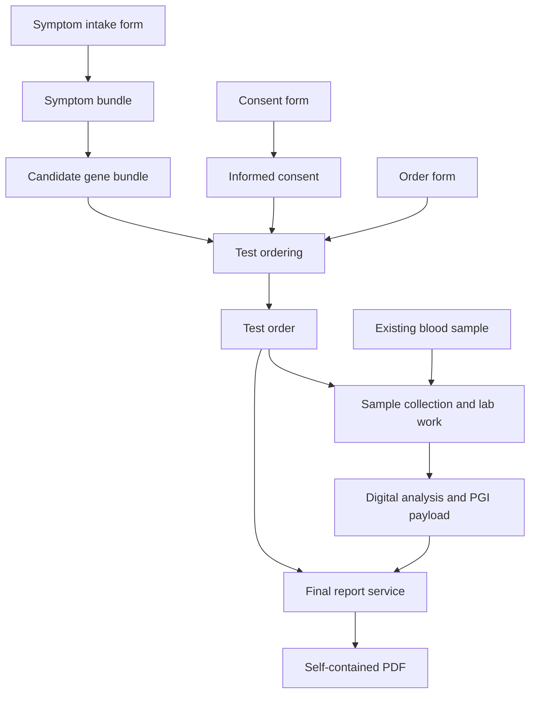

# Pocket Genes Objects and Services Wiki

Version: **1.2.0 — proposed catalog specification**
Prepared: **20 September 2026**
Scope: **20 exchanged object types, 15 mock services, and fictional independent providers.**

This reference turns the agreed Pocket Genes service model into a concrete wiki and implementation starter. The object names, property schemas, suffixes, and API routes below are proposed conventions for this catalog. They define proposed catalog contracts, including native PGI exchange formats mapped to the current app Codable models, but they are not a claim about live production data. All patient information, provider profiles, prices, turnaround times, genes, and analytical examples are synthetic.

Each provider offers services that declare typed input slots. A filled form is supplied only when the offer declares a `pgo_form` input slot. Services return typed objects or update the state of a physical item. The result of one service can become an input to another provider's service. People can request one service or an assembled journey through the app.

## Contents

1. [Model, stages, and shared rules](#model-stages-and-shared-rules)
2. [Ownership, provenance, and service fulfillment](#ownership-provenance-and-service-fulfillment)
3. [Object registry](#object-registry)
4. [Object reference pages](#object-reference-pages)
5. [Service catalog](#service-catalog)
6. [Provider catalog](#provider-catalog)
7. [Wiki presentation and icon system](#wiki-presentation-and-icon-system)
8. [Implementation and validation](#implementation-and-validation)
9. [Native services and PGO experience](#native-services-and-pgo-experience)
10. [Native format references](#native-format-references)

## Model, stages, and shared rules

The three stages are **Test planning → Wet lab → Bioinformatics**. An object can be useful in more than one stage. Stages classify capabilities; they do not force every request to traverse every stage.

| Stage | Main responsibility | Boundary |
| --- | --- | --- |
| Test planning | Forms, symptom structuring, candidate genes, informed consent, professional and organizational input | Produces the `test_order` |
| Wet lab | Biological sample collection requests, sample custody, optional separate transport, and laboratory processing | Produces the agreed initial digital file |
| Bioinformatics | Any supported transformation from source file through annotation, structured findings, or report generation | Produces the requested digital deliverable |

### Current service offer and transaction contract

These rules are the source of truth for the native app, backoffice, backend validators, bundled simulator catalog, and provider API examples. A service transaction always instantiates an existing published `service_offers` document. Users can create `service_transactions`; app users cannot create `service_offers`.

**Persistent key naming**

- Field naming is a per-collection contract. The complete table is in `firestore-field-naming.md`.
- `service_offers` and `service_transactions` use lower camel case at every persisted level. Service-result keys are exactly `outputObjects`, `outputReports`, `objectType`, `objectCode`, and `reportCode`; service-offer visibility is exactly `isHiddenFromSearch`.
- `uploaded_objects`, `uploaded_reports`, `file_storage`, `object_owners`, `report_owners`, `object_codes`, and `report_codes` use snake case for document fields and nested maps.
- The same concept intentionally crosses boundaries with different spellings: `service_transactions.outputObjects[].objectCode` resolves to `uploaded_objects.object_code` through `object_codes.uploaded_object_id`.
- A serialized PGO wrapper is a separate versioned file boundary whose schema also uses keys such as `object_type`. Implementations must decode the file, storage metadata, and service snapshot through separate boundary-specific contracts.
- Producers and consumers reject the wrong convention for their collection; compatibility aliases and dual reads are forbidden.

**Service offer identity and provider ownership**

- `service_offers` use one canonical root shape: `serviceId`, `serviceVersion`, `schemaVersion`, `name`, `providerId`, `providerKind`, `providerName`, `status`, `isHiddenFromSearch`, optional `formShape`, `inputSlots`, `outputSlots`, `acceptedConditions`, `scopeRules`, optional `commercialTerms`, calculated `shortContract`, requester-facing `description` and provider-side `providerWork`.
- Legacy aliases such as `title`, `service_id`, `provider_id`, `publisherOrganizationId`, `publisherIndividualId`, `form_shape`, `input_slots` and `output_slots` are invalid for root Firebase offers.
- `providerId` must resolve to a real Discover organization or professional individual. `providerKind` is exactly `organization` or `individual`; arbitrary provider strings are invalid.
- Provider selection happens before the rest of the offer details. Backend/backoffice owns provider resolution and must persist the provider ID, kind and display snapshot.
- New real service IDs are generated, not user-entered: `pgs_<provider_name_slug>_<n>`, lowercase with underscores. Matching form shape IDs use the same generated base: `pgfs_<provider_name_slug>_<n>`.
- The mock package may keep semantic fixture service IDs for documentation and simulation, but root Firebase/backoffice offers must use generated IDs.
- `serviceVersion` and `formShape.version` are display-only integers. Creation starts at `1`; backend logic increments published versions after meaningful published contract changes. Draft edits do not increment published contract versions.
- `description` and `providerWork` are distinct required fields. `description` is the requester-facing app summary. `providerWork` describes the provider-side operational work.
- `isHiddenFromSearch` is a required boolean on every offer. `false` allows an otherwise eligible active offer to appear in native discovery; `true` excludes it from the available-services search/list only. It is not a publication status, deletion marker, transaction status, or authorization rule. Missing, non-boolean, or snake-case variants are invalid; clients must not infer a default or perform a compatibility read.

**Form shape**

- A request form is optional. The only way to include a form input is enabling Support form input in the offer workflow.
- If support form input is enabled, the offer must include exactly one input slot with `objectType: "pgo_form"`, `acceptedTypes: ["pgo_form"]`, `role: "form"`, `required: true` and `cardinality: { "min": 1, "max": 1 }`.
- If support form input is disabled, there must be no `pgo_form` input slot and no `formShape`.
- `allowUnknownFields` is always `false` and must not be exposed as a UI control. Backend validation rejects `allowUnknownFields: true` and rejects undeclared submitted form fields.
- Every form field requires `key`, `label`, `type` and `required`. `enum` and `multi_enum` fields require non-empty `options`.
- Base form fields `requested_at` and `requested_by` are required in every form shape. They live inside the `pgo_form` payload fields, not as separate transaction fields.

**Input slots**

- Manual input slots cannot use `pgo_form`; only the Support form input toggle can add the single form slot.
- Each input slot accepts exactly one Pocket Genes object type. `acceptedTypes` must be a one-item array equal to `objectType`.
- `cardinality` is always `{ "min": 1, "max": 1 }` and `required` is always `true`.
- Input `role` is generated from the object type: `pgo_test_order` becomes `test_order`; `pgo_unannotated_vcf` becomes `unannotated_vcf`; `pgo_form` is the special role `form`.
- Duplicate input object types are invalid. Multiple required objects are modeled as multiple explicit slots.

**Output slots**

- At least one output slot is required.
- Output can never be `pgo_form`. The default/preferred output for a new offer is `pgo_pdf_report`.
- Output `role` is required. `mutationMode` remains exactly `new_object` or `new_revision`; `new_revision` must point to the source input role through `sameIdentityAsInput`.

**Calculated contract and stages**

- `shortContract` is auto-calculated from input and output slots and is not editable text.
- The calculated shape is `input_role:Input Label -> output_role:Output Label`; multiple slots are joined with ` + `. A service with no inputs uses `none -> ...`.
- Stages are shown near the calculated contract as the visual pipeline Test planning -> Wet lab -> Bioinformatics, not as a normal identity field.
- The frontend best-effort predicts stages from slots, then lets the user adjust checkboxes. At least one stage must stay selected. `pgo_form` does not influence prediction.
- Output-based prediction is preferred: planning outputs such as symptom bundles, candidate genes, informed consent and test orders map to `test_planning`; lab outputs such as collection requests, samples, DNA, reads and sequence data map to `wet_lab`; bioinformatics outputs such as aligned reads, VCFs, PGI/interactive reports, karyotype results and flow cytometry data map to `bioinformatics`.
- `pgo_pdf_report` is contextual: bioinformatics inputs predict `bioinformatics`, lab inputs predict `wet_lab`, otherwise it predicts `test_planning`.

**Commercial terms, acceptance and scope**

- The entire `commercialTerms` block is optional.
- `pricingModel` is exactly `not_specified`, `free`, `fixed` or `calculated_after_submission`. `fixed` requires `price.amount` and `price.currency`.
- Turnaround is collected as number plus unit picker and stored compactly as `2w`, `1d`, `3h` or `15m`.
- `acceptedConditions` and `scopeRules` are optional arrays. Empty values are accepted when the provider has no formal language at creation time.

**Transactions and publishing**

- A service transaction must be created from an existing service offer, never from a mock/free-text service relationship in the real request flow.
- New transactions inherit `serviceId`, `serviceVersion`, `inputSlots` and `outputSlots` from the selected offer.
- Native clients must not create the transaction when the user first taps **Solicitar este servicio** / **Request this service**. That tap opens a multistep request flow.
- The first request step is the offer form when the selected offer declares a `pgo_form` input. Platform fields such as `requested_at` and `requested_by` are filled from the real signed-in user context, and user-entered fields are collected before any transaction write. The submitted PGO embeds an immutable copy of the exact shape so it remains fully reconstructable after the offer changes.
- After the form, each required non-form input slot opens an in-app File picker. This picker searches internal File Storage documents linked to the signed-in user's six-character report codes (`community_users.owned_reports`) and filters them by the slot's expected object type/extension. It must not open an external device file picker.
- The user may proceed with **I will attach the files later**. The transaction is still created, selected attachments are recorded when present, and unresolved required roles remain in `missingRequiredInputRoles`/pending attachment metadata for later fulfillment.
- Before creating `file_storage`, `uploaded_objects`, `object_codes`, `object_owners`, or the provider `owned_objects` entry for a submitted form, the request flow must complete every deterministic validation and reload the user's root transactions. Total capacity, current UTC-day usage, latest transaction, and cooldown are calculated in memory from their `requestedAt` timestamps. No derived state is persisted. A denied request leaves no submitted-form object to remediate.
- For an offer with a form, the provider-owned form file, uploaded object, nine-digit code, owner normalization, provider `owned_objects` index, and requester-local download must all succeed before the transaction is created. The transaction write happens only after those steps and the file-selection/later-attachment choice are complete. The native flow then shows a congrats state and dismisses into ServicesHub.
- Required input slots collect `obj_*` object IDs and positive integer revisions. A transaction may become `delivered` only when `outputObjects` exactly covers every promised output role with a valid matching PGO.
- Request IDs use the `pgr_*` namespace.
- Offers start as `draft`. `active` is reached through the publish action, not through a normal status dropdown.
- Native service discovery lists only offers whose `status` is `active` and whose `isHiddenFromSearch` is `false`. Bundled mocks appear only in the simulator.
- An active hidden offer remains a valid versioned contract. An authorized backoffice workflow may create a transaction from it manually, subject to the same provider, input, output, admission, and version validation as any other offer. Hiding is not deactivation.
- Every transaction remains visible to its requester even when its source offer is hidden later or was already hidden when an authorized backoffice created it. Transaction lists load reduced transaction snapshots from the user node and transaction details load `service_transactions/{id}`; neither may join against the current offer or apply `isHiddenFromSearch`.
- Simulator requests are fake, but any generated requester/form metadata must use the real signed-in user context when available.

**Current root transaction write**

- Native writes `requestId`, `offerId`, `serviceId`, `serviceVersion`, `providerId`, `providerKind`, `requestedByUserId`, optional `requestedByUserEmail`, server `requestedAt`, `requestedAtClient`, `status`, `requestRevision`, `idempotencyKey`, `inputs`, `outputObjects`, `outputReports`, `issues`, `missingRequiredInputRoles`, `offerSnapshot`, `providerSnapshot`, `contractSource`, optional `attachmentsPending`, `createdAt`, and `updatedAt`.
- `schemaVersion` is allowed for backend normalization but is not required until the native writer emits it. `formRef`, `formSnapshot`, generic `outputs`, and publisher-ID aliases are invalid root fields.
- Every input writes `role`, positive-revision `objectRef`, exact `objectType`, and `objectSnapshot`. A provisioned form additionally writes `objectCode`, `uploadedObjectId`, `fileStorageId`, and `objectOwnerId`.
- The final batch creates the root transaction and appends the reduced `requestedServiceTransactions` summary. It writes no counters, remaining balances, bucket dates, cooldown dates, last/next-use dates, or pending admissions, and it never re-runs limit eligibility.

### Agreed contracts

- A request includes a `pgo_form` only when the selected service offer declares a `pgo_form` input slot backed by `formShape`. `requested_at` and `requested_by` live among its filled fields.
- `formShape` declares field keys, types, requiredness, and enum options. It is optional service configuration, not a twenty-first object type. A completed `pgo_form` must copy the exact shape into `data.form_shape`; shape ID/version pointers without that snapshot are invalid.
- Test ordering consumes **pgo_form + informed consent + candidate gene bundle** directly. No intermediate suggested-tests object is required.
- `test_order` holds the patient identity, purpose, clinical suspicion, selected gene scope, fulfillment requirements, and consent connection.
- `collection_request` is a formal biological sample collection request linked to a test order. It is the plan to obtain a specimen from a subject or source; it is not courier pickup, truck pickup, package pickup, route planning, transport, or the physical sample itself.
- A sample at origin and the same sample at destination have the same object identity with different revisions and custody state.
- An extracted DNA sample or biopsy is a derived physical object with its own identity and lineage.
- Extraction and sequencing also return updated source-specimen snapshots showing consumption or remaining quantity. Historical revisions preserve provenance; physical execution must check and lock the current available state.
- PGI native payloads are provider JSON files with strict closed tuples: `.pgi1.json` is always `MDMAPIModel`/`mdm`, `.pgi2.json` is always `AGAPIModel`/`ag`, and `.pgi3.json` is always `TwoPQAPIModel`/`2pq`. The Pocket Genes `pgo_interactive_report` object registers one of those raw payloads with linkage, support evidence and provenance. Cross-format registration is invalid even if two models share field names.
- Final reporting consumes **pgo_form + test_order + pgo_interactive_report**. The order supplies patient and scope, the registered PGI payload supplies provider report content, and the form supplies request context and presentation choices.
- Type matching is necessary but scope sufficiency is also required. Data must support the requested genes and analysis. File extensions and the presence or absence of VCF rows cannot establish that by themselves.
- Service request limits are catalog-level transaction admission rules. They are not `pgo_` object types, form fields, per-offer token costs, or provider-created service records.

### Vocabulary and identifiers

| Prefix / entity | Stands for | Purpose |
| --- | --- | --- |
| `pgo_` | Pocket Genes object type | Stable catalog keyword; e.g. `pgo_test_order` |
| `obj_` | Object instance | A particular order, sample, form, or result |
| `pgs_` | Pocket Genes service | A provider's declared transformation contract |
| `pgp_` | Pocket Genes provider | Organization or professional fulfilling services |
| `pgfs_` | Pocket Genes form shape | Versioned field definitions belonging to a service |
| `pgr_` | Pocket Genes request | One invocation and its execution state |
| Pipeline | Composition of requests | Connects compatible outputs and inputs across providers |

### Common object envelope

All exchanged objects have a JSON record. Native data files remain separate bytes in their standard format. A physical object's JSON records the real item's identity and state; it does not replace physical delivery.

| Property | Type | Meaning |
| --- | --- | --- |
| object_id | string | Stable instance identity. |
| object_type | enum | One of the 20 registered pgo_ keys. |
| schema_version | string | Payload contract version; fixtures use 1.0.0. |
| revision | integer ≥ 1 | Snapshot of the object. References pin this revision. |
| created_at | date-time | Creation time of this snapshot; distinct from the request time inside its form. |
| created_by | string | Identity that issued this snapshot. |
| input_refs | ObjectRef[] | Exact source object revisions, including the request form, when generated by a service. |
| data | object | Type-specific properties defined in the following pages. |
| files | FileDescriptor[] | Associated native payloads; role, path, media type, SHA-256 and byte count. |


`ObjectRef` has exactly `object_id` and `revision`. The same physical item may have revision 1 at origin and revision 2 at the destination; both snapshots remain addressable. New analytical results normally get new IDs, with references to their sources. Changing custody must not rewrite an earlier snapshot.

Native FASTQ, FASTA, BAM, VCF, FCS, and PDF objects use a `.pgobject.json` sidecar in this package. Their actual files keep `.fastq`, `.fasta`, `.bam`, `.vcf`, `.fcs`, or `.pdf`. Compound `.pg*.json` suffixes are conventions for Pocket Genes JSON objects. Compressed variants require an explicitly declared encoding/profile, not a new clinical meaning.

The same `.vcf` suffix is shared by the two VCF types. `object_type` and the annotation profile distinguish them. An annotated VCF is not automatically compatible with every interpretation service.

### Scope and fulfillment

The synthetic order requests `PGGENE_A`, `PGGENE_B`, and `PGGENE_C` under `PG_DEMO_REF_1`. The supporting metadata records which genes and variant classes are assessable and references the producer's evidence. A service checks the required profile, subject identity, order identity, actual input availability, and the requested analytical scope.

| Candidate handoff | Decision |
| --- | --- |
| Correct type/profile and evidence-backed support for all requested genes and variant classes | Eligible for the next service |
| Correct `.vcf` suffix but only two of the three requested genes supported | Insufficient scope; report the missing gene |
| Supported genes match, but reference/profile is incompatible | Requires an explicitly compatible service or transformation |
| No variants reported for one gene, with no evidence about its assessability | Cannot infer a negative result or complete testing |
| Broader acquisition than the requested scope | Does not authorize broader interpretation or reporting; honor the order's scope |

The tiny files in this package demonstrate structure and linkage. Their `synthetic_fixture` attestations are mock inputs to the compatibility example, not proof of assay coverage, a diagnostic result, or evidence that a real provider is qualified. The supplied validator checks catalog and fixture integrity; production assay validation remains provider-specific.

### Pocket Genes service network: proposed v1 logic

This specification describes a professional catalog of independently purchasable services. Pocket Genes defines a small shared object vocabulary and a common request contract. Providers publish what they accept, what they return, and the terms under which they do the work. A user can request one service or a complete compatible journey through the app or API.

This is a product-design proposal. The providers, prices, turnaround estimates, patients and scientific fixture tokens in the accompanying catalog are fictional. The examples demonstrate interoperability; they do not establish clinical validity or legal sufficiency.

#### 1. The concepts and what each one stands for

| Concept | Identifier convention | Responsibility |
|---|---|---|
| Object type | `pgo_*` | Defines the meaning, schema, representation and accepted profiles of an interchangeable piece. PGO means **Pocket Genes Object**. |
| Object instance | `object_id`, such as `obj_demo_order` | One actual piece: an order, gene bundle, sample record or registered native file. |
| Object revision | Positive integer | A specific recorded version of that object. References always pin it. |
| Provider | `pgp_*` | The organization or professional entity responsible for executing a published service. PGP means **Pocket Genes Provider**. |
| Service | `pgs_*` | An offer to perform a defined transformation. PGS means **Pocket Genes Service**. |
| Form shape | `pgfs_*` plus version | The service configuration specifying required fields, field types and enum options. PGFS means **Pocket Genes Form Shape**. |
| Form | `pgo_form` | The filled fields supplied with every execution request, including when the request was made and who made it. |
| Service request | `pgr_*` | One execution of one service under its pinned version and accepted commercial terms. PGR means **Pocket Genes Request**. |
| Pipeline | Application orchestration record | A set of service requests connected through explicit output-to-input bindings. It is a process configuration, not an extra accepted object type. |

`form_shape`, provider, service and pipeline are configuration or execution entities. They do not expand the fixed twenty-type exchanged-object registry. A specimen's digital record represents a physical item; sending its JSON does not deliver the specimen itself.

#### 2. The universal service contract

Every execution follows this pattern:

**Zero or more input objects, including a `pgo_form` only when declared, → one or more output objects.**

The `pgo_form` input is conditional. The phrase “VCF → PGI1” remains useful catalog shorthand; its full execution contract is defined by the offer input slots, and includes a form only when that offer declares a `pgo_form` slot.

A service definition contains:

| Field | Meaning |
|---|---|
| `serviceId`, `serviceVersion` | The particular published offer and its pinned integer contract version. |
| `schemaVersion` | Integer service-offer schema version; current value is `1`. |
| `name` | The display name shown by the native app. There is no `title` alias. |
| `providerId`, `providerKind`, `providerName` | The real organization or professional individual linked to this offer. There are no `publisherOrganizationId` or `publisherIndividualId` aliases on `service_offers`. |
| `status` | Published availability state; native available services read active offers only. |
| `isHiddenFromSearch` | Required discovery boolean. `true` removes the offer from native available-service search/listing only; it never hides transactions created from that offer. |
| `serviceCategory` | Optional/open-ended broad classification; not the service identity. |
| `stages` | Where the service belongs in the three-stage catalog. |
| `formShape` | Optional exact form schema, required only when an input slot declares `objectType: "pgo_form"`. |
| `inputSlots` | Named roles. Each slot has exactly one `objectType`, and `acceptedTypes` must contain exactly that same value. |
| `outputSlots` | Named results, their `objectType`, and whether `mutationMode` creates a new object or revision. |
| `acceptedConditions` | Optional preconditions for this provider to accept the particular objects and request. |
| `scopeRules` | Optional explanation of how the requested objective and analytical scope constrain the output. |
| `commercialTerms` | Optional price/turnaround metadata. Real offers can be free, priced later, or priced explicitly. |

The catalog contains sample requests and results for all fifteen services. A service may be performed by software, laboratory work, human assessment, transport, or a combination. Its internal method is the provider's responsibility; its external obligations are explicit.

##### Forms are service-specific

A `formShape` defines a list of fields, not one global medical intake questionnaire. Supported field types in this proposal are `text`, `number`, `integer`, `boolean`, `date`, `datetime`, `enum`, `multi_enum` and `string_list`.

Each field has a stable `key`, a display `label`, a `type` and `required`. Enum and multi-enum fields also contain explicit options, each with a stored value and a display label. Forms store the stable values, not the labels.

Every completed `pgo_form` is self-describing. `data.form_shape` is a required immutable snapshot with `id`, positive integer `version`, `allow_unknown_fields: false`, and the complete ordered field list. Every field snapshot contains `key`, `label`, canonical `type`, `required`, and `options`; `options` is non-empty only for `enum` and `multi_enum`. `data.form_shape.id/version` must exactly equal `data.form_shape_id/form_shape_version`. A consumer must never replace this snapshot with the latest offer shape.

Optional unanswered fields remain in `form_shape.fields` and are omitted from `data.fields`. This lets the explorer reconstruct the entire submitted form, show unanswered optional questions, resolve stored enum values back to their frozen labels, and preserve the original order. Shape keys and answer keys are unique, unknown answers are rejected, and null is not a substitute for an omitted optional answer.

When present, every shape includes `requested_at` and `requested_by`. Their values occur inside `pgo_form.data.fields`, alongside the service-specific values. An authenticated submission establishes the requester; a typed name alone is not proof of identity. Server processing timestamps can be recorded on the request separately.

For example, a symptom intake shape also requires `subject_id` and `observations`. A final-report shape requires `language` and `presentation`. Patient identity and clinical suspicion already live in the order for that reporting request, so the reporting form need not collect them again.

```json
{
  "form_shape_id": "pgfs_final_report",
  "form_shape_version": 1,
  "form_shape": {
    "id": "pgfs_final_report",
    "version": 1,
    "allow_unknown_fields": false,
    "fields": [
      {
        "key": "requested_at",
        "label": "Requested at",
        "type": "datetime",
        "required": true,
        "options": []
      },
      {
        "key": "requested_by",
        "label": "Requested by",
        "type": "text",
        "required": true,
        "options": []
      },
      {
        "key": "language",
        "label": "Report language",
        "type": "enum",
        "required": true,
        "options": [
          {
            "value": "en",
            "label": "English"
          },
          {
            "value": "es-AR",
            "label": "Spanish, Argentina"
          }
        ]
      },
      {
        "key": "presentation",
        "label": "Presentation",
        "type": "enum",
        "required": true,
        "options": [
          {
            "value": "clinical",
            "label": "Clinical report"
          },
          {
            "value": "patient",
            "label": "Patient-facing report"
          }
        ]
      }
    ]
  },
  "fields": [
    {
      "key": "requested_at",
      "value": "2026-09-16T12:00:00Z"
    },
    {
      "key": "requested_by",
      "value": "user_demo_001"
    },
    {
      "key": "language",
      "value": "en"
    },
    {
      "key": "presentation",
      "value": "clinical"
    }
  ]
}
```

The form is validated against the declared shape version. Reject duplicate keys, missing required fields, wrong value types and enum values outside the published options. This catalog rejects unknown fields; `allowUnknownFields` is not configurable. A new required field requires a new compatible contract version; changing a published shape must not silently invalidate already accepted requests.

##### Inputs bind by role

An input slot identifies why the object is supplied. For DNA extraction, the demonstrated contract uses `blood_sample`. A provider that accepts tissue or embryo biopsy publishes separate explicit slots or a separate offer; one manual input slot never hides several object types behind checkboxes.

A test order is a different slot. This avoids relying on array position to distinguish an order from the specimen being processed. An input reference consists of `object_id` and `revision`. Native files are retrieved through that registered object, with its file descriptors and integrity information.

```json
{
  "service_id": "pgs_final_report",
  "service_version": 1,
  "inputs": [
    {
      "role": "form",
      "object_ref": {
        "object_id": "obj_demo_form_final_report",
        "revision": 1
      }
    },
    {
      "role": "test_order",
      "object_ref": {
        "object_id": "obj_demo_order",
        "revision": 1
      }
    },
    {
      "role": "interactive_report",
      "object_ref": {
        "object_id": "obj_demo_interactive",
        "revision": 1
      }
    }
  ]
}
```

A form-only service supplies one `inputs` item for its `pgo_form` role and no separate root `form_ref`.

#### 3. The three stages

| Stage | Goal | Prevalent objects |
|---|---|---|
| **Test planning** | Turn an objective and available information into a complete test order. | Forms, symptom bundles, candidate gene bundles, informed consent and test orders. |
| **Wet lab** | Fulfill the physical work and laboratory processing required for the agreed digital deliverable. | Collection requests, physical samples, extracted DNA and the laboratory's output files. |
| **Bioinformatics** | Process an available digital input into the contracted analytical or presentation result. | FASTA, FASTQ, BAM, VCF, images, FCS, PGI payloads and PDF. |

The stage is a catalog location, not a rule that every customer must buy all three stages. In this three-stage vocabulary, bioinformatics also groups related digital analysis such as karyotype image review. A PDF can be produced in test planning as a consultation summary or in bioinformatics as a final genomic report; the document profile determines its purpose.

##### Test planning

One route creates a symptom bundle from a form and prioritizes candidate genes from that bundle. A second service produces an informed-consent piece from its own form. Test ordering then combines exactly the three agreed inputs:

**pgo_form + informed_consent + bundle_of_candidate_genes → test_order.**

The order's form supplies patient name, date of birth, patient identifier, objective, suspicion and other required ordering details. It also selects `wet_lab_output_type`, the final deliverables through `required_output_types`, and the `required_profile`. Those map to the order's patient record and fulfillment requirements, including `fulfillment.final_output_types`. The order consolidates that context and retains its consent reference. No `bundle_of_suggested_tests` intermediate is required. Professionals and organizations can specialize in any of these transformations.

##### Wet lab

A `collection_request` is a formal instruction to obtain an actual biological sample from a subject or source as part of a test order. The illustrated offer addresses `pgp_sample_logistics`, using a demo clinical collection room, a blood-draw collection method, the 2026-09-16 13:00–15:00 UTC collection window, and an EDTA-tube preparation profile. It is explicitly not courier pickup, truck pickup, package pickup, route planning, or transport.

After biological collection, the resulting physical sample is represented by a separate sample object. If that sample later moves, transport returns a later revision of the same physical sample identity with custody, location and receipt information. Extraction produces a new DNA object because the extracted material is a distinct derived specimen. Its lineage points back to the source. Consumption or remaining quantity of source material must be recorded.

The collection example is the sample-acquisition request. The transport example begins only after a physical specimen exists. These examples must not collapse biological collection and courier movement into one object.

`pgo_embryo_sample` distinguishes `whole_embryo` from `embryo_biopsy`. The demonstrated DNA-extraction offer accepts an embryo biopsy only. A whole embryo cannot be substituted merely because the registry type is shared. Taking a biopsy creates a separate material identity and lineage before that biopsy can enter extraction.

A lab can choose its contractual exit point. This catalog's sequencing offer returns FASTQ. Another published service could return BAM, unannotated VCF or a complete result by performing more work internally. The platform does not force the customer to purchase or download every intermediate file.

##### Bioinformatics

The fifteen examples split alignment, calling, annotation, interactive interpretation and reporting into separate offers. Each step can belong to a different provider, and a provider may publish a combined offer.

FASTA and FASTQ are distinct types. They are not interchangeable labels for one mandatory entry format. An eligible provider can accept whichever actual source format its contract supports. The fixed registry contains FASTA and FCS even though these fifteen mock offers do not yet consume or produce them.

Annotation requires `pgo_form + unannotated_vcf + test_order`. The order constrains subject, scope, reference, profile and fulfillment checks; the annotated VCF must preserve analytical-support evidence and limitations.

The interpretation contract demonstrated here is:

**pgo_form + annotated_vcf -> pgo_interactive_report (.pgi1.json / MDMAPIModel).**

The demo interpretation service creates a Pocket Genes registration object whose raw payload is a `.pgi1.json` file matching `MDMAPIModel`. The registered VCF carries its own source and analytical-support information. This conversion does not require a symptom bundle or a test order as an additional input. Pipeline orchestration compares the registration object's declared support with a linked order without making symptoms part of the conversion. `.pgi2.json` and `.pgi3.json` follow the same registration concept for `AGAPIModel` and `TwoPQAPIModel`, but require native payloads from compatible sources.

The final-report contract is:

**pgo_form + test_order + pgo_interactive_report (.pgi1/.pgi2/.pgi3) -> final PDF.**

The order supplies the patient and intended clinical context. The registered PGI object supplies the native payload reference, provider model, support evidence, provenance and analytical limitations. The form supplies request metadata and presentation choices. Under this contract, those pieces must contain everything needed for a self-contained report. The provider should not need to retrieve original intake forms or planning bundles. Any included professional review and report issuance must be stated in the offered service.

#### 4. Compatibility includes the requested result

Matching an extension only identifies a possible connection. Before a provider accepts work, the system evaluates:

1. **Object identity and access:** the supplied revision exists and belongs to the intended subject or material lineage.
2. **Type and version:** the declared semantic type, JSON schema or native representation is accepted.
3. **Profile and content:** the relevant form, annotation, imaging, assay or document-purpose profile matches.
4. **Order scope:** the service and input data can support the genes, reference, variant classes and deliverables requested.
5. **State and availability:** a physical item is in the appropriate location and condition, with usable material available.
6. **Execution terms:** the provider accepts the location, price, turnaround and responsibility attached to the request.

For example, the fixture order requests `PGGENE_A`, `PGGENE_B` and `PGGENE_C` on synthetic reference `PG_DEMO_REF_1`. Its scope is stored in `data.scope`. Its fulfillment requirements are stored in `data.fulfillment`, including `scope_policy: requested_only` and `analysis_support_required: true`.

A VCF whose supported analytical scope omits requested genes is insufficient, even if structurally valid. Adding annotations cannot recover missing measurements. Absence of a row for a requested gene does not establish that the gene was adequately assessed. Analytical objects therefore retain `data.analysis_support`, including status, evaluated genes, supported variant classes, evidence and limitations. Evidence can point to an embedded declaration or an attached quality/support file. Its presence as JSON is not, by itself, a scientific verification.

An output supports the order only when its analytical support and service profile meet the actual requirement. Extra processing or findings do not silently expand the requested scope. A provider that cannot meet the full accepted contract returns the limitation and a suitable non-delivered state rather than describing the request as fulfilled.

#### 5. Execution lifecycle and responsibility

| State | Meaning |
|---|---|
| `received` | The request is recorded and assigned an ID. |
| `validating` | Form, input access, compatibility, availability and scope are being checked. |
| `accepted` | The provider accepts responsibility for the specified service under the agreed terms. |
| `queued` | Accepted work waits for an execution slot. |
| `running` | The provider is performing the work. |
| `awaiting_input` | Work needs an explicit clarification or additional piece before it can continue. |
| `delivered` | The accepted contract is fulfilled and every promised output object is uploaded, registered and available to the requester. |
| `rejected` | The provider declines before acceptance, with a reason. |
| `failed` | Accepted work cannot fulfill the contract, with a reason and recovery information. |
| `cancelled` | Cancellation has completed under the agreed terms. |

The normal path is received, validating, accepted, queued, running and delivered. Queuing can be skipped. Validation or running work can pause at awaiting_input; the response must say what is needed and where execution resumes. Delivered, rejected, failed and cancelled are terminal states. A later rework execution has a new request identity linked to the original. `completed` and `finished` are not valid service-transaction states and must be rejected rather than translated for compatibility.

An HTTP `202` only confirms asynchronous receipt unless the returned state explicitly says accepted. A progress percentage is informative; it does not replace the state or prove fulfillment.

A pipeline needs a named party responsible for resolving cross-provider failures. Each provider owns its service, while Pocket Genes or an explicitly contracted journey operator coordinates the overall journey. If a downstream provider rejects an upstream output, the requester needs a concrete resolution: corrected output, an alternative compatible provider, a new physical procedure if separately authorized, or a refund under the accepted terms.

Refund status is a commercial outcome, not an object transformation. Track it alongside the execution. “The provider returned a file” is not a sufficient reason to consider an unfulfilled scope delivered.

##### Delivered transactions and registered results

`delivered` is the only successful final state for a root-level `service_transactions` record. It means more than provider-side processing being finished: every output slot frozen from the selected service offer has a corresponding, downloadable Pocket Genes Object. The backend and backoffice must validate this invariant immediately before committing the state transition. A provider callback that says work is finished cannot bypass it.

The transaction stores compact result snapshots under the exact Firestore property `outputObjects`:

```json
{
  "status": "delivered",
  "outputObjects": [
    {
      "role": "informed_consent",
      "objectType": "pgo_informed_consent",
      "objectCode": "012345678"
    }
  ],
  "outputReports": [
    {
      "reportCode": "A1B2C3"
    }
  ]
}
```

Each `outputObjects` item is a reduced snapshot, not the full object and not a free-form result:

| Property | Required | Rule |
|---|---:|---|
| `role` | Yes | Lowercase identifier. It must equal one output-slot role in the transaction's frozen service contract and may occur only once. |
| `objectType` | Yes | One concrete type from the 20-type PGO catalog. It must equal the type promised for that role. For a `same_as:<input_role>` slot, resolve the concrete input type before validating. |
| `objectCode` | Yes | Exactly nine ASCII digits, including leading zeroes. It must resolve through `object_codes/{objectCode}` to an existing `uploaded_objects` record. That record must declare a positive integer `upload_version_count`. |

The linked `uploaded_objects` record repeats those values using its own storage convention: `object_code` and `object_type`. It must be in the ready state and have a usable stored payload reference. The backend rejects duplicate roles, unknown roles, unknown object types, malformed codes, absent code lookups, missing uploaded objects, type mismatches, and objects that are not ready. A `delivered` transaction must contain exactly one valid `outputObjects` snapshot for every promised output slot. A transaction carrying `status: delivered` without that exact coverage is inconsistent and must not be persisted.

`outputReports` is an optional array of reduced report snapshots. Each item contains only a unique `reportCode` of exactly six ASCII alphanumeric characters. Reports may be useful companion results, but they are not service-contract output slots in this version. They are never required and never satisfy, replace or repair a missing `outputObjects` entry.

The delivery transition and the reduced `requested_service_transactions` user-node snapshot must be updated consistently. User-node snapshots support lists only; the authoritative contract, state and result snapshots remain under root `service_transactions`.

Native clients treat inconsistent delivered data as an error state, not as success. A valid delivered transaction shows a completion check in service lists and exposes **View results** from its detail and process-tracking screens. The result screen lists each delivered object as not downloaded, downloading, available to open, or ready to update. Download resolves the nine-digit code through the same `object_codes` -> `uploaded_objects` circuit used by **Add object**, stores both the object and its current `upload_version_count` in the user's local object inventory, and makes it discoverable from **Choose your object**. Every later presentation first matches the exact object code against local storage, so a downloaded object displays **Open** immediately rather than returning to **Download**. The client then reads the current remote `upload_version_count` without downloading the payload. It displays **Update** only when that positive integer is greater than the locally stored version. Updating downloads the same code again and atomically replaces the local content and version; it does not create a duplicate object. While downloading or updating, the row shows a progress indicator. **Open** uses the standard blocking object-activation flow before opening the matching PGO explorer. Optional report codes may be displayed separately but do not change delivery validity.

`uploaded_objects.upload_version_count` is required, starts at `1`, and increases by exactly one whenever the downloadable object payload is replaced with a newer revision. The `outputObjects` transaction snapshot intentionally does not copy this mutable counter: its nine-digit `objectCode` remains the stable identity, and `uploaded_objects` is the authoritative source for current-version checks. A delivered transaction is invalid if any promised object lacks a positive integer `upload_version_count`.

##### Token-based service request limits

The service catalog uses the catalog-level policy `pg_usage_policy_service_requests_v1`, stored in `catalog/usage-policy.json`. The policy gates creation of root-level `service_transactions`; it does not change any object type, add a `pgo_token` record, add token fields to `form_shape`, or allow individual `service_offers` to declare variable token costs. Service offers remain provider-published contracts. Users consume limits only when they request an offered service and the backend admits the resulting transaction.

A token means permission to initiate one admitted service transaction. Every newly admitted `pgr_` transaction costs exactly one token. Ordinary reads, downloads, status updates, notifications, clarifications, output registration, contact requests, and limit-extension requests do not consume tokens.

Each user may receive this stable policy configuration:

```json
{
  "token_status": {
    "policy_id": "pg_usage_policy_service_requests_v1",
    "total_transaction_limit": 20,
    "daily_transaction_limit": 5,
    "cooldown_seconds": 300
  }
}
```

`token_status` is configuration only. It must never contain usage counters, remaining balances, last/next request dates, cooldown start/end dates, UTC bucket dates, or pending admissions. The explicitly forbidden persisted fields are `admitted_usage_count`, `admitted_usage_day_start`, `today_usage_count`, `tokens_consumed_today`, `tokens_remaining_today`, `last_request_at`, `next_request_at`, `cooldown_started_at`, `cooldown_ends_at`, `pending_admissions`, and `token_balance`.

The only accounting source is the current root `service_transactions` list filtered by `requestedByUserId`. Every record requires its own server `requestedAt`. The reduced user-node list is not an accounting source, and duplicate fields such as `charged_user_id`, `token_consumed_at`, and `admittedAt` are not part of the native contract.

On every account-status load/refresh and immediately before request approval, the client deduplicates root transactions by document ID, ignores future timestamps, and recomputes all derived values in memory. Remaining total is `max(0, total_transaction_limit - transaction_count)`. Today's count uses the half-open UTC interval `[utc_day_start, next_utc_day_start)`. Latest use is `max(requestedAt)`. The cooldown deadline is that latest timestamp plus `cooldown_seconds`. When daily capacity and cooldown are both active, the later temporary deadline wins. Seven-day chart values are grouped from those same timestamps. None of those results is serialized.

At `00:00 UTC` there is no reset write. Recalculation against the new UTC interval naturally resets today's count. Device-local time is presentation only.

The gate validates offer, inputs, form, requester, provider/owner destination, and idempotency without writing submitted data; loads stable configuration and every current root transaction; calculates total, daily and cooldown eligibility; and approves or denies without persisting calculated state. A denial leaves no form, owner mutation, code, file, transaction, counter, balance, or deadline. After approval, the provider-owned form flow and final transaction commit proceed without a second endogenous limit check. The final batch writes the root transaction and reduced user summary only.

The native loading surface follows `ServiceRequestCreationStep`: request validation; optional form validation and provider resolution; stable limit loading; functional calculation from real transactions; eligibility approval; optional form preparation, registration, and local download; transaction creation; and finalization. Progress is event-driven and never advances ahead of the completed service callback. There is no reservation document or admission mirror.

Idempotent retries resolve an existing transaction first. Any retry requiring a new decision reloads the root list and recalculates from scratch. Administrative grants change the stable `total_transaction_limit`, not a stored remaining balance; historical transaction timestamps are never rewritten to manipulate the daily count or cooldown.

Pipelines follow the same rule. Compatibility planning and route preview consume no tokens. Each separately requested published service step consumes one token when admitted. A combined published service consumes one token for that one admitted transaction. If an automatic step cannot be admitted because of limits, store it as `waiting_for_limits` and re-check limits before retrying.

The native UI presents this as **Limits**, not as a wallet, coins, purchases, refills, or paid upgrades. Stable internal denial codes are `token_balance_exhausted`, `token_daily_limit_reached`, and `token_cooldown_active`. Required user messages are:

| Case | Message |
| --- | --- |
| Daily maximum reached | You've reached your service request limit for today. You can request another service after {time}. |
| Balance exhausted | You've reached your current service request limit. |
| Cooldown active | You can request another service in {remaining_time}. |

Add this suffix where helpful: "Need to use more services? Contact us to request higher usage limits." The short explanation is: "Service request limits help keep Pocket Genes reliable and give providers time to manage incoming requests."

The account-status modal shows configured cooldown plus derived last request, today's `used/max`, total `remaining/total`, local-clock rendering of the current UTC window and next reset, and seven UTC day buckets. Its countdown refreshes every second from `now` and the temporary calculated deadline. UTC defines bucket membership; device-local time is presentation only.

##### Idempotency and safe recovery

Every creation call carries an idempotency key. Repeating the same key with the same canonical request returns the original execution; reusing it for a different payload returns a conflict. The provider publishes the retention window. This draft proposes at least thirty days.

After a timeout, query the existing request or repeat with the same key. Do not submit a new request simply because a callback was delayed. Duplicate courier dispatch, sample consumption or laboratory work can be expensive and cannot always be undone.

A failed physical job is not automatically retried. Check the specimen's actual state and remaining material, determine the recovery action and obtain whatever action authorization is required by the accepted service terms. Digital work also needs idempotency so that retries do not create accidental repeated charges or conflicting outputs.

##### API and callbacks

The provider catalog includes an illustrative complete API example for Variant Analysis Cooperative:

- `POST /service-requests` submits a service, form reference and role-bound inputs.
- `GET /service-requests/{request_id}` returns authoritative state.
- `GET /service-requests/{request_id}/results` returns registered output references.
- A signed provider callback announces progress or completion to a preregistered Pocket Genes endpoint.

Provider authentication, object access and callback verification are integration configuration. Credentials are absent from the fixtures. Callback destinations are registered in advance; a request cannot redirect patient information to an arbitrary URL. Events include unique IDs and increasing request revisions so duplicates and out-of-order delivery can be handled. Large FASTQ, BAM or PDF payloads stay in object storage; the API passes authenticated object references and integrity metadata.

#### 6. Example pipelines and alternate entry points

##### A. Test planning through a final report

The user supplies the planning forms. Meridian Clinical Planning produces the symptom bundle, candidate genes and consent piece, then creates the order. Origin Sample Services produces the biological sample collection request and, through a separate transport service, moves the already collected blood sample. Atlas Precision Laboratory extracts DNA and produces FASTQ. Variant Analysis Cooperative aligns the reads, calls variants, annotates the VCF and creates a registered PGI1/MDM payload. Clarity Report Studio combines the registered PGI object with the original complete order and produces the final PDF.



Every service request in the diagram also receives its own form. The detailed fifteen-service table exposes the individual transformations hidden inside the grouped physical and digital blocks. The original order remains available at every step where it is explicitly required, including final reporting.

##### B. Start with an existing annotated VCF

A user already has a registered compatible annotated VCF and a complete test order. Request `pgs_interactive_interpretation` with its form and that VCF, then request `pgs_final_report` with its own form, the resulting registered PGI object and the order. Laboratory work, alignment, calling and annotation are skipped. The existing analytical support must still meet the order scope.

A user with an existing unannotated VCF can first request annotation without creating a test order, then request PGI1/MDM registration. A complete test order becomes required when that user requests the final self-contained reporting contract.

If the user already has a suitable `.pgi1.json`, `.pgi2.json`, or `.pgi3.json`, a registration/import step can create the `pgo_interactive_report`; then the final-report service is sufficient once its required order and form are available.

##### C. A service without sequencing or domain inputs

A user fills the `pgfs_form_to_pdf` form and requests `pgs_form_to_pdf`. Meridian Clinical Planning returns a consultation summary PDF. The request carries that form as a `pgo_form` input role and has no root `form_ref` field. This is a complete, independent service.

A separate non-sequencing branch is `pgo_form + metaphase image_bundle → karyotype_result`, fulfilled by Chromosome Image Services. It demonstrates that the network can support specialist image review within the same request mechanics.

#### 7. Provider substitution and composition

A new provider publishes its own service ID and accepted contract. The platform can propose it for a step when its output, acceptance conditions, scope and commercial terms fit the surrounding route. Existing requests keep the provider and version originally accepted; substitution is explicit.

A compatible output can be reused in several subsequent services, subject to access and scope. Input consumption matters: a digital object remains reusable, while a physical procedure may consume all or part of the specimen. Pipelines therefore bind exact object revisions and track remaining material before initiating more work.

A complete journey should be checked before starting irreversible physical steps. The available source, each required handoff, the selected providers and the final requested output must form a feasible route. A provider directory with matching extensions is not enough.

The fifteen services are a starting catalog. They illustrate how a provider can specialize in one conversion or offer several stages. The twenty object types are a fixed proposed v1 vocabulary; future registry additions should have clear semantics, schemas and examples rather than becoming catch-all files.

#### 8. Professional catalog presentation

Each object should have a stable icon asset, a clear name, its `pgo_*` keyword, a physical/virtual label, extension, accepted-profile details and a concise definition. Its wiki page should expose properties, a content example, producer services and consumer services.

The light gamification comes from visible progression and discoverable connections: “You have these pieces,” “These services can use them,” and “This requested result needs these remaining pieces.” Use neutral completion markers and stage colors. Icons and object cards should help users recognize the catalog without implying medical certainty, quality scores or game-like rewards for ordering more tests.

A provider page names who is responsible, which services are offered, coverage, turnaround and integration capabilities. A service page shows the input slots, required form, output, acceptance rules and exact scope. Missing compatibility is shown as a specific reason, such as an unsupported material kind or incomplete gene scope, with the relevant corrective action.

## Ownership, provenance, and service fulfillment

This chapter is the normative ownership and fulfillment contract for the Pocket Genes native app, Firebase backend, provider backoffice, service catalog, and support tooling. It defines who creates and controls reports and Pocket Genes Objects (PGOs), how creator information is stored and displayed, and how a reusable service offer becomes a time-bound service transaction whose results can be downloaded by the requester.

The exact capability field is `is_clinician`. The misspelling `is_clinitial` is not a valid field and must never be read, written, or accepted as an alias.

### 1. The identities must remain separate

The platform must not collapse the following identities into a single generic "owner":

| Identity | Meaning | Main authority |
| --- | --- | --- |
| Subject | The person whose health, specimen, or genomic information is represented | Gives the applicable consent and has the rights provided by law |
| Requester | The signed-in app user who creates a service transaction | Can access their own request, follow its progress, communicate, and retrieve delivered results |
| Report owner | The creator and seeder of a legacy report record | Publishes and maintains the report and its payload under a stable report code |
| Object owner | The creator and seeder of a PGO record | Publishes and maintains the object and its payload under a stable object code |
| Service provider | The Discover organization or professional individual contractually responsible for performing an offer | Performs the declared work and delivers the promised output object types |
| Pocket Genes platform | The technical intermediary that transports references, files, status, and messages | Provides access control, routing, storage integration, and the native experience |

One person or entity may occupy more than one role, but the records and permissions do not merge. For example, a professional may be the service provider and seed the resulting object, while a patient is both the requester and subject. The transaction must still preserve each role explicitly.

Downloading a report or object does **not** make the requester its technical owner. It gives the requester an authorized local copy and access to the result. The owner remains the creator/seeder recorded by the authoritative uploaded record unless an explicit, audited ownership transfer is performed by an authorized backend process.

In this contract, "owner" means the platform's creator, publisher, and seeder relationship. It does not by itself decide clinical data rights, intellectual-property rights, patient rights, copyright, or legal title. Those rights continue to be governed by consent, the service contract, and applicable law.

### 2. What report and object ownership means

A report owner or object owner is the account that created the platform record and supplied, linked, or authorized its payload. That account is the provenance source shown to recipients.

An owner may:

- create a tracker and its stable access code;
- provide or link the first payload;
- edit requester-visible metadata for records they own;
- replace or revise their own payload through the supported upload flow;
- increment `upload_version_count` when the payload changes;
- manage their public creator profile; and
- remove their own record when permitted by retention, transaction, consent, and legal rules.

An owner may not:

- edit a report or object seeded by a different owner;
- claim ownership merely because they know an access code or downloaded a copy;
- change a nine-digit object code into a report code, or the reverse;
- silently change an object's canonical `object_type` after publication;
- reuse one stored file for several report or object identities;
- use native owner tools to mark a service transaction as fulfilled; or
- use `is_clinician` as a substitute for provider authorization, backoffice authorization, or medical credential verification.

The stable code identifies the published record. A payload update remains a new version of that same record and increments `upload_version_count`; it does not create a second owner relationship. Identity fields, code mappings, and owner links are immutable except through a privileged, audited recovery or ownership-transfer operation.

### 3. Report owners and object owners are parallel, strict domains

Reports and PGOs share concepts but do not share lookup collections or code formats.

| Concern | Legacy report | Pocket Genes Object |
| --- | --- | --- |
| Access code | Six uppercase alphanumeric characters | Exactly nine ASCII digits; leading zeroes are valid |
| Code collection | `report_codes/{reportCode}` | `object_codes/{objectCode}` |
| Code target field | `uploaded_report_id` | `uploaded_object_id` |
| Full record | `uploaded_reports/{uploadedReportId}` | `uploaded_objects/{uploadedObjectId}` |
| Owner link field | `report_owner_id` | `object_owner_id` |
| Owner profile | `report_owners/{reportOwnerId}` | `object_owners/{objectOwnerId}` |
| User-owned index | `community_users/{uid}.owned_reports` | `community_users/{uid}.owned_objects` |
| Local provenance code | `ownerReportCode` | `ownerObjectCode` |

There is no report-to-object runtime compatibility fallback. Object reads never resolve through `report_owners`, and missing object codes are never searched in `report_codes`; the inverse is also forbidden. The only sanctioned bridge is a one-time normalization write before the first provider-owned submitted form: when the resolved provider account has `report_owners/{uid}` but no `object_owners/{uid}`, trusted provisioning copies the owner profile into a new `object_owners/{uid}` record. All subsequent object reads use that new object-owner record. If neither owner profile exists, form provisioning fails instead of inventing ownership data.

#### 3.1 Owner profile shape

Both owner profile domains expose the same human-readable profile fields:

- `owner_name`
- `owner_company`
- `owner_profession`
- `owner_bio`
- `owner_contact_number`
- `owner_contact_email`

The authoritative full creator profile is loaded from the corresponding owner collection. Uploaded records also carry small provenance snapshots such as `owner_name` and `owner_email` so lists and detail screens can render useful attribution without replacing the owner profile as source of truth.

Creator contact information must be displayed only in the contexts allowed by privacy and authorization rules. A public or recipient-visible screen may use a deliberately reduced profile. Internal contact details must not become public merely because they exist in the owner document.

#### 3.2 Uploaded report record

An uploaded report includes, at minimum for ownership and access purposes:

- `report_code`
- `report_owner_id`
- `owner_community_user_id`
- `owner_public_profile_id`
- `owner_name` and `owner_email` snapshots
- `file_name`
- `provider_name` and `provider_format`
- `download_url` or `linked_file_id` when ready
- positive integer `upload_version_count`
- `date_created` and `date_modified`
- `tracking_progress_status`

`report_owner_id` and `owner_community_user_id` must identify the account authorized to maintain the record. The six-character code document points to this full uploaded report; it is not the full report itself.

#### 3.3 Uploaded object record

An uploaded object includes, at minimum for ownership, type safety, and access:

- `object_code`
- exact catalog `object_type`, such as `pgo_annotated_vcf`
- `object_owner_id`
- `owner_community_user_id`
- `owner_public_profile_id`
- `owner_name` and `owner_email` snapshots
- `file_name`
- `provider_name`
- `download_url` or `linked_file_id` when ready
- positive integer `upload_version_count`
- `date_created` and `date_modified`
- `tracking_progress_status`

`object_owner_id` and `owner_community_user_id` are required and must identify the same owner. The nine-digit code document points to the full uploaded object. The payload must be a valid PGO wrapper whose `object_type` exactly matches the uploaded record and the promised service output.

#### 3.4 Stored payloads

Root `file_storage` is payload storage shared by report and object workflows, but every stored file can be claimed by only one code domain:

- `linked_report_code` links one file to one report;
- `linked_object_code` links one file to one object;
- both cannot be populated at the same time; and
- after a link is established, it is immutable and cannot be reused for another report or object.

The owner must have created the stored file they link. Client checks improve feedback, while Firestore rules and backend validation remain the security boundary.

### 4. `is_clinician` is a capability, not ownership

`community_users/{uid}.is_clinician` is the shared native capability flag for report and object publication tools.

When `is_clinician == true`, the profile section **Reports and objects** exposes both:

- **Manage uploaded reports**, backed by `owned_reports`; and
- **Manage uploaded objects**, backed by `owned_objects`.

The flag does not live in `report_owners` or `object_owners`, and neither owner document independently grants the capability. The app currently records acceptance evidence through `report_owners/{uid}.accepted_terms` and `accepted_terms_at`, then writes `community_users/{uid}.is_clinician = true`. Those terms explicitly cover both reports and PGOs. The object owner profile remains separate even though the shared onboarding acceptance record is stored in the report-owner domain.

`is_clinician` means that the user may access native creator tools after accepting the applicable terms. It does **not** mean that:

- every report or object belongs to that user;
- the user is the subject or requester;
- Pocket Genes has verified a license in every jurisdiction;
- the user may publish a service offer;
- the user may edit service transactions;
- the user may attach service outputs or set `delivered`; or
- the user may bypass ownership checks.

Backend authorization must check both the capability and the record's owner IDs. Hiding a button from non-clinicians is user experience, not authorization.

A non-clinician does not need `is_clinician` to request services, retain their own service transactions, download delivered results, store authorized local copies, or explore those copies. This is the complete requester experience and is a primary app use case.

### 5. Creator information in the native experience

Creator attribution follows the loaded report or object, not the signed-in viewer.

The app must:

1. resolve the access code in the correct code collection;
2. load the authoritative uploaded report or object;
3. read its owner ID;
4. load the matching owner profile from the correct owner collection;
5. show the creator/seeder beside the report or object where attribution is expected; and
6. preserve the report or object code in the local stored-file metadata so the relationship can be resolved again.

Report screens use report terminology and `report_owners`. PGO screens use object terminology and `object_owners`, including when the PGO's payload happens to be a PDF report or interactive report.

A service result screen may initially show the provider and compact output snapshot from the transaction. Before downloading or opening an output object, the app resolves `object_codes -> uploaded_objects -> object_owners`. This prevents a stale transaction snapshot from replacing the authoritative payload, version, type, readiness, or creator record.

Downloaded results are local recipient copies. They appear in **Choose your object** or the corresponding report selector and can be explored on that device, but they are not added to the requester's backend `owned_objects` or `owned_reports` merely because they were downloaded.

### 6. Platform terms and allocation of responsibility

These product rules state the intended platform allocation of responsibility. Production terms, privacy notices, consent language, retention rules, and jurisdiction-specific limitations must be reviewed by qualified legal and privacy counsel. No implementation may remove rights or liabilities that cannot legally be waived.

#### 6.1 Owner and provider representations

By seeding a report or object, the owner represents that they:

- have authority to upload, link, process, and share the content;
- have obtained the required patient or subject consent;
- have a lawful basis for handling health and genomic information;
- supplied accurate provenance and creator information;
- will not publish malicious, unlawful, deceptive, or rights-infringing content;
- are responsible for the content, clinical assertions, interpretation, quality, and fitness of the seeded material; and
- will maintain or correct the record when they discover a material error.

By fulfilling a service transaction, the provider additionally represents that the work and outputs conform to the accepted offer version, declared scope, output roles, object types, acceptance conditions, and applicable professional obligations.

#### 6.2 Requester responsibilities

The requester is responsible for:

- providing accurate request and subject information;
- supplying only inputs they are authorized to use;
- reviewing the offer, contract, provider, scope, timing, and limitations before requesting;
- protecting access codes and downloaded files;
- obtaining professional interpretation when the result requires it; and
- not treating transport, storage, or catalog presentation as an independent medical endorsement by Pocket Genes.

#### 6.3 Pocket Genes as technical intermediary

When acting as the platform, Pocket Genes is a means of digital transport and coordination. It routes service requests, object references, report references, files, statuses, and provider communications. It does not become the author, owner, seeder, laboratory, diagnosing professional, or guarantor of third-party content merely by transporting or displaying it.

To the maximum extent permitted by applicable law, Pocket Genes as platform does not warrant or accept responsibility for the accuracy, completeness, clinical validity, authorship, legality, availability, fitness, or interpretation of content created by owners or providers, nor for decisions made solely from that content. Owners and service providers remain responsible for what they create, publish, and deliver.

Pocket Genes remains responsible for obligations that belong to the platform itself, including its own access controls, security commitments, privacy duties, transaction routing, and statutory duties that cannot be excluded. A transport disclaimer must never be used to excuse a platform security failure or a non-waivable legal obligation.

If a Pocket Genes organization separately appears as the named provider of an offer, that provider role carries the obligations written in the offer and transaction. The provider role and the neutral platform role must remain separately attributable.

"Transport" in this chapter means digital transport of records and references. It does not mean physical specimen pickup. `pgo_collection_request` means a request to collect a biological sample from a subject; any physical shipment of an already collected specimen is a separate provider service and custody event.

#### 6.4 Takedown, correction, and disputes

The platform must offer an auditable path to report unauthorized content, incorrect attribution, compromised codes, or unlawful disclosure. A disputed record may be restricted while preserving required evidence. Corrections must preserve revision history, timestamps, and actor identity. Ownership transfer, if supported, must be explicit and audited; changing a display name is not an ownership transfer.

### 7. Service offers are untimed templates and contracts

A `service_offers` document is a reusable, versioned definition of work. It is not one patient's request and does not move through execution statuses.

An offer defines:

- provider identity and provider kind;
- requester-facing description and provider-side work;
- optional form shape;
- required input slots and their exact PGO types;
- promised output slots and their exact PGO types;
- calculated visual conversion contract;
- stages, acceptance conditions, scope, commercial terms, and turnaround; and
- `serviceVersion`, which freezes a published contract revision.

The offer is untimed in the execution sense: it has no requester-specific start, queue, completion, or delivery clock. It remains a selectable template while `active`, even though it still has administrative creation/update timestamps, version history, and may later be retired or superseded.

Only an active offer may be selected for a new real transaction. The native app cannot create or publish offers. Offers are created and published by authorized organizations or professional individuals through provider/backend tooling.

The offer is both:

1. a **template**, because many requesters may instantiate it; and
2. a **contract definition**, because its selected version fixes the expected inputs, outputs, provider work, scope, and terms for each resulting transaction.

A later offer edit must not rewrite an existing transaction. Each transaction stores the accepted `serviceId`, integer `serviceVersion`, provider identity, and an immutable `offerSnapshot` sufficient to explain the contract that was accepted.

### 8. Service transactions are timed executions

A root `service_transactions` document is one request by one user against one existing active offer. It is a time-bound operational record, not a template.

A transaction records:

- `requestId` in the `pgr_*` namespace;
- `serviceId` and frozen `serviceVersion`;
- requester and subject identity;
- provider identity;
- accepted offer/provider snapshots;
- exact input object references and revisions;
- form data only through the declared `pgo_form` input slot;
- creation, request, token-consumption, update, and delivery timing;
- current lifecycle status and issues;
- `outputObjects`; and
- optional `outputReports`.

Transactions can last seconds, days, or weeks. They remain visible in the requester's Service Hub for as long as required to complete, reject, fail, or cancel them. Logging out, closing the app, changing devices, or publishing a newer offer version must not erase or silently replace the authoritative root transaction.

The requester's `community_users` record stores only a reduced `requested_service_transactions` snapshot list for efficient cells. The full operational truth remains under root `service_transactions`.

#### 8.1 Offer versus transaction

| Property | Service offer | Service transaction |
| --- | --- | --- |
| Purpose | Reusable template and contract | One execution of one accepted offer version |
| Time model | No execution clock | Has request, processing, update, and completion times |
| Actor | Authorized provider publisher | Requester, assigned provider, and backoffice operators |
| Status | Publishing/availability state such as `active` | Operational state such as `received`, `running`, or `delivered` |
| Inputs/outputs | Declares required slot types | Binds actual input revisions and delivered output codes |
| Mutability | New published version for meaningful contract changes | Controlled lifecycle transitions; accepted contract stays frozen |
| Native app | Read/select only | Create own request, read own progress, communicate, download results |

An offer can exist with zero transactions. A transaction cannot exist without an offer. An offer is never `delivered`; only a transaction can be delivered.

### 9. Services are the primary way to request new objects

For an ordinary requester, a service is the primary mechanism for asking a provider to create, transform, analyze, or deliver PGOs. The requester chooses an active offer because its output slots state exactly which object types the provider promises.

The native app can also create reports and objects through clinician creator tools. That direct flow exists so an authorized creator can seed content they already produced or are responsible for. It is not a shortcut for a requester to manufacture an expected service output, claim that provider work was completed, or change a transaction to `delivered`.

The distinction is:

- **Direct creation:** an authorized clinician/creator seeds and owns a report or object outside a requester transaction.
- **Service request:** a non-clinician or clinician asks a provider to perform the published work; the transaction persists until the provider fulfills it.
- **Service delivery:** the provider/backoffice first creates and uploads the promised output records, then attaches their codes to the transaction and completes it.

Objects supplied as service inputs remain bound by their existing owner and revision. Objects produced as outputs are owned by the account or organization that actually creates/seeds them, commonly the provider or an authorized professional acting for that provider. Receipt by the requester grants access; it does not silently rewrite provenance.

#### 9.1 Submitted request forms are provider-owned PGOs

When an active offer declares its single `pgo_form` input, completing the native form creates a real `pgo_form` before it creates the service transaction. The provider account is the technical owner because the form is submitted to that provider for operational work. The signed-in requester remains the authenticated creator/submitting actor in `created_by` and audit snapshots; downloading a local copy does not transfer ownership back to the requester.

The provider account is resolved from the offer's real `providerId` and `providerKind` through the active Discover publisher document. Native requester clients must not query protected `user_roles` data to infer ownership. The publisher's explicit `ownerCommunityUserId`, `communityUserId`, or `firebaseUid` wins; when an existing publisher has not yet materialized one of those fields, its public `updatedByUserId` and then `createdByUserId` are the account candidates. The selected UID is still required to resolve a real `object_owners/{uid}` or `report_owners/{uid}` profile before any write. Arbitrary provider text, provider names, and contact-email strings are never owners. For an organization offer, `object_owner_id`, `owner_community_user_id`, and `owner_public_profile_id` identify that resolved organization account. A professional-individual offer follows the same rule with its linked professional account.

The required sequence is strict and sequential:

1. Validate the selected active offer, declared input roles, immutable form shape, every typed answer, and the complete `.pgform.json` wrapper in memory. `requested_at` and `requested_by` come from the authenticated context. This step writes nothing.
2. Load the exact Discover publisher, require `status == active`, resolve its public owning-community UID, and validate the matching owner profile. If `object_owners/{providerUid}` is absent, prepare the normalization data from the matching `report_owners/{providerUid}` profile, but do not write that normalization yet.
3. Load stable policy configuration and every root service transaction whose `requestedByUserId` matches the requester. Calculate total use, current UTC-day use, latest transaction, cooldown deadline, and effective next allowed moment in memory. Approve or deny without persisting any derived value. A denial ends here and leaves no form object or owner mutation.
4. After approval, generate a collision-checked random code of exactly nine ASCII digits. Leading zeroes are valid. A collision is retried as infrastructure work; it is not a new request validation.
5. In one authorized registration transaction, write any prepared owner normalization, create the provider-owned root `file_storage` record, create `uploaded_objects/{id}` as exact type `pgo_form` with revision/upload version `1`, and create `object_codes/{nineDigits}`. The file name is `<requester display name> - YYYY-MM-DD.pgform.json`, and the file is linked only through `linked_object_code`.
6. Add the uploaded-object document ID to `community_users/{providerUid}.owned_objects`. This is why the organization later sees the form under **Manage uploaded objects**.
7. Resolve the new code through the same `object_codes -> uploaded_objects -> object_owners -> file_storage` path used by **Add your object**, save the local copy, and make it visible under **Choose your object** for the requester.
8. Create `service_transactions/{id}`, bind the real form object ID/revision in the `form` input slot, and append the reduced requester summary in one final batch. This stage uses the existing in-memory approval and never rechecks total use, daily use, cooldown, offer shape, or form answers.

Registration of the remote file, object, code, owner index, and owner normalization should be performed by trusted backend logic or an equivalently atomic authorized transaction. Post-approval authorization checks only that the signed-in requester and immutable request/provider identity match and that the attempted writes are permitted. It must not rerun business eligibility. An external network, permission, or storage failure may interrupt execution and must preserve the request identity for retry/reconciliation. If provisional form data must be removed, compensating cleanup deletes the file, uploaded object, code, provider index, and local copy; a correctly normalized owner profile may remain because it is provider identity infrastructure, not request data.

The loading UI must expose the same ordered state machine used by the implementation: request validation, form validation, provider resolution, stable limit loading, functional usage calculation, eligibility approval, form preparation, provider registration, local download, transaction creation, and finalization. Progress is event-driven: the UI changes to the next step only after the service layer has completed the corresponding operation. The progress driver remains alive for the full request instead of terminating whenever its queue is temporarily empty. The current step stays visibly in progress, only earlier completed steps show checkmarks, and success cannot appear while an ownership, registration, download, or transaction commit callback is pending. After the matching root transaction is authoritatively committed, all business operations are complete: the driver drains any confirmed visual steps at the required minimum cadence and delivers success exactly once. A separate committed-success fallback performs that same terminal handoff if normal UI delivery stalls; it never repeats validation, writes data, or invents backend work.

### 10. Complete native requester flow

The native app must support the following complete flow for a signed-in user with `is_clinician == false`:

1. Load the same active root `service_offers` catalog available to all users.
2. Open an offer and review provider, description, expected work, form, inputs, outputs, contract, scope, timing, and terms.
3. Tap **Request this service** and complete the offer's form when it declares one.
4. Select required existing in-app objects by code and revision, or use the supported attach-later path when the contract permits pending attachments.
5. Immediately before creation, reload the user's root transactions and functionally calculate cooldown, UTC daily usage, and total usage from their `requestedAt` timestamps.
6. When a form is declared, create and register the provider-owned `pgo_form`, normalize its owner profile if required, add it to the provider's `owned_objects`, and download the requester-local copy through its new nine-digit code.
7. Create one root transaction only after form provisioning succeeds, using an idempotency key and the signed-in user's real identity, and bind the actual form object/revision rather than an embedded fake snapshot.
8. Show confirmation, dismiss it over the Service Hub, and reveal the newly persisted request in the user's list.
9. Keep the request available while the provider processes it. The user may open detail, view a standalone process-follow-up modal, or use **Contact**; the user cannot force the next status.
10. Refresh from root `service_transactions` until the authoritative status and output snapshots change.
11. When `delivered`, show a completed treatment and enable **View results**.
12. In the result modal, resolve every `outputObjects` code. Show **Download**, a spinner while downloading, **Open** once the matching object exists locally, or **Update** when the remote `upload_version_count` is greater than the local count.
13. Download through the same strict object-code circuit used by **Add your object**, persist the owner code and remote version, and make the result available in **Choose your object**.
14. Open the corresponding PGO explorer and preserve creator/provider attribution.

This is a full requester journey. Lack of clinician capability limits publication and ownership management; it does not reduce the user's ability to request, wait for, receive, download, and explore authorized service results.

```mermaid
flowchart LR
  A["Active service offer"] --> B["Native request form and inputs"]
  B --> C["Eligibility and token validation"]
  C --> D["Root service transaction"]
  D --> E["Provider work over time"]
  E --> F["Backoffice uploads promised PGOs"]
  F --> G["Backoffice attaches output codes"]
  G --> H["Backend validates and marks delivered"]
  H --> I["Requester downloads local copies"]
  I --> J["Requester explores results"]
```



### 11. Backoffice-only fulfillment authority

Service transaction lifecycle management is a web backoffice/backend responsibility. The native app initiates a request and consumes its state; it does not operate the provider queue.

| Operation | Native requester app | Provider backoffice/backend |
| --- | --- | --- |
| Browse active offers | Allowed | Allowed |
| Create a transaction from an active offer | Allowed for signed-in requester | May support assisted creation if authorized |
| Read a transaction | Only the requester's own transaction | Authorized provider/admin scope |
| Communicate about progress | Allowed | Allowed |
| Change operational status | Forbidden | Required authorized workflow |
| Attach `outputObjects` | Forbidden | Required authorized workflow |
| Attach optional `outputReports` | Forbidden | Authorized workflow |
| Mark `delivered` | Forbidden | Backend-validated backoffice action only |
| Download and explore delivered outputs | Allowed for authorized requester | Allowed when authorized |

Neither `is_clinician` nor native ownership-management access grants backoffice transaction permissions. A clinician may seed their own files in the app, but they still cannot use native UI or direct client writes to advance a service transaction.

The backend must reject unauthorized status or output mutations even if a modified client attempts them. Firestore rules alone should not be expected to implement all semantic delivery validation; the delivery action should pass through trusted backend logic.

### 12. Delivery and output consistency

The only successful final transaction status is `delivered`. Labels such as `finished`, `completed`, `done`, or `success` are not canonical stored statuses.

The canonical arrays are plural:

- `outputObjects`
- `outputReports`

Singular fields such as `output_object` or `output_report` are invalid.

Each `outputObjects` snapshot contains exactly:

- `role`, matching one promised output role;
- `objectType`, matching that role's promised canonical PGO type; and
- `objectCode`, an exact nine-digit object code.

Each optional `outputReports` snapshot contains a six-character `reportCode`. Report snapshots are a convenience and may accompany a delivery, but they are not part of output-slot contract satisfaction and cannot replace a promised PGO.

Before `delivered`, trusted backend logic must verify all of the following:

1. Every promised output slot from the frozen offer version is covered exactly once by `outputObjects`.
2. No unknown or duplicate output role is present.
3. Every `objectType` exactly matches its promised output role.
4. Every `objectCode` is nine ASCII digits and resolves through `object_codes`.
5. The code points to an existing `uploaded_objects` record.
6. The uploaded record repeats the same `object_code` and `object_type`.
7. The object has a valid owner relationship and provenance snapshots.
8. The object is ready through a valid `download_url` or `linked_file_id`.
9. `upload_version_count` is a positive integer.
10. The actor is authorized to fulfill the transaction for its provider.
11. The status transition is valid and audit fields are server-authored.

The safe delivery order is:

1. create or identify the output object record;
2. upload/link its payload;
3. establish the object code mapping;
4. confirm type, owner, readiness, and version;
5. attach the compact output snapshot to the transaction;
6. validate exact coverage against the frozen offer; and
7. atomically change the transaction to `delivered`.

A transaction that claims a successful final state without valid promised output objects is inconsistent and must not be displayed as delivered. The backoffice must block the transition; read clients should surface a controlled data error rather than pretending results are available.

### 13. Local download, opening, and updates

The service transaction carries compact output references, not the full result payload. On result access, the app resolves the authoritative remote object and compares it with local storage.

- No local object with the same code: show **Download**.
- Download in progress: replace the action with a spinner and prevent duplicate work.
- Same object code and same `upload_version_count`: show **Open**.
- Same object code but lower local version: show **Update**.
- Local version greater than remote: do not overwrite automatically; surface an integrity error for investigation.

Updating replaces the local payload under the same object identity and preserves the nine-digit code. It must not create duplicate entries in **Choose your object**. Opening uses the catalog `object_type` to route to the correct PGO explorer.

The locally stored copy is subject to device security, sign-out, deletion, and privacy controls. Local availability is not proof that the remote transaction, code mapping, or owner relationship may be mutated by that user.

### 14. Security, privacy, and audit requirements

The ecosystem must enforce:

- requester reads limited to their own transactions;
- provider/backoffice reads and writes limited to authorized provider scope;
- owner edits limited to records whose owner IDs match the signed-in account;
- server timestamps for security-sensitive creation, update, token, and delivery events;
- auditable actor identity for offer publication, output attachment, status transitions, corrections, and ownership transfers;
- least-privilege exposure of owner contact details;
- strict separation of report and object code namespaces;
- encryption and appropriate access controls for sensitive health/genomic information;
- retention and deletion behavior consistent with consent, transaction records, legal holds, and applicable law; and
- idempotent transaction creation so retries do not create duplicate provider work.

The reduced transaction snapshot under the user node is a display index, not authorization or operational truth. The root transaction, root uploaded record, code mapping, and owner profile must agree before sensitive content is exposed.

### 15. End-to-end examples

#### 15.1 Non-clinician requests a new annotated VCF object

1. The user selects an active offer whose output includes `annotated_vcf:pgo_annotated_vcf`.
2. The user completes the native request flow and receives a root transaction in `received`.
3. The provider works over time and updates status through the web backoffice.
4. An authorized provider account creates `uploaded_objects/{id}`, with `object_type = pgo_annotated_vcf`, a provider-controlled `object_owner_id`, a ready payload reference, and `upload_version_count = 1`.
5. The backoffice creates the nine-digit code mapping and attaches `{ role, objectType, objectCode }` to `outputObjects`.
6. The backend validates the output against the frozen offer and changes the transaction to `delivered`.
7. The app displays **View results**. The requester downloads and explores the object.
8. The requester has an authorized local copy; the provider/creator remains the technical object owner.

#### 15.2 Clinician directly seeds an existing object

1. A user with `is_clinician == true` opens **Manage uploaded objects**.
2. The app generates a collision-checked nine-digit code.
3. The clinician creates an object tracker and supplies or links a payload they are authorized to publish.
4. Firebase records the object under `uploaded_objects`, the profile under `object_owners`, the code mapping under `object_codes`, and the record ID in `community_users.owned_objects`.
5. The clinician may later replace the payload, incrementing `upload_version_count`.

No service transaction is implied. Direct creation does not create a service request, consume a service-request token, or grant permission to fulfill an unrelated transaction.

#### 15.3 Optional report accompanies promised objects

A service promises `pgo_interactive_report` and `pgo_pdf_report` output objects. The provider must deliver both as nine-digit object snapshots with the exact promised types. It may additionally attach a six-character legacy report snapshot in `outputReports` for a classic report experience. The report is useful, but it does not satisfy either PGO output slot.

### 16. Acceptance checklist

An implementation is aligned with this chapter only when all of the following are true:

- `is_clinician` is the only accepted spelling of the capability field.
- Report and object owners are creator/seeder identities, not whoever currently views or downloads a file.
- Report and object lookup chains remain separate and strict.
- Owner profiles and compact uploaded-record snapshots are both preserved for their intended roles.
- Native creator tools enforce capability plus record ownership.
- Non-clinicians can complete the entire requester journey.
- New objects are primarily requested through active service offers.
- Offers remain reusable, untimed execution templates with versioned contracts.
- Transactions remain time-bound instances of one frozen offer version.
- Native users cannot change transaction status or outputs.
- Backoffice/backend is the only fulfillment authority.
- `delivered` is impossible until exact, ready, versioned output objects satisfy every promised slot.
- Optional output reports never replace required output objects.
- Result downloads preserve code, owner provenance, object type, and remote version.
- Reopening results shows **Open** or **Update** from persisted local state.
- Pocket Genes is presented as the technical intermediary for third-party content, subject to its own non-waivable platform duties.
- Creator, provider, requester, subject, and platform responsibilities remain separately attributable and auditable.

## Native services and PGO experience

Services Hub opens on the signed-in user's transaction list, exposes **View account status**, and uses the pink floating **Request a service** action. The global authentication wall resumes the initiating action after sign-in. Available services contain only real active, non-mock, non-hidden offers; bundled services exist only in Simulator, and offer discovery flags never hide transactions.

The native request sequence is form -> optional in-app object pickers -> custom pink confirmation -> validation-first event-driven creation -> modal congrats over the refreshed Services Hub. Deterministic validation and a fresh functional calculation from root transaction timestamps precede all provider-owned form persistence; no derived usage state is saved. Successful creation atomically replaces the complete offer/request route with the congrats route in one animation-disabled state change, so dismiss returns to the transaction list and **View request** can replace it with a clean detail route without visible intermediate navigation.

Offer and transaction detail show the visual PGO conversion instead of raw `shortContract` text and use a modal adaptive service-contract document. Transaction summary/metadata start collapsed, form inputs are downloadable objects, original shape/answers use a separate modal, process follow-up is standalone, and provider contact composes email only. Delivered objects move through **Download**, spinner, **Open**, or **Update** based on exact code and remote/local version.

Account-status day buckets are UTC, reset timestamps are rendered in device-local time, countdowns refresh every second, and overlapping cooldown/daily waits use the later deadline. The exact Services Hub, request, navigation, limits, result, localization, and PGO presentation contract is defined in [Native services and PGO experience](native-services-current-state.md).

## Native format references

Strict native PGI tuples and nullability rules are defined in [PGI native formats](pgi-native-formats.md). Catalog-driven PGO selection, ownership, and explorer presentation are defined in [Native PGO file selection](native-pgo-file-selection.md).
