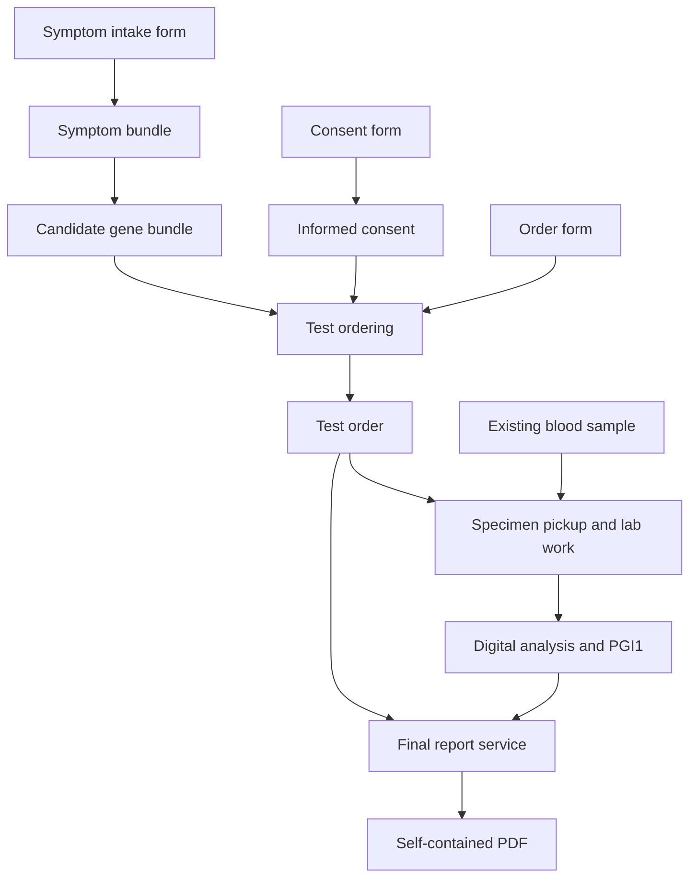

# Pocket Genes Objects and Services Wiki

Version: **1.0.0 — proposed catalog specification**
Prepared: **16 September 2026**
Scope: **20 exchanged object types, 15 mock services, and fictional independent providers.**

This reference turns the agreed Pocket Genes service model into a concrete wiki and implementation starter. The object names, property schemas, suffixes, and API routes below are proposed conventions for this catalog. They are not a claim about the current production app or an existing production `.pgi1.json` schema. All patient information, provider profiles, prices, turnaround times, genes, and analytical examples are synthetic.

Each provider offers services that accept a filled form and, when needed, typed input objects. Services return typed objects or update the state of a physical item. The result of one service can become an input to another provider's service. People can request one service or an assembled journey through the app.

## Contents

1. [Model, stages, and shared rules](#model-stages-and-shared-rules)
2. [Object registry](#object-registry)
3. [Object reference pages](#object-reference-pages)
4. [Service catalog](#service-catalog)
5. [Provider catalog](#provider-catalog)
6. [Wiki presentation and icon system](#wiki-presentation-and-icon-system)
7. [Implementation and validation](#implementation-and-validation)
8. [Native format references](#native-format-references)

## Model, stages, and shared rules

The three stages are **Test planning → Wet lab → Bioinformatics**. An object can be useful in more than one stage. Stages classify capabilities; they do not force every request to traverse every stage.

| Stage | Main responsibility | Boundary |
| --- | --- | --- |
| Test planning | Forms, symptom structuring, candidate genes, informed consent, professional and organizational input | Produces the `test_order` |
| Wet lab | Formal pickup request, sample custody and transport, laboratory processing | Produces the agreed initial digital file |
| Bioinformatics | Any supported transformation from source file through annotation, structured findings, or report generation | Produces the requested digital deliverable |

### Agreed contracts

- Every request includes a `pgo_form` filled against the exact `form_shape` of its service. `requested_at` and `requested_by` live among its filled fields.
- `form_shape` declares field keys, types, requiredness, and enum options. It is service configuration, not a twenty-first object type.
- Test ordering consumes **form + informed consent + candidate gene bundle** directly. No intermediate suggested-tests object is required.
- `test_order` holds the patient identity, purpose, clinical suspicion, selected gene scope, fulfillment requirements, and consent connection.
- `collection_request` is a formal pickup instruction to a specified company, linked to a test order. It is not itself a biological sample.
- A sample at origin and the same sample at destination have the same object identity with different revisions and custody state.
- An extracted DNA sample or biopsy is a derived physical object with its own identity and lineage.
- Extraction and sequencing also return updated source-specimen snapshots showing consumption or remaining quantity. Historical revisions preserve provenance; physical execution must check and lock the current available state.
- `.pgi1.json` holds variant findings and their clinical relevance independently of symptoms. The JSON conversion does not require a symptom bundle.
- Final reporting consumes **form + test_order + .pgi1.json**. The order and genomic result supply the patient and report content; the form supplies request context and presentation choices.
- Type matching is necessary but scope sufficiency is also required. Data must support the requested genes and analysis. File extensions and the presence or absence of VCF rows cannot establish that by themselves.

### Vocabulary and identifiers

| Prefix / entity | Stands for | Purpose |
| --- | --- | --- |
| `pgo_` | Pocket Genes object type | Stable catalog keyword; e.g. `pgo_test_order` |
| `obj_` | Object instance | A particular order, sample, form, or result |
| `pgs_` | Pocket Genes service | A provider's declared transformation contract |
| `pgp_` | Pocket Genes provider | Organization or professional fulfilling services |
| `pgfs_` | Pocket Genes form shape | Versioned field definitions belonging to a service |
| `pgr_` | Pocket Genes request | One invocation and its execution state |
| Pipeline | Composition of requests | Connects compatible outputs and inputs across providers |

### Common object envelope

All exchanged objects have a JSON record. Native data files remain separate bytes in their standard format. A physical object's JSON records the real item's identity and state; it does not replace physical delivery.

| Property | Type | Meaning |
| --- | --- | --- |
| object_id | string | Stable instance identity. |
| object_type | enum | One of the 20 registered pgo_ keys. |
| schema_version | string | Payload contract version; fixtures use 1.0.0. |
| revision | integer ≥ 1 | Snapshot of the object. References pin this revision. |
| created_at | date-time | Creation time of this snapshot; distinct from the request time inside its form. |
| created_by | string | Identity that issued this snapshot. |
| input_refs | ObjectRef[] | Exact source object revisions, including the request form, when generated by a service. |
| data | object | Type-specific properties defined in the following pages. |
| files | FileDescriptor[] | Associated native payloads; role, path, media type, SHA-256 and byte count. |


`ObjectRef` has exactly `object_id` and `revision`. The same physical item may have revision 1 at origin and revision 2 at the destination; both snapshots remain addressable. New analytical results normally get new IDs, with references to their sources. Changing custody must not rewrite an earlier snapshot.

Native FASTQ, FASTA, BAM, VCF, FCS, and PDF objects use a `.pgobject.json` sidecar in this package. Their actual files keep `.fastq`, `.fasta`, `.bam`, `.vcf`, `.fcs`, or `.pdf`. Compound `.pg*.json` suffixes are conventions for Pocket Genes JSON objects. Compressed variants require an explicitly declared encoding/profile, not a new clinical meaning.

The same `.vcf` suffix is shared by the two VCF types. `object_type` and the annotation profile distinguish them. An annotated VCF is not automatically compatible with every interpretation service.

### Scope and fulfillment

The synthetic order requests `PGGENE_A`, `PGGENE_B`, and `PGGENE_C` under `PG_DEMO_REF_1`. The supporting metadata records which genes and variant classes are assessable and references the producer's evidence. A service checks the required profile, subject identity, order identity, actual input availability, and the requested analytical scope.

| Candidate handoff | Decision |
| --- | --- |
| Correct type/profile and evidence-backed support for all requested genes and variant classes | Eligible for the next service |
| Correct `.vcf` suffix but only two of the three requested genes supported | Insufficient scope; report the missing gene |
| Supported genes match, but reference/profile is incompatible | Requires an explicitly compatible service or transformation |
| No variants reported for one gene, with no evidence about its assessability | Cannot infer a negative result or complete testing |
| Broader acquisition than the requested scope | Does not authorize broader interpretation or reporting; honor the order's scope |

The tiny files in this package demonstrate structure and linkage. Their `synthetic_fixture` attestations are mock inputs to the compatibility example, not proof of assay coverage, a diagnostic result, or evidence that a real provider is qualified. The supplied validator checks catalog and fixture integrity; production assay validation remains provider-specific.

### Pocket Genes service network: proposed v1 logic

This specification describes a professional catalog of independently purchasable services. Pocket Genes defines a small shared object vocabulary and a common request contract. Providers publish what they accept, what they return, and the terms under which they do the work. A user can request one service or a complete compatible journey through the app or API.

This is a product-design proposal. The providers, prices, turnaround estimates, patients and scientific fixture tokens in the accompanying catalog are fictional. The examples demonstrate interoperability; they do not establish clinical validity or legal sufficiency.

#### 1. The concepts and what each one stands for

| Concept | Identifier convention | Responsibility |
|---|---|---|
| Object type | `pgo_*` | Defines the meaning, schema, representation and accepted profiles of an interchangeable piece. PGO means **Pocket Genes Object**. |
| Object instance | `object_id`, such as `obj_demo_order` | One actual piece: an order, gene bundle, sample record or registered native file. |
| Object revision | Positive integer | A specific recorded version of that object. References always pin it. |
| Provider | `pgp_*` | The organization or professional entity responsible for executing a published service. PGP means **Pocket Genes Provider**. |
| Service | `pgs_*` | An offer to perform a defined transformation. PGS means **Pocket Genes Service**. |
| Form shape | `pgfs_*` plus version | The service configuration specifying required fields, field types and enum options. PGFS means **Pocket Genes Form Shape**. |
| Form | `pgo_form` | The filled fields supplied with every execution request, including when the request was made and who made it. |
| Service request | `pgr_*` | One execution of one service under its pinned version and accepted commercial terms. PGR means **Pocket Genes Request**. |
| Pipeline | Application orchestration record | A set of service requests connected through explicit output-to-input bindings. It is a process configuration, not an extra accepted object type. |

`form_shape`, provider, service and pipeline are configuration or execution entities. They do not expand the fixed twenty-type exchanged-object registry. A specimen's digital record represents a physical item; sending its JSON does not deliver the specimen itself.

#### 2. The universal service contract

Every execution follows this pattern:

**A filled form + zero or more additional objects → one or more output objects.**

The `form` is mandatory, even for a service that otherwise needs only a VCF. The phrase “VCF → PGI1” is useful catalog shorthand; its full execution contract is “form + VCF → PGI1.”

A service definition contains:

| Field | Meaning |
|---|---|
| `service_id`, `service_version` | The particular published offer and its pinned contract version. |
| `provider_id` | The responsible provider. |
| `stages` | Where the service belongs in the three-stage catalog. |
| `form_shape` | The exact form schema for this service version. |
| `input_slots` | Named roles, accepted object types, requiredness and cardinality. |
| `output_slots` | Named results, their type or explicit type binding, and whether they create a new object or a new revision. |
| `accepted_conditions` | Preconditions for this provider to accept the particular objects and request. |
| `scope_rules` | How the requested objective and analytical scope constrain the output. |
| `mock_commercial_terms` | Example price, turnaround start condition and failure handling. Real offers must publish their actual terms. |

The catalog contains sample requests and results for all fifteen services. A service may be performed by software, laboratory work, human assessment, transport, or a combination. Its internal method is the provider's responsibility; its external obligations are explicit.

##### Forms are service-specific

A `form_shape` defines a list of fields, not one global medical intake questionnaire. Supported field types in this proposal are `text`, `number`, `integer`, `boolean`, `date`, `datetime`, `enum`, `multi_enum` and `string_list`.

Each field has a stable `key`, a display `label`, a `type` and `required`. Enum and multi-enum fields also contain explicit options, each with a stored value and a display label. Forms store the stable values, not the labels.

Every shape includes `requested_at` and `requested_by`. Their values occur inside `pgo_form.data.fields`, alongside the service-specific values. An authenticated submission establishes the requester; a typed name alone is not proof of identity. Server processing timestamps can be recorded on the request separately.

For example, a symptom intake shape also requires `subject_id` and `observations`. A final-report shape requires `language` and `presentation`. Patient identity and clinical suspicion already live in the order for that reporting request, so the reporting form need not collect them again.

```json
{
  "form_shape_id": "pgfs_final_report",
  "form_shape_version": "1.0.0",
  "fields": [
    {"key": "requested_at", "value": "2026-09-16T12:00:00Z"},
    {"key": "requested_by", "value": "user_demo_001"},
    {"key": "language", "value": "en"},
    {"key": "presentation", "value": "clinical"}
  ]
}
```

The form is validated against the declared shape version. Reject duplicate keys, missing required fields, wrong value types and enum values outside the published options. This mock catalog also rejects unknown fields. A new required field requires a new compatible contract version; changing a published shape must not silently invalidate already accepted requests.

##### Inputs bind by role

An input slot identifies why the object is supplied. For DNA extraction, `specimen` accepts one of blood, tissue or embryo material. These are alternatives within one slot; the requester does not supply all three.

A test order is a different slot. This avoids relying on array position to distinguish an order from the specimen being processed. An input reference consists of `object_id` and `revision`. Native files are retrieved through that registered object, with its file descriptors and integrity information.

```json
{
  "service_id": "pgs_final_report",
  "service_version": "1.0.0",
  "form_ref": {"object_id": "obj_demo_form_final_report", "revision": 1},
  "inputs": [
    {"role": "test_order", "object_ref": {"object_id": "obj_demo_order", "revision": 1}},
    {"role": "interactive_report", "object_ref": {"object_id": "obj_demo_interactive", "revision": 1}}
  ]
}
```

A form-only service supplies an empty `inputs` array. The mandatory `form_ref` remains present.

#### 3. The three stages

| Stage | Goal | Prevalent objects |
|---|---|---|
| **Test planning** | Turn an objective and available information into a complete test order. | Forms, symptom bundles, candidate gene bundles, informed consent and test orders. |
| **Wet lab** | Fulfill the physical work and laboratory processing required for the agreed digital deliverable. | Collection requests, physical samples, extracted DNA and the laboratory's output files. |
| **Bioinformatics** | Process an available digital input into the contracted analytical or presentation result. | FASTA, FASTQ, BAM, VCF, images, FCS, PGI1 and PDF. |

The stage is a catalog location, not a rule that every customer must buy all three stages. In this three-stage vocabulary, bioinformatics also groups related digital analysis such as karyotype image review. A PDF can be produced in test planning as a consultation summary or in bioinformatics as a final genomic report; the document profile determines its purpose.

##### Test planning

One route creates a symptom bundle from a form and prioritizes candidate genes from that bundle. A second service produces an informed-consent piece from its own form. Test ordering then combines exactly the three agreed inputs:

**form + informed_consent + bundle_of_candidate_genes → test_order.**

The order's form supplies patient name, date of birth, patient identifier, objective, suspicion and other required ordering details. It also selects `wet_lab_output_type`, the final deliverables through `required_output_types`, and the `required_profile`. Those map to the order's patient record and fulfillment requirements, including `fulfillment.final_output_types`. The order consolidates that context and retains its consent reference. No `bundle_of_suggested_tests` intermediate is required. Professionals and organizations can specialize in any of these transformations.

##### Wet lab

A `collection_request` is a formal instruction addressed to a company to pick up a specimen and deliver it to the identified destination as part of a test order. The illustrated offer addresses `pgp_sample_logistics`, using the sample route from 100 Example Avenue to 200 Example Avenue in Demo City, AR, the 2026-09-16 13:00–15:00 UTC pickup window, and `handling_demo_v1`.

The specimen at origin and the specimen at destination retain the same `object_id`; transport returns a later revision with custody, location and receipt information. Extraction produces a new DNA object because the extracted material is a distinct derived specimen. Its lineage points back to the source. Consumption or remaining quantity of source material must be recorded.

The transport examples begin with an existing specimen. A future sample-acquisition offer can create that specimen from an appropriate request, supporting the broader home-collection journey. These fifteen examples do not implicitly turn a courier pickup into phlebotomy.

`pgo_embryo_sample` distinguishes `whole_embryo` from `embryo_biopsy`. The demonstrated DNA-extraction offer accepts an embryo biopsy only. A whole embryo cannot be substituted merely because the registry type is shared. Taking a biopsy creates a separate material identity and lineage before that biopsy can enter extraction.

A lab can choose its contractual exit point. This catalog's sequencing offer returns FASTQ. Another published service could return BAM, unannotated VCF or a complete result by performing more work internally. The platform does not force the customer to purchase or download every intermediate file.

##### Bioinformatics

The fifteen examples split alignment, calling, annotation, interactive interpretation and reporting into separate offers. Each step can belong to a different provider, and a provider may publish a combined offer.

FASTA and FASTQ are distinct types. They are not interchangeable labels for one mandatory entry format. An eligible provider can accept whichever actual source format its contract supports. The fixed registry contains FASTA and FCS even though these fifteen mock offers do not yet consume or produce them.

Annotation can be purchased with `form + unannotated_vcf` alone. Its `test_order` slot is optional: when supplied, the order constrains the scope and fulfillment checks; when absent, annotation stays within the input object's declared scope and preserves its analytical-support evidence and limitations. The sample request supplies an order to demonstrate the optional connection.

The interpretation contract demonstrated here is:

**form + annotated_vcf → .pgi1.json.**

PGI1 contains genomic findings and their clinical relevance independently of the patient's symptoms. The registered VCF carries its own source and analytical-support information. This interpretation service does not require a symptom bundle or a test order as an additional input. Pipeline orchestration can compare the resulting declared scope with a linked order without making symptoms part of the conversion.

The final-report contract is:

**form + test_order + .pgi1.json → final PDF.**

The order supplies the patient and intended clinical context. PGI1 supplies the findings, relevance, provenance and analytical limitations. The form supplies request metadata and presentation choices. Under this contract, those two domain pieces must contain everything needed for a self-contained report. The provider should not need to retrieve original intake forms or planning bundles. Any included professional review and report issuance must be stated in the offered service.

#### 4. Compatibility includes the requested result

Matching an extension only identifies a possible connection. Before a provider accepts work, the system evaluates:

1. **Object identity and access:** the supplied revision exists and belongs to the intended subject or material lineage.
2. **Type and version:** the declared semantic type, JSON schema or native representation is accepted.
3. **Profile and content:** the relevant form, annotation, imaging, assay or document-purpose profile matches.
4. **Order scope:** the service and input data can support the genes, reference, variant classes and deliverables requested.
5. **State and availability:** a physical item is in the appropriate location and condition, with usable material available.
6. **Execution terms:** the provider accepts the location, price, turnaround and responsibility attached to the request.

For example, the fixture order requests `PGGENE_A`, `PGGENE_B` and `PGGENE_C` on synthetic reference `PG_DEMO_REF_1`. Its scope is stored in `data.scope`. Its fulfillment requirements are stored in `data.fulfillment`, including `scope_policy: requested_only` and `analysis_support_required: true`.

A VCF whose supported analytical scope omits requested genes is insufficient, even if structurally valid. Adding annotations cannot recover missing measurements. Absence of a row for a requested gene does not establish that the gene was adequately assessed. Analytical objects therefore retain `data.analysis_support`, including status, evaluated genes, supported variant classes, evidence and limitations. Evidence can point to an embedded declaration or an attached quality/support file. Its presence as JSON is not, by itself, a scientific verification.

An output supports the order only when its analytical support and service profile meet the actual requirement. Extra processing or findings do not silently expand the requested scope. A provider that cannot meet the full accepted contract returns the limitation and a suitable non-completed state rather than describing the request as fulfilled.

#### 5. Execution lifecycle and responsibility

| State | Meaning |
|---|---|
| `received` | The request is recorded and assigned an ID. |
| `validating` | Form, input access, compatibility, availability and scope are being checked. |
| `accepted` | The provider accepts responsibility for the specified service under the agreed terms. |
| `queued` | Accepted work waits for an execution slot. |
| `running` | The provider is performing the work. |
| `awaiting_input` | Work needs an explicit clarification or additional piece before it can continue. |
| `completed` | The accepted contract is fulfilled and registered outputs are available. |
| `rejected` | The provider declines before acceptance, with a reason. |
| `failed` | Accepted work cannot fulfill the contract, with a reason and recovery information. |
| `cancelled` | Cancellation has completed under the agreed terms. |

The normal path is received, validating, accepted, queued, running and completed. Queuing can be skipped. Validation or running work can pause at awaiting_input; the response must say what is needed and where execution resumes. Completed, rejected, failed and cancelled are terminal states. A later rework execution has a new request identity linked to the original.

An HTTP `202` only confirms asynchronous receipt unless the returned state explicitly says accepted. A progress percentage is informative; it does not replace the state or prove fulfillment.

A pipeline needs a named party responsible for resolving cross-provider failures. Each provider owns its service, while Pocket Genes or an explicitly contracted journey operator coordinates the overall journey. If a downstream provider rejects an upstream output, the requester needs a concrete resolution: corrected output, an alternative compatible provider, a new physical procedure if separately authorized, or a refund under the accepted terms.

Refund status is a commercial outcome, not an object transformation. Track it alongside the execution. “The provider returned a file” is not a sufficient reason to consider an unfulfilled scope completed.

##### Idempotency and safe recovery

Every creation call carries an idempotency key. Repeating the same key with the same canonical request returns the original execution; reusing it for a different payload returns a conflict. The provider publishes the retention window. This draft proposes at least thirty days.

After a timeout, query the existing request or repeat with the same key. Do not submit a new request simply because a callback was delayed. Duplicate courier dispatch, sample consumption or laboratory work can be expensive and cannot always be undone.

A failed physical job is not automatically retried. Check the specimen's actual state and remaining material, determine the recovery action and obtain whatever action authorization is required by the accepted service terms. Digital work also needs idempotency so that retries do not create accidental repeated charges or conflicting outputs.

##### API and callbacks

The provider catalog includes an illustrative complete API example for Variant Analysis Cooperative:

- `POST /service-requests` submits a service, form reference and role-bound inputs.
- `GET /service-requests/{request_id}` returns authoritative state.
- `GET /service-requests/{request_id}/results` returns registered output references.
- A signed provider callback announces progress or completion to a preregistered Pocket Genes endpoint.

Provider authentication, object access and callback verification are integration configuration. Credentials are absent from the fixtures. Callback destinations are registered in advance; a request cannot redirect patient information to an arbitrary URL. Events include unique IDs and increasing request revisions so duplicates and out-of-order delivery can be handled. Large FASTQ, BAM or PDF payloads stay in object storage; the API passes authenticated object references and integrity metadata.

#### 6. Example pipelines and alternate entry points

##### A. Test planning through a final report

The user supplies the planning forms. Meridian Clinical Planning produces the symptom bundle, candidate genes and consent piece, then creates the order. Origin Sample Logistics produces the pickup request and transports the existing blood sample. Atlas Precision Laboratory extracts DNA and produces FASTQ. Variant Analysis Cooperative aligns the reads, calls variants, annotates the VCF and creates PGI1. Clarity Report Studio combines PGI1 with the original complete order and produces the final PDF.



Every service request in the diagram also receives its own form. The detailed fifteen-service table exposes the individual transformations hidden inside the grouped physical and digital blocks. The original order remains available at every step where it is explicitly required, including final reporting.

##### B. Start with an existing annotated VCF

A user already has a registered compatible annotated VCF and a complete test order. Request `pgs_interactive_interpretation` with its form and that VCF, then request `pgs_final_report` with its own form, the resulting PGI1 and the order. Laboratory work, alignment, calling and annotation are skipped. The existing analytical support must still meet the order scope.

A user with an existing unannotated VCF can first request annotation without creating a test order, then request PGI1 interpretation. A complete test order becomes required when that user requests the final self-contained reporting contract.

If the user already has a suitable `.pgi1.json`, the final-report service alone is sufficient once its required order and form are available.

##### C. A service without sequencing or domain inputs

A user fills `pgfs_form_to_pdf` and requests `pgs_form_to_pdf`. Meridian Clinical Planning returns a consultation summary PDF. The request has a mandatory `form_ref` and an empty `inputs` array. This is a complete, independent service.

A separate non-sequencing branch is `form + metaphase image_bundle → karyotype_result`, fulfilled by Chromosome Image Services. It demonstrates that the network can support specialist image review within the same request mechanics.

#### 7. Provider substitution and composition

A new provider publishes its own service ID and accepted contract. The platform can propose it for a step when its output, acceptance conditions, scope and commercial terms fit the surrounding route. Existing requests keep the provider and version originally accepted; substitution is explicit.

A compatible output can be reused in several subsequent services, subject to access and scope. Input consumption matters: a digital object remains reusable, while a physical procedure may consume all or part of the specimen. Pipelines therefore bind exact object revisions and track remaining material before initiating more work.

A complete journey should be checked before starting irreversible physical steps. The available source, each required handoff, the selected providers and the final requested output must form a feasible route. A provider directory with matching extensions is not enough.

The fifteen services are a starting catalog. They illustrate how a provider can specialize in one conversion or offer several stages. The twenty object types are a fixed proposed v1 vocabulary; future registry additions should have clear semantics, schemas and examples rather than becoming catch-all files.

#### 8. Professional catalog presentation

Each object should have a stable icon asset, a clear name, its `pgo_*` keyword, a physical/virtual label, extension, accepted-profile details and a concise definition. Its wiki page should expose properties, a content example, producer services and consumer services.

The light gamification comes from visible progression and discoverable connections: “You have these pieces,” “These services can use them,” and “This requested result needs these remaining pieces.” Use neutral completion markers and stage colors. Icons and object cards should help users recognize the catalog without implying medical certainty, quality scores or game-like rewards for ordering more tests.

A provider page names who is responsible, which services are offered, coverage, turnaround and integration capabilities. A service page shows the input slots, required form, output, acceptance rules and exact scope. Missing compatibility is shown as a specific reason, such as an unsupported material kind or incomplete gene scope, with the relevant corrective action.

## Object registry

| # | Object | Keyword | Nature | Primary extension | Typical stage |
| --- | --- | --- | --- | --- | --- |
| 1 | Form | `pgo_form` | virtual | `.pgform.json` | Test planning, Wet lab, Bioinformatics |
| 2 | Symptom bundle | `pgo_bundle_of_symptoms` | virtual | `.pgsymptoms.json` | Test planning |
| 3 | Candidate gene bundle | `pgo_bundle_of_candidate_genes` | virtual | `.pggenes.json` | Test planning |
| 4 | Informed consent | `pgo_informed_consent` | virtual | `.pgconsent.json` | Test planning, Wet lab, Bioinformatics |
| 5 | Test order | `pgo_test_order` | virtual | `.pgorder.json` | Test planning, Wet lab, Bioinformatics |
| 6 | Collection request | `pgo_collection_request` | virtual | `.pgcollection.json` | Wet lab |
| 7 | Blood sample | `pgo_blood_sample` | physical | `.pgblood.json` | Wet lab |
| 8 | Tissue sample | `pgo_tissue_sample` | physical | `.pgtissue.json` | Wet lab |
| 9 | Embryo material | `pgo_embryo_sample` | physical | `.pgembryo.json` | Wet lab |
| 10 | Extracted DNA sample | `pgo_dna_sample` | physical | `.pgdna.json` | Wet lab |
| 11 | Sequence reads | `pgo_sequence_reads` | virtual | `.fastq` | Wet lab, Bioinformatics |
| 12 | Nucleotide sequences | `pgo_sequence_data` | virtual | `.fasta` | Wet lab, Bioinformatics |
| 13 | Aligned reads | `pgo_aligned_reads` | virtual | `.bam` | Wet lab, Bioinformatics |
| 14 | Unannotated variants | `pgo_unannotated_vcf` | virtual | `.vcf` | Wet lab, Bioinformatics |
| 15 | Annotated variants | `pgo_annotated_vcf` | virtual | `.vcf` | Bioinformatics |
| 16 | Interactive genomic report | `pgo_interactive_report` | virtual | `.pgi1.json` | Bioinformatics |
| 17 | PDF report | `pgo_pdf_report` | virtual | `.pdf` | Test planning, Wet lab, Bioinformatics |
| 18 | Image bundle | `pgo_image_bundle` | virtual | `.pgimages.json` | Test planning, Wet lab, Bioinformatics |
| 19 | Karyotype result | `pgo_karyotype_result` | virtual | `.pgkaryotype.json` | Bioinformatics |
| 20 | Flow cytometry data | `pgo_flow_cytometry_data` | virtual | `.fcs` | Wet lab, Bioinformatics |

The registry is fixed at 20 types for this draft. `form_shape`, provider profiles, service definitions, requests, file descriptors, and pipelines are supporting configuration/runtime entities. Other specimen types and modalities can be introduced through a later registry version; for example, saliva is not silently treated as tissue.

## Object reference pages

### 01. Form — `pgo_form`

A service-specific list of filled fields accompanying every service request. The shape belongs to service configuration; the form is the completed request object.

| Attribute | Value |
| --- | --- |
| Nature | virtual |
| Stages | Test planning, Wet lab, Bioinformatics |
| Extension | .pgform.json |
| Icon asset | icons/pgo_form.svg |
| Icon subject | A compact form sheet with three input lines and one checked field. |
| JSON Schema | schemas/objects/pgo_form.schema.json |
| Example record | examples/objects/pgo_form.pgform.json |


**Properties inside `data`**

| Property | Type | Required within parent | Meaning / constraints |
| --- | --- | --- | --- |
| `form_shape_id` | string | Yes | Identifier of the form_shape published by the requested service. minLength: 1 |
| `form_shape_version` | string | Yes | Exact version of the form_shape used to fill and validate this form. minLength: 1 |
| `fields` | array | Yes | Filled request fields, including requested_at and requested_by. minItems: 2 |
| `fields[].key` | string | Yes | Field key declared in the service form_shape. minLength: 1 |
| `fields[].value` | string/number/boolean/array | Yes | Filled value. Actual type, requiredness, and enum options are enforced by the referenced form_shape. |


**Sample object record**

```json
{
  "object_id": "obj_demo_form_symptom_intake",
  "object_type": "pgo_form",
  "schema_version": "1.0.0",
  "revision": 1,
  "created_at": "2026-09-16T12:00:00Z",
  "created_by": "user_demo_001",
  "input_refs": [],
  "data": {
    "form_shape_id": "pgfs_symptom_intake",
    "form_shape_version": "1.0.0",
    "fields": [
      {
        "key": "requested_at",
        "value": "2026-09-16T12:00:00Z"
      },
      {
        "key": "requested_by",
        "value": "user_demo_001"
      },
      {
        "key": "subject_id",
        "value": "subject_demo_001"
      },
      {
        "key": "observations",
        "value": [
          "Synthetic observation A",
          "Synthetic observation B"
        ]
      }
    ]
  },
  "files": []
}
```

**Validation and JSON logic**

- Resolve the exact form_shape_id and form_shape_version before accepting a request.
- Field keys must be unique. Validate every field against its shape-defined type, enum options and requiredness.
- requested_at and requested_by must appear exactly once. requested_at must be a date-time and requested_by must identify the actual requester.
- The service can require only this form, or this form plus additional objects.
- Common request fields are platform-populated or verified; they are not editable evidence of someone else making a request.

**Linked mock services**

- Produced or updated by: No service in the initial 15; retained as an accepted type for additional provider contracts.
- Consumed by: `pgs_symptom_intake`, `pgs_gene_prioritization`, `pgs_informed_consent`, `pgs_test_ordering`, `pgs_collection_request`, `pgs_sample_transport`, `pgs_dna_extraction`, `pgs_sequencing`, `pgs_read_alignment`, `pgs_variant_calling`, `pgs_variant_annotation`, `pgs_interactive_interpretation`, `pgs_final_report`, `pgs_karyotype_analysis`, `pgs_form_to_pdf`

**Other service opportunities**

- Symptom intake without existing pieces.
- Informed consent request without existing pieces.
- Language and layout selection accompanying final report inputs.


### 02. Symptom bundle — `pgo_bundle_of_symptoms`

A structured collection of reported symptoms and observations that a provider can use to prioritize candidate genes.

| Attribute | Value |
| --- | --- |
| Nature | virtual |
| Stages | Test planning |
| Extension | .pgsymptoms.json |
| Icon asset | icons/pgo_bundle_of_symptoms.svg |
| Icon subject | Three observation dots connected to a short assessment list. |
| JSON Schema | schemas/objects/pgo_bundle_of_symptoms.schema.json |
| Example record | examples/objects/pgo_bundle_of_symptoms.pgsymptoms.json |


**Properties inside `data`**

| Property | Type | Required within parent | Meaning / constraints |
| --- | --- | --- | --- |
| `subject_id` | string | Yes | Synthetic or platform-assigned subject identifier; do not infer identity from a filename. minLength: 1 |
| `observations` | array | Yes | Structured observations for this subject. minItems: 1 |
| `observations[].observation_id` | string | Yes | Local identifier for this observation. minLength: 1 |
| `observations[].label` | string | Yes | Reported symptom or clinical observation text. minLength: 1 |
| `observations[].code_system` | string | Yes | Identifier namespace; demo fixtures use PG_DEMO_OBSERVATION. minLength: 1 |
| `observations[].code` | string | Yes | Code in the selected namespace. minLength: 1 |
| `observations[].presence` | string | Yes | Whether the observation was reported present, absent, or uncertain. Options: present, absent, uncertain; minLength: 1 |
| `observations[].source` | string | Yes | How the observation was obtained. Options: self_report, professional_observation, submitted_form; minLength: 1 |
| `observations[].recorded_at` | string | Yes | Time the observation was recorded. format: date-time; minLength: 1 |
| `source_form_ref` | object | Yes | Completed form from which this bundle was created. |
| `source_form_ref.object_id` | string | Yes | Stable object identifier. minLength: 1; pattern: ^obj_[A-Za-z0-9_]+$ |
| `source_form_ref.revision` | integer | Yes | Pinned object revision. minimum: 1 |


**Sample object record**

```json
{
  "object_id": "obj_demo_symptoms",
  "object_type": "pgo_bundle_of_symptoms",
  "schema_version": "1.0.0",
  "revision": 1,
  "created_at": "2026-09-16T12:05:00Z",
  "created_by": "pgp_clinical_planning",
  "input_refs": [
    {
      "object_id": "obj_demo_form_symptom_intake",
      "revision": 1
    }
  ],
  "data": {
    "subject_id": "subject_demo_001",
    "observations": [
      {
        "observation_id": "observation_demo_001",
        "label": "Fictional observation A",
        "code_system": "PG_DEMO_OBSERVATION",
        "code": "DEMO_OBSERVATION_01",
        "presence": "present",
        "source": "submitted_form",
        "recorded_at": "2026-09-16T12:00:00Z"
      },
      {
        "observation_id": "observation_demo_002",
        "label": "Fictional observation B",
        "code_system": "PG_DEMO_OBSERVATION",
        "code": "DEMO_OBSERVATION_02",
        "presence": "uncertain",
        "source": "submitted_form",
        "recorded_at": "2026-09-16T12:00:00Z"
      }
    ],
    "source_form_ref": {
      "object_id": "obj_demo_form_symptom_intake",
      "revision": 1
    }
  },
  "files": []
}
```

**Validation and JSON logic**

- Keep observation_id unique within the bundle.
- A symptom bundle represents observations; it does not itself assert a diagnosis or a confirmed affected gene.
- Preserve presence and provenance so absent or uncertain observations cannot silently become positive findings.

**Linked mock services**

- Produced or updated by: `pgs_symptom_intake`
- Consumed by: `pgs_gene_prioritization`

**Other service opportunities**

- Form to structured symptom bundle.
- Symptom bundle to ranked candidate genes.
- Professional review of submitted observations.


### 03. Candidate gene bundle — `pgo_bundle_of_candidate_genes`

A provider-selected set of candidate genes for the next planning step, optionally ranked and explained.

| Attribute | Value |
| --- | --- |
| Nature | virtual |
| Stages | Test planning |
| Extension | .pggenes.json |
| Icon asset | icons/pgo_bundle_of_candidate_genes.svg |
| Icon subject | A DNA helix next to three candidate markers. |
| JSON Schema | schemas/objects/pgo_bundle_of_candidate_genes.schema.json |
| Example record | examples/objects/pgo_bundle_of_candidate_genes.pggenes.json |


**Properties inside `data`**

| Property | Type | Required within parent | Meaning / constraints |
| --- | --- | --- | --- |
| `subject_id` | string | Yes | Synthetic or platform-assigned subject identifier; do not infer identity from a filename. minLength: 1 |
| `gene_namespace` | string | Yes | Identifier system used by all gene_id entries. minLength: 1 |
| `genes` | array | Yes | Candidate genes selected by the provider. minItems: 1 |
| `genes[].gene_id` | string | Yes | Gene identifier in gene_namespace. minLength: 1 |
| `genes[].rank` | integer | Yes | Provider-assigned candidate rank. minimum: 1 |
| `genes[].rationale` | string | Yes | Reason for including this candidate. minLength: 1 |
| `genes[].evidence_refs` | array | Yes | References supporting inclusion; may point to observation or source identifiers. minItems: 1 |
| `source_symptoms_ref` | object | Yes | Symptom bundle used by the provider. |
| `source_symptoms_ref.object_id` | string | Yes | Stable object identifier. minLength: 1; pattern: ^obj_[A-Za-z0-9_]+$ |
| `source_symptoms_ref.revision` | integer | Yes | Pinned object revision. minimum: 1 |
| `method` | string | Yes | Method name or version used for prioritization. minLength: 1 |


**Sample object record**

```json
{
  "object_id": "obj_demo_genes",
  "object_type": "pgo_bundle_of_candidate_genes",
  "schema_version": "1.0.0",
  "revision": 1,
  "created_at": "2026-09-16T12:10:00Z",
  "created_by": "pgp_clinical_planning",
  "input_refs": [
    {
      "object_id": "obj_demo_form_gene_prioritization",
      "revision": 1
    },
    {
      "object_id": "obj_demo_symptoms",
      "revision": 1
    }
  ],
  "data": {
    "subject_id": "subject_demo_001",
    "gene_namespace": "PG_DEMO_GENE",
    "genes": [
      {
        "gene_id": "PGGENE_A",
        "rank": 1,
        "rationale": "Fictional candidate 1 selected from demo observations.",
        "evidence_refs": [
          "observation_demo_001",
          "observation_demo_002"
        ]
      },
      {
        "gene_id": "PGGENE_B",
        "rank": 2,
        "rationale": "Fictional candidate 2 selected from demo observations.",
        "evidence_refs": [
          "observation_demo_001",
          "observation_demo_002"
        ]
      },
      {
        "gene_id": "PGGENE_C",
        "rank": 3,
        "rationale": "Fictional candidate 3 selected from demo observations.",
        "evidence_refs": [
          "observation_demo_001",
          "observation_demo_002"
        ]
      }
    ],
    "source_symptoms_ref": {
      "object_id": "obj_demo_symptoms",
      "revision": 1
    },
    "method": "demo-prioritization-v1"
  },
  "files": []
}
```

**Validation and JSON logic**

- gene_id and rank must be unique within this bundle.
- Candidate status must remain distinct from variant findings and confirmed causality.
- The test-order service can accept this bundle directly alongside informed_consent and its completed form.

**Linked mock services**

- Produced or updated by: `pgs_gene_prioritization`
- Consumed by: `pgs_test_ordering`

**Other service opportunities**

- Symptom-driven gene prioritization.
- Independent professional candidate review.
- Direct input to test ordering.


### 04. Informed consent — `pgo_informed_consent`

A completed, attributable consent record generated by a consent service from a submitted form.

| Attribute | Value |
| --- | --- |
| Nature | virtual |
| Stages | Test planning, Wet lab, Bioinformatics |
| Extension | .pgconsent.json |
| Icon asset | icons/pgo_informed_consent.svg |
| Icon subject | A shield containing a check, paired with a small document corner. |
| JSON Schema | schemas/objects/pgo_informed_consent.schema.json |
| Example record | examples/objects/pgo_informed_consent.pgconsent.json |


**Properties inside `data`**

| Property | Type | Required within parent | Meaning / constraints |
| --- | --- | --- | --- |
| `subject_id` | string | Yes | Synthetic or platform-assigned subject identifier; do not infer identity from a filename. minLength: 1 |
| `purpose` | string | Yes | Purpose explained to the participant. minLength: 1 |
| `scope` | object | Yes | The recorded scope of the consent. |
| `scope.activities` | array | Yes | Activities covered by this recorded consent. minItems: 1 |
| `scope.genes` | array | Yes | Gene scope disclosed when applicable. minItems: 0 |
| `scope.provider_ids` | array | Yes | Named providers covered by this record; avoid assuming global authorization. minItems: 1 |
| `text_version` | string | Yes | Version of the text presented to the person. minLength: 1 |
| `text_snapshot` | string | Yes | The exact consent text snapshot associated with this acceptance. minLength: 1 |
| `status` | string | Yes | Recorded state of this consent. Options: completed, withdrawn, superseded; minLength: 1 |
| `acceptance` | object | Yes | The captured consent action; schema validity alone does not prove legal sufficiency. |
| `acceptance.accepted_at` | string | Yes | Timestamp of the recorded consent action. format: date-time; minLength: 1 |
| `acceptance.accepted_by` | string | Yes | Identity of the person whose acceptance was captured. minLength: 1 |
| `acceptance.capacity` | string | Yes | Recorded capacity of the accepting person. Options: self, authorized_representative; minLength: 1 |
| `acceptance.method` | string | Yes | Acceptance capture method. Options: electronic_acceptance, signed_document, in_person_record; minLength: 1 |
| `acceptance.evidence_reference` | string | Yes | Immutable evidence reference for the captured acceptance. minLength: 1 |
| `source_form_ref` | object | Yes | Form submitted to the consent service. |
| `source_form_ref.object_id` | string | Yes | Stable object identifier. minLength: 1; pattern: ^obj_[A-Za-z0-9_]+$ |
| `source_form_ref.revision` | integer | Yes | Pinned object revision. minimum: 1 |


**Sample object record**

```json
{
  "object_id": "obj_demo_consent",
  "object_type": "pgo_informed_consent",
  "schema_version": "1.0.0",
  "revision": 1,
  "created_at": "2026-09-16T12:08:00Z",
  "created_by": "pgp_clinical_planning",
  "input_refs": [
    {
      "object_id": "obj_demo_form_informed_consent",
      "revision": 1
    }
  ],
  "data": {
    "subject_id": "subject_demo_001",
    "purpose": "Participate in the fictional Pocket Genes demonstration workflow.",
    "scope": {
      "activities": [
        "sample_processing",
        "variant_analysis",
        "report_generation"
      ],
      "genes": [
        "PGGENE_A",
        "PGGENE_B",
        "PGGENE_C"
      ],
      "provider_ids": [
        "pgp_clinical_planning",
        "pgp_sample_logistics",
        "pgp_precision_lab",
        "pgp_variant_analysis",
        "pgp_report_studio",
        "pgp_cytogenetics"
      ]
    },
    "text_version": "1.0.0",
    "text_snapshot": "DEMONSTRATION ONLY. I agree to use synthetic information and fictional samples in this catalog example. This text is not a clinical consent template.",
    "status": "completed",
    "acceptance": {
      "accepted_at": "2026-09-16T12:08:00Z",
      "accepted_by": "user_demo_001",
      "capacity": "self",
      "method": "electronic_acceptance",
      "evidence_reference": "signature_demo_001"
    },
    "source_form_ref": {
      "object_id": "obj_demo_form_informed_consent",
      "revision": 1
    }
  },
  "files": []
}
```

**Validation and JSON logic**

- A completed object must contain the presented text snapshot and attributable acceptance evidence.
- The subject and intended activities must match the service and order that rely on the record.
- A withdrawn or superseded consent must not be treated as an active completed consent.
- This mock record demonstrates a data contract only; a valid JSON object does not establish that a consent process meets any particular legal or professional requirements.

**Linked mock services**

- Produced or updated by: `pgs_informed_consent`
- Consumed by: `pgs_test_ordering`

**Other service opportunities**

- Form to completed consent record.
- Consent plus candidate genes plus form to test order.
- Trace the consent used for a particular service request.


### 05. Test order — `pgo_test_order`

The formal test request carrying patient identity, purpose, clinical suspicion, requested analytical scope, consent linkage, and required deliverables.

| Attribute | Value |
| --- | --- |
| Nature | virtual |
| Stages | Test planning, Wet lab, Bioinformatics |
| Extension | .pgorder.json |
| Icon asset | icons/pgo_test_order.svg |
| Icon subject | A clipboard with a checked gene list and a small order seal. |
| JSON Schema | schemas/objects/pgo_test_order.schema.json |
| Example record | examples/objects/pgo_test_order.pgorder.json |


**Properties inside `data`**

| Property | Type | Required within parent | Meaning / constraints |
| --- | --- | --- | --- |
| `order_number` | string | Yes | Human-readable order number. minLength: 1 |
| `patient` | object | Yes | Self-contained patient identity required by the ordered deliverable. |
| `patient.subject_id` | string | Yes | Synthetic or platform-assigned subject identifier; do not infer identity from a filename. minLength: 1 |
| `patient.full_name` | string | Yes | Patient name to appear in the final report. minLength: 1 |
| `patient.date_of_birth` | string | Yes | Date of birth supplied for the order. format: date; minLength: 1 |
| `patient.identifier` | string | Yes | Patient identifier for the ordering organization; the fixture is synthetic. minLength: 1 |
| `objective` | string | Yes | Question or intended objective of this test. minLength: 1 |
| `clinical_suspicion` | string | Yes | Suspicion or clinical reason being evaluated; may explicitly state that none was specified. minLength: 1 |
| `scope` | object | Yes | The analytical scope required by the order. |
| `scope.genes` | array | Yes | Requested genes, using the specified gene namespace. minItems: 1 |
| `scope.reference_id` | string | Yes | Reference assembly identifier agreed by the providers. minLength: 1 |
| `scope.variant_classes` | array | Yes | Variant classes required by this order. minItems: 1 |
| `fulfillment` | object | Yes | The outcome and intermediate laboratory handoff required by this order. |
| `fulfillment.wet_lab_output_type` | string | Yes | Object type the selected lab is expected to deliver. minLength: 1 |
| `fulfillment.final_output_types` | array | Yes | Requested final output object types. minItems: 1 |
| `fulfillment.required_profile` | string | Yes | Versioned analytical profile providers must satisfy. minLength: 1 |
| `fulfillment.scope_policy` | string | Yes | Requested analytical and reporting boundary. Options: requested_only; minLength: 1 |
| `fulfillment.analysis_support_required` | boolean | Yes | Require explicit support for requested analytical scope rather than relying on filename or variant presence. Value: True |
| `consent_ref` | object | Yes | Completed consent record relied upon for this order. |
| `consent_ref.object_id` | string | Yes | Stable object identifier. minLength: 1; pattern: ^obj_[A-Za-z0-9_]+$ |
| `consent_ref.revision` | integer | Yes | Pinned object revision. minimum: 1 |
| `candidate_genes_ref` | object | Yes | Candidate gene bundle used to create the order. |
| `candidate_genes_ref.object_id` | string | Yes | Stable object identifier. minLength: 1; pattern: ^obj_[A-Za-z0-9_]+$ |
| `candidate_genes_ref.revision` | integer | Yes | Pinned object revision. minimum: 1 |
| `requested_by` | string | Yes | Professional, organization or user recorded as placing the order. minLength: 1 |
| `issued_at` | string | Yes | Time the order was issued. format: date-time; minLength: 1 |
| `status` | string | Yes | Order state. Options: issued, in_progress, completed, cancelled; minLength: 1 |


**Sample object record**

```json
{
  "object_id": "obj_demo_order",
  "object_type": "pgo_test_order",
  "schema_version": "1.0.0",
  "revision": 1,
  "created_at": "2026-09-16T12:15:00Z",
  "created_by": "pgp_clinical_planning",
  "input_refs": [
    {
      "object_id": "obj_demo_form_test_ordering",
      "revision": 1
    },
    {
      "object_id": "obj_demo_consent",
      "revision": 1
    },
    {
      "object_id": "obj_demo_genes",
      "revision": 1
    }
  ],
  "data": {
    "order_number": "PG-DEMO-ORDER-001",
    "patient": {
      "subject_id": "subject_demo_001",
      "full_name": "Alex Example",
      "date_of_birth": "1990-01-01",
      "identifier": "PATIENT-DEMO-001"
    },
    "objective": "Evaluate the synthetic three-gene demonstration",
    "clinical_suspicion": "Demo clinical hypothesis only",
    "scope": {
      "genes": [
        "PGGENE_A",
        "PGGENE_B",
        "PGGENE_C"
      ],
      "reference_id": "PG_DEMO_REF_1",
      "variant_classes": [
        "SNV",
        "small_indel"
      ]
    },
    "fulfillment": {
      "wet_lab_output_type": "pgo_sequence_reads",
      "final_output_types": [
        "pgo_interactive_report",
        "pgo_pdf_report"
      ],
      "required_profile": "pg_demo_small_variant_v1",
      "scope_policy": "requested_only",
      "analysis_support_required": true
    },
    "consent_ref": {
      "object_id": "obj_demo_consent",
      "revision": 1
    },
    "candidate_genes_ref": {
      "object_id": "obj_demo_genes",
      "revision": 1
    },
    "requested_by": "user_demo_001",
    "issued_at": "2026-09-16T12:15:00Z",
    "status": "issued"
  },
  "files": []
}
```

**Validation and JSON logic**

- Creation requires its own completed form plus informed_consent plus bundle_of_candidate_genes.
- Patient identity, objective and clinical suspicion must be available directly in this object for the final reporting provider.
- Order scope must remain within the recorded consent scope and explicitly define which genes and variant classes are requested.
- A matching native file extension alone cannot fulfill the order; the deliverable must satisfy the scope and required profile.
- The final reporting request can use this order and a matching pgi1 object without fetching original symptom bundles or intake forms.
- requested_only limits requested analysis and reporting. It does not claim that an instrument cannot physically acquire additional raw signal.

**Linked mock services**

- Produced or updated by: `pgs_test_ordering`
- Consumed by: `pgs_collection_request`, `pgs_dna_extraction`, `pgs_sequencing`, `pgs_read_alignment`, `pgs_variant_calling`, `pgs_variant_annotation`, `pgs_final_report`

**Other service opportunities**

- Formal output of test planning.
- Define wet-lab processing and its digital handoff.
- Combine with pgi1 to produce a final self-contained PDF.


### 06. Collection request — `pgo_collection_request`

A formal request to a named company to pick up a specified sample at origin and deliver it to the agreed destination as part of a test order.

| Attribute | Value |
| --- | --- |
| Nature | virtual |
| Stages | Wet lab |
| Extension | .pgcollection.json |
| Icon asset | icons/pgo_collection_request.svg |
| Icon subject | A small delivery van with a specimen box. |
| JSON Schema | schemas/objects/pgo_collection_request.schema.json |
| Example record | examples/objects/pgo_collection_request.pgcollection.json |


**Properties inside `data`**

| Property | Type | Required within parent | Meaning / constraints |
| --- | --- | --- | --- |
| `order_ref` | object | Yes | Parent test order. |
| `order_ref.object_id` | string | Yes | Stable object identifier. minLength: 1; pattern: ^obj_[A-Za-z0-9_]+$ |
| `order_ref.revision` | integer | Yes | Pinned object revision. minimum: 1 |
| `sample_refs` | array | Yes | Identified samples included in this pickup. minItems: 1 |
| `sample_refs[].object_id` | string | Yes | Stable object identifier. minLength: 1; pattern: ^obj_[A-Za-z0-9_]+$ |
| `sample_refs[].revision` | integer | Yes | Pinned object revision. minimum: 1 |
| `assigned_provider_id` | string | Yes | Company formally asked to fulfill the request. minLength: 1 |
| `pickup` | object | Yes | Location and contact information for a logistics instruction. |
| `pickup.location_id` | string | Yes | Registered pickup or destination location identifier. minLength: 1 |
| `pickup.name` | string | Yes | Location display name. minLength: 1 |
| `pickup.address_line` | string | Yes | Address needed by the selected company. minLength: 1 |
| `pickup.city` | string | Yes | City. minLength: 1 |
| `pickup.country_code` | string | Yes | Country code. minLength: 1; pattern: ^[A-Z]{2}$ |
| `pickup.contact_name` | string | Yes | Contact at the site. minLength: 1 |
| `pickup.contact_phone` | string | Yes | Contact phone used for the request; synthetic in the fixture. minLength: 1 |
| `destination` | object | Yes | Location and contact information for a logistics instruction. |
| `destination.location_id` | string | Yes | Registered pickup or destination location identifier. minLength: 1 |
| `destination.name` | string | Yes | Location display name. minLength: 1 |
| `destination.address_line` | string | Yes | Address needed by the selected company. minLength: 1 |
| `destination.city` | string | Yes | City. minLength: 1 |
| `destination.country_code` | string | Yes | Country code. minLength: 1; pattern: ^[A-Z]{2}$ |
| `destination.contact_name` | string | Yes | Contact at the site. minLength: 1 |
| `destination.contact_phone` | string | Yes | Contact phone used for the request; synthetic in the fixture. minLength: 1 |
| `window_start` | string | Yes | Start of the requested pickup window. format: date-time; minLength: 1 |
| `window_end` | string | Yes | End of the requested pickup window. format: date-time; minLength: 1 |
| `handling_profile` | string | Yes | Handling profile accepted by the logistics provider. minLength: 1 |
| `status` | string | Yes | Collection-request lifecycle status. Options: requested, accepted, picked_up, delivered, cancelled; minLength: 1 |


**Sample object record**

```json
{
  "object_id": "obj_demo_collection",
  "object_type": "pgo_collection_request",
  "schema_version": "1.0.0",
  "revision": 1,
  "created_at": "2026-09-16T12:30:00Z",
  "created_by": "pgp_sample_logistics",
  "input_refs": [
    {
      "object_id": "obj_demo_form_collection_request",
      "revision": 1
    },
    {
      "object_id": "obj_demo_order",
      "revision": 1
    },
    {
      "object_id": "obj_demo_blood",
      "revision": 1
    }
  ],
  "data": {
    "order_ref": {
      "object_id": "obj_demo_order",
      "revision": 1
    },
    "sample_refs": [
      {
        "object_id": "obj_demo_blood",
        "revision": 1
      }
    ],
    "assigned_provider_id": "pgp_sample_logistics",
    "pickup": {
      "location_id": "location_demo_origin",
      "name": "Demo collection site",
      "address_line": "100 Example Avenue",
      "city": "Demo City",
      "country_code": "AR",
      "contact_name": "Demo origin contact",
      "contact_phone": "+54-DEMO-0001"
    },
    "destination": {
      "location_id": "location_demo_lab",
      "name": "Demo laboratory",
      "address_line": "200 Example Avenue",
      "city": "Demo City",
      "country_code": "AR",
      "contact_name": "Demo laboratory contact",
      "contact_phone": "+54-DEMO-0002"
    },
    "window_start": "2026-09-16T13:00:00Z",
    "window_end": "2026-09-16T15:00:00Z",
    "handling_profile": "handling_demo_v1",
    "status": "requested"
  },
  "files": []
}
```

**Validation and JSON logic**

- This object is the addressed pickup instruction, not the physical sample.
- The pickup window must have window_end later than window_start.
- Samples must belong to the linked order, be available at the pickup location, and satisfy the selected handling profile.
- Pickup and delivery update location and custody on the same physical sample identity; they do not invent a replacement sample.
- A sample that has not yet been obtained must be collected or registered before an execution request requiring sample_refs can begin.

**Linked mock services**

- Produced or updated by: `pgs_collection_request`
- Consumed by: `pgs_sample_transport`

**Other service opportunities**

- Test order plus form to addressed pickup request once samples are identified.
- Collection request plus sample to transported sample.
- Tracking the handoff to the selected laboratory.


### 07. Blood sample — `pgo_blood_sample`

An identified blood specimen whose digital object tracks location, custody, availability and processing lineage.

| Attribute | Value |
| --- | --- |
| Nature | physical |
| Stages | Wet lab |
| Extension | .pgblood.json — tracking record for the physical item |
| Icon asset | icons/pgo_blood_sample.svg |
| Icon subject | A blood collection tube with a droplet. |
| JSON Schema | schemas/objects/pgo_blood_sample.schema.json |
| Example record | examples/objects/pgo_blood_sample.pgblood.json |


**Properties inside `data`**

| Property | Type | Required within parent | Meaning / constraints |
| --- | --- | --- | --- |
| `subject_id` | string | Yes | Synthetic or platform-assigned subject identifier; do not infer identity from a filename. minLength: 1 |
| `order_ref` | object | Yes | The test order governing this specimen. |
| `order_ref.object_id` | string | Yes | Stable object identifier. minLength: 1; pattern: ^obj_[A-Za-z0-9_]+$ |
| `order_ref.revision` | integer | Yes | Pinned object revision. minimum: 1 |
| `sample_label` | string | Yes | Human-readable identifier physically applied to the specimen container. minLength: 1 |
| `state` | string | Yes | Current lifecycle state. Options: available_at_origin, in_transit, received_at_destination, processing, partially_consumed, consumed, unavailable; minLength: 1 |
| `collected_at` | string | Yes | Time the specimen or material was obtained. format: date-time; minLength: 1 |
| `collected_by` | string | Yes | Provider or professional identifier responsible for obtaining the material. minLength: 1 |
| `current_location` | object | Yes | A named physical location. |
| `current_location.location_id` | string | Yes | Registered location identifier. minLength: 1 |
| `current_location.name` | string | Yes | Display name for the current location. minLength: 1 |
| `current_location.country_code` | string | Yes | Country code for routing; two uppercase letters. minLength: 1; pattern: ^[A-Z]{2}$ |
| `custodian_id` | string | Yes | Provider or organization currently responsible for the specimen. minLength: 1 |
| `quantity` | object | Yes | A quantity with explicit units. |
| `quantity.value` | number | Yes | Non-negative remaining or collected amount. minimum: 0 |
| `quantity.unit` | string | Yes | Unit of measurement agreed by the service. minLength: 1 |
| `handling_profile` | string | Yes | Provider-defined, versioned handling profile. The fixture is not a medical handling instruction. minLength: 1 |
| `lineage_refs` | array | Yes | Parent material objects; empty for an initial collected specimen. minItems: 0 |
| `lineage_refs[].object_id` | string | Yes | Stable object identifier. minLength: 1; pattern: ^obj_[A-Za-z0-9_]+$ |
| `lineage_refs[].revision` | integer | Yes | Pinned object revision. minimum: 1 |
| `container_type` | string | Yes | Container profile accepted for this particular order. minLength: 1 |


**Sample object record**

```json
{
  "object_id": "obj_demo_blood",
  "object_type": "pgo_blood_sample",
  "schema_version": "1.0.0",
  "revision": 1,
  "created_at": "2026-09-16T12:20:00Z",
  "created_by": "platform_demo_import",
  "input_refs": [],
  "data": {
    "subject_id": "subject_demo_001",
    "order_ref": {
      "object_id": "obj_demo_order",
      "revision": 1
    },
    "sample_label": "DEMO-SAMPLE-001",
    "state": "available_at_origin",
    "collected_at": "2026-09-16T12:20:00Z",
    "collected_by": "pgp_precision_lab",
    "current_location": {
      "location_id": "location_demo_origin",
      "name": "Demo collection site",
      "country_code": "AR"
    },
    "custodian_id": "pgp_precision_lab",
    "quantity": {
      "value": 1,
      "unit": "container"
    },
    "handling_profile": "handling_demo_v1",
    "lineage_refs": [],
    "container_type": "container_demo_blood_v1"
  },
  "files": []
}
```

**Validation and JSON logic**

- The .pgblood.json file is a tracking record for the physical specimen; transferring it does not transfer the specimen.
- subject_id and order_ref must match the laboratory request.
- State, custodian, location, available quantity and handling profile must be accepted before work begins.
- Transport preserves object_id and records a new revision for the changed state.
- Material derived from this specimen, such as extracted DNA, receives a new object_id with lineage_refs pointing back to this specimen.

**Linked mock services**

- Produced or updated by: `pgs_sample_transport`, `pgs_dna_extraction`
- Consumed by: `pgs_collection_request`, `pgs_sample_transport`, `pgs_dna_extraction`

**Other service opportunities**

- Blood collection and registration.
- Pickup and transport to laboratory.
- Blood specimen to extracted DNA or directly to an agreed laboratory output.


### 08. Tissue sample — `pgo_tissue_sample`

An identified tissue specimen with its source description, preparation state and handling contract.

| Attribute | Value |
| --- | --- |
| Nature | physical |
| Stages | Wet lab |
| Extension | .pgtissue.json — tracking record for the physical item |
| Icon asset | icons/pgo_tissue_sample.svg |
| Icon subject | A specimen cassette or microscopy slide with a tissue patch. |
| JSON Schema | schemas/objects/pgo_tissue_sample.schema.json |
| Example record | examples/objects/pgo_tissue_sample.pgtissue.json |


**Properties inside `data`**

| Property | Type | Required within parent | Meaning / constraints |
| --- | --- | --- | --- |
| `subject_id` | string | Yes | Synthetic or platform-assigned subject identifier; do not infer identity from a filename. minLength: 1 |
| `order_ref` | object | Yes | The test order governing this specimen. |
| `order_ref.object_id` | string | Yes | Stable object identifier. minLength: 1; pattern: ^obj_[A-Za-z0-9_]+$ |
| `order_ref.revision` | integer | Yes | Pinned object revision. minimum: 1 |
| `sample_label` | string | Yes | Human-readable identifier physically applied to the specimen container. minLength: 1 |
| `state` | string | Yes | Current lifecycle state. Options: available_at_origin, in_transit, received_at_destination, processing, partially_consumed, consumed, unavailable; minLength: 1 |
| `collected_at` | string | Yes | Time the specimen or material was obtained. format: date-time; minLength: 1 |
| `collected_by` | string | Yes | Provider or professional identifier responsible for obtaining the material. minLength: 1 |
| `current_location` | object | Yes | A named physical location. |
| `current_location.location_id` | string | Yes | Registered location identifier. minLength: 1 |
| `current_location.name` | string | Yes | Display name for the current location. minLength: 1 |
| `current_location.country_code` | string | Yes | Country code for routing; two uppercase letters. minLength: 1; pattern: ^[A-Z]{2}$ |
| `custodian_id` | string | Yes | Provider or organization currently responsible for the specimen. minLength: 1 |
| `quantity` | object | Yes | A quantity with explicit units. |
| `quantity.value` | number | Yes | Non-negative remaining or collected amount. minimum: 0 |
| `quantity.unit` | string | Yes | Unit of measurement agreed by the service. minLength: 1 |
| `handling_profile` | string | Yes | Provider-defined, versioned handling profile. The fixture is not a medical handling instruction. minLength: 1 |
| `lineage_refs` | array | Yes | Parent material objects; empty for an initial collected specimen. minItems: 0 |
| `lineage_refs[].object_id` | string | Yes | Stable object identifier. minLength: 1; pattern: ^obj_[A-Za-z0-9_]+$ |
| `lineage_refs[].revision` | integer | Yes | Pinned object revision. minimum: 1 |
| `anatomical_site` | string | Yes | Recorded tissue source; the fixture uses a fictional site. minLength: 1 |
| `preparation` | string | Yes | Preparation description or profile accepted by the service. minLength: 1 |


**Sample object record**

```json
{
  "object_id": "obj_demo_tissue",
  "object_type": "pgo_tissue_sample",
  "schema_version": "1.0.0",
  "revision": 1,
  "created_at": "2026-09-16T12:20:00Z",
  "created_by": "platform_demo_import",
  "input_refs": [],
  "data": {
    "subject_id": "subject_demo_001",
    "order_ref": {
      "object_id": "obj_demo_order",
      "revision": 1
    },
    "sample_label": "DEMO-TISSUE-001",
    "state": "available_at_origin",
    "collected_at": "2026-09-16T12:20:00Z",
    "collected_by": "pgp_precision_lab",
    "current_location": {
      "location_id": "location_demo_origin",
      "name": "Demo collection site",
      "country_code": "AR"
    },
    "custodian_id": "pgp_precision_lab",
    "quantity": {
      "value": 1,
      "unit": "container"
    },
    "handling_profile": "handling_demo_tissue_v1",
    "lineage_refs": [],
    "anatomical_site": "SITE_DEMO_01",
    "preparation": "preparation_demo_v1"
  },
  "files": []
}
```

**Validation and JSON logic**

- The JSON record identifies physical material and must not be mistaken for a digital slide.
- Preparation and handling must meet the receiving service requirements.
- Derived images and extracted material receive distinct object identities linked through lineage or source references.

**Linked mock services**

- Produced or updated by: `pgs_sample_transport`, `pgs_dna_extraction`
- Consumed by: `pgs_collection_request`, `pgs_sample_transport`, `pgs_dna_extraction`

**Other service opportunities**

- Tissue pickup and transport.
- Tissue to extracted DNA.
- Tissue preparation and imaging to image_bundle.


### 09. Embryo material — `pgo_embryo_sample`

An identified whole embryo or embryo-biopsy specimen, with explicit material kind so the two cannot be interchanged.

| Attribute | Value |
| --- | --- |
| Nature | physical |
| Stages | Wet lab |
| Extension | .pgembryo.json — tracking record for the physical item |
| Icon asset | icons/pgo_embryo_sample.svg |
| Icon subject | A circular cell cluster, shown without a baby or human silhouette. |
| JSON Schema | schemas/objects/pgo_embryo_sample.schema.json |
| Example record | examples/objects/pgo_embryo_sample.pgembryo.json |


**Properties inside `data`**

| Property | Type | Required within parent | Meaning / constraints |
| --- | --- | --- | --- |
| `subject_id` | string | Yes | Synthetic or platform-assigned subject identifier; do not infer identity from a filename. minLength: 1 |
| `order_ref` | object | Yes | The test order governing this specimen. |
| `order_ref.object_id` | string | Yes | Stable object identifier. minLength: 1; pattern: ^obj_[A-Za-z0-9_]+$ |
| `order_ref.revision` | integer | Yes | Pinned object revision. minimum: 1 |
| `sample_label` | string | Yes | Human-readable identifier physically applied to the specimen container. minLength: 1 |
| `state` | string | Yes | Current lifecycle state. Options: available_at_origin, in_transit, received_at_destination, processing, partially_consumed, consumed, unavailable; minLength: 1 |
| `collected_at` | string | Yes | Time the specimen or material was obtained. format: date-time; minLength: 1 |
| `collected_by` | string | Yes | Provider or professional identifier responsible for obtaining the material. minLength: 1 |
| `current_location` | object | Yes | A named physical location. |
| `current_location.location_id` | string | Yes | Registered location identifier. minLength: 1 |
| `current_location.name` | string | Yes | Display name for the current location. minLength: 1 |
| `current_location.country_code` | string | Yes | Country code for routing; two uppercase letters. minLength: 1; pattern: ^[A-Z]{2}$ |
| `custodian_id` | string | Yes | Provider or organization currently responsible for the specimen. minLength: 1 |
| `quantity` | object | Yes | A quantity with explicit units. |
| `quantity.value` | number | Yes | Non-negative remaining or collected amount. minimum: 0 |
| `quantity.unit` | string | Yes | Unit of measurement agreed by the service. minLength: 1 |
| `handling_profile` | string | Yes | Provider-defined, versioned handling profile. The fixture is not a medical handling instruction. minLength: 1 |
| `lineage_refs` | array | Yes | Parent material objects; empty for an initial collected specimen. minItems: 0 |
| `lineage_refs[].object_id` | string | Yes | Stable object identifier. minLength: 1; pattern: ^obj_[A-Za-z0-9_]+$ |
| `lineage_refs[].revision` | integer | Yes | Pinned object revision. minimum: 1 |
| `material_kind` | string | Yes | Exact type of embryo-related material. Options: whole_embryo, embryo_biopsy; minLength: 1 |
| `embryo_identifier` | string | Yes | Identifier linking the material to the tracked embryo. minLength: 1 |
| `source_embryo_ref` | object | No | Source whole-embryo object when this object represents a biopsy. |
| `source_embryo_ref.object_id` | string | Yes | Stable object identifier. minLength: 1; pattern: ^obj_[A-Za-z0-9_]+$ |
| `source_embryo_ref.revision` | integer | Yes | Pinned object revision. minimum: 1 |


**Sample object record**

```json
{
  "object_id": "obj_demo_embryo",
  "object_type": "pgo_embryo_sample",
  "schema_version": "1.0.0",
  "revision": 1,
  "created_at": "2026-09-16T12:20:00Z",
  "created_by": "platform_demo_import",
  "input_refs": [],
  "data": {
    "subject_id": "subject_demo_001",
    "order_ref": {
      "object_id": "obj_demo_order",
      "revision": 1
    },
    "sample_label": "DEMO-EMBRYO-BIOPSY-001",
    "state": "available_at_origin",
    "collected_at": "2026-09-16T12:20:00Z",
    "collected_by": "pgp_precision_lab",
    "current_location": {
      "location_id": "location_demo_origin",
      "name": "Demo collection site",
      "country_code": "AR"
    },
    "custodian_id": "pgp_precision_lab",
    "quantity": {
      "value": 1,
      "unit": "container"
    },
    "handling_profile": "handling_demo_embryo_biopsy_v1",
    "lineage_refs": [
      {
        "object_id": "obj_demo_whole_embryo",
        "revision": 1
      }
    ],
    "material_kind": "embryo_biopsy",
    "embryo_identifier": "EMBRYO-DEMO-001",
    "source_embryo_ref": {
      "object_id": "obj_demo_whole_embryo",
      "revision": 1
    }
  },
  "files": []
}
```

**Validation and JSON logic**

- A service must declare accepted material_kind values; whole_embryo and embryo_biopsy are not substitutes.
- A biopsy is a new physical object with its own object_id and a source_embryo_ref.
- Services consuming biopsy material do not imply consuming or sequencing the whole embryo.
- Physical custody, availability and handling must be tracked for the specific material kind.

**Linked mock services**

- Produced or updated by: `pgs_sample_transport`, `pgs_dna_extraction`
- Consumed by: `pgs_collection_request`, `pgs_sample_transport`, `pgs_dna_extraction`

**Other service opportunities**

- Transport of explicitly identified embryo material.
- Embryo image acquisition.
- Embryo biopsy to extracted DNA.


### 10. Extracted DNA sample — `pgo_dna_sample`

Extracted DNA represented as a physical material object available for a compatible laboratory service.

| Attribute | Value |
| --- | --- |
| Nature | physical |
| Stages | Wet lab |
| Extension | .pgdna.json — tracking record for the physical item |
| Icon asset | icons/pgo_dna_sample.svg |
| Icon subject | A small sample tube containing a DNA helix. |
| JSON Schema | schemas/objects/pgo_dna_sample.schema.json |
| Example record | examples/objects/pgo_dna_sample.pgdna.json |


**Properties inside `data`**

| Property | Type | Required within parent | Meaning / constraints |
| --- | --- | --- | --- |
| `subject_id` | string | Yes | Synthetic or platform-assigned subject identifier; do not infer identity from a filename. minLength: 1 |
| `order_ref` | object | Yes | The test order governing this specimen. |
| `order_ref.object_id` | string | Yes | Stable object identifier. minLength: 1; pattern: ^obj_[A-Za-z0-9_]+$ |
| `order_ref.revision` | integer | Yes | Pinned object revision. minimum: 1 |
| `sample_label` | string | Yes | Human-readable identifier physically applied to the specimen container. minLength: 1 |
| `state` | string | Yes | Current lifecycle state. Options: available_at_origin, in_transit, received_at_destination, processing, partially_consumed, consumed, unavailable; minLength: 1 |
| `collected_at` | string | Yes | Time the specimen or material was obtained. format: date-time; minLength: 1 |
| `collected_by` | string | Yes | Provider or professional identifier responsible for obtaining the material. minLength: 1 |
| `current_location` | object | Yes | A named physical location. |
| `current_location.location_id` | string | Yes | Registered location identifier. minLength: 1 |
| `current_location.name` | string | Yes | Display name for the current location. minLength: 1 |
| `current_location.country_code` | string | Yes | Country code for routing; two uppercase letters. minLength: 1; pattern: ^[A-Z]{2}$ |
| `custodian_id` | string | Yes | Provider or organization currently responsible for the specimen. minLength: 1 |
| `quantity` | object | Yes | A quantity with explicit units. |
| `quantity.value` | number | Yes | Non-negative remaining or collected amount. minimum: 0 |
| `quantity.unit` | string | Yes | Unit of measurement agreed by the service. minLength: 1 |
| `handling_profile` | string | Yes | Provider-defined, versioned handling profile. The fixture is not a medical handling instruction. minLength: 1 |
| `lineage_refs` | array | Yes | Parent material objects; empty for an initial collected specimen. minItems: 0 |
| `lineage_refs[].object_id` | string | Yes | Stable object identifier. minLength: 1; pattern: ^obj_[A-Za-z0-9_]+$ |
| `lineage_refs[].revision` | integer | Yes | Pinned object revision. minimum: 1 |
| `concentration` | object | Yes | A quantity with explicit units. |
| `concentration.value` | number | Yes | Non-negative remaining or collected amount. minimum: 0 |
| `concentration.unit` | string | Yes | Unit of measurement agreed by the service. minLength: 1 |
| `extraction_method` | string | Yes | Extraction method or process identifier. minLength: 1 |
| `source_sample_ref` | object | Yes | Physical specimen from which DNA was extracted. |
| `source_sample_ref.object_id` | string | Yes | Stable object identifier. minLength: 1; pattern: ^obj_[A-Za-z0-9_]+$ |
| `source_sample_ref.revision` | integer | Yes | Pinned object revision. minimum: 1 |


**Sample object record**

```json
{
  "object_id": "obj_demo_dna",
  "object_type": "pgo_dna_sample",
  "schema_version": "1.0.0",
  "revision": 1,
  "created_at": "2026-09-16T16:00:00Z",
  "created_by": "pgp_precision_lab",
  "input_refs": [
    {
      "object_id": "obj_demo_form_dna_extraction",
      "revision": 1
    },
    {
      "object_id": "obj_demo_blood",
      "revision": 2
    },
    {
      "object_id": "obj_demo_order",
      "revision": 1
    }
  ],
  "data": {
    "subject_id": "subject_demo_001",
    "order_ref": {
      "object_id": "obj_demo_order",
      "revision": 1
    },
    "sample_label": "DEMO-DNA-001",
    "state": "received_at_destination",
    "collected_at": "2026-09-16T16:00:00Z",
    "collected_by": "pgp_precision_lab",
    "current_location": {
      "location_id": "location_demo_lab",
      "name": "Demo laboratory",
      "country_code": "AR"
    },
    "custodian_id": "pgp_precision_lab",
    "quantity": {
      "value": 20,
      "unit": "uL"
    },
    "handling_profile": "handling_demo_dna_v1",
    "lineage_refs": [
      {
        "object_id": "obj_demo_blood",
        "revision": 2
      }
    ],
    "concentration": {
      "value": 5,
      "unit": "ng/uL"
    },
    "extraction_method": "extraction_demo_v1",
    "source_sample_ref": {
      "object_id": "obj_demo_blood",
      "revision": 2
    }
  },
  "files": []
}
```

**Validation and JSON logic**

- source_sample_ref and lineage_refs must identify the source material consistently.
- Concentration and volume use explicit units and must meet the receiving service requirements.
- Available material must be updated when a service consumes all or part of the DNA sample.

**Linked mock services**

- Produced or updated by: `pgs_dna_extraction`, `pgs_sequencing`
- Consumed by: `pgs_sequencing`

**Other service opportunities**

- Blood or tissue to extracted DNA.
- DNA sample plus test order to sequence reads.
- DNA sample to an agreed variant file through a combined laboratory service.


### 11. Sequence reads — `pgo_sequence_reads`

Native sequencing reads with base-quality values in FASTQ files; the object groups related files and carries scope and provenance metadata.

| Attribute | Value |
| --- | --- |
| Nature | virtual |
| Stages | Wet lab, Bioinformatics |
| Extension | .fastq |
| Icon asset | icons/pgo_sequence_reads.svg |
| Icon subject | Three offset read strips with small quality dots. |
| JSON Schema | schemas/objects/pgo_sequence_reads.schema.json |
| Example record | examples/objects/pgo_sequence_reads.pgobject.json |


**Properties inside `data`**

| Property | Type | Required within parent | Meaning / constraints |
| --- | --- | --- | --- |
| `subject_id` | string | Yes | Synthetic or platform-assigned subject identifier; do not infer identity from a filename. minLength: 1 |
| `order_ref` | object | No | Linked order when this object belongs to an ordered pipeline; optional for a standalone or imported object. |
| `order_ref.object_id` | string | Yes | Stable object identifier. minLength: 1; pattern: ^obj_[A-Za-z0-9_]+$ |
| `order_ref.revision` | integer | Yes | Pinned object revision. minimum: 1 |
| `reference_id` | string | Yes | Reference identifier shared across sequence analysis and variant coordinates. minLength: 1 |
| `profile_id` | string | Yes | Versioned analytical contract or compatibility profile. minLength: 1 |
| `analysis_support` | object | Yes | Declared analysis support, separate from the presence or absence of variant records. |
| `analysis_support.status` | string | Yes | Whether this object is sufficient for its linked analytical scope. Options: sufficient, partial, unassessed; minLength: 1 |
| `analysis_support.evaluated_genes` | array | Yes | Genes evaluated by the declared process. Empty when unassessed. minItems: 0 |
| `analysis_support.supported_variant_classes` | array | Yes | Variant classes supported by the declared process. minItems: 0 |
| `analysis_support.evidence` | array | Yes | Evidence supporting the status. A sufficient status requires evidence. minItems: 0 |
| `analysis_support.evidence[].kind` | string | Yes | Evidence category, such as provider_attestation or analytical_qc; this fixture uses synthetic_fixture_attestation. minLength: 1 |
| `analysis_support.evidence[].reference` | string | Yes | An auditable evidence identifier or source reference. minLength: 1 |
| `analysis_support.evidence[].summary` | string | Yes | What this evidence establishes, including its limitations. minLength: 1 |
| `analysis_support.limitations` | array | Yes | Known scope or analytical limitations. minItems: 0 |
| `source_sample_ref` | object | No | Pinned upstream object when recorded in Pocket Genes. Imported standalone objects may omit this reference with explicit source disclosure. |
| `source_sample_ref.object_id` | string | Yes | Stable object identifier. minLength: 1; pattern: ^obj_[A-Za-z0-9_]+$ |
| `source_sample_ref.revision` | integer | Yes | Pinned object revision. minimum: 1 |
| `read_layout` | string | Yes | Relationship between the read files. Options: single_end, paired_end; minLength: 1 |
| `read_count` | integer | Yes | Number of read records across all attached FASTQ files. minimum: 1 |
| `quality_encoding` | string | Yes | Base-quality encoding declared by the producer. Options: phred33, phred64; minLength: 1 |
| `compression` | string | Yes | Compression of attached native payloads. Options: none, gzip; minLength: 1 |
| `provenance` | object | No | Explicit source disclosure for an imported object or a provider-generated result. This supplements registered lineage; it does not prove analytical sufficiency. |
| `provenance.source_kind` | string | Yes | Whether this object entered from outside the recorded network or was generated by a provider service. Options: imported, provider_generated |
| `provenance.source_label` | string | Yes | Human-readable description of where this object came from. minLength: 1 |
| `provenance.imported_at` | string | No | When the object was registered from an external source; required when source_kind is imported. format: date-time |
| `provenance.producer_label` | string | No | Known producing provider or source label; omit when genuinely unknown rather than inventing an identity. minLength: 1 |


**Sample object record**

```json
{
  "object_id": "obj_demo_fastq",
  "object_type": "pgo_sequence_reads",
  "schema_version": "1.0.0",
  "revision": 1,
  "created_at": "2026-09-17T12:00:00Z",
  "created_by": "pgp_precision_lab",
  "input_refs": [
    {
      "object_id": "obj_demo_form_sequencing",
      "revision": 1
    },
    {
      "object_id": "obj_demo_dna",
      "revision": 1
    },
    {
      "object_id": "obj_demo_order",
      "revision": 1
    }
  ],
  "data": {
    "subject_id": "subject_demo_001",
    "order_ref": {
      "object_id": "obj_demo_order",
      "revision": 1
    },
    "reference_id": "PG_DEMO_REF_1",
    "profile_id": "pg_demo_small_variant_v1",
    "analysis_support": {
      "status": "sufficient",
      "evaluated_genes": [
        "PGGENE_A",
        "PGGENE_B",
        "PGGENE_C"
      ],
      "supported_variant_classes": [
        "SNV",
        "small_indel"
      ],
      "evidence": [
        {
          "kind": "synthetic_fixture_attestation",
          "reference": "demo-evidence-001",
          "summary": "Illustrative provider declaration for the fictional three-gene fixture; not a real measurement or clinical result."
        }
      ],
      "limitations": [
        "Synthetic fixture only; the native sample bytes do not establish real gene coverage or clinical validity."
      ]
    },
    "source_sample_ref": {
      "object_id": "obj_demo_dna",
      "revision": 1
    },
    "read_layout": "single_end",
    "read_count": 3,
    "quality_encoding": "phred33",
    "compression": "none",
    "provenance": {
      "source_kind": "provider_generated",
      "source_label": "Synthetic provider-generated result for the Pocket Genes demonstration pipeline.",
      "producer_label": "Pocket Genes demo fixture author"
    }
  },
  "files": [
    {
      "role": "primary",
      "path": "payloads/demo.fastq",
      "media_type": "text/plain",
      "sha256": "a7d93a768978a1d855daf6dee1401496ac46e1c8d0428905ea6ea9ede860c9a9",
      "size_bytes": 180
    }
  ]
}
```

**Native content / decoded preview**


```text
@pg_demo_read_1
GCGTACGTACGTACGTACGT
+
IIIIIIIIIIIIIIIIIIII
@pg_demo_read_2
TCGTACGTACGTACGTACGT
+
IIIIIIIIIIIIIIIIIIII
@pg_demo_read_3
CCGTACGTACGTACGTACGT
+
IIIIIIIIIIIIIIIIIIII
```

**Validation and JSON logic**

- The primary payload must be native FASTQ; .fastq.gz is allowed when compression is gzip.
- Each read record must have corresponding sequence and quality lengths.
- Paired-end objects must identify compatible read_1 and read_2 payload roles in the common files list.
- Read presence or read count alone does not establish analytical sufficiency for requested genes.
- Keep data metadata in the .pgobject.json sidecar; never replace FASTQ content with JSON.
- order_ref is optional for a standalone or imported object. A service request that explicitly requires a test order must compare the supplied order with subject, scope, reference, profile and any existing linkage.
- Imported standalone objects can omit upstream object references that do not exist in Pocket Genes, but must provide provenance.source_kind=imported, source_label, imported_at, and disclose known limitations in analysis_support.limitations. Do not invent upstream identities or scope evidence.
- Provider-generated outputs require the actual upstream source_sample_ref and common input_refs as a semantic provenance rule. A missing source reference cannot be excused by changing or omitting provenance metadata.

**Linked mock services**

- Produced or updated by: `pgs_sequencing`
- Consumed by: `pgs_read_alignment`

**Other service opportunities**

- DNA sample to sequence reads.
- Read processing and alignment to BAM.
- Combined FASTQ to unannotated VCF service.


### 12. Nucleotide sequences — `pgo_sequence_data`

Native nucleotide sequences in FASTA format, with an explicit sequence role and no assumed per-base quality information.

| Attribute | Value |
| --- | --- |
| Nature | virtual |
| Stages | Wet lab, Bioinformatics |
| Extension | .fasta |
| Icon asset | icons/pgo_sequence_data.svg |
| Icon subject | One nucleotide strip with a FASTA-style header mark. |
| JSON Schema | schemas/objects/pgo_sequence_data.schema.json |
| Example record | examples/objects/pgo_sequence_data.pgobject.json |


**Properties inside `data`**

| Property | Type | Required within parent | Meaning / constraints |
| --- | --- | --- | --- |
| `subject_id` | string | Yes | Synthetic or platform-assigned subject identifier; do not infer identity from a filename. minLength: 1 |
| `order_ref` | object | No | Linked order when this object belongs to an ordered pipeline; optional for a standalone or imported object. |
| `order_ref.object_id` | string | Yes | Stable object identifier. minLength: 1; pattern: ^obj_[A-Za-z0-9_]+$ |
| `order_ref.revision` | integer | Yes | Pinned object revision. minimum: 1 |
| `reference_id` | string | Yes | Reference identifier shared across sequence analysis and variant coordinates. minLength: 1 |
| `profile_id` | string | Yes | Versioned analytical contract or compatibility profile. minLength: 1 |
| `analysis_support` | object | Yes | Declared analysis support, separate from the presence or absence of variant records. |
| `analysis_support.status` | string | Yes | Whether this object is sufficient for its linked analytical scope. Options: sufficient, partial, unassessed; minLength: 1 |
| `analysis_support.evaluated_genes` | array | Yes | Genes evaluated by the declared process. Empty when unassessed. minItems: 0 |
| `analysis_support.supported_variant_classes` | array | Yes | Variant classes supported by the declared process. minItems: 0 |
| `analysis_support.evidence` | array | Yes | Evidence supporting the status. A sufficient status requires evidence. minItems: 0 |
| `analysis_support.evidence[].kind` | string | Yes | Evidence category, such as provider_attestation or analytical_qc; this fixture uses synthetic_fixture_attestation. minLength: 1 |
| `analysis_support.evidence[].reference` | string | Yes | An auditable evidence identifier or source reference. minLength: 1 |
| `analysis_support.evidence[].summary` | string | Yes | What this evidence establishes, including its limitations. minLength: 1 |
| `analysis_support.limitations` | array | Yes | Known scope or analytical limitations. minItems: 0 |
| `sequence_role` | string | Yes | What the attached sequences represent. Options: consensus, assembly, reference, unqualified_reads; minLength: 1 |
| `sequence_count` | integer | Yes | Number of sequence records in the native payload. minimum: 1 |
| `alphabet` | string | Yes | Declared sequence alphabet. Options: DNA, RNA; minLength: 1 |
| `source_object_ref` | object | No | Pinned upstream object when recorded in Pocket Genes. Imported standalone objects may omit this reference with explicit source disclosure. |
| `source_object_ref.object_id` | string | Yes | Stable object identifier. minLength: 1; pattern: ^obj_[A-Za-z0-9_]+$ |
| `source_object_ref.revision` | integer | Yes | Pinned object revision. minimum: 1 |
| `provenance` | object | No | Explicit source disclosure for an imported object or a provider-generated result. This supplements registered lineage; it does not prove analytical sufficiency. |
| `provenance.source_kind` | string | Yes | Whether this object entered from outside the recorded network or was generated by a provider service. Options: imported, provider_generated |
| `provenance.source_label` | string | Yes | Human-readable description of where this object came from. minLength: 1 |
| `provenance.imported_at` | string | No | When the object was registered from an external source; required when source_kind is imported. format: date-time |
| `provenance.producer_label` | string | No | Known producing provider or source label; omit when genuinely unknown rather than inventing an identity. minLength: 1 |


**Sample object record**

```json
{
  "object_id": "obj_demo_fasta",
  "object_type": "pgo_sequence_data",
  "schema_version": "1.0.0",
  "revision": 1,
  "created_at": "2026-09-16T12:20:00Z",
  "created_by": "platform_demo_import",
  "input_refs": [],
  "data": {
    "subject_id": "subject_demo_001",
    "order_ref": {
      "object_id": "obj_demo_order",
      "revision": 1
    },
    "reference_id": "PG_DEMO_REF_1",
    "profile_id": "pg_demo_small_variant_v1",
    "analysis_support": {
      "status": "unassessed",
      "evaluated_genes": [],
      "supported_variant_classes": [],
      "evidence": [
        {
          "kind": "synthetic_fixture_attestation",
          "reference": "demo-evidence-001",
          "summary": "Illustrative provider declaration for the fictional three-gene fixture; not a real measurement or clinical result."
        }
      ],
      "limitations": [
        "This FASTA is a synthetic reference sequence, not evidence that a patient was tested."
      ]
    },
    "sequence_role": "reference",
    "sequence_count": 1,
    "alphabet": "DNA",
    "provenance": {
      "source_kind": "imported",
      "source_label": "Synthetic PG_DEMO_REF_1 reference fixture registered for this catalog.",
      "imported_at": "2026-09-16T12:00:00Z",
      "producer_label": "Pocket Genes demo fixture author"
    }
  },
  "files": [
    {
      "role": "primary",
      "path": "payloads/demo.fasta",
      "media_type": "text/plain",
      "sha256": "bee4388007176d0df49964c2d345e5075b2891f908d224968f6777e9ac3326ea",
      "size_bytes": 1058
    }
  ]
}
```

**Native content / decoded preview**


```text
>PG_DEMO_1 synthetic_reference=PG_DEMO_REF_1
ACGTACGTACGTACGTACGTACGTACGTACGTACGTACGTACGTACGTACGTACGTACGTACGTACGTACGTACGTACGT
ACGTACGTACGTACGTACGTACGTACGTACGTACGTACGTACGTACGTACGTACGTACGTACGTACGTACGTACGTACGT
ACGTACGTACGTACGTACGTACGTACGTACGTACGTACGTACGTACGTACGTACGTACGTACGTACGTACGTACGTACGT
[preview truncated; bundled FASTA contains the full 1,000-base sequence]
```

**Validation and JSON logic**

- The native payload must be FASTA; the sidecar supplies metadata and provenance.
- sequence_role must match the receiving service requirements.
- FASTA and FASTQ are separate contracts. A service requiring read-quality values cannot infer them from FASTA.
- No universal pipeline requires conversion from FASTQ to FASTA or FASTA to FASTQ.
- order_ref is optional for a standalone or imported object. A service request that explicitly requires a test order must compare the supplied order with subject, scope, reference, profile and any existing linkage.
- Imported standalone objects can omit upstream object references that do not exist in Pocket Genes, but must provide provenance.source_kind=imported, source_label, imported_at, and disclose known limitations in analysis_support.limitations. Do not invent upstream identities or scope evidence.
- Provider-generated outputs require the actual upstream source_object_ref and common input_refs as a semantic provenance rule. A missing source reference cannot be excused by changing or omitting provenance metadata.

**Linked mock services**

- Produced or updated by: No service in the initial 15; retained as an accepted type for additional provider contracts.
- Consumed by: No service in the initial 15; retained as an accepted type for additional provider contracts.

**Other service opportunities**

- Consensus generation from available reads.
- Alignment or analysis services explicitly accepting the specified FASTA role.
- Reference-aware sequence comparison.


### 13. Aligned reads — `pgo_aligned_reads`

Native BAM alignment data with the exact reference identifier, source lineage and analytical support declaration.

| Attribute | Value |
| --- | --- |
| Nature | virtual |
| Stages | Wet lab, Bioinformatics |
| Extension | .bam |
| Icon asset | icons/pgo_aligned_reads.svg |
| Icon subject | Several short read strips aligned beneath one reference line. |
| JSON Schema | schemas/objects/pgo_aligned_reads.schema.json |
| Example record | examples/objects/pgo_aligned_reads.pgobject.json |


**Properties inside `data`**

| Property | Type | Required within parent | Meaning / constraints |
| --- | --- | --- | --- |
| `subject_id` | string | Yes | Synthetic or platform-assigned subject identifier; do not infer identity from a filename. minLength: 1 |
| `order_ref` | object | No | Linked order when this object belongs to an ordered pipeline; optional for a standalone or imported object. |
| `order_ref.object_id` | string | Yes | Stable object identifier. minLength: 1; pattern: ^obj_[A-Za-z0-9_]+$ |
| `order_ref.revision` | integer | Yes | Pinned object revision. minimum: 1 |
| `reference_id` | string | Yes | Reference identifier shared across sequence analysis and variant coordinates. minLength: 1 |
| `profile_id` | string | Yes | Versioned analytical contract or compatibility profile. minLength: 1 |
| `analysis_support` | object | Yes | Declared analysis support, separate from the presence or absence of variant records. |
| `analysis_support.status` | string | Yes | Whether this object is sufficient for its linked analytical scope. Options: sufficient, partial, unassessed; minLength: 1 |
| `analysis_support.evaluated_genes` | array | Yes | Genes evaluated by the declared process. Empty when unassessed. minItems: 0 |
| `analysis_support.supported_variant_classes` | array | Yes | Variant classes supported by the declared process. minItems: 0 |
| `analysis_support.evidence` | array | Yes | Evidence supporting the status. A sufficient status requires evidence. minItems: 0 |
| `analysis_support.evidence[].kind` | string | Yes | Evidence category, such as provider_attestation or analytical_qc; this fixture uses synthetic_fixture_attestation. minLength: 1 |
| `analysis_support.evidence[].reference` | string | Yes | An auditable evidence identifier or source reference. minLength: 1 |
| `analysis_support.evidence[].summary` | string | Yes | What this evidence establishes, including its limitations. minLength: 1 |
| `analysis_support.limitations` | array | Yes | Known scope or analytical limitations. minItems: 0 |
| `source_reads_ref` | object | No | Pinned upstream object when recorded in Pocket Genes. Imported standalone objects may omit this reference with explicit source disclosure. |
| `source_reads_ref.object_id` | string | Yes | Stable object identifier. minLength: 1; pattern: ^obj_[A-Za-z0-9_]+$ |
| `source_reads_ref.revision` | integer | Yes | Pinned object revision. minimum: 1 |
| `sort_order` | string | Yes | Declared BAM record sort order. Options: coordinate, queryname, unsorted; minLength: 1 |
| `alignment_count` | integer | Yes | Number of alignment records in the payload. minimum: 1 |
| `index_present` | boolean | Yes | Whether the common files list includes an index payload. |
| `provenance` | object | No | Explicit source disclosure for an imported object or a provider-generated result. This supplements registered lineage; it does not prove analytical sufficiency. |
| `provenance.source_kind` | string | Yes | Whether this object entered from outside the recorded network or was generated by a provider service. Options: imported, provider_generated |
| `provenance.source_label` | string | Yes | Human-readable description of where this object came from. minLength: 1 |
| `provenance.imported_at` | string | No | When the object was registered from an external source; required when source_kind is imported. format: date-time |
| `provenance.producer_label` | string | No | Known producing provider or source label; omit when genuinely unknown rather than inventing an identity. minLength: 1 |


**Sample object record**

```json
{
  "object_id": "obj_demo_bam",
  "object_type": "pgo_aligned_reads",
  "schema_version": "1.0.0",
  "revision": 1,
  "created_at": "2026-09-17T13:00:00Z",
  "created_by": "pgp_variant_analysis",
  "input_refs": [
    {
      "object_id": "obj_demo_form_read_alignment",
      "revision": 1
    },
    {
      "object_id": "obj_demo_fastq",
      "revision": 1
    },
    {
      "object_id": "obj_demo_order",
      "revision": 1
    }
  ],
  "data": {
    "subject_id": "subject_demo_001",
    "order_ref": {
      "object_id": "obj_demo_order",
      "revision": 1
    },
    "reference_id": "PG_DEMO_REF_1",
    "profile_id": "pg_demo_small_variant_v1",
    "analysis_support": {
      "status": "sufficient",
      "evaluated_genes": [
        "PGGENE_A",
        "PGGENE_B",
        "PGGENE_C"
      ],
      "supported_variant_classes": [
        "SNV",
        "small_indel"
      ],
      "evidence": [
        {
          "kind": "synthetic_fixture_attestation",
          "reference": "demo-evidence-001",
          "summary": "Illustrative provider declaration for the fictional three-gene fixture; not a real measurement or clinical result."
        }
      ],
      "limitations": [
        "Synthetic fixture only; the native sample bytes do not establish real gene coverage or clinical validity."
      ]
    },
    "source_reads_ref": {
      "object_id": "obj_demo_fastq",
      "revision": 1
    },
    "sort_order": "coordinate",
    "alignment_count": 3,
    "index_present": true,
    "provenance": {
      "source_kind": "provider_generated",
      "source_label": "Synthetic provider-generated result for the Pocket Genes demonstration pipeline.",
      "producer_label": "Pocket Genes demo fixture author"
    }
  },
  "files": [
    {
      "role": "primary",
      "path": "payloads/demo.bam",
      "media_type": "application/octet-stream",
      "sha256": "7754c84562be6eda557639415b0fc5d4bcbf31c9475cc242b705fe0d5efa1b9d",
      "size_bytes": 321
    },
    {
      "role": "index",
      "path": "payloads/demo.bam.bai",
      "media_type": "application/octet-stream",
      "sha256": "f161f04d6028f5c142f8ddeb3cd3dfe72457c72dd238b17baf6597e29061b3ec",
      "size_bytes": 96
    }
  ]
}
```

**Native content / decoded preview**

The following is a readable preview. The package also contains the actual binary file; this text is not its byte representation.

```text
@HD	VN:1.6	SO:coordinate
@SQ	SN:PG_DEMO_1	LN:1000	AS:PG_DEMO_REF_1
@RG	ID:PGDEMO	SM:subject_demo_001
@CO	Synthetic catalog fixtures. Not clinical data.
@PG	ID:samtools	PN:samtools	VN:1.24 (pysam)	CL:samtools view -h -o /tmp/tmpdehbc4sh /workspace/scratch/a631aa0d3bb1/pocket-genes-wiki/package/payloads/demo.bam
pg_demo_read_1	0	PG_DEMO_1	101	60	20M	*	0	0	GCGTACGTACGTACGTACGT	IIIIIIIIIIIIIIIIIIII	RG:Z:PGDEMO
pg_demo_read_2	0	PG_DEMO_1	401	60	20M	*	0	0	TCGTACGTACGTACGTACGT	IIIIIIIIIIIIIIIIIIII	RG:Z:PGDEMO
pg_demo_read_3	0	PG_DEMO_1	701	60	20M	*	0	0	CCGTACGTACGTACGTACGT	IIIIIIIIIIIIIIIIIIII	RG:Z:PGDEMO
```

**Validation and JSON logic**

- The primary payload is binary BAM. SAM-like text is a decoded preview, not a .bam file.
- The native header and object reference_id must agree.
- An index is required only for services that explicitly require one; index_present must agree with file roles.
- The receiving service must accept the sort order, reference and analytical profile.
- order_ref is optional for a standalone or imported object. A service request that explicitly requires a test order must compare the supplied order with subject, scope, reference, profile and any existing linkage.
- Imported standalone objects can omit upstream object references that do not exist in Pocket Genes, but must provide provenance.source_kind=imported, source_label, imported_at, and disclose known limitations in analysis_support.limitations. Do not invent upstream identities or scope evidence.
- Provider-generated outputs require the actual upstream source_reads_ref and common input_refs as a semantic provenance rule. A missing source reference cannot be excused by changing or omitting provenance metadata.

**Linked mock services**

- Produced or updated by: `pgs_read_alignment`
- Consumed by: `pgs_variant_calling`

**Other service opportunities**

- Sequence reads to aligned reads.
- BAM to unannotated VCF.
- Independent alignment-quality review.


### 14. Unannotated variants — `pgo_unannotated_vcf`

A native variant file without the clinical annotation profile expected by the next service. Technical calling fields may still be present.

| Attribute | Value |
| --- | --- |
| Nature | virtual |
| Stages | Wet lab, Bioinformatics |
| Extension | .vcf |
| Icon asset | icons/pgo_unannotated_vcf.svg |
| Icon subject | A nucleotide strip with one highlighted variant marker. |
| JSON Schema | schemas/objects/pgo_unannotated_vcf.schema.json |
| Example record | examples/objects/pgo_unannotated_vcf.pgobject.json |


**Properties inside `data`**

| Property | Type | Required within parent | Meaning / constraints |
| --- | --- | --- | --- |
| `subject_id` | string | Yes | Synthetic or platform-assigned subject identifier; do not infer identity from a filename. minLength: 1 |
| `order_ref` | object | No | Linked order when this object belongs to an ordered pipeline; optional for a standalone or imported object. |
| `order_ref.object_id` | string | Yes | Stable object identifier. minLength: 1; pattern: ^obj_[A-Za-z0-9_]+$ |
| `order_ref.revision` | integer | Yes | Pinned object revision. minimum: 1 |
| `reference_id` | string | Yes | Reference identifier shared across sequence analysis and variant coordinates. minLength: 1 |
| `profile_id` | string | Yes | Versioned analytical contract or compatibility profile. minLength: 1 |
| `analysis_support` | object | Yes | Declared analysis support, separate from the presence or absence of variant records. |
| `analysis_support.status` | string | Yes | Whether this object is sufficient for its linked analytical scope. Options: sufficient, partial, unassessed; minLength: 1 |
| `analysis_support.evaluated_genes` | array | Yes | Genes evaluated by the declared process. Empty when unassessed. minItems: 0 |
| `analysis_support.supported_variant_classes` | array | Yes | Variant classes supported by the declared process. minItems: 0 |
| `analysis_support.evidence` | array | Yes | Evidence supporting the status. A sufficient status requires evidence. minItems: 0 |
| `analysis_support.evidence[].kind` | string | Yes | Evidence category, such as provider_attestation or analytical_qc; this fixture uses synthetic_fixture_attestation. minLength: 1 |
| `analysis_support.evidence[].reference` | string | Yes | An auditable evidence identifier or source reference. minLength: 1 |
| `analysis_support.evidence[].summary` | string | Yes | What this evidence establishes, including its limitations. minLength: 1 |
| `analysis_support.limitations` | array | Yes | Known scope or analytical limitations. minItems: 0 |
| `vcf_version` | string | Yes | Native VCF format version. minLength: 1 |
| `sample_names` | array | Yes | Native VCF sample-column names. minItems: 1 |
| `source_object_ref` | object | No | Pinned upstream object when recorded in Pocket Genes. Imported standalone objects may omit this reference with explicit source disclosure. |
| `source_object_ref.object_id` | string | Yes | Stable object identifier. minLength: 1; pattern: ^obj_[A-Za-z0-9_]+$ |
| `source_object_ref.revision` | integer | Yes | Pinned object revision. minimum: 1 |
| `annotation_state` | string | Yes | Semantic annotation state. Options: unannotated; minLength: 1 |
| `record_count` | integer | Yes | Count of native VCF variant records. minimum: 0 |
| `provenance` | object | No | Explicit source disclosure for an imported object or a provider-generated result. This supplements registered lineage; it does not prove analytical sufficiency. |
| `provenance.source_kind` | string | Yes | Whether this object entered from outside the recorded network or was generated by a provider service. Options: imported, provider_generated |
| `provenance.source_label` | string | Yes | Human-readable description of where this object came from. minLength: 1 |
| `provenance.imported_at` | string | No | When the object was registered from an external source; required when source_kind is imported. format: date-time |
| `provenance.producer_label` | string | No | Known producing provider or source label; omit when genuinely unknown rather than inventing an identity. minLength: 1 |


**Sample object record**

```json
{
  "object_id": "obj_demo_unannotated_vcf",
  "object_type": "pgo_unannotated_vcf",
  "schema_version": "1.0.0",
  "revision": 1,
  "created_at": "2026-09-17T14:00:00Z",
  "created_by": "pgp_variant_analysis",
  "input_refs": [
    {
      "object_id": "obj_demo_form_variant_calling",
      "revision": 1
    },
    {
      "object_id": "obj_demo_bam",
      "revision": 1
    },
    {
      "object_id": "obj_demo_order",
      "revision": 1
    }
  ],
  "data": {
    "subject_id": "subject_demo_001",
    "order_ref": {
      "object_id": "obj_demo_order",
      "revision": 1
    },
    "reference_id": "PG_DEMO_REF_1",
    "profile_id": "pg_demo_small_variant_v1",
    "analysis_support": {
      "status": "sufficient",
      "evaluated_genes": [
        "PGGENE_A",
        "PGGENE_B",
        "PGGENE_C"
      ],
      "supported_variant_classes": [
        "SNV",
        "small_indel"
      ],
      "evidence": [
        {
          "kind": "synthetic_fixture_attestation",
          "reference": "demo-evidence-001",
          "summary": "Illustrative provider declaration for the fictional three-gene fixture; not a real measurement or clinical result."
        }
      ],
      "limitations": [
        "Synthetic fixture only; the native sample bytes do not establish real gene coverage or clinical validity."
      ]
    },
    "vcf_version": "4.3",
    "sample_names": [
      "subject_demo_001"
    ],
    "source_object_ref": {
      "object_id": "obj_demo_bam",
      "revision": 1
    },
    "annotation_state": "unannotated",
    "record_count": 3,
    "provenance": {
      "source_kind": "provider_generated",
      "source_label": "Synthetic provider-generated result for the Pocket Genes demonstration pipeline.",
      "producer_label": "Pocket Genes demo fixture author"
    }
  },
  "files": [
    {
      "role": "primary",
      "path": "payloads/demo-unannotated.vcf",
      "media_type": "text/plain",
      "sha256": "8cb57b1c2ac24e13a038e5161c7747e6f6643209fd67dd89eb5ad54ce70a9b51",
      "size_bytes": 522
    }
  ]
}
```

**Native content / decoded preview**


```text
##fileformat=VCFv4.3
##source=PocketGenesSyntheticCatalog
##reference=PG_DEMO_REF_1
##contig=<ID=PG_DEMO_1,length=1000>
##FORMAT=<ID=GT,Number=1,Type=String,Description="Genotype">
##FORMAT=<ID=DP,Number=1,Type=Integer,Description="Read depth">
##FORMAT=<ID=GQ,Number=1,Type=Integer,Description="Genotype quality">
#CHROM	POS	ID	REF	ALT	QUAL	FILTER	INFO	FORMAT	subject_demo_001
PG_DEMO_1	101	.	A	G	60	PASS	.	GT:DP:GQ	1/1:1:40
PG_DEMO_1	401	.	A	T	60	PASS	.	GT:DP:GQ	1/1:1:40
PG_DEMO_1	701	.	A	C	60	PASS	.	GT:DP:GQ	1/1:1:40
```

**Validation and JSON logic**

- The native payload must conform to the declared VCF version and native sample names.
- Unannotated means no accepted clinical annotation profile is attached; normal technical calling fields are allowed.
- A record-free position or gene cannot be interpreted as adequately tested simply because no variant is listed.
- Analytical sufficiency must come from the declared evidence and agreed profile.
- Matching pgo_unannotated_vcf is distinct from matching pgo_annotated_vcf even though both use .vcf.
- order_ref is optional for a standalone or imported object. A service request that explicitly requires a test order must compare the supplied order with subject, scope, reference, profile and any existing linkage.
- The demo fixture uses the technical PGGENE tag for fictional gene mapping. That tag alone does not satisfy clinical annotation profile PG_DEMO_ANN_V1.
- Imported standalone objects can omit upstream object references that do not exist in Pocket Genes, but must provide provenance.source_kind=imported, source_label, imported_at, and disclose known limitations in analysis_support.limitations. Do not invent upstream identities or scope evidence.
- Provider-generated outputs require the actual upstream source_object_ref and common input_refs as a semantic provenance rule. A missing source reference cannot be excused by changing or omitting provenance metadata.

**Linked mock services**

- Produced or updated by: `pgs_variant_calling`
- Consumed by: `pgs_variant_annotation`

**Other service opportunities**

- Laboratory sample processing to unannotated VCF.
- BAM to unannotated VCF.
- Unannotated VCF to annotated VCF or directly to pgi1.


### 15. Annotated variants — `pgo_annotated_vcf`

A native VCF with declared annotation fields and versioned annotation sources, ready for services accepting that annotation profile.

| Attribute | Value |
| --- | --- |
| Nature | virtual |
| Stages | Bioinformatics |
| Extension | .vcf |
| Icon asset | icons/pgo_annotated_vcf.svg |
| Icon subject | A variant marker with an attached small information tag. |
| JSON Schema | schemas/objects/pgo_annotated_vcf.schema.json |
| Example record | examples/objects/pgo_annotated_vcf.pgobject.json |


**Properties inside `data`**

| Property | Type | Required within parent | Meaning / constraints |
| --- | --- | --- | --- |
| `subject_id` | string | Yes | Synthetic or platform-assigned subject identifier; do not infer identity from a filename. minLength: 1 |
| `order_ref` | object | No | Linked order when this object belongs to an ordered pipeline; optional for a standalone or imported object. |
| `order_ref.object_id` | string | Yes | Stable object identifier. minLength: 1; pattern: ^obj_[A-Za-z0-9_]+$ |
| `order_ref.revision` | integer | Yes | Pinned object revision. minimum: 1 |
| `reference_id` | string | Yes | Reference identifier shared across sequence analysis and variant coordinates. minLength: 1 |
| `profile_id` | string | Yes | Versioned analytical contract or compatibility profile. minLength: 1 |
| `analysis_support` | object | Yes | Declared analysis support, separate from the presence or absence of variant records. |
| `analysis_support.status` | string | Yes | Whether this object is sufficient for its linked analytical scope. Options: sufficient, partial, unassessed; minLength: 1 |
| `analysis_support.evaluated_genes` | array | Yes | Genes evaluated by the declared process. Empty when unassessed. minItems: 0 |
| `analysis_support.supported_variant_classes` | array | Yes | Variant classes supported by the declared process. minItems: 0 |
| `analysis_support.evidence` | array | Yes | Evidence supporting the status. A sufficient status requires evidence. minItems: 0 |
| `analysis_support.evidence[].kind` | string | Yes | Evidence category, such as provider_attestation or analytical_qc; this fixture uses synthetic_fixture_attestation. minLength: 1 |
| `analysis_support.evidence[].reference` | string | Yes | An auditable evidence identifier or source reference. minLength: 1 |
| `analysis_support.evidence[].summary` | string | Yes | What this evidence establishes, including its limitations. minLength: 1 |
| `analysis_support.limitations` | array | Yes | Known scope or analytical limitations. minItems: 0 |
| `vcf_version` | string | Yes | Native VCF format version. minLength: 1 |
| `sample_names` | array | Yes | Native VCF sample-column names. minItems: 1 |
| `source_vcf_ref` | object | No | Pinned upstream object when recorded in Pocket Genes. Imported standalone objects may omit this reference with explicit source disclosure. |
| `source_vcf_ref.object_id` | string | Yes | Stable object identifier. minLength: 1; pattern: ^obj_[A-Za-z0-9_]+$ |
| `source_vcf_ref.revision` | integer | Yes | Pinned object revision. minimum: 1 |
| `annotation_state` | string | Yes | Semantic annotation state. Options: annotated; minLength: 1 |
| `annotation_profile` | string | Yes | Exact profile describing the required annotation tags and their meaning. minLength: 1 |
| `annotation_sources` | array | Yes | Sources used for this annotation. minItems: 1 |
| `annotation_sources[].name` | string | Yes | Annotation source or vocabulary name. minLength: 1 |
| `annotation_sources[].version` | string | Yes | Version used. minLength: 1 |
| `annotation_sources[].retrieved_at` | string | Yes | Source retrieval or evaluation time. format: date-time; minLength: 1 |
| `record_count` | integer | Yes | Count of native variant records. minimum: 0 |
| `provenance` | object | No | Explicit source disclosure for an imported object or a provider-generated result. This supplements registered lineage; it does not prove analytical sufficiency. |
| `provenance.source_kind` | string | Yes | Whether this object entered from outside the recorded network or was generated by a provider service. Options: imported, provider_generated |
| `provenance.source_label` | string | Yes | Human-readable description of where this object came from. minLength: 1 |
| `provenance.imported_at` | string | No | When the object was registered from an external source; required when source_kind is imported. format: date-time |
| `provenance.producer_label` | string | No | Known producing provider or source label; omit when genuinely unknown rather than inventing an identity. minLength: 1 |


**Sample object record**

```json
{
  "object_id": "obj_demo_annotated_vcf",
  "object_type": "pgo_annotated_vcf",
  "schema_version": "1.0.0",
  "revision": 1,
  "created_at": "2026-09-17T15:00:00Z",
  "created_by": "pgp_variant_analysis",
  "input_refs": [
    {
      "object_id": "obj_demo_form_variant_annotation",
      "revision": 1
    },
    {
      "object_id": "obj_demo_unannotated_vcf",
      "revision": 1
    },
    {
      "object_id": "obj_demo_order",
      "revision": 1
    }
  ],
  "data": {
    "subject_id": "subject_demo_001",
    "order_ref": {
      "object_id": "obj_demo_order",
      "revision": 1
    },
    "reference_id": "PG_DEMO_REF_1",
    "profile_id": "pg_demo_small_variant_v1",
    "analysis_support": {
      "status": "sufficient",
      "evaluated_genes": [
        "PGGENE_A",
        "PGGENE_B",
        "PGGENE_C"
      ],
      "supported_variant_classes": [
        "SNV",
        "small_indel"
      ],
      "evidence": [
        {
          "kind": "synthetic_fixture_attestation",
          "reference": "demo-evidence-001",
          "summary": "Illustrative provider declaration for the fictional three-gene fixture; not a real measurement or clinical result."
        }
      ],
      "limitations": [
        "Synthetic fixture only; the native sample bytes do not establish real gene coverage or clinical validity."
      ]
    },
    "vcf_version": "4.3",
    "sample_names": [
      "subject_demo_001"
    ],
    "source_vcf_ref": {
      "object_id": "obj_demo_unannotated_vcf",
      "revision": 1
    },
    "annotation_state": "annotated",
    "annotation_profile": "PG_DEMO_ANN_V1",
    "annotation_sources": [
      {
        "name": "PG_DEMO_KNOWLEDGE_BASE",
        "version": "1.0.0",
        "retrieved_at": "2026-09-16T12:00:00Z"
      }
    ],
    "record_count": 3,
    "provenance": {
      "source_kind": "provider_generated",
      "source_label": "Synthetic provider-generated result for the Pocket Genes demonstration pipeline.",
      "producer_label": "Pocket Genes demo fixture author"
    }
  },
  "files": [
    {
      "role": "primary",
      "path": "payloads/demo-annotated.vcf",
      "media_type": "text/plain",
      "sha256": "e16ed45f7af1643fbbb6c7f09a32c451a37b5e17ada7dd83222a51f0e23b58ce",
      "size_bytes": 811
    }
  ]
}
```

**Native content / decoded preview**


```text
##fileformat=VCFv4.3
##source=PocketGenesSyntheticCatalog
##reference=PG_DEMO_REF_1
##contig=<ID=PG_DEMO_1,length=1000>
##FORMAT=<ID=GT,Number=1,Type=String,Description="Genotype">
##FORMAT=<ID=DP,Number=1,Type=Integer,Description="Read depth">
##FORMAT=<ID=GQ,Number=1,Type=Integer,Description="Genotype quality">
##INFO=<ID=PGGENE,Number=1,Type=String,Description="Synthetic gene identifier">
##INFO=<ID=PGANN,Number=1,Type=String,Description="Synthetic annotation under PG_DEMO_ANN_V1">
#CHROM	POS	ID	REF	ALT	QUAL	FILTER	INFO	FORMAT	subject_demo_001
PG_DEMO_1	101	.	A	G	60	PASS	PGGENE=PGGENE_A;PGANN=synthetic_example	GT:DP:GQ	1/1:1:40
PG_DEMO_1	401	.	A	T	60	PASS	PGGENE=PGGENE_B;PGANN=synthetic_example	GT:DP:GQ	1/1:1:40
PG_DEMO_1	701	.	A	C	60	PASS	PGGENE=PGGENE_C;PGANN=synthetic_example	GT:DP:GQ	1/1:1:40
```

**Validation and JSON logic**

- The declared annotation_profile must be satisfied by the native header and INFO or FORMAT fields as applicable.
- Version the annotation sources so the result can be reproduced and compared later.
- Annotation does not expand the regions or variant classes supported by the original analysis.
- Annotations in this catalog are fictional; do not treat them as clinical evidence.
- order_ref is optional for a standalone or imported object. A service request that explicitly requires a test order must compare the supplied order with subject, scope, reference, profile and any existing linkage.
- The demo profile PG_DEMO_ANN_V1 requires both declared PGGENE and PGANN INFO fields. PGGENE identifies the fictional gene; PGANN supplies the fictional annotation value. Validate the header definitions and record values against that profile.
- Imported standalone objects can omit upstream object references that do not exist in Pocket Genes, but must provide provenance.source_kind=imported, source_label, imported_at, and disclose known limitations in analysis_support.limitations. Do not invent upstream identities or scope evidence.
- Provider-generated outputs require the actual upstream source_vcf_ref and common input_refs as a semantic provenance rule. A missing source reference cannot be excused by changing or omitting provenance metadata.

**Linked mock services**

- Produced or updated by: `pgs_variant_annotation`
- Consumed by: `pgs_interactive_interpretation`

**Other service opportunities**

- Unannotated VCF to annotated VCF.
- Annotated VCF to pgi1.
- Annotation refresh using a new version of an accepted source.


### 16. Interactive genomic report — `pgo_interactive_report`

Pocket Genes structured genomic findings and their clinical relevance derived from variant data, independently of the user symptom bundle.

| Attribute | Value |
| --- | --- |
| Nature | virtual |
| Stages | Bioinformatics |
| Extension | .pgi1.json |
| Icon asset | icons/pgo_interactive_report.svg |
| Icon subject | A document card with two selectable result rows. |
| JSON Schema | schemas/objects/pgo_interactive_report.schema.json |
| Example record | examples/objects/pgo_interactive_report.pgi1.json |


**Properties inside `data`**

| Property | Type | Required within parent | Meaning / constraints |
| --- | --- | --- | --- |
| `subject_id` | string | Yes | Synthetic or platform-assigned subject identifier; do not infer identity from a filename. minLength: 1 |
| `order_ref` | object | No | Linked order when this object belongs to an ordered pipeline; optional for a standalone or imported object. |
| `order_ref.object_id` | string | Yes | Stable object identifier. minLength: 1; pattern: ^obj_[A-Za-z0-9_]+$ |
| `order_ref.revision` | integer | Yes | Pinned object revision. minimum: 1 |
| `reference_id` | string | Yes | Reference identifier shared across sequence analysis and variant coordinates. minLength: 1 |
| `profile_id` | string | Yes | Versioned analytical contract or compatibility profile. minLength: 1 |
| `analysis_support` | object | Yes | Declared analysis support, separate from the presence or absence of variant records. |
| `analysis_support.status` | string | Yes | Whether this object is sufficient for its linked analytical scope. Options: sufficient, partial, unassessed; minLength: 1 |
| `analysis_support.evaluated_genes` | array | Yes | Genes evaluated by the declared process. Empty when unassessed. minItems: 0 |
| `analysis_support.supported_variant_classes` | array | Yes | Variant classes supported by the declared process. minItems: 0 |
| `analysis_support.evidence` | array | Yes | Evidence supporting the status. A sufficient status requires evidence. minItems: 0 |
| `analysis_support.evidence[].kind` | string | Yes | Evidence category, such as provider_attestation or analytical_qc; this fixture uses synthetic_fixture_attestation. minLength: 1 |
| `analysis_support.evidence[].reference` | string | Yes | An auditable evidence identifier or source reference. minLength: 1 |
| `analysis_support.evidence[].summary` | string | Yes | What this evidence establishes, including its limitations. minLength: 1 |
| `analysis_support.limitations` | array | Yes | Known scope or analytical limitations. minItems: 0 |
| `format_version` | string | Yes | Version of the pgi1 data format. Value: 1.0.0; minLength: 1 |
| `gene_namespace` | string | Yes | Gene identifier namespace used in findings. minLength: 1 |
| `source_variants_ref` | object | No | Pinned upstream object when recorded in Pocket Genes. Imported standalone objects may omit this reference with explicit source disclosure. |
| `source_variants_ref.object_id` | string | Yes | Stable object identifier. minLength: 1; pattern: ^obj_[A-Za-z0-9_]+$ |
| `source_variants_ref.revision` | integer | Yes | Pinned object revision. minimum: 1 |
| `findings` | array | Yes | Genomic findings with source genotype; may be empty with an explicit result summary. minItems: 0 |
| `findings[].finding_id` | string | Yes | Identifier unique within this report. minLength: 1 |
| `findings[].gene_id` | string | Yes | Gene identifier in the declared namespace. minLength: 1 |
| `findings[].variant` | object | Yes | A variant coordinate on reference_id. |
| `findings[].variant.contig` | string | Yes | Reference contig identifier. minLength: 1 |
| `findings[].variant.position` | integer | Yes | One-based variant position. minimum: 1 |
| `findings[].variant.reference` | string | Yes | Reference allele. minLength: 1 |
| `findings[].variant.alternate` | string | Yes | Alternate allele. minLength: 1 |
| `findings[].clinical_relevance` | object | Yes | Clinical relevance associated with genomic findings independently of the intake symptom bundle. |
| `findings[].clinical_relevance.label` | string | Yes | Human-readable clinical relevance label from the declared source. minLength: 1 |
| `findings[].clinical_relevance.summary` | string | Yes | Symptom-independent relevance statement for this finding. minLength: 1 |
| `findings[].clinical_relevance.evidence_refs` | array | Yes | Evidence identifiers or source references. minItems: 1 |
| `findings[].clinical_relevance.knowledge_version` | string | Yes | Version of the knowledge used to construct this statement. minLength: 1 |
| `findings[].genotype` | string | Yes | Genotype copied from the source VCF sample, retaining ploidy and phased or unphased separators. minLength: 1; pattern: ^(?:[0-9]+\|\.)(?:[\|/](?:[0-9]+\|\.))*$ |
| `result_summary` | string | Yes | Plain-language summary restricted to the supported genomic scope. minLength: 1 |
| `method_summary` | string | Yes | Methods and processing provenance required by downstream reporting. minLength: 1 |
| `produced_by` | string | Yes | Provider responsible for the structured results. minLength: 1 |
| `produced_at` | string | Yes | Time the structured results were produced. format: date-time; minLength: 1 |
| `provenance` | object | No | Explicit source disclosure for an imported object or a provider-generated result. This supplements registered lineage; it does not prove analytical sufficiency. |
| `provenance.source_kind` | string | Yes | Whether this object entered from outside the recorded network or was generated by a provider service. Options: imported, provider_generated |
| `provenance.source_label` | string | Yes | Human-readable description of where this object came from. minLength: 1 |
| `provenance.imported_at` | string | No | When the object was registered from an external source; required when source_kind is imported. format: date-time |
| `provenance.producer_label` | string | No | Known producing provider or source label; omit when genuinely unknown rather than inventing an identity. minLength: 1 |


**Sample object record**

```json
{
  "object_id": "obj_demo_interactive",
  "object_type": "pgo_interactive_report",
  "schema_version": "1.0.0",
  "revision": 1,
  "created_at": "2026-09-17T16:00:00Z",
  "created_by": "pgp_variant_analysis",
  "input_refs": [
    {
      "object_id": "obj_demo_form_interactive_interpretation",
      "revision": 1
    },
    {
      "object_id": "obj_demo_annotated_vcf",
      "revision": 1
    }
  ],
  "data": {
    "subject_id": "subject_demo_001",
    "order_ref": {
      "object_id": "obj_demo_order",
      "revision": 1
    },
    "reference_id": "PG_DEMO_REF_1",
    "profile_id": "pg_demo_small_variant_v1",
    "analysis_support": {
      "status": "sufficient",
      "evaluated_genes": [
        "PGGENE_A",
        "PGGENE_B",
        "PGGENE_C"
      ],
      "supported_variant_classes": [
        "SNV",
        "small_indel"
      ],
      "evidence": [
        {
          "kind": "synthetic_fixture_attestation",
          "reference": "demo-evidence-001",
          "summary": "Illustrative provider declaration for the fictional three-gene fixture; not a real measurement or clinical result."
        }
      ],
      "limitations": [
        "Synthetic fixture only; the native sample bytes do not establish real gene coverage or clinical validity."
      ]
    },
    "format_version": "1.0.0",
    "gene_namespace": "PG_DEMO_GENE",
    "source_variants_ref": {
      "object_id": "obj_demo_annotated_vcf",
      "revision": 1
    },
    "findings": [
      {
        "finding_id": "finding_demo_001",
        "gene_id": "PGGENE_A",
        "variant": {
          "contig": "PG_DEMO_1",
          "position": 101,
          "reference": "A",
          "alternate": "G"
        },
        "clinical_relevance": {
          "label": "Demonstration finding",
          "summary": "Synthetic example 1 of a structured relevance statement; no real disease or risk is asserted.",
          "evidence_refs": [
            "PG_DEMO_KNOWLEDGE_BASE:ENTRY_001"
          ],
          "knowledge_version": "1.0.0"
        },
        "genotype": "1/1"
      },
      {
        "finding_id": "finding_demo_002",
        "gene_id": "PGGENE_B",
        "variant": {
          "contig": "PG_DEMO_1",
          "position": 401,
          "reference": "A",
          "alternate": "T"
        },
        "clinical_relevance": {
          "label": "Demonstration finding",
          "summary": "Synthetic example 2 of a structured relevance statement; no real disease or risk is asserted.",
          "evidence_refs": [
            "PG_DEMO_KNOWLEDGE_BASE:ENTRY_002"
          ],
          "knowledge_version": "1.0.0"
        },
        "genotype": "1/1"
      },
      {
        "finding_id": "finding_demo_003",
        "gene_id": "PGGENE_C",
        "variant": {
          "contig": "PG_DEMO_1",
          "position": 701,
          "reference": "A",
          "alternate": "C"
        },
        "clinical_relevance": {
          "label": "Demonstration finding",
          "summary": "Synthetic example 3 of a structured relevance statement; no real disease or risk is asserted.",
          "evidence_refs": [
            "PG_DEMO_KNOWLEDGE_BASE:ENTRY_003"
          ],
          "knowledge_version": "1.0.0"
        },
        "genotype": "1/1"
      }
    ],
    "result_summary": "Three fictional findings are represented for demonstration within the three requested fictional genes.",
    "method_summary": "Synthetic catalog fixture illustrating variant annotation and structured result production.",
    "produced_by": "pgp_variant_analysis",
    "produced_at": "2026-09-17T16:00:00Z",
    "provenance": {
      "source_kind": "provider_generated",
      "source_label": "Synthetic provider-generated result for the Pocket Genes demonstration pipeline.",
      "producer_label": "Pocket Genes demo fixture author"
    }
  },
  "files": []
}
```

**Validation and JSON logic**

- The schema contains genomic findings and relevance; it does not require a bundle_of_symptoms or a copy of intake symptoms.
- The order_ref supplies linkage and scope; the patient identity and clinical question used for the final PDF remain in test_order.
- An empty findings array is not sufficient to claim a negative result; the summary must reflect support, evidence and limitations.
- All findings must be within the requested analysis and reporting scope.
- Method summary, provenance, limitations and evidence needed by the reporting contract must travel in these objects so the reporting provider does not need earlier pipeline pieces.
- order_ref is optional for a standalone or imported object. A service request that explicitly requires a test order must compare the supplied order with subject, scope, reference, profile and any existing linkage.
- Imported standalone objects can omit upstream object references that do not exist in Pocket Genes, but must provide provenance.source_kind=imported, source_label, imported_at, and disclose known limitations in analysis_support.limitations. Do not invent upstream identities or scope evidence.
- Provider-generated outputs require the actual upstream source_variants_ref and common input_refs as a semantic provenance rule. A missing source reference cannot be excused by changing or omitting provenance metadata.

**Linked mock services**

- Produced or updated by: `pgs_interactive_interpretation`
- Consumed by: `pgs_final_report`

**Other service opportunities**

- VCF to interactive genomic report.
- Interactive display of structured genomic findings.
- Test order plus pgi1 plus reporting form to final PDF.


### 17. PDF report — `pgo_pdf_report`

A native PDF deliverable that may represent a standalone form-based service or a complete report assembled from a test order and structured genomic findings.

| Attribute | Value |
| --- | --- |
| Nature | virtual |
| Stages | Test planning, Wet lab, Bioinformatics |
| Extension | .pdf |
| Icon asset | icons/pgo_pdf_report.svg |
| Icon subject | A folded document corner with three report lines. |
| JSON Schema | schemas/objects/pgo_pdf_report.schema.json |
| Example record | examples/objects/pgo_pdf_report.pgobject.json |


**Properties inside `data`**

| Property | Type | Required within parent | Meaning / constraints |
| --- | --- | --- | --- |
| `title` | string | Yes | Document title. minLength: 1 |
| `report_kind` | string | Yes | The declared purpose of this report. Options: final_genomic, assessment, laboratory, administrative; minLength: 1 |
| `language` | string | Yes | Language tag used in the document. minLength: 1 |
| `subject_id` | string | Yes | Synthetic or platform-assigned subject identifier; do not infer identity from a filename. minLength: 1 |
| `order_ref` | object | No | Order associated with this report when the service requires one. |
| `order_ref.object_id` | string | Yes | Stable object identifier. minLength: 1; pattern: ^obj_[A-Za-z0-9_]+$ |
| `order_ref.revision` | integer | Yes | Pinned object revision. minimum: 1 |
| `source_pgi1_ref` | object | No | Structured genomic findings used for a final genomic report. |
| `source_pgi1_ref.object_id` | string | Yes | Stable object identifier. minLength: 1; pattern: ^obj_[A-Za-z0-9_]+$ |
| `source_pgi1_ref.revision` | integer | Yes | Pinned object revision. minimum: 1 |
| `created_by_provider_id` | string | Yes | Provider responsible for the PDF. minLength: 1 |
| `generated_at` | string | Yes | PDF generation time. format: date-time; minLength: 1 |
| `page_count` | integer | Yes | Number of pages in the native PDF. minimum: 1 |
| `status` | string | Yes | Report state. Options: draft, final, superseded; minLength: 1 |
| `template_id` | string | Yes | Report template identifier and version. minLength: 1 |


**Sample object record**

```json
{
  "object_id": "obj_demo_pdf",
  "object_type": "pgo_pdf_report",
  "schema_version": "1.0.0",
  "revision": 1,
  "created_at": "2026-09-17T16:10:00Z",
  "created_by": "pgp_report_studio",
  "input_refs": [
    {
      "object_id": "obj_demo_form_final_report",
      "revision": 1
    },
    {
      "object_id": "obj_demo_order",
      "revision": 1
    },
    {
      "object_id": "obj_demo_interactive",
      "revision": 1
    }
  ],
  "data": {
    "title": "Pocket Genes demonstration genomic report",
    "report_kind": "final_genomic",
    "language": "en",
    "subject_id": "subject_demo_001",
    "order_ref": {
      "object_id": "obj_demo_order",
      "revision": 1
    },
    "source_pgi1_ref": {
      "object_id": "obj_demo_interactive",
      "revision": 1
    },
    "created_by_provider_id": "pgp_report_studio",
    "generated_at": "2026-09-17T16:10:00Z",
    "page_count": 1,
    "status": "final",
    "template_id": "pg_demo_report_v1"
  },
  "files": [
    {
      "role": "primary",
      "path": "payloads/demo-report.pdf",
      "media_type": "application/pdf",
      "sha256": "cddb432eb94be2f1ad212a73488bf17a2be9ebb2335bf835023ceb89783e72f7",
      "size_bytes": 44812
    }
  ]
}
```

**Native content / decoded preview**

The following is a readable preview. The package also contains the actual binary file; this text is not its byte representation.

```text
Pocket Genes catalog fixture | Generated from test_order + pgi1
1
Pocket Genes
Genomic report - synthetic example
SYNTHETIC DEMONSTRATION. The patient, genes and findings below are fictional catalog fixtures.
Order and patient context
Patient: Alex Example | Identifier: PATIENT-DEMO-001
Date of birth: 1990-01-01 | Order: PG-DEMO-ORDER-001
Objective: Evaluate the synthetic three-gene demonstration
Clinical suspicion: Demo clinical hypothesis only
Requested genes: PGGENE_A, PGGENE_B, PGGENE_C
Genomic findings
PGGENE_A | PG_DEMO_1:101 A>G | Genotype 1/1
Synthetic example 1 of a structured relevance statement; no real disease or risk is asserted.
Evidence: PG_DEMO_KNOWLEDGE_BASE:ENTRY_001 | Knowledge version 1.0.0
PGGENE_B | PG_DEMO_1:401 A>T | Genotype 1/1
Synthetic example 2 of a structured relevance statement; no real disease or risk is asserted.
Evidence: PG_DEMO_KNOWLEDGE_BASE:ENTRY_002 | Knowledge version 1.0.0
PGGENE_C | PG_DEMO_1:701 A>C | Genotype 1/1
Synthetic example 3 of a structured relevance statement; no real disease or risk is asserted.
Evidence: PG_DEMO_KNOWLEDGE_BASE:ENTRY_003 | Knowledge version 1.0.0
Scope and limitations
Evaluated genes: PGGENE_A, PGGENE_B, PGGENE_C
Reference: PG_DEMO_REF_1 | Supported variant classes: SNV, small_indel
Synthetic catalog fixture illustrating variant annotation and structured result production.
Synthetic fixture only; the native sample bytes do not establish real gene coverage or clinical validity.
These tiny files demonstrate the interface contract. Their synthetic scope declaration is not evidence of real assay coverage.
Source objects
Test order: obj_demo_order revision 1. Genomic result: obj_demo_interactive revision 1.
Issued by Clarity Report Studio (fictional) | 17 September 2026, 16:10 UTC.
Genomic analysis: Variant Analysis Cooperative (fictional), produced 17 September 2026, 16:00 UTC.
```

**Validation and JSON logic**

- The primary payload is a real PDF file; the sidecar contains the metadata.
- A final_genomic report requires order_ref and source_pgi1_ref with matching subject and order scope.
- For the final reporting service, form plus test_order plus pgi1 are the complete input contract.
- The final genomic PDF must contain the order context, genomic findings, methods, support, limitations and issuing-provider information required by that service.
- A PDF can also be the output of a form-only service; such services do not need a genomic source reference.

**Linked mock services**

- Produced or updated by: `pgs_final_report`, `pgs_form_to_pdf`
- Consumed by: No service in the initial 15; retained as an accepted type for additional provider contracts.

**Other service opportunities**

- Form to administrative or assessment PDF.
- Test order plus pgi1 to final genomic PDF.
- Karyotype findings plus reporting form to a PDF.


### 18. Image bundle — `pgo_image_bundle`

A manifest grouping images that form one service input, such as metaphase images, specimen photographs or embryo images.

| Attribute | Value |
| --- | --- |
| Nature | virtual |
| Stages | Test planning, Wet lab, Bioinformatics |
| Extension | .pgimages.json |
| Icon asset | icons/pgo_image_bundle.svg |
| Icon subject | Two overlapping image frames with a microscope dot pattern. |
| JSON Schema | schemas/objects/pgo_image_bundle.schema.json |
| Example record | examples/objects/pgo_image_bundle.pgimages.json |


**Properties inside `data`**

| Property | Type | Required within parent | Meaning / constraints |
| --- | --- | --- | --- |
| `subject_id` | string | Yes | Synthetic or platform-assigned subject identifier; do not infer identity from a filename. minLength: 1 |
| `order_ref` | object | No | Related test order when this image service belongs to one. |
| `order_ref.object_id` | string | Yes | Stable object identifier. minLength: 1; pattern: ^obj_[A-Za-z0-9_]+$ |
| `order_ref.revision` | integer | Yes | Pinned object revision. minimum: 1 |
| `image_kind` | string | Yes | Semantic class of the image set. Options: metaphase, embryo, microscopy, specimen_photo, other; minLength: 1 |
| `source_object_ref` | object | Yes | Physical or virtual source that was imaged. |
| `source_object_ref.object_id` | string | Yes | Stable object identifier. minLength: 1; pattern: ^obj_[A-Za-z0-9_]+$ |
| `source_object_ref.revision` | integer | Yes | Pinned object revision. minimum: 1 |
| `acquired_at` | string | Yes | Image acquisition time. format: date-time; minLength: 1 |
| `acquired_by` | string | Yes | Provider or operator responsible for acquisition. minLength: 1 |
| `images` | array | Yes | Images included as files in this bundle. minItems: 1 |
| `images[].image_id` | string | Yes | Identifier unique within the bundle. minLength: 1 |
| `images[].file_role` | string | Yes | Role identifying the file in the common files list. minLength: 1 |
| `images[].format` | string | Yes | Native image format. Options: png, jpeg, tiff, svs; minLength: 1 |
| `images[].width_px` | integer | Yes | Image width in pixels. minimum: 1 |
| `images[].height_px` | integer | Yes | Image height in pixels. minimum: 1 |
| `images[].caption` | string | Yes | Description of what this particular image represents. minLength: 1 |
| `acquisition_profile` | string | Yes | Image-acquisition contract accepted by the analysis service. minLength: 1 |


**Sample object record**

```json
{
  "object_id": "obj_demo_images",
  "object_type": "pgo_image_bundle",
  "schema_version": "1.0.0",
  "revision": 1,
  "created_at": "2026-09-16T12:20:00Z",
  "created_by": "platform_demo_import",
  "input_refs": [],
  "data": {
    "subject_id": "subject_demo_001",
    "order_ref": {
      "object_id": "obj_demo_order",
      "revision": 1
    },
    "image_kind": "metaphase",
    "source_object_ref": {
      "object_id": "obj_demo_blood",
      "revision": 1
    },
    "acquired_at": "2026-09-16T12:00:00Z",
    "acquired_by": "pgp_cytogenetics",
    "images": [
      {
        "image_id": "image_demo_001",
        "file_role": "image_001",
        "format": "png",
        "width_px": 640,
        "height_px": 400,
        "caption": "Synthetic metaphase-like illustration 1 for catalog demonstration only."
      },
      {
        "image_id": "image_demo_002",
        "file_role": "image_002",
        "format": "png",
        "width_px": 640,
        "height_px": 400,
        "caption": "Synthetic metaphase-like illustration 2 for catalog demonstration only."
      }
    ],
    "acquisition_profile": "pg_demo_metaphase_v1"
  },
  "files": [
    {
      "role": "image_001",
      "path": "payloads/demo-image-1.png",
      "media_type": "image/png",
      "sha256": "3912a97626f8724df64d60e94111308be261b38690f28bd2764aab3e80ba88a6",
      "size_bytes": 6870
    },
    {
      "role": "image_002",
      "path": "payloads/demo-image-2.png",
      "media_type": "image/png",
      "sha256": "c3b79c5d395bf3f4f6147f0de38dc4fcbbeec6319bd0072e37611d8943f31137",
      "size_bytes": 6968
    }
  ]
}
```
The `files` array resolves the manifest entries to two PNG payloads. These are explicitly marked synthetic illustrations, not patient microscopy images.

**Validation and JSON logic**

- Each image file_role must resolve to exactly one file in the common files list.
- Image identifiers must be unique and stated pixel dimensions must match the payload.
- An analysis service can require a specific image_kind, image count, quality and acquisition profile.
- One bundle remains one input object even when it contains many native image files.

**Linked mock services**

- Produced or updated by: No service in the initial 15; retained as an accepted type for additional provider contracts.
- Consumed by: `pgs_karyotype_analysis`

**Other service opportunities**

- Specimen to microscopy image bundle.
- Metaphase images to karyotype result.
- Embryo images to an assessment PDF.


### 19. Karyotype result — `pgo_karyotype_result`

Structured chromosome-analysis findings produced from an accepted metaphase image bundle, with image provenance and review status.

| Attribute | Value |
| --- | --- |
| Nature | virtual |
| Stages | Bioinformatics |
| Extension | .pgkaryotype.json |
| Icon asset | icons/pgo_karyotype_result.svg |
| Icon subject | Two stylized chromosome pairs beside a result tick. |
| JSON Schema | schemas/objects/pgo_karyotype_result.schema.json |
| Example record | examples/objects/pgo_karyotype_result.pgkaryotype.json |


**Properties inside `data`**

| Property | Type | Required within parent | Meaning / constraints |
| --- | --- | --- | --- |
| `subject_id` | string | Yes | Synthetic or platform-assigned subject identifier; do not infer identity from a filename. minLength: 1 |
| `order_ref` | object | No | Linked test order when one governs this service. |
| `order_ref.object_id` | string | Yes | Stable object identifier. minLength: 1; pattern: ^obj_[A-Za-z0-9_]+$ |
| `order_ref.revision` | integer | Yes | Pinned object revision. minimum: 1 |
| `source_images_ref` | object | Yes | Metaphase image bundle analyzed by the provider. |
| `source_images_ref.object_id` | string | Yes | Stable object identifier. minLength: 1; pattern: ^obj_[A-Za-z0-9_]+$ |
| `source_images_ref.revision` | integer | Yes | Pinned object revision. minimum: 1 |
| `notation_system` | string | Yes | System used for the result notation; fixtures use PG_DEMO_NOTATION. minLength: 1 |
| `result_notation` | string | Yes | Result in the declared notation system. minLength: 1 |
| `findings` | array | Yes | Findings supported by the analyzed images. minItems: 0 |
| `findings[].finding_id` | string | Yes | Unique finding identifier. minLength: 1 |
| `findings[].description` | string | Yes | Chromosome finding or observation statement. minLength: 1 |
| `findings[].supporting_image_ids` | array | Yes | Images from source_images_ref supporting this finding. minItems: 1 |
| `analyzed_image_count` | integer | Yes | Number of submitted images used in this result. minimum: 1 |
| `review_status` | string | Yes | Provider-recorded review state. Options: automated_draft, professional_reviewed; minLength: 1 |
| `reviewer_id` | string | No | Identifier of the reviewer when professionally reviewed. minLength: 1 |
| `limitations` | array | Yes | Limits of the analysis or submitted images. minItems: 0 |


**Sample object record**

```json
{
  "object_id": "obj_demo_karyotype",
  "object_type": "pgo_karyotype_result",
  "schema_version": "1.0.0",
  "revision": 1,
  "created_at": "2026-09-16T13:00:00Z",
  "created_by": "pgp_cytogenetics",
  "input_refs": [
    {
      "object_id": "obj_demo_form_karyotype_analysis",
      "revision": 1
    },
    {
      "object_id": "obj_demo_images",
      "revision": 1
    }
  ],
  "data": {
    "subject_id": "subject_demo_001",
    "order_ref": {
      "object_id": "obj_demo_order",
      "revision": 1
    },
    "source_images_ref": {
      "object_id": "obj_demo_images",
      "revision": 1
    },
    "notation_system": "PG_DEMO_NOTATION",
    "result_notation": "DEMO_CHROMOSOME_RESULT",
    "findings": [
      {
        "finding_id": "karyotype_finding_demo_001",
        "description": "Fictional chromosome-pattern finding used to illustrate the service contract.",
        "supporting_image_ids": [
          "image_demo_001",
          "image_demo_002"
        ]
      }
    ],
    "analyzed_image_count": 2,
    "review_status": "professional_reviewed",
    "reviewer_id": "professional_demo_cytogenetics",
    "limitations": [
      "Synthetic images and notation; not a clinical karyotype."
    ]
  },
  "files": []
}
```

**Validation and JSON logic**

- supporting_image_ids must exist in the referenced image bundle.
- review_status professional_reviewed requires reviewer_id.
- Notation and review requirements must match the downstream service contract.
- This image-analysis route can end in its own PDF; it does not need a VCF or pgi1 conversion.

**Linked mock services**

- Produced or updated by: `pgs_karyotype_analysis`
- Consumed by: No service in the initial 15; retained as an accepted type for additional provider contracts.

**Other service opportunities**

- Metaphase image bundle to structured karyotype result.
- Independent professional review of a karyotype draft.
- Karyotype result to PDF.


### 20. Flow cytometry data — `pgo_flow_cytometry_data`

Native FCS measurements with the panel and channel information a compatible cell-population analysis service requires.

| Attribute | Value |
| --- | --- |
| Nature | virtual |
| Stages | Wet lab, Bioinformatics |
| Extension | .fcs |
| Icon asset | icons/pgo_flow_cytometry_data.svg |
| Icon subject | A small scatter plot with three distinct point clusters. |
| JSON Schema | schemas/objects/pgo_flow_cytometry_data.schema.json |
| Example record | examples/objects/pgo_flow_cytometry_data.pgobject.json |


**Properties inside `data`**

| Property | Type | Required within parent | Meaning / constraints |
| --- | --- | --- | --- |
| `subject_id` | string | Yes | Synthetic or platform-assigned subject identifier; do not infer identity from a filename. minLength: 1 |
| `order_ref` | object | No | Related test order when applicable. |
| `order_ref.object_id` | string | Yes | Stable object identifier. minLength: 1; pattern: ^obj_[A-Za-z0-9_]+$ |
| `order_ref.revision` | integer | Yes | Pinned object revision. minimum: 1 |
| `source_sample_ref` | object | Yes | Physical sample used in acquisition. |
| `source_sample_ref.object_id` | string | Yes | Stable object identifier. minLength: 1; pattern: ^obj_[A-Za-z0-9_]+$ |
| `source_sample_ref.revision` | integer | Yes | Pinned object revision. minimum: 1 |
| `fcs_version` | string | Yes | Version of the native FCS format. minLength: 1 |
| `panel_id` | string | Yes | Versioned panel identifier. minLength: 1 |
| `channels` | array | Yes | Measurement channels present in the file. minItems: 1 |
| `channels[].name` | string | Yes | Native FCS channel name. minLength: 1 |
| `channels[].marker` | string | Yes | Marker or signal description. minLength: 1 |
| `channels[].unit` | string | Yes | Measurement unit or scale label. minLength: 1 |
| `event_count` | integer | Yes | Number of acquired events in the native payload. minimum: 1 |
| `instrument_id` | string | Yes | Instrument identifier. minLength: 1 |
| `acquired_at` | string | Yes | Acquisition time. format: date-time; minLength: 1 |
| `analysis_profile` | string | Yes | Panel and signal interpretation contract accepted by a receiving analysis service. minLength: 1 |


**Sample object record**

```json
{
  "object_id": "obj_demo_fcs",
  "object_type": "pgo_flow_cytometry_data",
  "schema_version": "1.0.0",
  "revision": 1,
  "created_at": "2026-09-16T12:20:00Z",
  "created_by": "platform_demo_import",
  "input_refs": [],
  "data": {
    "subject_id": "subject_demo_001",
    "order_ref": {
      "object_id": "obj_demo_order",
      "revision": 1
    },
    "source_sample_ref": {
      "object_id": "obj_demo_blood",
      "revision": 1
    },
    "fcs_version": "3.1",
    "panel_id": "panel_demo_three_signal_v1",
    "channels": [
      {
        "name": "FSC-A",
        "marker": "DEMO_SCATTER_1",
        "unit": "arbitrary"
      },
      {
        "name": "SSC-A",
        "marker": "DEMO_SCATTER_2",
        "unit": "arbitrary"
      },
      {
        "name": "PG-DEMO-A",
        "marker": "DEMO_SIGNAL_A",
        "unit": "arbitrary"
      }
    ],
    "event_count": 4,
    "instrument_id": "instrument_demo_001",
    "acquired_at": "2026-09-16T12:00:00Z",
    "analysis_profile": "pg_demo_cytometry_v1"
  },
  "files": [
    {
      "role": "primary",
      "path": "payloads/demo.fcs",
      "media_type": "application/octet-stream",
      "sha256": "cb95fb4a13bb59bb8adf02aeda7baaa7c46506fef8046428766169723e649d5b",
      "size_bytes": 692
    }
  ]
}
```

**Native content / decoded preview**

The following is a readable preview. The package also contains the actual binary file; this text is not its byte representation.

```text
{
  "format": "FCS 3.1",
  "purpose": "Decoded preview of the bundled binary file",
  "event_count": 4,
  "channel_count": 3,
  "channels": [
    "FSC-A",
    "SSC-A",
    "PG-DEMO-A"
  ],
  "events": [
    [
      100.0,
      40.0,
      12.0
    ],
    [
      140.0,
      60.0,
      25.0
    ],
    [
      180.0,
      90.0,
      40.0
    ],
    [
      250.0,
      100.0,
      60.0
    ]
  ]
}
```

**Validation and JSON logic**

- The primary payload is native binary FCS; channel descriptions and event_count must agree with its metadata.
- A matching .fcs extension is insufficient when the receiving service requires a particular panel or acquisition profile.
- This object represents measurements, not a diagnosis or finalized cell-population interpretation.

**Linked mock services**

- Produced or updated by: No service in the initial 15; retained as an accepted type for additional provider contracts.
- Consumed by: No service in the initial 15; retained as an accepted type for additional provider contracts.

**Other service opportunities**

- Blood specimen to FCS measurements.
- FCS data plus service form to analysis PDF.
- Independent gating or population-analysis service.
## Service catalog

These 15 services are fictional offerings. Their prices and turnaround times illustrate catalog fields, not real quotes. The form is mandatory for every request; `input_slots` lists additional objects only. Types within one slot are alternatives; separate required slots must all be supplied.

| Service key | Name | Provider | Stage | Contract |
| --- | --- | --- | --- | --- |
| pgs_symptom_intake | Structure submitted symptoms | pgp_clinical_planning | Test planning | form → bundle_of_symptoms |
| pgs_gene_prioritization | Prioritize candidate genes | pgp_clinical_planning | Test planning | form + bundle_of_symptoms → bundle_of_candidate_genes |
| pgs_informed_consent | Record informed consent | pgp_clinical_planning | Test planning | form → informed_consent |
| pgs_test_ordering | Create the test order | pgp_clinical_planning | Test planning | form + informed_consent + bundle_of_candidate_genes → test_order |
| pgs_collection_request | Create a formal specimen pickup request | pgp_sample_logistics | Wet lab | form + test_order + specimen → collection_request |
| pgs_sample_transport | Pick up and deliver a specimen | pgp_sample_logistics | Wet lab | form + collection_request + specimen at origin → same specimen at destination |
| pgs_dna_extraction | Extract DNA from an accepted specimen | pgp_precision_lab | Wet lab | form + (blood_sample \| tissue_sample \| embryo_biopsy) + test_order → dna_sample + consumed source snapshot |
| pgs_sequencing | Sequence the requested scope | pgp_precision_lab | Wet lab | form + dna_sample + test_order → FASTQ + consumed source snapshot |
| pgs_read_alignment | Align sequence reads | pgp_variant_analysis | Bioinformatics | form + FASTQ + test_order → BAM |
| pgs_variant_calling | Call variants in the requested scope | pgp_variant_analysis | Bioinformatics | form + BAM + test_order → unannotated_vcf |
| pgs_variant_annotation | Annotate a VCF | pgp_variant_analysis | Bioinformatics | form + unannotated_vcf + optional test_order → annotated_vcf |
| pgs_interactive_interpretation | Produce an interactive genomic result | pgp_variant_analysis | Bioinformatics | form + annotated_vcf → .pgi1.json |
| pgs_final_report | Create the final self-contained report | pgp_report_studio | Bioinformatics | form + test_order + .pgi1.json → final PDF |
| pgs_karyotype_analysis | Analyze a metaphase image bundle | pgp_cytogenetics | Bioinformatics | form + image_bundle → karyotype_result |
| pgs_form_to_pdf | Prepare a consultation summary PDF | pgp_clinical_planning | Test planning | form → PDF |

### S01. Structure submitted symptoms — `pgs_symptom_intake`

Turn the submitted observations into a reusable symptom bundle. A professional or organization can supply this service.

**Provider:** `pgp_clinical_planning`. **Stage:** Test planning.

**Provider work:** Review the form, clarify wording if needed, and return structured entries with provenance.

**Input slots in addition to the form**

None. This is a form-only request.

**Outputs**

| Role | Type / binding | Identity behavior |
| --- | --- | --- |
| symptoms | pgo_bundle_of_symptoms | new_object |


**Form shape**

`pgfs_symptom_intake` version `1.0.0`

| Field | Type | Required | Enum options |
| --- | --- | --- | --- |
| requested_at | datetime | True | — |
| requested_by | text | True | — |
| subject_id | text | True | — |
| observations | string_list | True | — |


**Filled form**

```json
{
  "object_id": "obj_demo_form_symptom_intake",
  "object_type": "pgo_form",
  "schema_version": "1.0.0",
  "revision": 1,
  "created_at": "2026-09-16T12:00:00Z",
  "created_by": "user_demo_001",
  "input_refs": [],
  "data": {
    "form_shape_id": "pgfs_symptom_intake",
    "form_shape_version": "1.0.0",
    "fields": [
      {
        "key": "requested_at",
        "value": "2026-09-16T12:00:00Z"
      },
      {
        "key": "requested_by",
        "value": "user_demo_001"
      },
      {
        "key": "subject_id",
        "value": "subject_demo_001"
      },
      {
        "key": "observations",
        "value": [
          "Synthetic observation A",
          "Synthetic observation B"
        ]
      }
    ]
  },
  "files": []
}
```

**Request**

```json
{
  "request_id": "pgr_demo_symptom_intake",
  "service_id": "pgs_symptom_intake",
  "service_version": "1.0.0",
  "form_ref": {
    "object_id": "obj_demo_form_symptom_intake",
    "revision": 1
  },
  "inputs": []
}
```

**Completed result**

```json
{
  "request_id": "pgr_demo_symptom_intake",
  "status": "completed",
  "outputs": [
    {
      "role": "symptoms",
      "object_ref": {
        "object_id": "obj_demo_symptoms",
        "revision": 1
      }
    }
  ]
}
```

**Acceptance and fulfillment rules**

- The form identifies one subject and contains at least one observation.
- Record whether each structured item is reported, observed or uncertain; do not silently replace a report with a confirmed finding.
- This service structures supplied information; it does not itself establish a diagnosis.

**Illustrative commercial terms**

```json
{
  "price": {
    "amount": 15000,
    "currency": "ARS",
    "basis": "per accepted request",
    "is_mock": true
  },
  "turnaround": "1 business day",
  "turnaround_starts_at": "accepted after required inputs are available; waiting for a specimen or clarification pauses the estimate",
  "tax_and_payment_policy": "Not specified in this fictional catalog",
  "failure_policy": "Assess fulfillment and remaining usable outputs; refunds or rework follow the accepted service terms. No default automatic repeat of physical work."
}
```


### S02. Prioritize candidate genes — `pgs_gene_prioritization`

Use a symptom bundle to return a ranked or selected bundle of candidate genes for subsequent test planning.

**Provider:** `pgp_clinical_planning`. **Stage:** Test planning.

**Provider work:** Apply the provider method and professional review where included; return genes, evidence and ranking rationale.

**Input slots in addition to the form**

| Role | Accepted types | Required | Cardinality |
| --- | --- | --- | --- |
| symptoms | pgo_bundle_of_symptoms | True | {"min": 1, "max": 1} |


**Outputs**

| Role | Type / binding | Identity behavior |
| --- | --- | --- |
| candidate_genes | pgo_bundle_of_candidate_genes | new_object |


**Form shape**

`pgfs_gene_prioritization` version `1.0.0`

| Field | Type | Required | Enum options |
| --- | --- | --- | --- |
| requested_at | datetime | True | — |
| requested_by | text | True | — |
| ranking_mode | enum | True | [{"value": "ranked", "label": "Ranked list"}, {"value": "selected", "label": "Selected set"}] |
| maximum_genes | integer | True | — |


**Filled form**

```json
{
  "object_id": "obj_demo_form_gene_prioritization",
  "object_type": "pgo_form",
  "schema_version": "1.0.0",
  "revision": 1,
  "created_at": "2026-09-16T12:06:00Z",
  "created_by": "user_demo_001",
  "input_refs": [],
  "data": {
    "form_shape_id": "pgfs_gene_prioritization",
    "form_shape_version": "1.0.0",
    "fields": [
      {
        "key": "requested_at",
        "value": "2026-09-16T12:06:00Z"
      },
      {
        "key": "requested_by",
        "value": "user_demo_001"
      },
      {
        "key": "ranking_mode",
        "value": "ranked"
      },
      {
        "key": "maximum_genes",
        "value": 3
      }
    ]
  },
  "files": []
}
```

**Request**

```json
{
  "request_id": "pgr_demo_gene_prioritization",
  "service_id": "pgs_gene_prioritization",
  "service_version": "1.0.0",
  "form_ref": {
    "object_id": "obj_demo_form_gene_prioritization",
    "revision": 1
  },
  "inputs": [
    {
      "role": "symptoms",
      "object_ref": {
        "object_id": "obj_demo_symptoms",
        "revision": 1
      }
    }
  ]
}
```

**Completed result**

```json
{
  "request_id": "pgr_demo_gene_prioritization",
  "status": "completed",
  "outputs": [
    {
      "role": "candidate_genes",
      "object_ref": {
        "object_id": "obj_demo_genes",
        "revision": 1
      }
    }
  ]
}
```

**Acceptance and fulfillment rules**

- The provider accepts the symptom bundle schema and any declared terminology profile.
- The symptom bundle represents one identified subject.
- Candidate status and supporting reasons must be preserved. Ranking does not establish that these genes are affected.

**Illustrative commercial terms**

```json
{
  "price": {
    "amount": 30000,
    "currency": "ARS",
    "basis": "per accepted request",
    "is_mock": true
  },
  "turnaround": "1 business day",
  "turnaround_starts_at": "accepted after required inputs are available; waiting for a specimen or clarification pauses the estimate",
  "tax_and_payment_policy": "Not specified in this fictional catalog",
  "failure_policy": "Assess fulfillment and remaining usable outputs; refunds or rework follow the accepted service terms. No default automatic repeat of physical work."
}
```


### S03. Record informed consent — `pgs_informed_consent`

Receive the completed consent-specific form and produce an informed-consent record for the stated scope.

**Provider:** `pgp_clinical_planning`. **Stage:** Test planning.

**Provider work:** Present or verify the consent material and record the completed consent process as specified by the provider service.

**Input slots in addition to the form**

None. This is a form-only request.

**Outputs**

| Role | Type / binding | Identity behavior |
| --- | --- | --- |
| consent | pgo_informed_consent | new_object |


**Form shape**

`pgfs_informed_consent` version `1.0.0`

| Field | Type | Required | Enum options |
| --- | --- | --- | --- |
| requested_at | datetime | True | — |
| requested_by | text | True | — |
| subject_id | text | True | — |
| signer_name | text | True | — |
| signer_capacity | enum | True | [{"value": "self", "label": "Self"}, {"value": "representative", "label": "Representative"}] |
| consent_text_id | text | True | — |
| consent_text_version | text | True | — |
| scope_description | text | True | — |
| accepted | boolean | True | — |
| signature_evidence_id | text | True | — |


**Filled form**

```json
{
  "object_id": "obj_demo_form_informed_consent",
  "object_type": "pgo_form",
  "schema_version": "1.0.0",
  "revision": 1,
  "created_at": "2026-09-16T12:00:00Z",
  "created_by": "user_demo_001",
  "input_refs": [],
  "data": {
    "form_shape_id": "pgfs_informed_consent",
    "form_shape_version": "1.0.0",
    "fields": [
      {
        "key": "requested_at",
        "value": "2026-09-16T12:00:00Z"
      },
      {
        "key": "requested_by",
        "value": "user_demo_001"
      },
      {
        "key": "subject_id",
        "value": "subject_demo_001"
      },
      {
        "key": "signer_name",
        "value": "Alex Example"
      },
      {
        "key": "signer_capacity",
        "value": "self"
      },
      {
        "key": "consent_text_id",
        "value": "consent_demo_testing"
      },
      {
        "key": "consent_text_version",
        "value": "1.0.0"
      },
      {
        "key": "scope_description",
        "value": "Demo testing and processing for PGGENE_A, PGGENE_B and PGGENE_C"
      },
      {
        "key": "accepted",
        "value": true
      },
      {
        "key": "signature_evidence_id",
        "value": "signature_demo_001"
      }
    ]
  },
  "files": []
}
```

**Request**

```json
{
  "request_id": "pgr_demo_informed_consent",
  "service_id": "pgs_informed_consent",
  "service_version": "1.0.0",
  "form_ref": {
    "object_id": "obj_demo_form_informed_consent",
    "revision": 1
  },
  "inputs": []
}
```

**Completed result**

```json
{
  "request_id": "pgr_demo_informed_consent",
  "status": "completed",
  "outputs": [
    {
      "role": "consent",
      "object_ref": {
        "object_id": "obj_demo_consent",
        "revision": 1
      }
    }
  ]
}
```

**Acceptance and fulfillment rules**

- The consent text, its version, signer identity and signature or acceptance evidence must be recoverable in the resulting object.
- Only an accepted consent for the appropriate scope can satisfy the test-ordering contract. A submission alone is not proof of valid consent.
- The record retains what was consented to, when and by whom. Subsequent use must fit that scope.

**Illustrative commercial terms**

```json
{
  "price": {
    "amount": 10000,
    "currency": "ARS",
    "basis": "per accepted request",
    "is_mock": true
  },
  "turnaround": "1 business day",
  "turnaround_starts_at": "accepted after required inputs are available; waiting for a specimen or clarification pauses the estimate",
  "tax_and_payment_policy": "Not specified in this fictional catalog",
  "failure_policy": "Assess fulfillment and remaining usable outputs; refunds or rework follow the accepted service terms. No default automatic repeat of physical work."
}
```


### S04. Create the test order — `pgs_test_ordering`

Combine the consent record, candidate genes and patient/request context into the formal test order.

**Provider:** `pgp_clinical_planning`. **Stage:** Test planning.

**Provider work:** Review consent and test selection, consolidate the patient context, and issue the order with explicit fulfillment requirements.

**Input slots in addition to the form**

| Role | Accepted types | Required | Cardinality |
| --- | --- | --- | --- |
| consent | pgo_informed_consent | True | {"min": 1, "max": 1} |
| candidate_genes | pgo_bundle_of_candidate_genes | True | {"min": 1, "max": 1} |


**Outputs**

| Role | Type / binding | Identity behavior |
| --- | --- | --- |
| test_order | pgo_test_order | new_object |


**Form shape**

`pgfs_test_ordering` version `1.0.0`

| Field | Type | Required | Enum options |
| --- | --- | --- | --- |
| requested_at | datetime | True | — |
| requested_by | text | True | — |
| subject_id | text | True | — |
| patient_name | text | True | — |
| objective | text | True | — |
| clinical_suspicion | text | True | — |
| reference_id | text | True | — |
| variant_classes | multi_enum | True | [{"value": "SNV", "label": "Single-nucleotide variants"}, {"value": "small_indel", "label": "Small insertions/deletions"}] |
| required_output_types | multi_enum | True | [{"value": "pgo_interactive_report", "label": "Interactive report"}, {"value": "pgo_pdf_report", "label": "PDF report"}] |
| patient_date_of_birth | date | True | — |
| patient_identifier | text | True | — |
| wet_lab_output_type | enum | True | [{"value": "pgo_sequence_reads", "label": "FASTQ reads"}, {"value": "pgo_aligned_reads", "label": "Aligned reads (BAM)"}, {"value": "pgo_unannotated_vcf", "label": "Unannotated variants (VCF)"}, {"value": "pgo_annotated_vcf", "label": "Annotated variants (VCF)"}] |
| required_profile | text | True | — |


**Filled form**

```json
{
  "object_id": "obj_demo_form_test_ordering",
  "object_type": "pgo_form",
  "schema_version": "1.0.0",
  "revision": 1,
  "created_at": "2026-09-16T12:11:00Z",
  "created_by": "user_demo_001",
  "input_refs": [],
  "data": {
    "form_shape_id": "pgfs_test_ordering",
    "form_shape_version": "1.0.0",
    "fields": [
      {
        "key": "requested_at",
        "value": "2026-09-16T12:11:00Z"
      },
      {
        "key": "requested_by",
        "value": "user_demo_001"
      },
      {
        "key": "subject_id",
        "value": "subject_demo_001"
      },
      {
        "key": "patient_name",
        "value": "Alex Example"
      },
      {
        "key": "objective",
        "value": "Evaluate the synthetic three-gene demonstration"
      },
      {
        "key": "clinical_suspicion",
        "value": "Demo clinical hypothesis only"
      },
      {
        "key": "reference_id",
        "value": "PG_DEMO_REF_1"
      },
      {
        "key": "variant_classes",
        "value": [
          "SNV",
          "small_indel"
        ]
      },
      {
        "key": "required_output_types",
        "value": [
          "pgo_interactive_report",
          "pgo_pdf_report"
        ]
      },
      {
        "key": "patient_date_of_birth",
        "value": "1990-01-01"
      },
      {
        "key": "patient_identifier",
        "value": "PATIENT-DEMO-001"
      },
      {
        "key": "wet_lab_output_type",
        "value": "pgo_sequence_reads"
      },
      {
        "key": "required_profile",
        "value": "pg_demo_small_variant_v1"
      }
    ]
  },
  "files": []
}
```

**Request**

```json
{
  "request_id": "pgr_demo_test_ordering",
  "service_id": "pgs_test_ordering",
  "service_version": "1.0.0",
  "form_ref": {
    "object_id": "obj_demo_form_test_ordering",
    "revision": 1
  },
  "inputs": [
    {
      "role": "consent",
      "object_ref": {
        "object_id": "obj_demo_consent",
        "revision": 1
      }
    },
    {
      "role": "candidate_genes",
      "object_ref": {
        "object_id": "obj_demo_genes",
        "revision": 1
      }
    }
  ]
}
```

**Completed result**

```json
{
  "request_id": "pgr_demo_test_ordering",
  "status": "completed",
  "outputs": [
    {
      "role": "test_order",
      "object_ref": {
        "object_id": "obj_demo_order",
        "revision": 1
      }
    }
  ]
}
```

**Acceptance and fulfillment rules**

- Patient and subject references agree across the form and input objects.
- The consent is accepted and its scope covers the proposed order.
- The provider confirms the selected tests and scope within its offered test-ordering process.
- Create data.scope and data.fulfillment explicitly; retain patient identity, objective, clinical suspicion and consent reference.
- The final report must be generatable from this complete order plus the interactive result and the report service form.
- The candidate-gene bundle feeds test ordering directly; no suggested-tests intermediate object is required.
- The ordering form supplies patient_name, patient_date_of_birth and patient_identifier for the patient record. wet_lab_output_type selects the laboratory handoff; required_output_types maps to fulfillment.final_output_types; required_profile sets the analytical profile.

**Illustrative commercial terms**

```json
{
  "price": {
    "amount": 25000,
    "currency": "ARS",
    "basis": "per accepted request",
    "is_mock": true
  },
  "turnaround": "1 business day",
  "turnaround_starts_at": "accepted after required inputs are available; waiting for a specimen or clarification pauses the estimate",
  "tax_and_payment_policy": "Not specified in this fictional catalog",
  "failure_policy": "Assess fulfillment and remaining usable outputs; refunds or rework follow the accepted service terms. No default automatic repeat of physical work."
}
```


### S05. Create a formal specimen pickup request — `pgs_collection_request`

Create a company-addressed pickup instruction linked to the test order and to an existing specimen.

**Provider:** `pgp_sample_logistics`. **Stage:** Wet lab.

**Provider work:** Check pickup coverage, destination acceptance and specimen availability; issue the formal transport instruction.

**Input slots in addition to the form**

| Role | Accepted types | Required | Cardinality |
| --- | --- | --- | --- |
| test_order | pgo_test_order | True | {"min": 1, "max": 1} |
| specimen | pgo_blood_sample, pgo_tissue_sample, pgo_embryo_sample | True | {"min": 1, "max": 1} |


**Outputs**

| Role | Type / binding | Identity behavior |
| --- | --- | --- |
| collection_request | pgo_collection_request | new_object |


**Form shape**

`pgfs_collection_request` version `1.0.0`

| Field | Type | Required | Enum options |
| --- | --- | --- | --- |
| requested_at | datetime | True | — |
| requested_by | text | True | — |
| pickup_address | text | True | — |
| destination_address | text | True | — |
| pickup_window_start | datetime | True | — |
| pickup_window_end | datetime | True | — |
| handling_profile | enum | True | [{"value": "handling_demo_v1", "label": "Demo blood transport profile"}, {"value": "demo_tissue_transport_v1", "label": "Demo tissue transport profile"}, {"value": "demo_embryo_transport_v1", "label": "Demo embryo transport profile"}] |


**Filled form**

```json
{
  "object_id": "obj_demo_form_collection_request",
  "object_type": "pgo_form",
  "schema_version": "1.0.0",
  "revision": 1,
  "created_at": "2026-09-16T12:25:00Z",
  "created_by": "user_demo_001",
  "input_refs": [],
  "data": {
    "form_shape_id": "pgfs_collection_request",
    "form_shape_version": "1.0.0",
    "fields": [
      {
        "key": "requested_at",
        "value": "2026-09-16T12:25:00Z"
      },
      {
        "key": "requested_by",
        "value": "user_demo_001"
      },
      {
        "key": "pickup_address",
        "value": "100 Example Avenue, Demo City, AR"
      },
      {
        "key": "destination_address",
        "value": "200 Example Avenue, Demo City, AR"
      },
      {
        "key": "pickup_window_start",
        "value": "2026-09-16T13:00:00Z"
      },
      {
        "key": "pickup_window_end",
        "value": "2026-09-16T15:00:00Z"
      },
      {
        "key": "handling_profile",
        "value": "handling_demo_v1"
      }
    ]
  },
  "files": []
}
```

**Request**

```json
{
  "request_id": "pgr_demo_collection_request",
  "service_id": "pgs_collection_request",
  "service_version": "1.0.0",
  "form_ref": {
    "object_id": "obj_demo_form_collection_request",
    "revision": 1
  },
  "inputs": [
    {
      "role": "test_order",
      "object_ref": {
        "object_id": "obj_demo_order",
        "revision": 1
      }
    },
    {
      "role": "specimen",
      "object_ref": {
        "object_id": "obj_demo_blood",
        "revision": 1
      }
    }
  ]
}
```

**Completed result**

```json
{
  "request_id": "pgr_demo_collection_request",
  "status": "completed",
  "outputs": [
    {
      "role": "collection_request",
      "object_ref": {
        "object_id": "obj_demo_collection",
        "revision": 1
      }
    }
  ]
}
```

**Acceptance and fulfillment rules**

- The specimen is identified and available at origin.
- The destination laboratory accepts that specimen and handling profile.
- The receiving logistics provider is explicitly named on the resulting collection request as assigned_provider_id=pgp_sample_logistics for this offer.
- Resolve the explicitly supplied test_order at its pinned revision. Its data.scope.genes, reference_id and variant_classes define the requested analysis.
- Respect data.fulfillment.scope_policy=requested_only. Additional supported capability does not expand the order.
- Fulfillment is measured against the order; file extension alone never proves sufficiency.
- This contract requests pickup of an existing specimen. Creating the collection_request does not create or physically collect a sample.
- Any whole-embryo movement requires an explicitly supported handling profile and provider capability; a biopsy profile cannot authorize whole-embryo transport.

**Illustrative commercial terms**

```json
{
  "price": {
    "amount": 5000,
    "currency": "ARS",
    "basis": "per accepted request",
    "is_mock": true
  },
  "turnaround": "2 business hours",
  "turnaround_starts_at": "accepted after required inputs are available; waiting for a specimen or clarification pauses the estimate",
  "tax_and_payment_policy": "Not specified in this fictional catalog",
  "failure_policy": "Assess fulfillment and remaining usable outputs; refunds or rework follow the accepted service terms. No default automatic repeat of physical work."
}
```


### S06. Pick up and deliver a specimen — `pgs_sample_transport`

Move the identified physical specimen from origin to the agreed destination and record its custody and receipt.

**Provider:** `pgp_sample_logistics`. **Stage:** Wet lab.

**Provider work:** Perform the physical handoff and transport, record custody, and obtain destination receipt.

**Input slots in addition to the form**

| Role | Accepted types | Required | Cardinality |
| --- | --- | --- | --- |
| collection_request | pgo_collection_request | True | {"min": 1, "max": 1} |
| specimen | pgo_blood_sample, pgo_tissue_sample, pgo_embryo_sample | True | {"min": 1, "max": 1} |


**Outputs**

| Role | Type / binding | Identity behavior |
| --- | --- | --- |
| delivered_specimen | same_as:specimen | new_revision |


**Form shape**

`pgfs_sample_transport` version `1.0.0`

| Field | Type | Required | Enum options |
| --- | --- | --- | --- |
| requested_at | datetime | True | — |
| requested_by | text | True | — |
| contact_name | text | True | — |
| contact_phone | text | True | — |


**Filled form**

```json
{
  "object_id": "obj_demo_form_sample_transport",
  "object_type": "pgo_form",
  "schema_version": "1.0.0",
  "revision": 1,
  "created_at": "2026-09-16T12:35:00Z",
  "created_by": "user_demo_001",
  "input_refs": [],
  "data": {
    "form_shape_id": "pgfs_sample_transport",
    "form_shape_version": "1.0.0",
    "fields": [
      {
        "key": "requested_at",
        "value": "2026-09-16T12:35:00Z"
      },
      {
        "key": "requested_by",
        "value": "user_demo_001"
      },
      {
        "key": "contact_name",
        "value": "Example Contact"
      },
      {
        "key": "contact_phone",
        "value": "+54-DEMO-ONLY"
      }
    ]
  },
  "files": []
}
```

**Request**

```json
{
  "request_id": "pgr_demo_sample_transport",
  "service_id": "pgs_sample_transport",
  "service_version": "1.0.0",
  "form_ref": {
    "object_id": "obj_demo_form_sample_transport",
    "revision": 1
  },
  "inputs": [
    {
      "role": "collection_request",
      "object_ref": {
        "object_id": "obj_demo_collection",
        "revision": 1
      }
    },
    {
      "role": "specimen",
      "object_ref": {
        "object_id": "obj_demo_blood",
        "revision": 1
      }
    }
  ]
}
```

**Completed result**

```json
{
  "request_id": "pgr_demo_sample_transport",
  "status": "completed",
  "outputs": [
    {
      "role": "delivered_specimen",
      "object_ref": {
        "object_id": "obj_demo_blood",
        "revision": 2
      }
    }
  ]
}
```

**Acceptance and fulfillment rules**

- The specimen reference must match the collection request exactly.
- Pickup and delivery locations, availability and handling requirements must be accepted before dispatch.
- The specimen type and material_kind remain unchanged.
- Preserve object_id; return a new revision with destination, custody events and receipt status.
- If collection or receipt fails, record the real state. Do not fabricate a delivered specimen or create another pickup automatically.

**Illustrative commercial terms**

```json
{
  "price": {
    "amount": 20000,
    "currency": "ARS",
    "basis": "per accepted request",
    "is_mock": true
  },
  "turnaround": "1 business day within the fictional coverage area",
  "turnaround_starts_at": "accepted after required inputs are available; waiting for a specimen or clarification pauses the estimate",
  "tax_and_payment_policy": "Not specified in this fictional catalog",
  "failure_policy": "Assess fulfillment and remaining usable outputs; refunds or rework follow the accepted service terms. No default automatic repeat of physical work."
}
```


### S07. Extract DNA from an accepted specimen — `pgs_dna_extraction`

Produce an identified DNA sample from one compatible blood, tissue or embryo-biopsy specimen.

**Provider:** `pgp_precision_lab`. **Stage:** Wet lab.

**Provider work:** Perform the accepted extraction method and return the DNA identity, measured properties and source lineage.

**Input slots in addition to the form**

| Role | Accepted types | Required | Cardinality |
| --- | --- | --- | --- |
| specimen | pgo_blood_sample, pgo_tissue_sample, pgo_embryo_sample | True | {"min": 1, "max": 1} |
| test_order | pgo_test_order | True | {"min": 1, "max": 1} |


**Outputs**

| Role | Type / binding | Identity behavior |
| --- | --- | --- |
| dna_sample | pgo_dna_sample | new_object |
| source_specimen | same_as:specimen | new_revision |


**Form shape**

`pgfs_dna_extraction` version `1.0.0`

| Field | Type | Required | Enum options |
| --- | --- | --- | --- |
| requested_at | datetime | True | — |
| requested_by | text | True | — |
| extraction_profile | enum | True | [{"value": "demo_blood_dna_v1", "label": "Demo blood DNA extraction"}, {"value": "demo_tissue_dna_v1", "label": "Demo tissue DNA extraction"}, {"value": "demo_embryo_biopsy_dna_v1", "label": "Demo embryo-biopsy DNA extraction"}] |


**Filled form**

```json
{
  "object_id": "obj_demo_form_dna_extraction",
  "object_type": "pgo_form",
  "schema_version": "1.0.0",
  "revision": 1,
  "created_at": "2026-09-16T15:05:00Z",
  "created_by": "user_demo_001",
  "input_refs": [],
  "data": {
    "form_shape_id": "pgfs_dna_extraction",
    "form_shape_version": "1.0.0",
    "fields": [
      {
        "key": "requested_at",
        "value": "2026-09-16T15:05:00Z"
      },
      {
        "key": "requested_by",
        "value": "user_demo_001"
      },
      {
        "key": "extraction_profile",
        "value": "demo_blood_dna_v1"
      }
    ]
  },
  "files": []
}
```

**Request**

```json
{
  "request_id": "pgr_demo_dna_extraction",
  "service_id": "pgs_dna_extraction",
  "service_version": "1.0.0",
  "form_ref": {
    "object_id": "obj_demo_form_dna_extraction",
    "revision": 1
  },
  "inputs": [
    {
      "role": "specimen",
      "object_ref": {
        "object_id": "obj_demo_blood",
        "revision": 2
      }
    },
    {
      "role": "test_order",
      "object_ref": {
        "object_id": "obj_demo_order",
        "revision": 1
      }
    }
  ]
}
```

**Completed result**

```json
{
  "request_id": "pgr_demo_dna_extraction",
  "status": "completed",
  "outputs": [
    {
      "role": "dna_sample",
      "object_ref": {
        "object_id": "obj_demo_dna",
        "revision": 1
      }
    },
    {
      "role": "source_specimen",
      "object_ref": {
        "object_id": "obj_demo_blood",
        "revision": 3
      }
    }
  ]
}
```

**Acceptance and fulfillment rules**

- Exactly one specimen occupies the specimen slot; accepted_types are alternatives, not three required inputs.
- The specimen is received at this provider, available for the planned procedure and accepted under the selected extraction profile.
- For pgo_embryo_sample, data.material_kind must equal embryo_biopsy. A whole_embryo is rejected by this service.
- The blood, tissue or embryo-biopsy material must match the selected extraction profile.
- Resolve the explicitly supplied test_order at its pinned revision. Its data.scope.genes, reference_id and variant_classes define the requested analysis.
- Respect data.fulfillment.scope_policy=requested_only. Additional supported capability does not expand the order.
- Fulfillment is measured against the order; file extension alone never proves sufficiency.
- The extracted DNA has its own object_id and a lineage reference to the source specimen. Record source consumption or remaining quantity in specimen tracking.
- Return a new revision of the source physical object recording consumed material and remaining quantity. This fixture consumes the entire provided aliquot. Physical execution must lock the current revision to prevent concurrent reuse.

**Illustrative commercial terms**

```json
{
  "price": {
    "amount": 60000,
    "currency": "ARS",
    "basis": "per accepted request",
    "is_mock": true
  },
  "turnaround": "1 business day",
  "turnaround_starts_at": "accepted after required inputs are available; waiting for a specimen or clarification pauses the estimate",
  "tax_and_payment_policy": "Not specified in this fictional catalog",
  "failure_policy": "Assess fulfillment and remaining usable outputs; refunds or rework follow the accepted service terms. No default automatic repeat of physical work."
}
```


### S08. Sequence the requested scope — `pgs_sequencing`

Process an accepted DNA sample and deliver FASTQ reads supporting the contracted order scope.

**Provider:** `pgp_precision_lab`. **Stage:** Wet lab.

**Provider work:** Prepare and run the laboratory work, assess the requested scope, and deliver the contracted read files and support evidence.

**Input slots in addition to the form**

| Role | Accepted types | Required | Cardinality |
| --- | --- | --- | --- |
| dna_sample | pgo_dna_sample | True | {"min": 1, "max": 1} |
| test_order | pgo_test_order | True | {"min": 1, "max": 1} |


**Outputs**

| Role | Type / binding | Identity behavior |
| --- | --- | --- |
| reads | pgo_sequence_reads | new_object |
| source_dna | same_as:dna_sample | new_revision |


**Form shape**

`pgfs_sequencing` version `1.0.0`

| Field | Type | Required | Enum options |
| --- | --- | --- | --- |
| requested_at | datetime | True | — |
| requested_by | text | True | — |
| sequencing_profile | enum | True | [{"value": "pg_demo_targeted_reads_v1", "label": "Demo targeted read profile"}] |


**Filled form**

```json
{
  "object_id": "obj_demo_form_sequencing",
  "object_type": "pgo_form",
  "schema_version": "1.0.0",
  "revision": 1,
  "created_at": "2026-09-16T16:05:00Z",
  "created_by": "user_demo_001",
  "input_refs": [],
  "data": {
    "form_shape_id": "pgfs_sequencing",
    "form_shape_version": "1.0.0",
    "fields": [
      {
        "key": "requested_at",
        "value": "2026-09-16T16:05:00Z"
      },
      {
        "key": "requested_by",
        "value": "user_demo_001"
      },
      {
        "key": "sequencing_profile",
        "value": "pg_demo_targeted_reads_v1"
      }
    ]
  },
  "files": []
}
```

**Request**

```json
{
  "request_id": "pgr_demo_sequencing",
  "service_id": "pgs_sequencing",
  "service_version": "1.0.0",
  "form_ref": {
    "object_id": "obj_demo_form_sequencing",
    "revision": 1
  },
  "inputs": [
    {
      "role": "dna_sample",
      "object_ref": {
        "object_id": "obj_demo_dna",
        "revision": 1
      }
    },
    {
      "role": "test_order",
      "object_ref": {
        "object_id": "obj_demo_order",
        "revision": 1
      }
    }
  ]
}
```

**Completed result**

```json
{
  "request_id": "pgr_demo_sequencing",
  "status": "completed",
  "outputs": [
    {
      "role": "reads",
      "object_ref": {
        "object_id": "obj_demo_fastq",
        "revision": 1
      }
    },
    {
      "role": "source_dna",
      "object_ref": {
        "object_id": "obj_demo_dna",
        "revision": 2
      }
    }
  ]
}
```

**Acceptance and fulfillment rules**

- The provider has accepted the DNA identity, quantity, quality and physical availability.
- The sequencing profile supports the order scope and requested variant classes.
- Resolve the explicitly supplied test_order at its pinned revision. Its data.scope.genes, reference_id and variant_classes define the requested analysis.
- Respect data.fulfillment.scope_policy=requested_only. Additional supported capability does not expand the order.
- Fulfillment is measured against the order; file extension alone never proves sufficiency.
- Carry forward data.analysis_support with status, evaluated_genes, supported_variant_classes, evidence and limitations. Do not infer an adequately assessed gene from absence of VCF rows.
- If the input cannot support the requested scope, return awaiting_input or failed with the affected scope; do not report a complete negative result.
- FASTQ is the output of this particular contract. A different laboratory contract may deliver BAM or VCF and combine later transformations internally.
- The digital deliverable carries the run/profile, reference and assessment evidence needed to evaluate its suitability for the order.
- Return a new revision of the source physical object recording consumed material and remaining quantity. This fixture consumes the entire provided aliquot. Physical execution must lock the current revision to prevent concurrent reuse.

**Illustrative commercial terms**

```json
{
  "price": {
    "amount": 180000,
    "currency": "ARS",
    "basis": "per accepted request",
    "is_mock": true
  },
  "turnaround": "3 business days",
  "turnaround_starts_at": "accepted after required inputs are available; waiting for a specimen or clarification pauses the estimate",
  "tax_and_payment_policy": "Not specified in this fictional catalog",
  "failure_policy": "Assess fulfillment and remaining usable outputs; refunds or rework follow the accepted service terms. No default automatic repeat of physical work."
}
```


### S09. Align sequence reads — `pgs_read_alignment`

Align accepted FASTQ reads to the order reference and return an aligned-read object.

**Provider:** `pgp_variant_analysis`. **Stage:** Bioinformatics.

**Provider work:** Run the alignment and quality assessment under the declared profile; retain input and reference provenance.

**Input slots in addition to the form**

| Role | Accepted types | Required | Cardinality |
| --- | --- | --- | --- |
| reads | pgo_sequence_reads | True | {"min": 1, "max": 1} |
| test_order | pgo_test_order | True | {"min": 1, "max": 1} |


**Outputs**

| Role | Type / binding | Identity behavior |
| --- | --- | --- |
| aligned_reads | pgo_aligned_reads | new_object |


**Form shape**

`pgfs_read_alignment` version `1.0.0`

| Field | Type | Required | Enum options |
| --- | --- | --- | --- |
| requested_at | datetime | True | — |
| requested_by | text | True | — |
| alignment_profile | enum | True | [{"value": "pg_demo_alignment_v1", "label": "Demo alignment profile"}] |


**Filled form**

```json
{
  "object_id": "obj_demo_form_read_alignment",
  "object_type": "pgo_form",
  "schema_version": "1.0.0",
  "revision": 1,
  "created_at": "2026-09-17T12:05:00Z",
  "created_by": "user_demo_001",
  "input_refs": [],
  "data": {
    "form_shape_id": "pgfs_read_alignment",
    "form_shape_version": "1.0.0",
    "fields": [
      {
        "key": "requested_at",
        "value": "2026-09-17T12:05:00Z"
      },
      {
        "key": "requested_by",
        "value": "user_demo_001"
      },
      {
        "key": "alignment_profile",
        "value": "pg_demo_alignment_v1"
      }
    ]
  },
  "files": []
}
```

**Request**

```json
{
  "request_id": "pgr_demo_read_alignment",
  "service_id": "pgs_read_alignment",
  "service_version": "1.0.0",
  "form_ref": {
    "object_id": "obj_demo_form_read_alignment",
    "revision": 1
  },
  "inputs": [
    {
      "role": "reads",
      "object_ref": {
        "object_id": "obj_demo_fastq",
        "revision": 1
      }
    },
    {
      "role": "test_order",
      "object_ref": {
        "object_id": "obj_demo_order",
        "revision": 1
      }
    }
  ]
}
```

**Completed result**

```json
{
  "request_id": "pgr_demo_read_alignment",
  "status": "completed",
  "outputs": [
    {
      "role": "aligned_reads",
      "object_ref": {
        "object_id": "obj_demo_bam",
        "revision": 1
      }
    }
  ]
}
```

**Acceptance and fulfillment rules**

- Read layout, encoding and sequencing profile are supported.
- The specified reference is available to the provider and agrees with the order.
- Resolve the explicitly supplied test_order at its pinned revision. Its data.scope.genes, reference_id and variant_classes define the requested analysis.
- Respect data.fulfillment.scope_policy=requested_only. Additional supported capability does not expand the order.
- Fulfillment is measured against the order; file extension alone never proves sufficiency.
- Carry forward data.analysis_support with status, evaluated_genes, supported_variant_classes, evidence and limitations. Do not infer an adequately assessed gene from absence of VCF rows.
- If the input cannot support the requested scope, return awaiting_input or failed with the affected scope; do not report a complete negative result.

**Illustrative commercial terms**

```json
{
  "price": {
    "amount": 12000,
    "currency": "ARS",
    "basis": "per accepted request",
    "is_mock": true
  },
  "turnaround": "6 business hours",
  "turnaround_starts_at": "accepted after required inputs are available; waiting for a specimen or clarification pauses the estimate",
  "tax_and_payment_policy": "Not specified in this fictional catalog",
  "failure_policy": "Assess fulfillment and remaining usable outputs; refunds or rework follow the accepted service terms. No default automatic repeat of physical work."
}
```


### S10. Call variants in the requested scope — `pgs_variant_calling`

Derive an unannotated VCF from aligned reads for the contracted genes, regions and variant classes.

**Provider:** `pgp_variant_analysis`. **Stage:** Bioinformatics.

**Provider work:** Call the agreed classes, assess support across the requested scope and produce a native VCF with registered provenance.

**Input slots in addition to the form**

| Role | Accepted types | Required | Cardinality |
| --- | --- | --- | --- |
| aligned_reads | pgo_aligned_reads | True | {"min": 1, "max": 1} |
| test_order | pgo_test_order | True | {"min": 1, "max": 1} |


**Outputs**

| Role | Type / binding | Identity behavior |
| --- | --- | --- |
| variants | pgo_unannotated_vcf | new_object |


**Form shape**

`pgfs_variant_calling` version `1.0.0`

| Field | Type | Required | Enum options |
| --- | --- | --- | --- |
| requested_at | datetime | True | — |
| requested_by | text | True | — |
| calling_profile | enum | True | [{"value": "pg_demo_calling_v1", "label": "Demo variant-calling profile"}] |


**Filled form**

```json
{
  "object_id": "obj_demo_form_variant_calling",
  "object_type": "pgo_form",
  "schema_version": "1.0.0",
  "revision": 1,
  "created_at": "2026-09-17T13:05:00Z",
  "created_by": "user_demo_001",
  "input_refs": [],
  "data": {
    "form_shape_id": "pgfs_variant_calling",
    "form_shape_version": "1.0.0",
    "fields": [
      {
        "key": "requested_at",
        "value": "2026-09-17T13:05:00Z"
      },
      {
        "key": "requested_by",
        "value": "user_demo_001"
      },
      {
        "key": "calling_profile",
        "value": "pg_demo_calling_v1"
      }
    ]
  },
  "files": []
}
```

**Request**

```json
{
  "request_id": "pgr_demo_variant_calling",
  "service_id": "pgs_variant_calling",
  "service_version": "1.0.0",
  "form_ref": {
    "object_id": "obj_demo_form_variant_calling",
    "revision": 1
  },
  "inputs": [
    {
      "role": "aligned_reads",
      "object_ref": {
        "object_id": "obj_demo_bam",
        "revision": 1
      }
    },
    {
      "role": "test_order",
      "object_ref": {
        "object_id": "obj_demo_order",
        "revision": 1
      }
    }
  ]
}
```

**Completed result**

```json
{
  "request_id": "pgr_demo_variant_calling",
  "status": "completed",
  "outputs": [
    {
      "role": "variants",
      "object_ref": {
        "object_id": "obj_demo_unannotated_vcf",
        "revision": 1
      }
    }
  ]
}
```

**Acceptance and fulfillment rules**

- The alignment reference matches the order and the calling profile.
- Input data and support evidence meet the accepted calling requirements.
- Resolve the explicitly supplied test_order at its pinned revision. Its data.scope.genes, reference_id and variant_classes define the requested analysis.
- Respect data.fulfillment.scope_policy=requested_only. Additional supported capability does not expand the order.
- Fulfillment is measured against the order; file extension alone never proves sufficiency.
- Carry forward data.analysis_support with status, evaluated_genes, supported_variant_classes, evidence and limitations. Do not infer an adequately assessed gene from absence of VCF rows.
- If the input cannot support the requested scope, return awaiting_input or failed with the affected scope; do not report a complete negative result.
- Retain analytical-support evidence separately from the variant list inside the registered object; an empty variant list does not establish a complete negative result.

**Illustrative commercial terms**

```json
{
  "price": {
    "amount": 18000,
    "currency": "ARS",
    "basis": "per accepted request",
    "is_mock": true
  },
  "turnaround": "6 business hours",
  "turnaround_starts_at": "accepted after required inputs are available; waiting for a specimen or clarification pauses the estimate",
  "tax_and_payment_policy": "Not specified in this fictional catalog",
  "failure_policy": "Assess fulfillment and remaining usable outputs; refunds or rework follow the accepted service terms. No default automatic repeat of physical work."
}
```


### S11. Annotate a VCF — `pgs_variant_annotation`

Add the agreed variant annotations while preserving source identity, variant provenance and analytical limitations.

**Provider:** `pgp_variant_analysis`. **Stage:** Bioinformatics.

**Provider work:** Enrich variants using the provider annotation profile and record the knowledge-source versions and limitations.

**Input slots in addition to the form**

| Role | Accepted types | Required | Cardinality |
| --- | --- | --- | --- |
| variants | pgo_unannotated_vcf | True | {"min": 1, "max": 1} |
| test_order | pgo_test_order | False | {"min": 0, "max": 1} |


**Outputs**

| Role | Type / binding | Identity behavior |
| --- | --- | --- |
| annotated_variants | pgo_annotated_vcf | new_object |


**Form shape**

`pgfs_variant_annotation` version `1.0.0`

| Field | Type | Required | Enum options |
| --- | --- | --- | --- |
| requested_at | datetime | True | — |
| requested_by | text | True | — |
| annotation_profile | enum | True | [{"value": "PG_DEMO_ANN_V1", "label": "Demo annotation profile"}] |


**Filled form**

```json
{
  "object_id": "obj_demo_form_variant_annotation",
  "object_type": "pgo_form",
  "schema_version": "1.0.0",
  "revision": 1,
  "created_at": "2026-09-17T14:05:00Z",
  "created_by": "user_demo_001",
  "input_refs": [],
  "data": {
    "form_shape_id": "pgfs_variant_annotation",
    "form_shape_version": "1.0.0",
    "fields": [
      {
        "key": "requested_at",
        "value": "2026-09-17T14:05:00Z"
      },
      {
        "key": "requested_by",
        "value": "user_demo_001"
      },
      {
        "key": "annotation_profile",
        "value": "PG_DEMO_ANN_V1"
      }
    ]
  },
  "files": []
}
```

**Request**

```json
{
  "request_id": "pgr_demo_variant_annotation",
  "service_id": "pgs_variant_annotation",
  "service_version": "1.0.0",
  "form_ref": {
    "object_id": "obj_demo_form_variant_annotation",
    "revision": 1
  },
  "inputs": [
    {
      "role": "variants",
      "object_ref": {
        "object_id": "obj_demo_unannotated_vcf",
        "revision": 1
      }
    },
    {
      "role": "test_order",
      "object_ref": {
        "object_id": "obj_demo_order",
        "revision": 1
      }
    }
  ]
}
```

**Completed result**

```json
{
  "request_id": "pgr_demo_variant_annotation",
  "status": "completed",
  "outputs": [
    {
      "role": "annotated_variants",
      "object_ref": {
        "object_id": "obj_demo_annotated_vcf",
        "revision": 1
      }
    }
  ]
}
```

**Acceptance and fulfillment rules**

- The VCF encoding, reference and variant representation are accepted.
- Required analytical-support information is available in the registered object.
- When a test_order is supplied, resolve its pinned revision and enforce data.scope.genes, reference_id and variant_classes plus data.fulfillment requirements.
- When an order is supplied, respect data.fulfillment.scope_policy=requested_only. Additional capability does not expand that order.
- Without a test_order, annotate within the input object's declared source scope and available analytical-support evidence. An existing compatible unannotated VCF can use this service independently.
- Carry forward data.analysis_support with status, evaluated_genes, supported_variant_classes, evidence and limitations. Do not infer an adequately assessed gene from absence of VCF rows.
- When a supplied order cannot be supported by the input, return awaiting_input or failed with the affected scope. Without an order, preserve the input limitations and never claim a broader assessment.
- Annotation adds information about supplied variants; it cannot recover data missing from the input analysis.
- The annotated and unannotated types share .vcf but have different accepted semantic profiles.

**Illustrative commercial terms**

```json
{
  "price": {
    "amount": 10000,
    "currency": "ARS",
    "basis": "per accepted request",
    "is_mock": true
  },
  "turnaround": "4 business hours",
  "turnaround_starts_at": "accepted after required inputs are available; waiting for a specimen or clarification pauses the estimate",
  "tax_and_payment_policy": "Not specified in this fictional catalog",
  "failure_policy": "Assess fulfillment and remaining usable outputs; refunds or rework follow the accepted service terms. No default automatic repeat of physical work."
}
```


### S12. Produce an interactive genomic result — `pgs_interactive_interpretation`

Convert an annotated VCF into the symptom-independent clinical-relevance structure stored in .pgi1.json.

**Provider:** `pgp_variant_analysis`. **Stage:** Bioinformatics.

**Provider work:** Produce structured genomic findings, their clinical relevance, evidence and limitations using the provider interpretation profile.

**Input slots in addition to the form**

| Role | Accepted types | Required | Cardinality |
| --- | --- | --- | --- |
| annotated_variants | pgo_annotated_vcf | True | {"min": 1, "max": 1} |


**Outputs**

| Role | Type / binding | Identity behavior |
| --- | --- | --- |
| interactive_report | pgo_interactive_report | new_object |


**Form shape**

`pgfs_interactive_interpretation` version `1.0.0`

| Field | Type | Required | Enum options |
| --- | --- | --- | --- |
| requested_at | datetime | True | — |
| requested_by | text | True | — |
| interpretation_profile | enum | True | [{"value": "pg_demo_pgi1_v1", "label": "Demo PGI1 interpretation profile"}] |


**Filled form**

```json
{
  "object_id": "obj_demo_form_interactive_interpretation",
  "object_type": "pgo_form",
  "schema_version": "1.0.0",
  "revision": 1,
  "created_at": "2026-09-17T15:05:00Z",
  "created_by": "user_demo_001",
  "input_refs": [],
  "data": {
    "form_shape_id": "pgfs_interactive_interpretation",
    "form_shape_version": "1.0.0",
    "fields": [
      {
        "key": "requested_at",
        "value": "2026-09-17T15:05:00Z"
      },
      {
        "key": "requested_by",
        "value": "user_demo_001"
      },
      {
        "key": "interpretation_profile",
        "value": "pg_demo_pgi1_v1"
      }
    ]
  },
  "files": []
}
```

**Request**

```json
{
  "request_id": "pgr_demo_interactive_interpretation",
  "service_id": "pgs_interactive_interpretation",
  "service_version": "1.0.0",
  "form_ref": {
    "object_id": "obj_demo_form_interactive_interpretation",
    "revision": 1
  },
  "inputs": [
    {
      "role": "annotated_variants",
      "object_ref": {
        "object_id": "obj_demo_annotated_vcf",
        "revision": 1
      }
    }
  ]
}
```

**Completed result**

```json
{
  "request_id": "pgr_demo_interactive_interpretation",
  "status": "completed",
  "outputs": [
    {
      "role": "interactive_report",
      "object_ref": {
        "object_id": "obj_demo_interactive",
        "revision": 1
      }
    }
  ]
}
```

**Acceptance and fulfillment rules**

- The annotated VCF object declares an accepted annotation profile, source scope and analytical-support evidence.
- The requested result schema is .pgi1.json version 1.0.0.
- The genomic content is derived from the VCF and its carried source/analytical-support information; a symptom bundle is not an input.
- Carry source scope and limitations into the interactive object. A pipeline compares that declared support with its linked order.
- No test_order is a required input to this specific conversion. It can be purchased for an existing compatible annotated VCF.
- Clinical relevance is represented as structured variant information with provenance; patient-specific conclusions belong to the appropriately scoped reporting service.

**Illustrative commercial terms**

```json
{
  "price": {
    "amount": 20000,
    "currency": "ARS",
    "basis": "per accepted request",
    "is_mock": true
  },
  "turnaround": "1 business day",
  "turnaround_starts_at": "accepted after required inputs are available; waiting for a specimen or clarification pauses the estimate",
  "tax_and_payment_policy": "Not specified in this fictional catalog",
  "failure_policy": "Assess fulfillment and remaining usable outputs; refunds or rework follow the accepted service terms. No default automatic repeat of physical work."
}
```


### S13. Create the final self-contained report — `pgs_final_report`

Combine the complete test order with the interactive genomic result into a final PDF for the requested objective.

**Provider:** `pgp_report_studio`. **Stage:** Bioinformatics.

**Provider work:** Verify the match and scope, perform included report review, and issue a complete PDF using the selected presentation.

**Input slots in addition to the form**

| Role | Accepted types | Required | Cardinality |
| --- | --- | --- | --- |
| test_order | pgo_test_order | True | {"min": 1, "max": 1} |
| interactive_report | pgo_interactive_report | True | {"min": 1, "max": 1} |


**Outputs**

| Role | Type / binding | Identity behavior |
| --- | --- | --- |
| report | pgo_pdf_report | new_object |


**Form shape**

`pgfs_final_report` version `1.0.0`

| Field | Type | Required | Enum options |
| --- | --- | --- | --- |
| requested_at | datetime | True | — |
| requested_by | text | True | — |
| language | enum | True | [{"value": "en", "label": "English"}, {"value": "es-AR", "label": "Spanish, Argentina"}] |
| presentation | enum | True | [{"value": "clinical", "label": "Clinical report"}, {"value": "patient", "label": "Patient-facing report"}] |


**Filled form**

```json
{
  "object_id": "obj_demo_form_final_report",
  "object_type": "pgo_form",
  "schema_version": "1.0.0",
  "revision": 1,
  "created_at": "2026-09-17T16:05:00Z",
  "created_by": "user_demo_001",
  "input_refs": [],
  "data": {
    "form_shape_id": "pgfs_final_report",
    "form_shape_version": "1.0.0",
    "fields": [
      {
        "key": "requested_at",
        "value": "2026-09-17T16:05:00Z"
      },
      {
        "key": "requested_by",
        "value": "user_demo_001"
      },
      {
        "key": "language",
        "value": "en"
      },
      {
        "key": "presentation",
        "value": "clinical"
      }
    ]
  },
  "files": []
}
```

**Request**

```json
{
  "request_id": "pgr_demo_final_report",
  "service_id": "pgs_final_report",
  "service_version": "1.0.0",
  "form_ref": {
    "object_id": "obj_demo_form_final_report",
    "revision": 1
  },
  "inputs": [
    {
      "role": "test_order",
      "object_ref": {
        "object_id": "obj_demo_order",
        "revision": 1
      }
    },
    {
      "role": "interactive_report",
      "object_ref": {
        "object_id": "obj_demo_interactive",
        "revision": 1
      }
    }
  ]
}
```

**Completed result**

```json
{
  "request_id": "pgr_demo_final_report",
  "status": "completed",
  "outputs": [
    {
      "role": "report",
      "object_ref": {
        "object_id": "obj_demo_pdf",
        "revision": 1
      }
    }
  ]
}
```

**Acceptance and fulfillment rules**

- The order and interactive result identify the same subject and compatible specimen/source lineage.
- The order contains patient identity, clinical objective, suspicion and required reporting context.
- The interactive result contains findings, clinical relevance, support evidence, limitations and the producer information required by the reporting profile.
- The selected provider service includes the review/issuance responsibilities required by its report profile. Rendering alone does not supply missing professional conclusions or authorizations.
- Resolve the explicitly supplied test_order at its pinned revision. Its data.scope.genes, reference_id and variant_classes define the requested analysis.
- Respect data.fulfillment.scope_policy=requested_only. Additional supported capability does not expand the order.
- Fulfillment is measured against the order; file extension alone never proves sufficiency.
- Carry forward data.analysis_support with status, evaluated_genes, supported_variant_classes, evidence and limitations. Do not infer an adequately assessed gene from absence of VCF rows.
- If the input cannot support the requested scope, return awaiting_input or failed with the affected scope; do not report a complete negative result.
- The two domain inputs plus this service form are sufficient under this contract; do not require the original intake form or symptom bundle.
- Both successful requested-scope assessment and explicit limitations must appear in the final self-contained report as appropriate.

**Illustrative commercial terms**

```json
{
  "price": {
    "amount": 15000,
    "currency": "ARS",
    "basis": "per accepted request",
    "is_mock": true
  },
  "turnaround": "1 business day",
  "turnaround_starts_at": "accepted after required inputs are available; waiting for a specimen or clarification pauses the estimate",
  "tax_and_payment_policy": "Not specified in this fictional catalog",
  "failure_policy": "Assess fulfillment and remaining usable outputs; refunds or rework follow the accepted service terms. No default automatic repeat of physical work."
}
```


### S14. Analyze a metaphase image bundle — `pgs_karyotype_analysis`

Review a compatible bundle of metaphase images and return a structured karyotype result without a sequencing step.

**Provider:** `pgp_cytogenetics`. **Stage:** Bioinformatics.

**Provider work:** Perform digital image analysis and the professional review included in the offered cytogenetics service.

**Input slots in addition to the form**

| Role | Accepted types | Required | Cardinality |
| --- | --- | --- | --- |
| images | pgo_image_bundle | True | {"min": 1, "max": 1} |


**Outputs**

| Role | Type / binding | Identity behavior |
| --- | --- | --- |
| karyotype_result | pgo_karyotype_result | new_object |


**Form shape**

`pgfs_karyotype_analysis` version `1.0.0`

| Field | Type | Required | Enum options |
| --- | --- | --- | --- |
| requested_at | datetime | True | — |
| requested_by | text | True | — |
| subject_id | text | True | — |
| objective | text | True | — |
| analysis_profile | enum | True | [{"value": "pg_demo_metaphase_review_v1", "label": "Demo metaphase image review"}] |


**Filled form**

```json
{
  "object_id": "obj_demo_form_karyotype_analysis",
  "object_type": "pgo_form",
  "schema_version": "1.0.0",
  "revision": 1,
  "created_at": "2026-09-16T12:35:00Z",
  "created_by": "user_demo_001",
  "input_refs": [],
  "data": {
    "form_shape_id": "pgfs_karyotype_analysis",
    "form_shape_version": "1.0.0",
    "fields": [
      {
        "key": "requested_at",
        "value": "2026-09-16T12:35:00Z"
      },
      {
        "key": "requested_by",
        "value": "user_demo_001"
      },
      {
        "key": "subject_id",
        "value": "subject_demo_001"
      },
      {
        "key": "objective",
        "value": "Demonstrate image-based cytogenetic review"
      },
      {
        "key": "analysis_profile",
        "value": "pg_demo_metaphase_review_v1"
      }
    ]
  },
  "files": []
}
```

**Request**

```json
{
  "request_id": "pgr_demo_karyotype_analysis",
  "service_id": "pgs_karyotype_analysis",
  "service_version": "1.0.0",
  "form_ref": {
    "object_id": "obj_demo_form_karyotype_analysis",
    "revision": 1
  },
  "inputs": [
    {
      "role": "images",
      "object_ref": {
        "object_id": "obj_demo_images",
        "revision": 1
      }
    }
  ]
}
```

**Completed result**

```json
{
  "request_id": "pgr_demo_karyotype_analysis",
  "status": "completed",
  "outputs": [
    {
      "role": "karyotype_result",
      "object_ref": {
        "object_id": "obj_demo_karyotype",
        "revision": 1
      }
    }
  ]
}
```

**Acceptance and fulfillment rules**

- The image bundle declares a metaphase-imaging profile accepted by the provider.
- Subject identity, acquisition context, image count and image quality satisfy the selected review profile.
- A generic image MIME type is insufficient; the acquisition profile and content must match the analysis.
- This three-stage catalog places digital image analysis in bioinformatics, used here as the broader digital-analysis stage.
- Report the examined material, findings, support and limitations for the selected scope.

**Illustrative commercial terms**

```json
{
  "price": {
    "amount": 45000,
    "currency": "ARS",
    "basis": "per accepted request",
    "is_mock": true
  },
  "turnaround": "1 business day",
  "turnaround_starts_at": "accepted after required inputs are available; waiting for a specimen or clarification pauses the estimate",
  "tax_and_payment_policy": "Not specified in this fictional catalog",
  "failure_policy": "Assess fulfillment and remaining usable outputs; refunds or rework follow the accepted service terms. No default automatic repeat of physical work."
}
```


### S15. Prepare a consultation summary PDF — `pgs_form_to_pdf`

Create a standalone professional summary from the submitted form, demonstrating a service with no additional input objects.

**Provider:** `pgp_clinical_planning`. **Stage:** Test planning.

**Provider work:** Review the submitted information within the service scope and issue a clearly labeled consultation summary.

**Input slots in addition to the form**

None. This is a form-only request.

**Outputs**

| Role | Type / binding | Identity behavior |
| --- | --- | --- |
| summary | pgo_pdf_report | new_object |


**Form shape**

`pgfs_form_to_pdf` version `1.0.0`

| Field | Type | Required | Enum options |
| --- | --- | --- | --- |
| requested_at | datetime | True | — |
| requested_by | text | True | — |
| subject_id | text | True | — |
| patient_name | text | True | — |
| objective | text | True | — |
| submitted_information | string_list | True | — |
| language | enum | True | [{"value": "en", "label": "English"}, {"value": "es-AR", "label": "Spanish, Argentina"}] |


**Filled form**

```json
{
  "object_id": "obj_demo_form_form_to_pdf",
  "object_type": "pgo_form",
  "schema_version": "1.0.0",
  "revision": 1,
  "created_at": "2026-09-16T12:00:00Z",
  "created_by": "user_demo_001",
  "input_refs": [],
  "data": {
    "form_shape_id": "pgfs_form_to_pdf",
    "form_shape_version": "1.0.0",
    "fields": [
      {
        "key": "requested_at",
        "value": "2026-09-16T12:00:00Z"
      },
      {
        "key": "requested_by",
        "value": "user_demo_001"
      },
      {
        "key": "subject_id",
        "value": "subject_demo_001"
      },
      {
        "key": "patient_name",
        "value": "Alex Example"
      },
      {
        "key": "objective",
        "value": "Summarize the demonstration request"
      },
      {
        "key": "submitted_information",
        "value": [
          "Synthetic consultation note A",
          "Synthetic consultation note B"
        ]
      },
      {
        "key": "language",
        "value": "en"
      }
    ]
  },
  "files": []
}
```

**Request**

```json
{
  "request_id": "pgr_demo_form_to_pdf",
  "service_id": "pgs_form_to_pdf",
  "service_version": "1.0.0",
  "form_ref": {
    "object_id": "obj_demo_form_form_to_pdf",
    "revision": 1
  },
  "inputs": []
}
```

**Completed result**

```json
{
  "request_id": "pgr_demo_form_to_pdf",
  "status": "completed",
  "outputs": [
    {
      "role": "summary",
      "object_ref": {
        "object_id": "obj_demo_consultation_pdf",
        "revision": 1
      }
    }
  ]
}
```

**Acceptance and fulfillment rules**

- The form contains the information required for the offered summary service.
- The provider labels the document as a consultation summary and preserves the source/assessment distinction.
- This PDF is a planning-stage summary. Sharing pgo_pdf_report with a final genomic report does not make the two documents semantically interchangeable.
- Document-purpose and required-content profiles determine which later services can accept it.

**Illustrative commercial terms**

```json
{
  "price": {
    "amount": 12000,
    "currency": "ARS",
    "basis": "per accepted request",
    "is_mock": true
  },
  "turnaround": "1 business day",
  "turnaround_starts_at": "accepted after required inputs are available; waiting for a specimen or clarification pauses the estimate",
  "tax_and_payment_policy": "Not specified in this fictional catalog",
  "failure_policy": "Assess fulfillment and remaining usable outputs; refunds or rework follow the accepted service terms. No default automatic repeat of physical work."
}
```
## Provider catalog

A provider is the accountable person or organization offering one or more services. A provider profile advertises its capabilities and integration contact; the service definitions carry exact input/output and form contracts. Every provider below is fictional. `.example` addresses are reserved placeholders, not operational integrations.

| Provider key | Name | Services |
| --- | --- | --- |
| pgp_clinical_planning | Meridian Clinical Planning | pgs_symptom_intake, pgs_gene_prioritization, pgs_informed_consent, pgs_test_ordering, pgs_form_to_pdf |
| pgp_sample_logistics | Origin Sample Logistics | pgs_collection_request, pgs_sample_transport |
| pgp_precision_lab | Atlas Precision Laboratory | pgs_dna_extraction, pgs_sequencing |
| pgp_variant_analysis | Variant Analysis Cooperative | pgs_read_alignment, pgs_variant_calling, pgs_variant_annotation, pgs_interactive_interpretation |
| pgp_report_studio | Clarity Report Studio | pgs_final_report |
| pgp_cytogenetics | Chromosome Image Services | pgs_karyotype_analysis |


### Complete example provider profile

```json
{
  "provider_id": "pgp_variant_analysis",
  "name": "Variant Analysis Cooperative",
  "kind": "bioinformatics_company",
  "description": "Fictional specialist in independently purchasable alignment, variant calling, annotation, and symptom-independent structured genomic interpretation.",
  "supported_stages": [
    "bioinformatics"
  ],
  "country_codes": [
    "AR"
  ],
  "service_ids": [
    "pgs_read_alignment",
    "pgs_variant_calling",
    "pgs_variant_annotation",
    "pgs_interactive_interpretation"
  ],
  "contacts": {
    "website": "https://variantanalysis.example",
    "operations_email": "operations@variantanalysis.example",
    "integration_email": "integrations@variantanalysis.example"
  },
  "api_capability_proposal": {
    "status": "illustrative_not_live",
    "contract_id": "pg_api_service_requests_v1",
    "base_url": "https://variantanalysis.example/api/v1",
    "execution_modes": [
      "automated_processing",
      "specialist_review_when_included"
    ],
    "completion_model": "asynchronous",
    "callbacks": "signed_callback_to_preregistered_pocket_genes_endpoint",
    "complete_example_contract": "variant_analysis_api_example"
  }
}
```

### Provider field guide

```json
{
  "provider_id": "Stable pgp_ identifier used by services, requests and provenance.",
  "name": "Human-readable display name.",
  "kind": "Business or professional provider category.",
  "description": "What the provider contributes to the network.",
  "supported_stages": "One or more of test_planning, wet_lab and bioinformatics.",
  "country_codes": "ISO 3166-1 alpha-2 codes used here as illustrative service coverage.",
  "service_ids": "Actual assigned services in this mock catalog; no unregistered transformations are implied.",
  "contacts": "Illustrative website and operational or integration contacts.",
  "api_capability_proposal": "How the provider could implement the common request, status, output and callback contract."
}
```

### Shared provider API contract

```json
{
  "contract_id": "pg_api_service_requests_v1",
  "status": "proposal",
  "request_identity": "Each execution receives a pgr_ request_id. Provider IDs use pgp_; service IDs use pgs_. Object references use object_id and revision.",
  "request_fields": {
    "service_id": {
      "type": "string",
      "required": true,
      "meaning": "Published service to execute."
    },
    "service_version": {
      "type": "string",
      "required": true,
      "meaning": "Pinned service contract version, including its accepted input and output profiles."
    },
    "form_ref": {
      "type": "object_reference",
      "required": true,
      "meaning": "Reference to a pgo_form carrying filled fields for the service form_shape. Its fields include requested_at and requested_by."
    },
    "inputs": {
      "type": "array<role_object_reference>",
      "required": true,
      "meaning": "Role-labelled additional pieces required by the service input_slots. Every item has role and object_ref; object_ref contains object_id and revision. An empty array is valid for a form-only service."
    }
  },
  "form_metadata_location": "requested_at and requested_by are field entries inside the referenced pgo_form.data.fields. They are not separate service-request payload properties. Server processing timestamps may be returned separately as operational facts.",
  "version_binding": "Validate form_shape_id and form_shape_version in the referenced form against the pinned service version before acceptance.",
  "object_access": "References resolve through an authenticated Pocket Genes object access mechanism. The provider receives access only to the pinned input revisions and authorized payloads for that request. Result objects must be registered and accessible before completion is emitted.",
  "file_transfer": "Large or binary payloads stay in object storage. The API exchanges object references, checksums and media metadata; it does not embed BAM, FASTQ or PDF bytes in request JSON.",
  "idempotency": {
    "header": "Idempotency-Key",
    "required_on": [
      "POST /service-requests"
    ],
    "scope": "authenticated_client_and_provider",
    "replay": "Return the original request_id and current status for an identical payload.",
    "conflict": "Return HTTP 409 when a key is reused with a different canonical payload.",
    "retention": "Provider contract must publish the retention duration; this draft proposes at least 30 days."
  },
  "authentication": {
    "proposal": "OAuth 2.0 client credentials for server-to-server calls over HTTPS, with short-lived access tokens and scopes limited to the provider and request operations.",
    "credentials_in_examples": "No credentials, tokens or private keys are included."
  },
  "statuses": [
    "received",
    "validating",
    "accepted",
    "queued",
    "running",
    "awaiting_input",
    "completed",
    "rejected",
    "failed",
    "cancelled"
  ],
  "status_meanings": {
    "received": "Request persisted and assigned a request_id.",
    "validating": "Provider checks form, object access, compatibility and requested scope.",
    "accepted": "Provider has accepted responsibility for the contracted service under the agreed terms.",
    "queued": "Accepted work awaits an execution slot.",
    "running": "Service work is in progress.",
    "awaiting_input": "An explicit clarification or additional input is required; the response must say what is missing.",
    "completed": "Contracted output objects are registered, available and linked through role-labelled outputs.",
    "rejected": "Provider declined the request before acceptance, with a reason.",
    "failed": "Accepted work could not fulfill its contract, with a reason and recovery information.",
    "cancelled": "Request was cancelled under the agreed cancellation terms."
  },
  "state_rules": [
    "Acceptance is explicit; an HTTP 202 response only confirms receipt unless its status field explicitly says accepted.",
    "Normal progression is received, validating, accepted, queued, running, completed. queued can be skipped when work starts immediately.",
    "Validation or active work may enter awaiting_input. The response includes an issues list and the phase to resume after resolution.",
    "rejected is used before acceptance. failed is used after acceptance. cancelled requires the cancellation terms to permit it.",
    "completed, rejected, failed and cancelled are terminal. Rework after a terminal state creates a new request linked to the earlier request.",
    "Physical activity may be irreversible even if later work is cancelled; the service terms define charges and specimen disposition."
  ],
  "failure_response": {
    "request_id": "pgr_demo_variant_annotation",
    "status": "rejected",
    "issues": [
      {
        "code": "INPUT_PROFILE_MISMATCH",
        "object_ref": {
          "object_id": "obj_demo_unannotated_vcf",
          "revision": 1
        },
        "message": "The declared reference profile does not match this service version.",
        "retryable_after_correction": true
      }
    ]
  },
  "matching_rules": [
    "declared_object_type",
    "schema_or_native_format_version",
    "accepted_profile",
    "test_order_scope_and_fulfillment_requirements_when_applicable",
    "specimen_state_when_applicable"
  ],
  "scope_rule": "A suitable extension alone does not demonstrate that the requested genes and analysis can be fulfilled. Providers must use explicit scope and analytical-sufficiency evidence associated with the objects and test order. A VCF record list alone does not prove coverage or a negative result.",
  "callback_contract": {
    "registration": "Pocket Genes callback destination and provider verification public keys are registered during integration configuration. Service requests cannot supply arbitrary callback URLs.",
    "delivery": "Provider POSTs events to its preregistered Pocket Genes endpoint over HTTPS.",
    "signature_proposal": {
      "algorithm": "Ed25519",
      "headers": [
        "PG-Event-Id",
        "PG-Timestamp",
        "PG-Key-Id",
        "PG-Signature"
      ],
      "signed_message": "UTF-8 bytes of PG-Timestamp, a newline, PG-Event-Id, a newline, and the exact raw HTTP body bytes.",
      "verification": "Verify the signature using the registered public key identified by PG-Key-Id, reject timestamps outside a configured tolerance, and deduplicate by event_id.",
      "key_management": "Store private keys outside payloads and rotate registered verification keys with an overlap period. This draft contains no key material."
    },
    "ordering": "Each event includes a monotonically increasing request_revision. Pocket Genes ignores stale revisions and may query GET /service-requests/{request_id} to reconcile current state.",
    "retry": "Delivery is at least once. Retry transient non-2xx responses with exponential backoff; retain failed deliveries for reconciliation. Receivers acknowledge already processed event IDs with 2xx.",
    "payload": "Include request identity, state, request_revision and role-labelled outputs when completed. Patient details and native file bytes are excluded from callback bodies."
  },
  "role_binding": "Each inputs item must name a published input_slots role, satisfy that slot's accepted types and cardinality, and pin its object revision. Each outputs item must name a published output_slots role and contain a compatible object_ref. The separate form_ref always identifies the required pgo_form.",
  "object_provenance": "Object envelopes retain input_refs for provenance. Service request and result slot bindings use inputs and outputs with explicit roles; these are separate structures."
}
```

### Provider request and response example

```json
{
  "provider_id": "pgp_variant_analysis",
  "illustrative_only": true,
  "base_url": "https://variantanalysis.example/api/v1",
  "endpoints": [
    {
      "method": "POST",
      "path": "/service-requests",
      "purpose": "Submit an independent service execution.",
      "required_headers": [
        "Authorization",
        "Content-Type: application/json",
        "Idempotency-Key"
      ],
      "success_code": 202,
      "body_example": {
        "service_id": "pgs_variant_annotation",
        "service_version": "1.0.0",
        "form_ref": {
          "object_id": "obj_demo_form_variant_annotation",
          "revision": 1
        },
        "inputs": [
          {
            "role": "variants",
            "object_ref": {
              "object_id": "obj_demo_unannotated_vcf",
              "revision": 1
            }
          },
          {
            "role": "test_order",
            "object_ref": {
              "object_id": "obj_demo_order",
              "revision": 1
            }
          }
        ]
      },
      "response_example": {
        "request_id": "pgr_demo_variant_annotation",
        "provider_id": "pgp_variant_analysis",
        "service_id": "pgs_variant_annotation",
        "service_version": "1.0.0",
        "status": "received",
        "request_revision": 1,
        "received_at": "2026-09-16T12:00:01Z",
        "form_ref": {
          "object_id": "obj_demo_form_variant_annotation",
          "revision": 1
        },
        "inputs": [
          {
            "role": "variants",
            "object_ref": {
              "object_id": "obj_demo_unannotated_vcf",
              "revision": 1
            }
          },
          {
            "role": "test_order",
            "object_ref": {
              "object_id": "obj_demo_order",
              "revision": 1
            }
          }
        ],
        "outputs": []
      }
    },
    {
      "method": "GET",
      "path": "/service-requests/{request_id}",
      "purpose": "Read authoritative execution state.",
      "required_headers": [
        "Authorization"
      ],
      "success_code": 200,
      "response_example": {
        "request_id": "pgr_demo_variant_annotation",
        "provider_id": "pgp_variant_analysis",
        "service_id": "pgs_variant_annotation",
        "service_version": "1.0.0",
        "status": "completed",
        "request_revision": 6,
        "received_at": "2026-09-16T12:00:01Z",
        "updated_at": "2026-09-16T12:08:00Z",
        "form_ref": {
          "object_id": "obj_demo_form_variant_annotation",
          "revision": 1
        },
        "inputs": [
          {
            "role": "variants",
            "object_ref": {
              "object_id": "obj_demo_unannotated_vcf",
              "revision": 1
            }
          },
          {
            "role": "test_order",
            "object_ref": {
              "object_id": "obj_demo_order",
              "revision": 1
            }
          }
        ],
        "outputs": [
          {
            "role": "annotated_variants",
            "object_ref": {
              "object_id": "obj_demo_annotated_vcf",
              "revision": 1
            }
          }
        ],
        "issues": []
      }
    },
    {
      "method": "GET",
      "path": "/service-requests/{request_id}/results",
      "purpose": "Retrieve registered output-object references after completion.",
      "required_headers": [
        "Authorization"
      ],
      "success_code": 200,
      "response_example": {
        "request_id": "pgr_demo_variant_annotation",
        "status": "completed",
        "data": {
          "outputs": [
            {
              "role": "annotated_variants",
              "object_ref": {
                "object_id": "obj_demo_annotated_vcf",
                "revision": 1
              }
            }
          ]
        }
      },
      "before_completion": {
        "http_status": 409,
        "code": "RESULTS_NOT_READY"
      }
    },
    {
      "method": "POST",
      "url": "https://pocketgenes.example/integrations/pgp_variant_analysis/events",
      "direction": "provider_to_pocket_genes",
      "purpose": "Deliver a signed status or completion event to the preregistered endpoint.",
      "url_source": "integration_configuration",
      "body_example": {
        "event_id": "event_demo_variant_annotation_completed",
        "event_type": "service_request.completed",
        "provider_id": "pgp_variant_analysis",
        "occurred_at": "2026-09-16T12:08:00Z",
        "data": {
          "request_id": "pgr_demo_variant_annotation",
          "request_revision": 6,
          "service_id": "pgs_variant_annotation",
          "status": "completed",
          "outputs": [
            {
              "role": "annotated_variants",
              "object_ref": {
                "object_id": "obj_demo_annotated_vcf",
                "revision": 1
              }
            }
          ]
        }
      }
    }
  ],
  "example_idempotency_header": {
    "Idempotency-Key": "demo-variant-annotation-request-001"
  },
  "referenced_form_example": {
    "object_id": "obj_demo_form_variant_annotation",
    "object_type": "pgo_form",
    "schema_version": "1.0.0",
    "revision": 1,
    "created_at": "2026-09-16T12:00:00Z",
    "created_by": "user_demo_001",
    "input_refs": [],
    "data": {
      "form_shape_id": "pgfs_variant_annotation",
      "form_shape_version": "1.0.0",
      "fields": [
        {
          "key": "requested_at",
          "value": "2026-09-16T12:00:00Z"
        },
        {
          "key": "requested_by",
          "value": "user_demo_001"
        },
        {
          "key": "annotation_profile",
          "value": "PG_DEMO_ANN_V1"
        }
      ]
    },
    "files": []
  },
  "example_form_note": "This complete form example matches the pgfs_variant_annotation version 1.0.0 form_shape, including the required annotation_profile enum. Validate all fields and reject undeclared fields according to allow_unknown_fields=false.",
  "http_error_mapping": {
    "400": "Malformed JSON or invalid request field structure.",
    "401": "Missing or invalid authentication.",
    "403": "Client or provider lacks access to the service or referenced objects.",
    "404": "Requested service or request does not exist within the caller access scope.",
    "409": "Idempotency conflict, incompatible revision, or results not ready.",
    "422": "Form or input contract validation failure detected synchronously.",
    "429": "Rate limit; observe Retry-After.",
    "500": "Provider internal error; reconcile using idempotency before resubmission."
  },
  "example_walkthrough": [
    "Pocket Genes creates or resolves the filled pgo_form, the unannotated VCF and the test_order at exact revisions.",
    "Pocket Genes submits POST /service-requests with form_ref, inputs bound to the variants and test_order roles, the pinned service version and the Idempotency-Key header.",
    "The provider returns a pgr_ request_id, then validates accessible input objects, profile and service compatibility.",
    "The provider accepts and runs only its annotation service. It can be replaced in a future catalog by another provider publishing a compatible contract.",
    "The provider registers the resulting pgo_annotated_vcf with its actual file descriptor, checksum, provenance and scope evidence.",
    "The provider sends the signed completed callback to the preregistered Pocket Genes endpoint.",
    "Pocket Genes verifies and deduplicates the event, retrieves the annotated_variants output object_ref, and makes that object available for another compatible service request."
  ]
}
```
Complete JSON and Markdown profiles for all providers are included under `providers/`. The machine-readable provider schema and service references define which part of the network each provider fulfills.

## Wiki presentation and icon system

Use professional catalog cards with a restrained sense of collecting and connecting useful pieces. Each card has one recognizable symbol, a name, its stable keyword, a physical/virtual badge, supported stages, and a short description. Show compatible services beneath it.

### Asset contract

- Each object has `icons/<pgo_key>.svg`: 24 × 24 viewBox, transparent background, 1.65-unit rounded strokes, `currentColor`, and an accessible title.
- Use 24 px in tables, 32 px in lists, and 40–48 px inside catalog-card containers.
- Suggested stage accents: Test planning `#6F42C1`, Wet lab `#087F8C`, Bioinformatics `#B42F7D`. Neutral text `#242239`; borders `#E3E0ED`; background `#F7F7FC`.
- Use the declared icon symbol to identify type. Stage, availability, completion, and physical/virtual nature are separate labels or badges.
- `icons/catalog-preview.png` and `.svg` show all 20 draft assets. These are new catalog assets, not replacements for the Pocket Genes application logo.
- Object images and clinical photos belong to payloads. They are not the catalog icons.

### Card content

1. Icon and name.
2. Keyword and extension.
3. Stage and physical/virtual badges.
4. What the object represents.
5. Available transformations: accepted inputs, produced outputs, provider, price, and turnaround.
6. “Use in a service” for an owned object, or “View services that produce this” for a catalog type.

### Light gamification

Make each completed stage visibly add useful objects to the user's case inventory. Show filled and missing input slots before requesting a service; mark a compatible next step as available. A pipeline progress indicator can show planned, in progress, awaiting input, and delivered steps. Keep the status about workflow completion. Do not use rarity, competitive rankings, or colored object tiers to imply that a health result is better or worse.

### Wiki page structure

An object page should expose definition, type key, format, fields, examples, validation rules, providers that produce it, services that accept it, and revision history. A service page should expose provider, input slots, form shape, sample request, outputs, scope requirements, turnaround, pricing basis, and failure behavior. A provider page should expose organization/professional identity, service list, geographical coverage, integration profile, and contact details.

Use filters for stage, object type, physical/virtual nature, input owned, and desired output. A “Can I obtain this result?” view should trace compatible services while checking the test-order requirements; a line between two matching file extensions is only an initial candidate connection.

## Implementation and validation

### Package map

| Location | Contents |
| --- | --- |
| `Pocket-Genes-Wiki.md` | This complete reference |
| `catalog/objects.json` | All 20 types, properties, schemas, examples, and icon metadata |
| `catalog/services.json` | All 15 service contracts and sample requests/results |
| `catalog/providers.json` | Fictional provider records |
| `objects/`, `services/`, `providers/` | Individual wiki pages and machine-readable records |
| `schemas/objects/` | One complete JSON Schema per object type |
| `schemas/protocol/` | Shared envelope, reference, form-shape, service, provider, and request schemas |
| `examples/objects/` | Instantiated object records, including source/destination specimen snapshots |
| `examples/forms/` | One filled form per service |
| `examples/requests/`, `examples/results/` | Complete service request/result fixtures |
| `payloads/` | Tiny native FASTQ, FASTA, BAM, VCF, FCS, image and PDF fixtures |
| `icons/` | Twenty SVG symbols and the catalog preview |
| `validate_catalog.py` | Executable structural, contract, reference, and fixture validation |
| `validation-report.json` | Results of the delivered package's checks |

### Conformance layers

1. Validate the object envelope and its type-specific `data` with the bundled JSON Schema.
2. Validate form values against the exact published `form_shape`: field keys, required fields, primitive types, enum choices, duplicate fields, and unknown fields.
3. Resolve exact object revisions for all request roles, and confirm required slots and allowed type alternatives.
4. Apply semantic rules: same subject/order, valid consent connection, appropriate specimen kind and state, requested scope, supported profile and evidence.
5. Parse native bytes with the corresponding format reader. A JSON manifest does not prove its referenced BAM or VCF is well-formed.
6. Validate returned outputs, lineage, expected identity behavior, and claimed fulfillment before treating downstream work as ready.

The JSON Schemas define structural properties. Cross-object rules, biological suitability, professional judgment, and executed-service quality cannot all be expressed in a single JSON Schema. This package includes representative semantic checks and counterexamples; it is a catalog/reference implementation, not an operating laboratory platform.

### Forms and metadata

`requested_by` and `requested_at` are part of the form, as agreed. The platform should populate or verify them against the authenticated request rather than trusting arbitrary submitted values. This preserves the user's single form model while allowing reliable provenance. A provider's shape can include language, presentation style, or other request-specific fields without duplicating the genomic data in `.pgi1.json`.

`form_shape` versions are pinned. Renaming a field, removing an enum option, or changing a field's type requires explicit version handling. Stored forms remain interpretable against the version under which they were filled. JSON object extensions and catalog keywords are not a substitute for this validation.

### File content boundaries

The sample PDF is a rendered demonstration using order context and `.pgi1.json` findings. The BAM and FCS are actual small binary files with separate readable previews. The FASTA/FASTQ and VCF files are ordinary text in their native conventions. The fixtures are intentionally tiny; their scope attestations are synthetic and must never be interpreted as a real assay performance demonstration.

### Initial catalog boundaries

The fifteen offered mocks cover the main pipeline, an image-to-karyotype service, and a form-only report. The FASTA and FCS types are accepted catalog definitions with native fixtures and suggested service opportunities, but no fabricated provider availability is implied where the mock service list contains no matching contract. Additional services can be registered without changing the object registry when they use existing types.

## Native format references

The Pocket Genes contracts above are proposed internal design. The native format explanations and fixture encodings are grounded in these primary references:

- [JSON Schema Draft 2020-12](https://json-schema.org/draft/2020-12): schema dialect used by the bundled object schemas.
- [GA4GH HTS format specifications](https://samtools.github.io/hts-specs/): SAM/BAM and VCF specifications and their distinctions.
- [NCBI SRA File Format Guide](https://www.ncbi.nlm.nih.gov/sra/docs/submitformats/): FASTQ sequence/quality content, FASTA sequences, and BAM/SAM representations.
- [ISAC Data Standards](https://isac-net.org/data-standards/): the Flow Cytometry Standard and FCS 3.1.
- [FlowIO documentation](https://flowio.readthedocs.io/): the reader/writer used for the FCS fixture.

No real provider is represented by the mock organizations, and no external clinical claim or real price is inferred from the examples.
