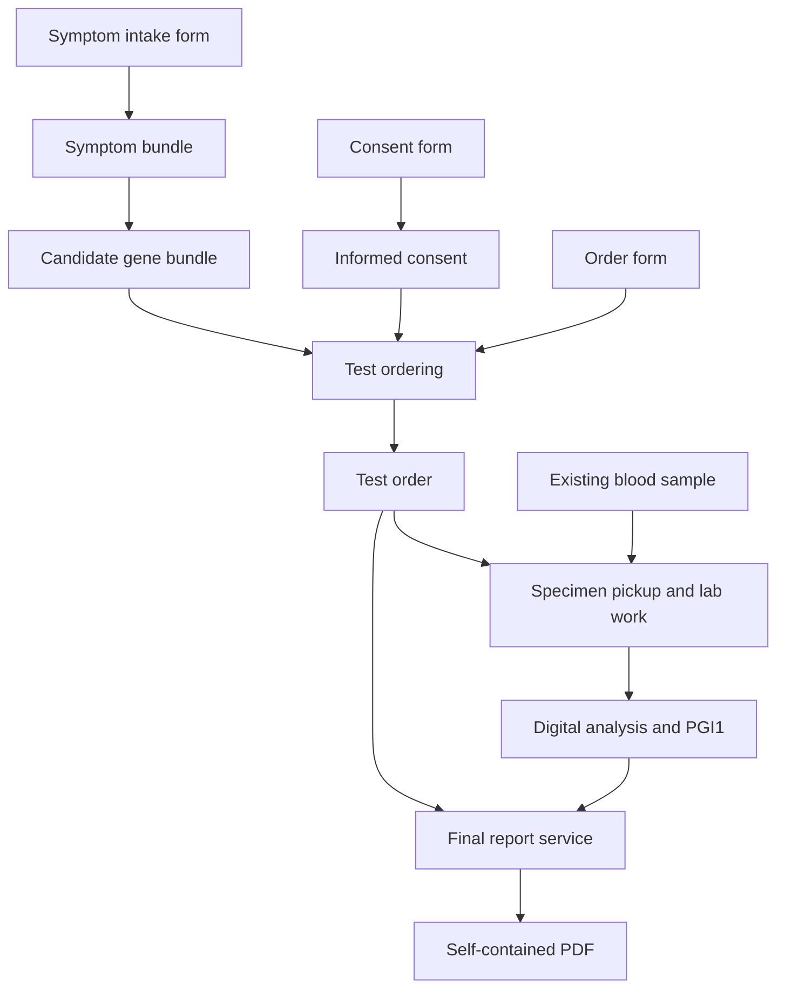

# Pocket Genes Objects and Services Wiki

Version: **1.0.0 — proposed catalog specification**
Prepared: **16 September 2026**
Scope: **20 exchanged object types, 15 mock services, and fictional independent providers.**

This reference turns the agreed Pocket Genes service model into a concrete wiki and implementation starter. The object names, property schemas, suffixes, and API routes below are proposed conventions for this catalog. They are not a claim about the current production app or an existing production `.pgi1.json` schema. All patient information, provider profiles, prices, turnaround times, genes, and analytical examples are synthetic.

Each provider offers services that accept a filled form and, when needed, typed input objects. Services return typed objects or update the state of a physical item. The result of one service can become an input to another provider's service. People can request one service or an assembled journey through the app.

## Contents

1. [Model, stages, and shared rules](#model-stages-and-shared-rules)
2. [Object registry](#object-registry)
3. [Object reference pages](#object-reference-pages)
4. [Service catalog](#service-catalog)
5. [Provider catalog](#provider-catalog)
6. [Wiki presentation and icon system](#wiki-presentation-and-icon-system)
7. [Implementation and validation](#implementation-and-validation)
8. [Native format references](#native-format-references)

## Model, stages, and shared rules

The three stages are **Test planning → Wet lab → Bioinformatics**. An object can be useful in more than one stage. Stages classify capabilities; they do not force every request to traverse every stage.

| Stage | Main responsibility | Boundary |
| --- | --- | --- |
| Test planning | Forms, symptom structuring, candidate genes, informed consent, professional and organizational input | Produces the `test_order` |
| Wet lab | Formal pickup request, sample custody and transport, laboratory processing | Produces the agreed initial digital file |
| Bioinformatics | Any supported transformation from source file through annotation, structured findings, or report generation | Produces the requested digital deliverable |

### Agreed contracts

- Every request includes a `pgo_form` filled against the exact `form_shape` of its service. `requested_at` and `requested_by` live among its filled fields.
- `form_shape` declares field keys, types, requiredness, and enum options. It is service configuration, not a twenty-first object type.
- Test ordering consumes **form + informed consent + candidate gene bundle** directly. No intermediate suggested-tests object is required.
- `test_order` holds the patient identity, purpose, clinical suspicion, selected gene scope, fulfillment requirements, and consent connection.
- `collection_request` is a formal pickup instruction to a specified company, linked to a test order. It is not itself a biological sample.
- A sample at origin and the same sample at destination have the same object identity with different revisions and custody state.
- An extracted DNA sample or biopsy is a derived physical object with its own identity and lineage.
- Extraction and sequencing also return updated source-specimen snapshots showing consumption or remaining quantity. Historical revisions preserve provenance; physical execution must check and lock the current available state.
- `.pgi1.json` holds variant findings and their clinical relevance independently of symptoms. The JSON conversion does not require a symptom bundle.
- Final reporting consumes **form + test_order + .pgi1.json**. The order and genomic result supply the patient and report content; the form supplies request context and presentation choices.
- Type matching is necessary but scope sufficiency is also required. Data must support the requested genes and analysis. File extensions and the presence or absence of VCF rows cannot establish that by themselves.

### Vocabulary and identifiers

| Prefix / entity | Stands for | Purpose |
| --- | --- | --- |
| `pgo_` | Pocket Genes object type | Stable catalog keyword; e.g. `pgo_test_order` |
| `obj_` | Object instance | A particular order, sample, form, or result |
| `pgs_` | Pocket Genes service | A provider's declared transformation contract |
| `pgp_` | Pocket Genes provider | Organization or professional fulfilling services |
| `pgfs_` | Pocket Genes form shape | Versioned field definitions belonging to a service |
| `pgr_` | Pocket Genes request | One invocation and its execution state |
| Pipeline | Composition of requests | Connects compatible outputs and inputs across providers |

### Common object envelope

All exchanged objects have a JSON record. Native data files remain separate bytes in their standard format. A physical object's JSON records the real item's identity and state; it does not replace physical delivery.

| Property | Type | Meaning |
| --- | --- | --- |
| object_id | string | Stable instance identity. |
| object_type | enum | One of the 20 registered pgo_ keys. |
| schema_version | string | Payload contract version; fixtures use 1.0.0. |
| revision | integer ≥ 1 | Snapshot of the object. References pin this revision. |
| created_at | date-time | Creation time of this snapshot; distinct from the request time inside its form. |
| created_by | string | Identity that issued this snapshot. |
| input_refs | ObjectRef[] | Exact source object revisions, including the request form, when generated by a service. |
| data | object | Type-specific properties defined in the following pages. |
| files | FileDescriptor[] | Associated native payloads; role, path, media type, SHA-256 and byte count. |


`ObjectRef` has exactly `object_id` and `revision`. The same physical item may have revision 1 at origin and revision 2 at the destination; both snapshots remain addressable. New analytical results normally get new IDs, with references to their sources. Changing custody must not rewrite an earlier snapshot.

Native FASTQ, FASTA, BAM, VCF, FCS, and PDF objects use a `.pgobject.json` sidecar in this package. Their actual files keep `.fastq`, `.fasta`, `.bam`, `.vcf`, `.fcs`, or `.pdf`. Compound `.pg*.json` suffixes are conventions for Pocket Genes JSON objects. Compressed variants require an explicitly declared encoding/profile, not a new clinical meaning.

The same `.vcf` suffix is shared by the two VCF types. `object_type` and the annotation profile distinguish them. An annotated VCF is not automatically compatible with every interpretation service.

### Scope and fulfillment

The synthetic order requests `PGGENE_A`, `PGGENE_B`, and `PGGENE_C` under `PG_DEMO_REF_1`. The supporting metadata records which genes and variant classes are assessable and references the producer's evidence. A service checks the required profile, subject identity, order identity, actual input availability, and the requested analytical scope.

| Candidate handoff | Decision |
| --- | --- |
| Correct type/profile and evidence-backed support for all requested genes and variant classes | Eligible for the next service |
| Correct `.vcf` suffix but only two of the three requested genes supported | Insufficient scope; report the missing gene |
| Supported genes match, but reference/profile is incompatible | Requires an explicitly compatible service or transformation |
| No variants reported for one gene, with no evidence about its assessability | Cannot infer a negative result or complete testing |
| Broader acquisition than the requested scope | Does not authorize broader interpretation or reporting; honor the order's scope |

The tiny files in this package demonstrate structure and linkage. Their `synthetic_fixture` attestations are mock inputs to the compatibility example, not proof of assay coverage, a diagnostic result, or evidence that a real provider is qualified. The supplied validator checks catalog and fixture integrity; production assay validation remains provider-specific.

### Pocket Genes service network: proposed v1 logic

This specification describes a professional catalog of independently purchasable services. Pocket Genes defines a small shared object vocabulary and a common request contract. Providers publish what they accept, what they return, and the terms under which they do the work. A user can request one service or a complete compatible journey through the app or API.

This is a product-design proposal. The providers, prices, turnaround estimates, patients and scientific fixture tokens in the accompanying catalog are fictional. The examples demonstrate interoperability; they do not establish clinical validity or legal sufficiency.

#### 1. The concepts and what each one stands for

| Concept | Identifier convention | Responsibility |
|---|---|---|
| Object type | `pgo_*` | Defines the meaning, schema, representation and accepted profiles of an interchangeable piece. PGO means **Pocket Genes Object**. |
| Object instance | `object_id`, such as `obj_demo_order` | One actual piece: an order, gene bundle, sample record or registered native file. |
| Object revision | Positive integer | A specific recorded version of that object. References always pin it. |
| Provider | `pgp_*` | The organization or professional entity responsible for executing a published service. PGP means **Pocket Genes Provider**. |
| Service | `pgs_*` | An offer to perform a defined transformation. PGS means **Pocket Genes Service**. |
| Form shape | `pgfs_*` plus version | The service configuration specifying required fields, field types and enum options. PGFS means **Pocket Genes Form Shape**. |
| Form | `pgo_form` | The filled fields supplied with every execution request, including when the request was made and who made it. |
| Service request | `pgr_*` | One execution of one service under its pinned version and accepted commercial terms. PGR means **Pocket Genes Request**. |
| Pipeline | Application orchestration record | A set of service requests connected through explicit output-to-input bindings. It is a process configuration, not an extra accepted object type. |

`form_shape`, provider, service and pipeline are configuration or execution entities. They do not expand the fixed twenty-type exchanged-object registry. A specimen's digital record represents a physical item; sending its JSON does not deliver the specimen itself.

#### 2. The universal service contract

Every execution follows this pattern:

**A filled form + zero or more additional objects → one or more output objects.**

The `form` is mandatory, even for a service that otherwise needs only a VCF. The phrase “VCF → PGI1” is useful catalog shorthand; its full execution contract is “form + VCF → PGI1.”

A service definition contains:

| Field | Meaning |
|---|---|
| `service_id`, `service_version` | The particular published offer and its pinned contract version. |
| `provider_id` | The responsible provider. |
| `stages` | Where the service belongs in the three-stage catalog. |
| `form_shape` | The exact form schema for this service version. |
| `input_slots` | Named roles, accepted object types, requiredness and cardinality. |
| `output_slots` | Named results, their type or explicit type binding, and whether they create a new object or a new revision. |
| `accepted_conditions` | Preconditions for this provider to accept the particular objects and request. |
| `scope_rules` | How the requested objective and analytical scope constrain the output. |
| `mock_commercial_terms` | Example price, turnaround start condition and failure handling. Real offers must publish their actual terms. |

The catalog contains sample requests and results for all fifteen services. A service may be performed by software, laboratory work, human assessment, transport, or a combination. Its internal method is the provider's responsibility; its external obligations are explicit.

##### Forms are service-specific

A `form_shape` defines a list of fields, not one global medical intake questionnaire. Supported field types in this proposal are `text`, `number`, `integer`, `boolean`, `date`, `datetime`, `enum`, `multi_enum` and `string_list`.

Each field has a stable `key`, a display `label`, a `type` and `required`. Enum and multi-enum fields also contain explicit options, each with a stored value and a display label. Forms store the stable values, not the labels.

Every shape includes `requested_at` and `requested_by`. Their values occur inside `pgo_form.data.fields`, alongside the service-specific values. An authenticated submission establishes the requester; a typed name alone is not proof of identity. Server processing timestamps can be recorded on the request separately.

For example, a symptom intake shape also requires `subject_id` and `observations`. A final-report shape requires `language` and `presentation`. Patient identity and clinical suspicion already live in the order for that reporting request, so the reporting form need not collect them again.

```json
{
  "form_shape_id": "pgfs_final_report",
  "form_shape_version": "1.0.0",
  "fields": [
    {"key": "requested_at", "value": "2026-09-16T12:00:00Z"},
    {"key": "requested_by", "value": "user_demo_001"},
    {"key": "language", "value": "en"},
    {"key": "presentation", "value": "clinical"}
  ]
}
```

The form is validated against the declared shape version. Reject duplicate keys, missing required fields, wrong value types and enum values outside the published options. This mock catalog also rejects unknown fields. A new required field requires a new compatible contract version; changing a published shape must not silently invalidate already accepted requests.

##### Inputs bind by role

An input slot identifies why the object is supplied. For DNA extraction, `specimen` accepts one of blood, tissue or embryo material. These are alternatives within one slot; the requester does not supply all three.

A test order is a different slot. This avoids relying on array position to distinguish an order from the specimen being processed. An input reference consists of `object_id` and `revision`. Native files are retrieved through that registered object, with its file descriptors and integrity information.

```json
{
  "service_id": "pgs_final_report",
  "service_version": "1.0.0",
  "form_ref": {"object_id": "obj_demo_form_final_report", "revision": 1},
  "inputs": [
    {"role": "test_order", "object_ref": {"object_id": "obj_demo_order", "revision": 1}},
    {"role": "interactive_report", "object_ref": {"object_id": "obj_demo_interactive", "revision": 1}}
  ]
}
```

A form-only service supplies an empty `inputs` array. The mandatory `form_ref` remains present.

#### 3. The three stages

| Stage | Goal | Prevalent objects |
|---|---|---|
| **Test planning** | Turn an objective and available information into a complete test order. | Forms, symptom bundles, candidate gene bundles, informed consent and test orders. |
| **Wet lab** | Fulfill the physical work and laboratory processing required for the agreed digital deliverable. | Collection requests, physical samples, extracted DNA and the laboratory's output files. |
| **Bioinformatics** | Process an available digital input into the contracted analytical or presentation result. | FASTA, FASTQ, BAM, VCF, images, FCS, PGI1 and PDF. |

The stage is a catalog location, not a rule that every customer must buy all three stages. In this three-stage vocabulary, bioinformatics also groups related digital analysis such as karyotype image review. A PDF can be produced in test planning as a consultation summary or in bioinformatics as a final genomic report; the document profile determines its purpose.

##### Test planning

One route creates a symptom bundle from a form and prioritizes candidate genes from that bundle. A second service produces an informed-consent piece from its own form. Test ordering then combines exactly the three agreed inputs:

**form + informed_consent + bundle_of_candidate_genes → test_order.**

The order's form supplies patient name, date of birth, patient identifier, objective, suspicion and other required ordering details. It also selects `wet_lab_output_type`, the final deliverables through `required_output_types`, and the `required_profile`. Those map to the order's patient record and fulfillment requirements, including `fulfillment.final_output_types`. The order consolidates that context and retains its consent reference. No `bundle_of_suggested_tests` intermediate is required. Professionals and organizations can specialize in any of these transformations.

##### Wet lab

A `collection_request` is a formal instruction addressed to a company to pick up a specimen and deliver it to the identified destination as part of a test order. The illustrated offer addresses `pgp_sample_logistics`, using the sample route from 100 Example Avenue to 200 Example Avenue in Demo City, AR, the 2026-09-16 13:00–15:00 UTC pickup window, and `handling_demo_v1`.

The specimen at origin and the specimen at destination retain the same `object_id`; transport returns a later revision with custody, location and receipt information. Extraction produces a new DNA object because the extracted material is a distinct derived specimen. Its lineage points back to the source. Consumption or remaining quantity of source material must be recorded.

The transport examples begin with an existing specimen. A future sample-acquisition offer can create that specimen from an appropriate request, supporting the broader home-collection journey. These fifteen examples do not implicitly turn a courier pickup into phlebotomy.

`pgo_embryo_sample` distinguishes `whole_embryo` from `embryo_biopsy`. The demonstrated DNA-extraction offer accepts an embryo biopsy only. A whole embryo cannot be substituted merely because the registry type is shared. Taking a biopsy creates a separate material identity and lineage before that biopsy can enter extraction.

A lab can choose its contractual exit point. This catalog's sequencing offer returns FASTQ. Another published service could return BAM, unannotated VCF or a complete result by performing more work internally. The platform does not force the customer to purchase or download every intermediate file.

##### Bioinformatics

The fifteen examples split alignment, calling, annotation, interactive interpretation and reporting into separate offers. Each step can belong to a different provider, and a provider may publish a combined offer.

FASTA and FASTQ are distinct types. They are not interchangeable labels for one mandatory entry format. An eligible provider can accept whichever actual source format its contract supports. The fixed registry contains FASTA and FCS even though these fifteen mock offers do not yet consume or produce them.

Annotation can be purchased with `form + unannotated_vcf` alone. Its `test_order` slot is optional: when supplied, the order constrains the scope and fulfillment checks; when absent, annotation stays within the input object's declared scope and preserves its analytical-support evidence and limitations. The sample request supplies an order to demonstrate the optional connection.

The interpretation contract demonstrated here is:

**form + annotated_vcf → .pgi1.json.**

PGI1 contains genomic findings and their clinical relevance independently of the patient's symptoms. The registered VCF carries its own source and analytical-support information. This interpretation service does not require a symptom bundle or a test order as an additional input. Pipeline orchestration can compare the resulting declared scope with a linked order without making symptoms part of the conversion.

The final-report contract is:

**form + test_order + .pgi1.json → final PDF.**

The order supplies the patient and intended clinical context. PGI1 supplies the findings, relevance, provenance and analytical limitations. The form supplies request metadata and presentation choices. Under this contract, those two domain pieces must contain everything needed for a self-contained report. The provider should not need to retrieve original intake forms or planning bundles. Any included professional review and report issuance must be stated in the offered service.

#### 4. Compatibility includes the requested result

Matching an extension only identifies a possible connection. Before a provider accepts work, the system evaluates:

1. **Object identity and access:** the supplied revision exists and belongs to the intended subject or material lineage.
2. **Type and version:** the declared semantic type, JSON schema or native representation is accepted.
3. **Profile and content:** the relevant form, annotation, imaging, assay or document-purpose profile matches.
4. **Order scope:** the service and input data can support the genes, reference, variant classes and deliverables requested.
5. **State and availability:** a physical item is in the appropriate location and condition, with usable material available.
6. **Execution terms:** the provider accepts the location, price, turnaround and responsibility attached to the request.

For example, the fixture order requests `PGGENE_A`, `PGGENE_B` and `PGGENE_C` on synthetic reference `PG_DEMO_REF_1`. Its scope is stored in `data.scope`. Its fulfillment requirements are stored in `data.fulfillment`, including `scope_policy: requested_only` and `analysis_support_required: true`.

A VCF whose supported analytical scope omits requested genes is insufficient, even if structurally valid. Adding annotations cannot recover missing measurements. Absence of a row for a requested gene does not establish that the gene was adequately assessed. Analytical objects therefore retain `data.analysis_support`, including status, evaluated genes, supported variant classes, evidence and limitations. Evidence can point to an embedded declaration or an attached quality/support file. Its presence as JSON is not, by itself, a scientific verification.

An output supports the order only when its analytical support and service profile meet the actual requirement. Extra processing or findings do not silently expand the requested scope. A provider that cannot meet the full accepted contract returns the limitation and a suitable non-completed state rather than describing the request as fulfilled.

#### 5. Execution lifecycle and responsibility

| State | Meaning |
|---|---|
| `received` | The request is recorded and assigned an ID. |
| `validating` | Form, input access, compatibility, availability and scope are being checked. |
| `accepted` | The provider accepts responsibility for the specified service under the agreed terms. |
| `queued` | Accepted work waits for an execution slot. |
| `running` | The provider is performing the work. |
| `awaiting_input` | Work needs an explicit clarification or additional piece before it can continue. |
| `completed` | The accepted contract is fulfilled and registered outputs are available. |
| `rejected` | The provider declines before acceptance, with a reason. |
| `failed` | Accepted work cannot fulfill the contract, with a reason and recovery information. |
| `cancelled` | Cancellation has completed under the agreed terms. |

The normal path is received, validating, accepted, queued, running and completed. Queuing can be skipped. Validation or running work can pause at awaiting_input; the response must say what is needed and where execution resumes. Completed, rejected, failed and cancelled are terminal states. A later rework execution has a new request identity linked to the original.

An HTTP `202` only confirms asynchronous receipt unless the returned state explicitly says accepted. A progress percentage is informative; it does not replace the state or prove fulfillment.

A pipeline needs a named party responsible for resolving cross-provider failures. Each provider owns its service, while Pocket Genes or an explicitly contracted journey operator coordinates the overall journey. If a downstream provider rejects an upstream output, the requester needs a concrete resolution: corrected output, an alternative compatible provider, a new physical procedure if separately authorized, or a refund under the accepted terms.

Refund status is a commercial outcome, not an object transformation. Track it alongside the execution. “The provider returned a file” is not a sufficient reason to consider an unfulfilled scope completed.

##### Idempotency and safe recovery

Every creation call carries an idempotency key. Repeating the same key with the same canonical request returns the original execution; reusing it for a different payload returns a conflict. The provider publishes the retention window. This draft proposes at least thirty days.

After a timeout, query the existing request or repeat with the same key. Do not submit a new request simply because a callback was delayed. Duplicate courier dispatch, sample consumption or laboratory work can be expensive and cannot always be undone.

A failed physical job is not automatically retried. Check the specimen's actual state and remaining material, determine the recovery action and obtain whatever action authorization is required by the accepted service terms. Digital work also needs idempotency so that retries do not create accidental repeated charges or conflicting outputs.

##### API and callbacks

The provider catalog includes an illustrative complete API example for Variant Analysis Cooperative:

- `POST /service-requests` submits a service, form reference and role-bound inputs.
- `GET /service-requests/{request_id}` returns authoritative state.
- `GET /service-requests/{request_id}/results` returns registered output references.
- A signed provider callback announces progress or completion to a preregistered Pocket Genes endpoint.

Provider authentication, object access and callback verification are integration configuration. Credentials are absent from the fixtures. Callback destinations are registered in advance; a request cannot redirect patient information to an arbitrary URL. Events include unique IDs and increasing request revisions so duplicates and out-of-order delivery can be handled. Large FASTQ, BAM or PDF payloads stay in object storage; the API passes authenticated object references and integrity metadata.

#### 6. Example pipelines and alternate entry points

##### A. Test planning through a final report

The user supplies the planning forms. Meridian Clinical Planning produces the symptom bundle, candidate genes and consent piece, then creates the order. Origin Sample Logistics produces the pickup request and transports the existing blood sample. Atlas Precision Laboratory extracts DNA and produces FASTQ. Variant Analysis Cooperative aligns the reads, calls variants, annotates the VCF and creates PGI1. Clarity Report Studio combines PGI1 with the original complete order and produces the final PDF.



Every service request in the diagram also receives its own form. The detailed fifteen-service table exposes the individual transformations hidden inside the grouped physical and digital blocks. The original order remains available at every step where it is explicitly required, including final reporting.

##### B. Start with an existing annotated VCF

A user already has a registered compatible annotated VCF and a complete test order. Request `pgs_interactive_interpretation` with its form and that VCF, then request `pgs_final_report` with its own form, the resulting PGI1 and the order. Laboratory work, alignment, calling and annotation are skipped. The existing analytical support must still meet the order scope.

A user with an existing unannotated VCF can first request annotation without creating a test order, then request PGI1 interpretation. A complete test order becomes required when that user requests the final self-contained reporting contract.

If the user already has a suitable `.pgi1.json`, the final-report service alone is sufficient once its required order and form are available.

##### C. A service without sequencing or domain inputs

A user fills `pgfs_form_to_pdf` and requests `pgs_form_to_pdf`. Meridian Clinical Planning returns a consultation summary PDF. The request has a mandatory `form_ref` and an empty `inputs` array. This is a complete, independent service.

A separate non-sequencing branch is `form + metaphase image_bundle → karyotype_result`, fulfilled by Chromosome Image Services. It demonstrates that the network can support specialist image review within the same request mechanics.

#### 7. Provider substitution and composition

A new provider publishes its own service ID and accepted contract. The platform can propose it for a step when its output, acceptance conditions, scope and commercial terms fit the surrounding route. Existing requests keep the provider and version originally accepted; substitution is explicit.

A compatible output can be reused in several subsequent services, subject to access and scope. Input consumption matters: a digital object remains reusable, while a physical procedure may consume all or part of the specimen. Pipelines therefore bind exact object revisions and track remaining material before initiating more work.

A complete journey should be checked before starting irreversible physical steps. The available source, each required handoff, the selected providers and the final requested output must form a feasible route. A provider directory with matching extensions is not enough.

The fifteen services are a starting catalog. They illustrate how a provider can specialize in one conversion or offer several stages. The twenty object types are a fixed proposed v1 vocabulary; future registry additions should have clear semantics, schemas and examples rather than becoming catch-all files.

#### 8. Professional catalog presentation

Each object should have a stable icon asset, a clear name, its `pgo_*` keyword, a physical/virtual label, extension, accepted-profile details and a concise definition. Its wiki page should expose properties, a content example, producer services and consumer services.

The light gamification comes from visible progression and discoverable connections: “You have these pieces,” “These services can use them,” and “This requested result needs these remaining pieces.” Use neutral completion markers and stage colors. Icons and object cards should help users recognize the catalog without implying medical certainty, quality scores or game-like rewards for ordering more tests.

A provider page names who is responsible, which services are offered, coverage, turnaround and integration capabilities. A service page shows the input slots, required form, output, acceptance rules and exact scope. Missing compatibility is shown as a specific reason, such as an unsupported material kind or incomplete gene scope, with the relevant corrective action.
